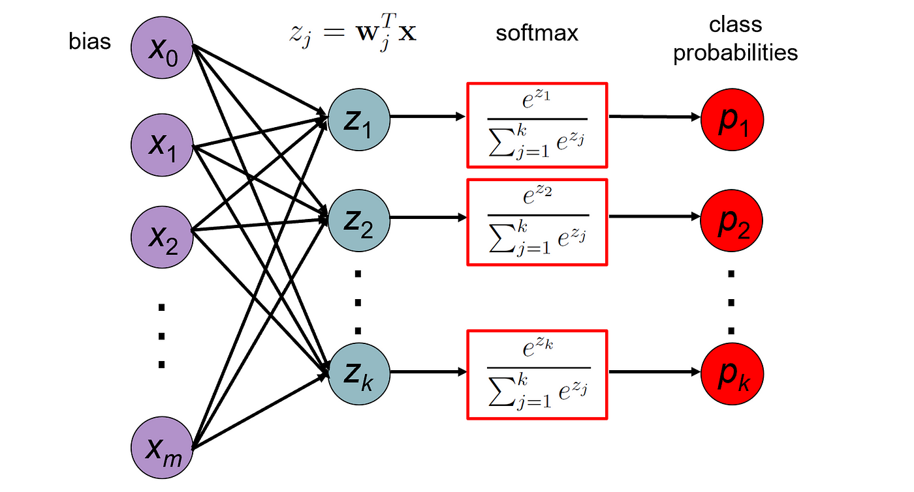

# 激活函数

## Sigmoid

$$
\begin{align}
{\sigma(x)={\frac{1}{1+e^{-x}}}={\frac {e^{x}}{1+e^{x}}}=1-\sigma(-x)}
\end{align}
$$

## Tanh

$$
\begin{align}
{\tanh x={\frac {\sinh x}{\cosh x}}={\frac {e^{x}-e^{-x}}{e^{x}+e^{-x}}}={\frac {e^{2x}-1}{e^{2x}+1}}}
\end{align}
$$

## ReLU

$$
\begin{align}
{f(x)=x^{+}=\max(0,x)={\frac {x+|x|}{2}}={\begin{cases}x&{\text{if }}x>0,\\0&{\text{otherwise}},\end{cases}}}
\end{align}
$$

## Leaky ReLU

$$
\begin{align}
{LeakyReLU(x)=\max(0,x)+\mu\min(0,x)={\begin{cases}x&{\text{if }}x>=0,\\\mu{x}&{\text{otherwise}},\end{cases}}}
\end{align}
$$

$\mu$ controls the angle of the negative slope.

## ELU

$$
\begin{align}
{ELU(x)={\begin{cases}x&{\text{if }}x>=0,\\ e^x-1&{\text{otherwise}},\end{cases}}}
\end{align}
$$

## Softmax

$$
\begin{align}
{\sigma(\mathbf{z})_{i}={\frac{e^{z_{i}}}{\sum_{j=1}^{K}e^{z_{j}}}}\ \ {\text{ for }}i=1,\dotsc ,K{\text{ and }}\mathbf {z} =(z_{1},\dotsc ,z_{K})\in \mathbb {R} ^{K}}    
\end{align}
$$

## Swish

$$
\begin{align}
f(x)=x\cdot sigmoid(\beta x)
\end{align}
$$

## Maxout

$$
\begin{align}
z_{ij}=x^TW..._{ij}+b_{ij},W\in\Reals^{d \times m \times k} \nonumber\\
h_i(x)=\max _{j\in[1,k]} z_{ij}
\end{align}
$$

## Softplus

$$
\begin{align}
{Softplus(x)=\frac{1}{\beta}\log{(1+e^{\beta x}})}
\end{align}
$$

# 参考资料

