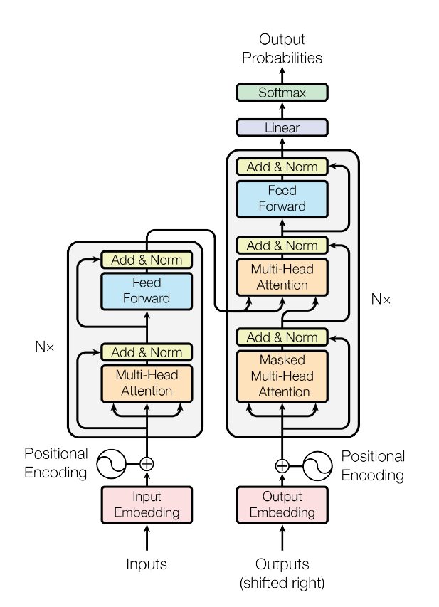

# Transformer

## 相关资料

论文：《[Attention Is All You Need](https://arxiv.org/abs/1706.03762)》

代码实现：

* [GitHub - harvardnlp/annotated-transformer](https://github.com/harvardnlp/annotated-transformer)

代码解读：

* [The Annotated Transformer](https://nlp.seas.harvard.edu/2018/04/03/attention.html)

## 整体架构

## Attention 机制

$$
\begin{align}
Attention(Q,K,V)&=softmax(\frac{QK^T}{\sqrt{d_k}}V) \\
MultiHead(Q,K,V)&=Concat(head_1,...,head_h)W^O \\
head_i&=Attention(QW_i^Q,KW_i^K,VW_i^V) \nonumber
\end{align}
$$

### QKV 到底是什么？

>An attention function can be described as mapping a query and a set of key-value pairs to an output, where the **query**, **keys**, **values**, and output are all vectors.

**Query**，**Key**，**Value** 的概念类似于检索系统，搜索系统会把输入**Query**映射成一系列的**Keys**，这些**Keys**会关联数据库中的内容，也就是**Values**。例如Query是“猫的图片”，映射为Keys为\[Cat,Picture\]，最终关联匹配得到猫的照片，也就是Values。Attention 的机制也可以认为是另外一种形式的检索过程。

论文《[Neural Machine Translation by Jointly Learning to Align and Translate](https://arxiv.org/abs/1409.0473)》中提到一种 attention 的计算方式：

$$
\begin{align}
c_i=\sum _{j=1}^{T_x} \alpha_{ij} h_j \\
\alpha_{ij}=\frac{e^{e^{ij}}}{\sum _{k=1}^{T_x}e^{ik}}\\
e_{ij}=a(s_{i-1},h_j)
\end{align}
$$

Attention 被定义为 Values 的加权平均，其中 $\sum _j \alpha_j=1$ ，$h_j$ 来自encoder序列，$s_i$ 来自于decoder序列，$a$ 为神经网络。如果我们限制 $\alpha$ 为一个 one-hot 向量，我们对每个元素 $h$ 召回的比例相同。如果没有这个限制，我们对不同的元素就会按不同的比例召回，取决于概率向量 $\alpha$。

不难看出，$h$ 类比于 values ，两篇论文的区别在于概率向量 $\alpha$ 的计算方式上。上述方法有一个计算复杂度的问题，也就是对于一个长度为 $m$ 的encoder序列和长度为 $n$ 的decoder序列，我们获得attention值 $e_{ij}$ 需要$m*n$次计算。一个比较有效的方法就是就是把首先把 $s$ 和 $h$ 投影到公共的空间中，然后选择一个相似度度量方法（例如点乘操作）计算attention值。例如下面这种方式，我们只需要计算 $g(h_j)m$ 和 $f(s_i)n$ 次就能得到向量投影，$e_{ij}$ 能够使用矩阵乘法进行有效地计算。

$$
\begin{align}
e_{ij}=f(s_i)g(h_j)^T
\end{align}
$$

上面的方法本质上就是《[Attention Is All You Need](https://arxiv.org/abs/1706.03762)》提出的方法，把输入向量投影成 $Q$ $K$ $V$，然后计算 $softmax(\frac{QK^T}{\sqrt{d_k}}V)$ 值就得到了attention值。

上面我们说的 Query 来源于decoder，Key 来源于encoder，其实并不一定都是这种情况，更多地取决于我们的应用场景。例如对于GPT这类无监督学习模型而言， $Q$ $K$ $V$ 都来源于语料，所以我们把这种称为**Self-Attention**；而对于机器翻译任务， $K$ $V$ 来源于原序列， $Q$ 则来源于待翻译文本。

值得一提的是，论文中提出的 $Q$ $K$ $V$ 是对输入线性变换之后生成的，为什么需要进行这样的变换呢？

主要有以下两个原因：

1. 如果我们不对输入向量进行变换，则用于计算每个输入值的权重的点积将始终产生单个输入token本身的最大权重得分。也就是说，当我们计算在位置 $i$ 处的输入 token 的注意力权重 $a_{ij}$ 时，权重 $a_{ii}$ 总是大于权重 $a_{ij}(i\not ={j})$ 。
2. 神经网络中的线性变换会为Query、Key和Value生成更好的表示。回想一下奇异值分解（SVD）的效果，通过将输入向量与矩阵V相乘（来自SVD），如果这两个向量在主题空间中相似，我们可以获得更好的表示来计算两个向量之间的兼容性。

# 参考资料

* [GitHub - tensorflow/tensor2tensor](https://github.com/tensorflow/tensor2tensor)
* [Transformer Architecture: The Positional Encoding](https://kazemnejad.com/blog/transformer_architecture_positional_encoding/)
* [知乎 - 如何最简单、通俗地理解Transformer？ - 卜寒兮的回答](https://www.zhihu.com/question/445556653/answer/3254012065)
* [StackExchange - What exactly are keys, queries, and values in attention mechanisms?](https://stats.stackexchange.com/questions/421935/what-exactly-are-keys-queries-and-values-in-attention-mechanisms)