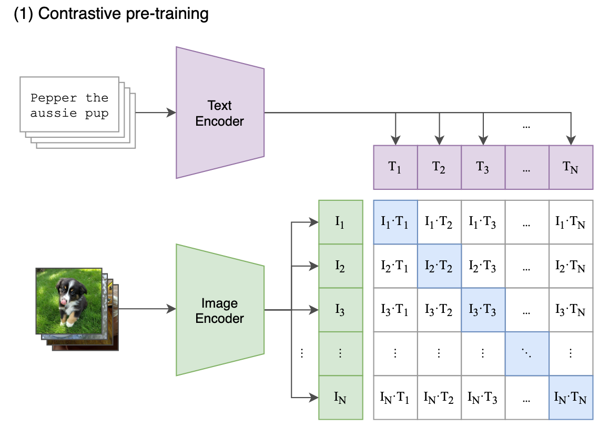
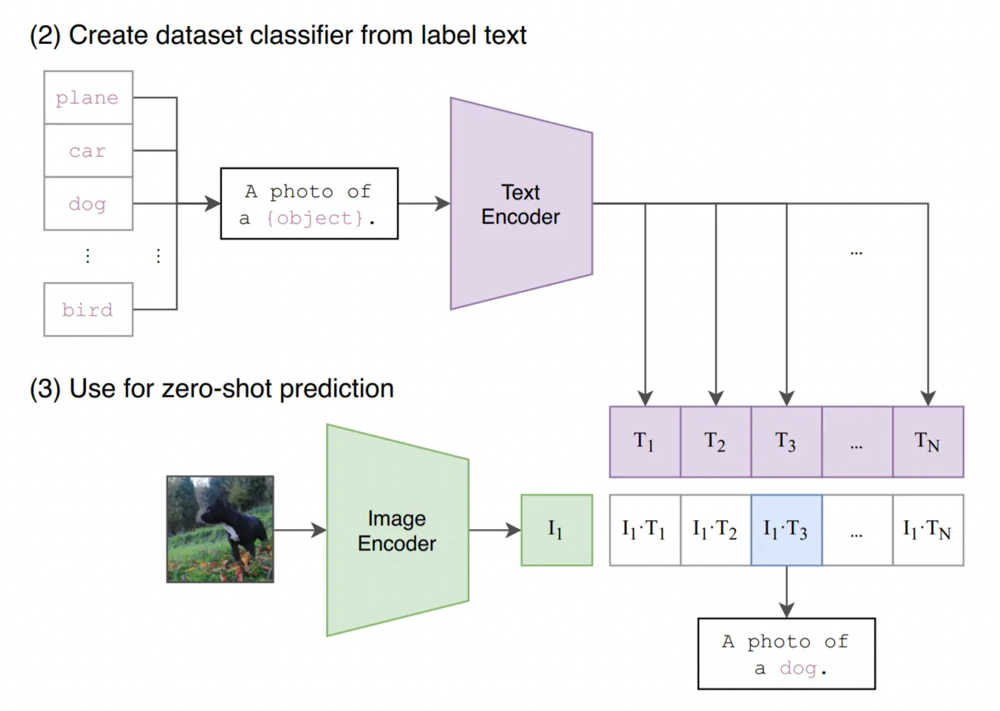

# CLIP（Contrastive Language-Image Pre-training）

## 相关资料

相关论文：

* 《[Learning Transferable Visual Models From Natural Language Supervision](https://arxiv.org/abs/2103.00020)》

相关代码：

* [GitHub - openai/CLIP](https://github.com/openai/CLIP)

## CLIP 架构

### 训练阶段

CLIP的训练数据是 \<图像，文本\> 对。一个batch的数据里，有若干张图像，每张图像都配有相应的文字描述信息（prompt）。

**Text Encoder**和**Image Encoder** 这两部分可以分别理解成文本和图像的特征提取器。对于**Text Encoder**，CLIP借鉴的是GPT2（Radford et al.2019）的架构。对于**Image Encoder**，CLIP则尝试过5种不同的ResNet架构和3种VIT架构，最终选用的是“ViT-L/14@336px”这个模型，也就是架构为Large，patch_size = 14的ViT。

一个batch中共有N对\<图像，文字\>对，它们经过各自的Encoder编码后，就会分别产生这两组向量 $T_i$ 和 $I_i$，然后将这两组向量经过线性映射生成多条多模态Embedding，最后通过“对比学习”，找到图像和文字的相似关系，实现上可采用向量点积计算余弦相似度。

### 预测阶段

当我们做完模型的预训练后，就能用模型来做之前说的zero-shot预测了，方法也非常简单：

1. 首先，我们创建一个标签全集，如图中（2）所示，并得到每一个标签的特征向量
2. 然后，我们取一张图片，如图中（3）所示，过Image Encoder后得到该图片的特征向量
3. 最后，计算图片向量和文字向量间的相似度，取相似度最高的那条label即可。

# 参考资料

* [掘金 - CV大模型系列之：多模态经典之作CLIP，探索图文结合的奥秘](https://juejin.cn/post/7264503343996747830)
* [知乎 - 神器CLIP：连接文本和图像，打造可迁移的视觉模型 - 小小将的文章](https://zhuanlan.zhihu.com/p/493489688)
