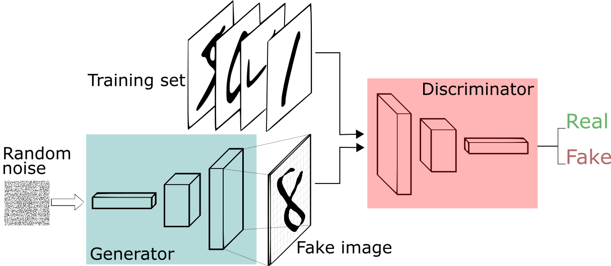
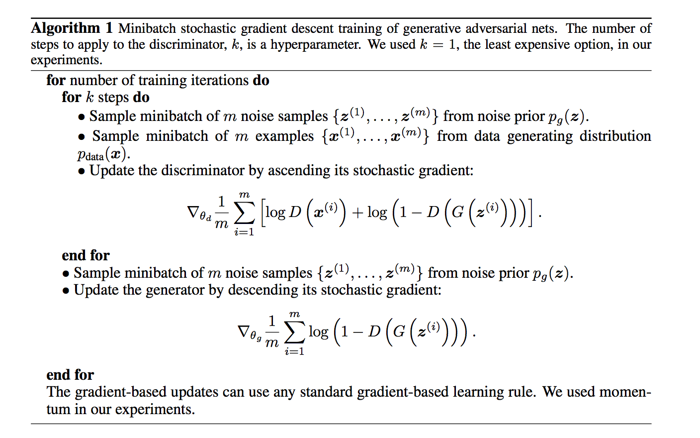

# Generative Adversarial Network (GAN)

## 相关资料

相关论文：

* 《[Generative Adversarial Networks](https://arxiv.org/abs/1406.2661)》
* 《[Conditional Generative Adversarial Networks](https://arxiv.org/pdf/1411.1784)》
* 《[Deep Convolutional GANs(DCGAN)](http://arxiv.org/abs/1511.06434)》

相关代码：

* [GitHub - goodfeli/adversarial](https://github.com/goodfeli/adversarial)
* [GitHub - eriklindernoren/PyTorch-GAN](https://github.com/eriklindernoren/PyTorch-GAN)
* [基于MNIST数据集构建GANs模型来生成手写数字](https://github.com/Maxwell-Hu/deep_learning/tree/master/gans_on_mnist)

## 理论介绍

GAN的主要结构包括一个生成器G（Generator）和一个判别器D（Discriminator）。

GAN使用梯度下降方式逐步迭代如下损失函数：

$$
\begin{align}
\argmin_{G}\argmax_{D} V(D,G)=\mathbb{E}_{x\sim p_{data}(x)}[\log{D(x)}]+ \mathbb{E}_{z\sim p_{z}(z)}[\log{1-D(G(z))}]
\end{align}
$$

* 其中 $V(G,D)$ 表示真实样本和生成样本的差异程度。
*  $\argmax_{D}{V(G,D)}$ 表示先固定生成器 $G$ ，尽可能地让判别器能够最大化地判别出样本来自于真实数据还是生成的数据。
* 然后令 $L=\argmax_{D}{V(G,D)}$ ， $\argmin_{G}L$ 表示在固定判别器 $D$ 的条件下得到生成器 $G$ ，这个 $G$ 要求能够最小化真实样本与生成样本的差异。
* 通过上述min和max的博弈过程，理想情况下生成分布逐渐拟合于真实分布。

GAN算法伪代码流程如下：

基本流程如下：

1. 初始化判别器D的参数 $\theta_d$ 和生成器G的参数 $\theta_g$ 。
2. 从真实样本中采样 $m$ 个样本 ${x^1,x^2,\cdots,x^m}$ ，从先验分布噪声中采样 $m$ 个噪声样本 ${z^1,z^2,\cdots,z^m}$ 并通过生成器获取 $m$ 个生成样本 ${\tilde{x}^1,\tilde{x}^2,\cdots,\tilde{x}^m}$ 。固定生成器G，训练判别器D尽可能好地准确判别真实样本和生成样本，尽可能大地区分正确样本和生成的样本。
3. 循环k次更新判别器之后，使用较小的学习率来更新一次生成器的参数，训练生成器使其尽可能能够减小生成样本与真实样本之间的差距，也相当于尽量使得判别器判别错误。
4. 多次更新迭代之后，最终理想情况是使得判别器判别不出样本来自于生成器的输出还是真实的输出。亦即最终样本判别概率均为0.5。

# 参考资料

* [通俗理解生成对抗网络GAN - 陈诚的文章 - 知乎](https://zhuanlan.zhihu.com/p/33752313)
* [Seita's Place - Understanding Generative Adversarial Networks](https://danieltakeshi.github.io/2017/03/05/understanding-generative-adversarial-networks/)
* [深度学习-52:生成式对抗网络GAN(原理、模型和演进)](https://github.com/media-tm/MTOpenML/blob/master/book-open-ai-cn/5-ai-self-decode-gan/54-ai-gan.md)