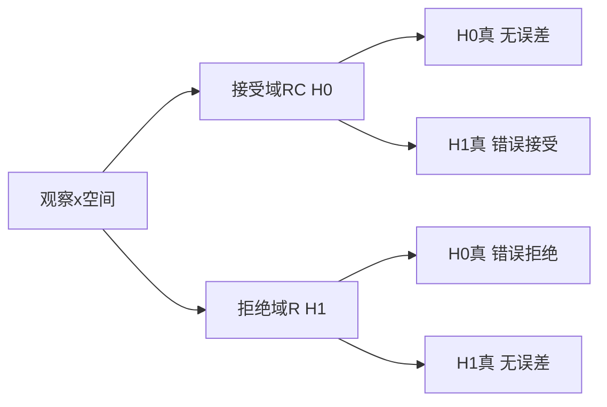

# 概率公式

## 分布列、概率密度和分布函数

### 分布列

分布列一般是针对于离散随机变量 $X$ 而言，使用 $p_X(x)$ 表示

$$
\begin{align}
p_X(x)=P({X=x})
\end{align}
$$

### 概率密度函数PDF

分布列一般是针对于连续随机变量 $X$ 而言，使用 $f_X(x)$ 表示

$$
\begin{align}
P(X\in B)=\int_{B}f_X(x)\mathrm{d}x
\end{align}
$$

### 分布函数CDF

$$
\begin{align}
F_X(x)=P(X\le x)=
\begin{cases}
\sum _{k\le x}p_X(k) &\text{if }X\text{为离散随机变量} \\
\int _{-\infty }^{\infty }f_X(t)\,\mathrm{d}t &\text{if }X\text{为连续随机变量} \\
\end{cases}
\end{align}
$$

## 期望和方差

### 数学期望

$$
\begin{align}
E[X]=
\begin{cases}
\sum _{i}x_{i}p_X(x_i) &\text{if }X\text{为离散随机变量} \\
\int _{-\infty }^{\infty }xf_X(x)\,\mathrm{d}x &\text{if }X\text{为连续随机变量} \\
\end{cases}
\end{align}
$$

$$
\begin{align}
E[g(X)]=
\begin{cases}
\sum _{i}g(x_{i})p_X(x_i) &\text{if }X\text{为离散随机变量} \\
\int _{-\infty }^{\infty }g(x)f_X(x)\,\mathrm{d}x &\text{if }X\text{为连续随机变量} \\
\end{cases}
\end{align}
$$

对于随机变量 $X$ 和 $Y=aX+b$ ，其中 $a$ 和 $b$ 为常数，则有 $E[Y]=aE[X]+b$ 。

### 方差

$$
\begin{align}
{Var}(X)&=E[{(X-E[X])}^2] \\
~&=E[X^2-2XE[X]+E[X]^2] \nonumber \\
~&=E[X^2]-2E[X]E[X]+E[X]^2 \nonumber \\
~&=E[X]^2-E[X^2]
\end{align}
$$

对于随机变量 $X$ 和 $Y=aX+b$ ，其中 $a$ 和 $b$ 为常数，则有 $Var(Y)=a^2Var(X)$ 。

### 协方差

$X$ 和 $Y$ 的协方差公式如下：

$$
\begin{align}
conv(X,Y)&=E\big[(X-E[X])(Y-E[Y])\big]=E[XY]-E[X]E[Y]
\end{align}
$$

可推导出如下结论：

$$
\begin{align}
conv(X,X)&=Var(X) \\
conv(X,aY+b)&=a\cdot conv(X,Y) \\
conv(X,Y+Z)&=conv(X,Y)+conv(X,Z) \\
Var(X+Y)&=Var(X)+Var(Y)+2\cdot conv(X,Y) \\
Var\big(\sum_{i=1}^n{X_i}\big)&=\sum_{i=1}^n{Var(X_i)}+\sum_{\{i,j\}|i\not ={j}}^n{conv(X_i,X_j)} \\
\end{align}
$$

如果 $conv(X,Y)=0$ ，则称 $X$ 和 $Y$ **不相关**，如果大于 $0$ 则称 $X$ 和 $Y$ **正相关**，如果小于 $0$ 则称 $X$ 和 $Y$ **负相关**。

具有正方差的随机变量 $X$ 和 $Y$ 的相关系数 $\rho(X,Y)$ 定义为：

$$
\rho(X,Y)=\frac{conv(X,Y)}{\sqrt{Var(X)Var(Y)}} \qquad\text{且满足}-1\le \rho(X,Y)\le 1
$$

## 常见分布

### 伯努利分布

$$
\begin{align}
p_X(x)&={\begin{cases}p&{\text{if }}x=1,\\1-p&{\text{if }}x=0,\end{cases}} \\
E[X]&=p \nonumber \\
Var(X)&=p(1-p) \nonumber
\end{align}
$$

### 二项随机分布

$$
\begin{align}
p_X(x)&=C_n^x p^x(1-p)^{n-x} \qquad(x=0,1,2,3,...)\\
E[X]&=np \nonumber \\
Var(X)&=np(1-p) \nonumber
\end{align}
$$

### 泊松分布

$$
\begin{align}
p_X(k)&=\frac{\lambda^k}{k!}e^{-\lambda} \qquad(k=0,1,2,3,...) \\
\end{align}
$$

### 正态分布

$$
\begin{align}
f_X(x)&=\frac{1}{\sqrt{2\pi}\sigma}e^{-\frac{(x-\mu)^2}{2\sigma^2}} \\
E[X]&=\mu \nonumber \\
Var(X)&=\sigma^2 \nonumber
\end{align}
$$

## 概率分布

### 贝叶斯定律

$$
\begin{align}
p_{X|Y}(x|y)=\frac{p_{Y|X}(y|x)p_X(x)}{p_Y(y)}=\frac{p_{Y|X}(y|x)p_X(x)}{\sum_{x_i\in{X}}p_{Y|X}(y|x_i)p_X(x_i)} \\
f_{X|Y}(x|y)=\frac{f_{Y|X}(y|x)f_X(x)}{f_Y(y)}=\frac{f_{Y|X}(y|x)f_X(x)}{\int_{-\infty}^{+\infty}f_{Y|X}(y|\hat{x})f_X(\hat{x})\mathrm{d}\hat{x}}
\end{align}
$$

### 连续随机变量和分布

设 $(X,Y)$ 的联合概率密度为 $f(x,y)$ ，以下是求解概率密度函数 $f_Z(z)$ 的过程：

$$
\begin{align}
F_Z(z)&=P(X+Y\le{z}) \nonumber \\
&=\iint_{x+y\le{z}}f(x,y)\mathrm{d}x\mathrm{d}y 
=\int_{-\infty}^{+\infty}\int_{-\infty}^{z-x}f(x,y)\mathrm{d}y\mathrm{d}x \nonumber \\
&=\int_{-\infty}^{+\infty}\int_{-\infty}^{z}f(x,u-x)\mathrm{d}u\mathrm{d}x 
=\int_{-\infty}^{z}\big(\int_{-\infty}^{+\infty}f(x,u-x)\mathrm{d}x\big)\mathrm{d}u \nonumber \\
f_Z(z)&=\int_{-\infty}^{+\infty}f(x,z-x)\mathrm{d}x
\end{align}
$$

如果 $X$ 和 $Y$ 为互相独立事件，则 $Z=X+Y$ 的概率密度为：

$$
\begin{align}
f_Z(z)&=\int_{-\infty}^{+\infty}f_X(x)\cdot f_Y(z-x)\mathrm{d}x \\
f_Z(z)&=\int_{-\infty}^{+\infty}f_X(z-y)\cdot f_Y(y)\mathrm{d}y \\
f_Z&=f_X\ast f_Y \nonumber
\end{align}
$$

如果 $X\sim{\mathbb{N}(\mu_{1},\sigma_{1}^2)}$ 和 $Y\sim{\mathbb{N}(\mu_{2},\sigma_{2}^2)}$ 为互相独立事件，根据上述结论可推导出 $Z=X+Y \sim{\mathbb{N}(\mu_{1}+\mu_{2},\sigma_{1}^2+\sigma_{2}^2)}$ ，证明过程参考 [Wikipedia正态随机变量分布和](https://en.wikipedia.org/wiki/Sum_of_normally_distributed_random_variables)。

## 极限

### 马尔可夫和切比雪夫不等式

**马尔可夫不等式**

设随机变量 $X$ 只取非负值，则有
$$
\begin{align}
P(X\ge a)\le \frac{E[X]}{a} \qquad(\text{对于任意}a>0) \\
\end{align}
$$

**切比雪夫不等式**

设随机变量 $X$ 的均值为 $\mu$，方差为 $\sigma^2$ ，则对任意 $c>0$ 有
$$
\begin{align}
P(|X-\mu|\ge c)\le \frac{\sigma^2}{c^2} \\
\end{align}
$$

### 大数定律

设 $X_1, X_2, ..., X_n$ 为独立同分布的随机变量序列，均值为 $\mu$ ，方差为 $\sigma^2$ 。定义 $M_n$ 为样本均值，有

$$
\begin{align}
M_n&=\frac{1}{n}\sum _{i=1}^n Xi \\
E[M_n]&=\frac{\sum _{i=1}^n E[X_i]}{n}=\mu \nonumber \\
Var(M_n)&=\frac{\sum _{i=1}^nVar(X_i)}{n^2}=\frac{\sigma^2}{n} \nonumber
\end{align}
$$

**弱大数定律**

利用切比雪夫不等式，可得出
$$
\begin{align}
P(|M_n-\mu|\ge\epsilon)&\le\frac{\sigma^2}{n\epsilon^2} \qquad(\text{对于任意}\epsilon>0)\\
\lim_{n\to\infty}{P(|M_n-\mu|\ge\epsilon)}&=0
\end{align}
$$

**强大数定律**

$$
\begin{align}
P(\lim_{n\to\infty}M_n =\mu)&=P(\lim_{n\to\infty}{\frac{1}{n}\sum _{i=1}^n Xi} =\mu)=1
\end{align}
$$

**大数定律说明在大量样本情况下，样本均值依概率收敛于实际均值 $\mu$。也就是说我们可以通过样本均值 $\mu^s$ 去估计实际的均值 $\mu$ 。**

强大数定律和弱大数定律的差别比较细微。弱大数定律是指 $M_n$ 显著偏离 $\mu$ 的事件概率 $P(|M_n-\mu|\ge\epsilon)$ 在 $n\to\infty$ 时趋于0，但是对任意有限的 $n$，这个概率可以是正的，所以它不能提供有多少会显著偏离 $\mu$ 。但是强大数定律可以，$M_n$ 以概率1收敛于 $\mu$ ，意味着对任意的 $\epsilon>0$ 偏移 $|M_n-\mu|$ 超过 $\epsilon$ 的，只能发生有限次。

### 中心极限定理

设 $X_1, X_2, ..., X_n$ 为独立同分布的随机变量序列，均值为 $\mu$ ，方差为 $\sigma^2$ 。

$$
\begin{align}
Z_n&=\frac{nM_n-n\mu}{\sqrt{n}\sigma}=\frac{\sum _{i=1}^n Xi-n\mu}{\sqrt{n}\sigma} \\
E[Z_n]&=\frac{\sum _{i=1}^n E[X_i] - n\mu}{\sqrt{n}\sigma}=0 \nonumber \\
Var(M_n)&=\frac{\sum _{i=1}^nVar(X_i)}{n\sigma^2}=\frac{n\sigma^2}{n\sigma^2}=1 \nonumber
\end{align}
$$

则 $Z_n$ 的分布函数的极限分布为标准正态分布函数

$$
\begin{align}
F(x)=\frac{1}{\sqrt{2\pi}}\int_{-\infty}^x{e^{-\frac{z^2}{2}}}\mathrm{d}z \\
\lim_{n\to\infty}{P(Z_n\le{x})}=F(x)
\end{align}
$$

**中心极限定律说明大样本的独立随机变量序列和符合正态分布。也就是说，对于任意分布，总体的样本平均值 $\mu^s$ 都会集中整体平均值 $\mu$ 周围，并呈现正态分布。**

如下，我们可以利用中心极限定律来估计样本平均值 $\mu^s$ 和 实际整体平均值 $\mu$ 的偏差 $\epsilon$ 的概率：
$$
\begin{align}
\mu^s&=M_n=\frac{1}{n}\sum _{i=1}^nX_i \\
z&=\frac{n\mu^s-n\mu}{\sqrt{n}\sigma} \\
P(|\mu^s-\mu|\ge\epsilon)&\approx 2P(\mu^s-\mu \ge\epsilon)=2(1-\Phi(z))
\end{align}
$$

## 统计推断

统计推断是从观测数据推断未知变量或未知模型的有关信息的过程。

统计推断主要有两种方法，他们之前的区别在于如何看待未知模型或变量。

1. **经典统计推断**：将未知模型或变量参数看成是未知待估计的量。该方法认为参数 $\theta$ 是确定的，只是取值未知。
2. **贝叶斯统计推断**：将未知模型或变量参数看成已知分布的随机变量。通过构造先验概率 $p_\Phi(\theta)$，并结合已知数据来推导后验概率 $p_\Phi(\theta|x)$ 。

估计量是指在给定观测 $X=(X_1,X_2,\dots,X_n)$ 下，形式为 $\hat{\Theta}=g(X)$ 的随机变量。 $\hat{\Theta}$ 是未知参数 $\theta$ 的一个估计量。

定义估计**误差**为 $\tilde{\Theta}=\hat{\Theta}-\theta$ ，估计量的**偏差**为 $b_\theta(\hat{\Theta})=E_\theta[\hat{\Theta}]-\theta$ ，则有：

* $\hat{\Theta}_n$ **无偏**，当 $E_\theta[\hat{\Theta}]=\theta$ 对于 $\theta$ 所有可能的取值都成立。
* $\hat{\Theta}_n$ **渐进无偏**，当 $\lim_{n\to\infty}E_\theta[\hat{\Theta}]=\theta$ 对于 $\theta$ 所有可能的取值都成立。
* $\hat{\Theta}_n$ 为 $\theta$ 的**相合**估计序列，当对于参数所有可能的真值 $\theta$ ，序列 $\hat{\Theta_n}$ 依概率收敛到 $\theta$。

我们可推导出均方误差的期望：

$$
\begin{align}
E_\theta[(\hat{\Theta}_n-\theta)^2]&=(E[\hat{\Theta}_n-\theta])^2+Var_\theta(\hat{\Theta}_n-\theta) \nonumber \\
E_\theta[\tilde{\Theta_n^2}]&=b_\theta^2(\hat{\Theta}_n)+Var_\theta(\hat{\Theta}_n)    
\end{align}
$$

### 经典统计推断

#### 最大似然估计（MLE）

对于观测数据 $x={\{x_1,x_2,\dots,x_n\}}$ ，优化 $\theta$ 使得 $P_X(x;\theta)$ 最大，也就是在最优 $\theta_{MLE}$ 参数下， $x$ 出现的概率最大。

$$
\begin{align}
L(\theta)&={\begin{cases}
P_X(x;\theta)&{\text{if }}x\text{为离散随机变量},\\
f_X(x;\theta)&{\text{if }}x\text{为连续随机变量},
\end{cases}} \\
\theta_{MLE}&=\argmax _\theta L(\theta) \\
~&=\argmin _\theta -\log{L(\theta)} \nonumber \\
\end{align}
$$

对于 $x$ 为独立分布的随机变量，有：
$$
\begin{align}
\theta_{MLE}={\begin{cases}
\argmin _\theta -\sum _{i=1}^n\log{P(x_i;\theta)} &{\text{if }}x\text{为离散随机变量},\\
\argmin _\theta -\sum _{i=1}^n\log{f_X(x_i;\theta)} &{\text{if }}x\text{为连续随机变量},
\end{cases}}
\end{align}
$$

#### 随机变量均值和方差估计

对于独立同分布的观测数据 $X_1,X_2,\dots,X_n$ ，均值 $\theta$ 和方差 $v$ 均未知。

样本均值是 $\theta$ 的无偏估计，均方误差是 $\frac{v}{n}$ 。

$$
\begin{align}
M_n=\frac{1}{n}\sum_{i=1}^n X_i
\end{align}
$$

方差估计有两个 $\bar{S}^2_n$ 和 $\hat{S}^2_n$ 。

$$
\begin{align}
\bar{S}^2_n=\frac{1}{n}\sum_{i=1}^n (X_i-M_n)^2 \\
\hat{S}^2_n=\frac{1}{n-1}\sum_{i=1}^n (X_i-M_n)^2 \\
\end{align}
$$

当 $X_i$ 服从正态分布，估计量 $\bar{S}^2_n$ 和最大似然估计量相等，为渐进无偏。而估计量 $\hat{S}^2_n$ 是无偏的。当 $n$ 很大的时候，两个估计本质上一样。

#### 基于方差近似估计量的置信区间

如下表示 $\theta$ 的参数估计 $\hat{\Theta}_n$ 取值范围在 $[\hat{\Theta}^-_n, \hat{\Theta}^+_n]$ 区间的**置信度**大于等于 $1-\alpha$ 。

$$
\begin{align}
P_\theta(\hat{\Theta}^-_n \le\theta\le \hat{\Theta}^+_n) \ge 1-\alpha \\
\end{align}
$$

如果误差 $\hat{\Theta}_n -\theta$ 的分布为正态分布，可按如下方法推导出如下的置信区间为 $[\hat{\Theta}_n- z\sqrt{Var_\theta(\hat{\Theta}_n)}, \hat{\Theta}_n+ z\sqrt{Var_\theta(\hat{\Theta}_n)}]$ ：

$$
\begin{align}
P_\theta(\frac{|\hat{\Theta}_n -\theta|}{\sqrt{Var_\theta(\hat{\Theta}_n)}}\le z)= 1-\alpha \\
\Phi(z)=1-\frac{\alpha}{2} \nonumber \\
\end{align}
$$

#### 线性回归

$$
\begin{align}
y&=\theta_0+\theta_1x \nonumber \\
\hat{y}&=\hat{\theta_0}+\hat{\theta_1}x \nonumber \\
\end{align}
$$

使用残差平方和最小估计方法，求导取极值可求出 $\hat{\theta}_0$ 和 $\hat{\theta}_1$ 参数：
$$
\begin{align}
&\sum_{i=1}^n(y_i-\hat{y_i})^2=\sum_{i=1}^n(y_i-\hat{\theta_0}-\hat{\theta_1}x_i)^2 \nonumber \\
\bar{x}&=\frac{1}{n}\sum_{i=1}^n x_i \qquad \bar{y}=\frac{1}{n}\sum_{i=1}^n y_i \nonumber \\
\hat{\theta}_1&=\frac{\sum_{i=1}^n (x_i-\bar{x})(y_i-\bar{y})}{\sum_{i=1}^n (x_i-\bar{x})^2} \qquad \hat{\theta}_0=\bar{y}-\hat{\theta}_1\bar{x}
\end{align}
$$

#### 假设检验

$H0$ 代表原假设，$H1$ 代表择备假设，根据假设来进行推断情况如下：

**似然比校验**

1. 确定错误拒绝概率 $\alpha$ 的目标值。
2. 选择 $\xi$ 的值使得错误拒绝的概率值为 $\alpha$ 。
3. 观测 $X$ 的取值 $x$ ，若 $L(x)>\xi$ 则拒绝 $H0$ 。

$$
\begin{align}
L(x)=\frac{p_X(x;H1)}{p_X(x;H0)}=\xi \nonumber \\
P(L(X)>\xi;H0)=\alpha \nonumber
\end{align}
$$

### 贝叶斯统计推断

#### 最大后验估计

我们有先验知识 $P(\theta)$ ，并且已知 $X$ ，然后来优化 $\theta$ 使得 $P(\theta|X)$ 最大。

$$
\begin{align}
\theta_{MAP}&=\argmax _\theta P(\theta|X) \\
~&=\argmax _\theta \frac{P(X|\theta)P(\theta)}{P(X)} \nonumber \\
~&=\argmax _\theta P(X|\theta)P(\theta) \nonumber \\
~&=\argmax _\theta P(\theta) \prod _i P(x_i|\theta) \nonumber \\
~&=\argmax _\theta (\log{P(\theta)} + \sum _i \log{P(x_i|\theta)}) \\
\end{align}
$$

**当先验概率 $P(\theta)$ 为常量时，最大后验估计退化为最大似然估计。**

MAP中两个值得注意的地方：

1. 若假设先验分布 $\theta$ 服从均匀分布，则 $P(\theta)$ 为常数。此时 $\theta_{MLE}=\theta_{MAP}$ ，即 MAP 等价于 MLE 。
2. 从机器学习的角度来看，MAP 可以看作是 MLE 增加了一个关于参数的先验分布的正则项 $\log{P(\theta)}$。

#### 最小均方估计

估计量为 $g(X)$ 的非条件均方估计误差定义为 $E[(\Theta-g(X))^2]$ 。

在考虑没有观测 $X$ 的情况下用常量 $\hat{\theta}$ 来估计 $\Theta$ 这个问题，估计误差 $\hat{\theta}-\Theta$ 是随机的，均方误差 $E[(\Theta-\hat{\theta})^2]$ 包含 $\hat{\theta}$ 参数，可以达到最小，此时最好的估计是 $\hat{\theta}=E[\Theta]$ 。同理，在已有观测 $X$ 的条件下，$\hat{\theta}=E[\Theta|X=x]$ 的情况下， $\hat{\theta}=E[(\Theta-\hat{\theta})|X=x]$ 均方估计误差达到最小。
$$
\begin{align}
E[(\Theta-\hat{\theta})^2]&=(E[(\Theta-\hat{\theta})])^2+ Var(\Theta-\hat{\theta})=(E[(\Theta-\hat{\theta})])^2+ Var(\Theta) \\
E[(\Theta-E[\Theta])^2]&\le E[(\Theta-\hat{\theta})^2] \\
E[(\Theta-E[\Theta])^2|X=x]&\le E[(\Theta-\hat{\theta})^2|X=x]
\end{align}
$$

## 熵

### 信息量

概率越大的事件，其信息量越少，反之，概率越小的事件，信息量越大。

$$
\begin{align}
I(x)=-\log{p(x)}
\end{align}
$$

### 信息熵

$$
\begin{align}
H_p(X)=-\sum_x p(x)\log p(x) \\
H_p(X)=-\int p(x)\log p(x)\mathrm{d}x
\end{align}
$$

### 交叉熵

带着某个主观认知去接触某个客观随机现象的时候，会产生的平均惊喜度。

$$
\begin{align}
H_{p_o,p_s}(X)=-\int p_o(x)\log{p_s(x)}\mathrm{d}x
\end{align}
$$

$p_o(x)$是客观（objective）上$x$会发生的概率，$p_s(x)$是主观（subjective）上$x$会发生的概率。

### 相对熵（KL散度）

$$
\begin{align}
D_{KL}(p_o||p_s)&=H_{p_o,p_s}(X)-H_{p_o}(X) \\
~&=-\int p_o(x)\log{p_s(x)}\mathrm{d}x - (-\int p_o(x)\log{p_o(x)}\mathrm{d}x) \nonumber \\
~&=\int p_o(x)\log\frac{{p_o(x)}}{{p_s(x)}}\mathrm{d}x \nonumber
\end{align}
$$

## 马尔可夫链

$$
\begin{align}
&P(X_{t+1}=j|X_t=i,X_{t-1}=i_{t-1},...,X_0=i_0)=P(X_{t+1}=j|X_t=i) \nonumber \\
&P(X_{t+1}=j|X_t=i)=p_{ij} \qquad(\{S=\{1,2,..,m\};i,j\in{S};\sum_{j=1}^m{p_{ij}}=1) \\
&P(X_1=i_1,...,X_t=i_t|X_0=i_0)=p_{i_0i_1}p_{i_1i_2}...p_{i_{t-1}i_t} \\
\end{align}
$$

**n步转移概率 查普曼-科尔莫戈罗夫方程**

$r_{ij}(n)$ 表示在给定当前状态 $i$ 条件下， $n$ 个时间后的状态为 $j$ 的概率。

$$
\begin{align}
r_{ij}(n)=\sum_{k=1}^mr_{ik}(n-1)p_{kj} \quad r_{ij}(1)=p_{ij} \qquad(\text{对于所有}n>1,i,j\text{成立})
\end{align}
$$

# 参考资料

* [一篇文章讲清楚交叉熵和KL散度 - 康斯坦丁的文章 - 知乎](https://zhuanlan.zhihu.com/p/573385147)
* [机器学习方法—统计：MLE与MAP - 苗思奇的文章 - 知乎](https://zhuanlan.zhihu.com/p/345024301)
