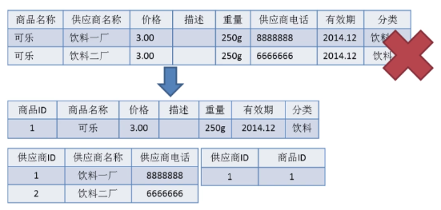

# 数据库基础知识

## 基本概念

### 数据库的四个概念

* **数据库** : 数据库(DataBase 简称 DB)就是信息的集合或者说数据库是由数据库管理系统管理的数据的集合。
* **数据库管理系统** : 数据库管理系统(Database Management System 简称 DBMS)是一种操纵和管理数据库的大型软件，通常用于建立、使用和维护数据库。
* **数据库系统** : 数据库系统(Data Base System，简称 DBS)通常由软件、数据库和数据管理员(DBA)组成。
* **数据库管理员** : 数据库管理员(Database Administrator, 简称 DBA)负责全面管理和控制数据库系统。

数据库系统基本构成如下图所示：

### 关键

* **元组** ： 元组（tuple）是关系数据库中的基本概念，关系是一张表，表中的每行（即数据库中的每条记录）就是一个元组，每列就是一个属性。 在二维表里，元组也称为行。
* **码** ：码就是能唯一标识实体的属性，对应表中的列。
* **候选码** ： 若关系中的某一属性或属性组的值能唯一的标识一个元组，而其任何、子集都不能再标识，则称该属性组为候选码。例如：在学生实体中，“学号”是能唯一的区分学生实体的，同时又假设“姓名”、“班级”的属性组合足以区分学生实体，那么\{学号\}和\{姓名，班级\}都是候选码。
* **主码** : 主码也叫主键。主码是从候选码中选出来的。 一个实体集中只能有一个主码，但可以有多个候选码。
* **外码** : 外码也叫外键。如果一个关系中的一个属性是另外一个关系中的主码则这个属性为外码。
* **主属性** ： 候选码中出现过的属性称为主属性。比如关系 工人（工号，身份证号，姓名，性别，部门）. 显然工号和身份证号都能够唯一标示这个关系，所以都是候选码。工号、身份证号这两个属性就是主属性。如果主码是一个属性组，那么属性组中的属性都是主属性。
* **非主属性**： 不包含在任何一个候选码中的属性称为非主属性。比如在关系——学生（学号，姓名，年龄，性别，班级）中，主码是“学号”，那么其他的“姓名”、“年龄”、“性别”、“班级”就都可以称为非主属性。

:::tip 主键和外键有什么区别?
* 主键(主码) ：主键用于唯一标识一个元组，不能有重复，不允许为空。一个表只能有一个主键。
* 外键(外码) ：外键用来和其他表建立联系用，外键是另一表的主键，外键是可以有重复的，可以是空值。一个表可以有多个外键。
:::

:::tip 为什么不推荐使用外键与级联？
《阿里巴巴开发手册》【强制】不得使用外键与级联，一切外键概念必须在应用层解决。以学生和成绩的关系为例，学生表中的 student_id 是主键，那么成绩表中的 student_id 则为外键。如果更新学生表中的 student_id，同时触发成绩表中的 student_id 更新，即为级联更新。外键与级联更新适用于单机低并发，不适合分布式、高并发集群; 级联更新是强阻塞，存在数据库更新风暴的风 险; 外键影响数据库的插入速度。
:::

## 数据库范式

### 1NF(第一范式)

**属性（对应于表中的字段）不能再被分割**，也就是这个字段只能是一个值，不能再分为多个其他的字段了。**1NF 是所有关系型数据库的最基本要求**，也就是说关系型数据库中创建的表一定满足第一范式。

### 2NF(第二范式)

2NF 在 1NF 的基础之上，**消除了非主属性对于码的部分函数依赖**。如下图所示，展示了第一范式到第二范式的过渡。第二范式在第一范式的基础上增加了一个列，这个列称为主键，非主属性都依赖于主键。

一些重要的概念：
* **函数依赖**（functional dependency） ：若在一张表中，在属性（或属性组）X 的值确定的情况下，必定能确定属性 Y 的值，那么就可以说 Y 函数依赖于 X，写作 X → Y。
* **部分函数依赖**（partial functional dependency） ：如果 X→Y，并且存在 X 的一个真子集 X0，使得 X0→Y，则称 Y 对 X 部分函数依赖。比如学生基本信息表 R 中（学号，身份证号，姓名）当然学号属性取值是唯一的，在 R 关系中，（学号，身份证号）->（姓名），（学号）->（姓名），（身份证号）->（姓名）；所以姓名部分函数依赖与（学号，身份证号）；
* **完全函数依赖**(Full functional dependency) ：在一个关系中，若某个非主属性数据项依赖于全部关键字称之为完全函数依赖。比如学生基本信息表 R（学号，班级，姓名）假设不同的班级学号有相同的，班级内学号不能相同，在 R 关系中，（学号，班级）->（姓名），但是（学号）->(姓名)不成立，（班级）->(姓名)不成立，所以姓名完全函数依赖与（学号，班级）；
* **传递函数依赖** ： 在关系模式 R(U)中，设 X，Y，Z 是 U 的不同的属性子集，如果 X 确定 Y、Y 确定 Z，且有 X 不包含 Y，Y 不确定 X，（X∪Y）∩Z=空集合，则称 Z 传递函数依赖(transitive functional dependency) 于 X。传递函数依赖会导致数据冗余和异常。传递函数依赖的 Y 和 Z 子集往往同属于某一个事物，因此可将其合并放到一个表中。比如在关系 R(学号 , 姓名, 系名，系主任)中，学号 → 系名，系名 → 系主任，所以存在非主属性系主任对于学号的传递函数依赖。

### 3NF(第三范式)

3NF 在 2NF 的基础之上，**消除了非主属性对于码的传递函数依赖**。符合 3NF 要求的数据库设计，基本上解决了数据冗余过大，插入异常，修改异常，删除异常的问题。比如在关系 R(学号 , 姓名, 系名，系主任)中，学号 → 系名，系名 → 系主任，所以存在非主属性系主任对于学号的传递函数依赖，所以该表的设计，不符合 3NF 的要求。

**总结：**

* 1NF：属性不可再分。
* 2NF：1NF 的基础之上，消除了非主属性对于码的部分函数依赖。
* 3NF：3NF 在 2NF 的基础之上，消除了非主属性对于码的传递函数依赖。

## E-R图
E-R 图 也称实体-联系图(Entity Relationship Diagram)，提供了表示实体类型、属性和联系的方法，用来描述现实世界的概念模型。 它是描述现实世界关系概念模型的有效方法。 是表示概念关系模型的一种方式。

下图是一个学生选课的 ER 图，每个学生可以选若干门课程，同一门课程也可以被若干人选择，所以它们之间的关系是多对多（M: N）。另外，还有其他两种关系是：1 对 1（1:1）、1 对多（1: N）。

我们试着将上面的 ER 图转换成数据库实际的关系模型(实际设计中，我们通常会将任课教师也作为一个实体来处理)：

## 数据库类型

### 关系型数据库

### NoSQL数据库

NoSQL（**Not Only SQL** 的缩写）泛指非关系型的数据库，主要针对的是键值、文档以及图形类型数据存储。并且，NoSQL 数据库天生支持分布式，数据冗余和数据分片等特性，旨在提供可扩展的高可用高性能数据存储解决方案。

NoSQL 数据库主要可以分为下面四种类型：

* 键值 ：键值数据库是一种较简单的数据库，其中每个项目都包含键和值。这是极为灵活的 NoSQL 数据库类型，因为应用可以完全控制 value 字段中存储的内容，没有任何限制。
* 文档 ：文档数据库中的数据被存储在类似于 JSON（JavaScript 对象表示法）对象的文档中，非常清晰直观。每个文档包含成对的字段和值。这些值通常可以是各种类型，包括字符串、数字、布尔值、数组或对象等，并且它们的结构通常与开发者在代码中使用的对象保持一致。
* 图形 ：图形数据库旨在轻松构建和运行与高度连接的数据集一起使用的应用程序。图形数据库的典型使用案例包括社交网络、推荐引擎、欺诈检测和知识图形。
* 宽列 ：宽列存储数据库非常适合需要存储大量的数据。

| 类型 | 常见数据库 |
| --- | --- |
| 键值 | Redis、DynanoDB |
| 文档 | MongoDB、ElasticSearch |
| 图 | Neo4j、JanusGraph、Giraph |
| 宽列 | Cassandra、HBase |

## 事务（Transaction）

### ACID

* **原子性**（`Atomicity`） ： 事务是最小的执行单位，不允许分割。事务的原子性确保动作要么全部完成，要么完全不起作用；
* **一致性**（`Consistency`）： 执行事务前后，数据保持一致，例如转账业务中，无论事务是否成功，转账者和收款人的总额应该是不变的；
* **隔离性**（`Isolation`）： 并发访问数据库时，一个用户的事务不被其他事务所干扰，各并发事务之间数据库是独立的。
* **持久性**（`Durability`）： 一个事务被提交之后。它对数据库中数据的改变是持久的，即使数据库发生故障也不应该对其有任何影响。

### 事务隔离级别

* **读取未提交**（`READ-UNCOMMITTED`）： 最低的隔离级别，允许读取尚未提交的数据变更，可能会导致脏读、幻读或不可重复读。
* **读取已提交**（`READ-COMMITTED`）： 允许读取并发事务已经提交的数据，可以阻止脏读，但是幻读或不可重复读仍有可能发生。
* **可重复读**（`REPEATABLE-READ`）： 对同一字段的多次读取结果都是一致的，除非数据是被本身事务自己所修改，可以阻止脏读和不可重复读，但幻读仍有可能发生。
* **可串行化**（`SERIALIZABLE`）： 最高的隔离级别，完全服从`ACID`的隔离级别。所有的事务依次逐个执行，这样事务之间就完全不可能产生干扰，也就是说，该级别可以防止脏读、不可重复读以及幻读。

| 隔离级别 | 脏读 | 不可重复读 | 幻读 |
| :--- | :---: | :---: | :---: |
| READ-UNCOMMITTED | √ | √ | √ |
| READ-COMMITTED | × | √ | √ |
| REPEATABLE-READ | × | × | √ |
| SERIALIZABLE | × | × | × |

## 参考资料

* [NoSQL 是什么？- MongoDB 官方文档](https://www.mongodb.com/zh-cn/nosql-explained)
* [什么是 NoSQL? - AWS](https://aws.amazon.com/cn/nosql/)
* [NoSQL vs. SQL Databases - MongoDB 官方文档](https://www.mongodb.com/zh-cn/nosql-explained/nosql-vs-sql)
* [JavaGuide-数据库](https://javaguide.cn/database/)
