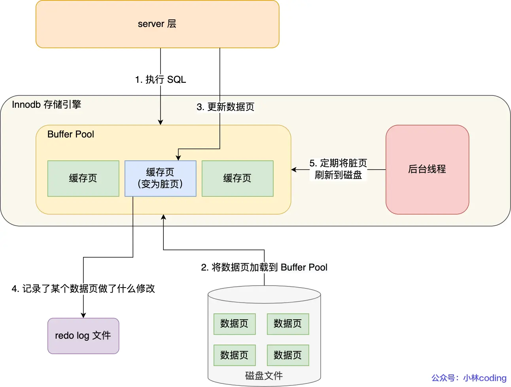
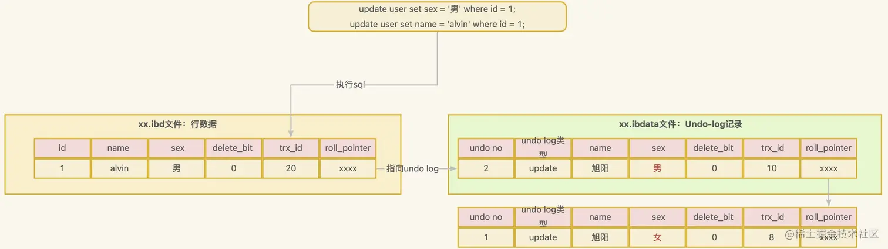
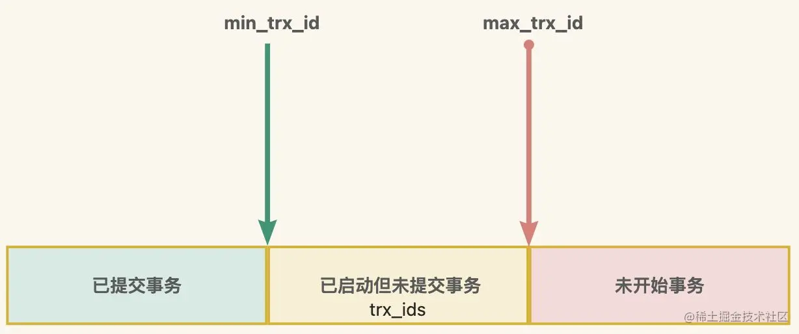

# Transaction

## 事务的实现

### redo日志

redo log 是物理日志，记录了某个数据页做了什么修改，，比如对 X 表空间中的 Y 数据页 Z 偏移量的地方做了 U 更新，每当执行一个事务就会产生这样的一条或者多条物理日志。

之所以需要这个的原因是为了**保证事务的持久性**，MySQL 为了实现高性能的吞吐，把数据页、索引页等各种磁盘信息缓存到内存中，也就是 **Buffer Pool**，数据的修改会直接修改内存，而不是磁盘，后台线程定时刷新脏页到磁盘。内存是易失存储介质，所以需要有机制能保证事务的持久性，redo日志就是为了保证数据持久性而设计的。增删改等修改操作会修改内存并同时往redo日志中追加相关日志，也就是 **WAL（Write-Ahead Logging）技术**，日志追加完成才算事务提交完成。这样即便系统崩溃或掉电也能使用redo日志恢复数据。



WAL 技术也有另外一个优点，MySQL 的写操作从磁盘的「随机写」变成了「顺序写」，提升语句的执行性能。这是因为 MySQL 的写操作并不是立刻更新到磁盘上，而是先记录在日志上，然后在合适的时间再更新到磁盘上。

综上，redo日志有两个主要的作用：

1. **保证事务的持久性**：让 MySQL 有 crash-safe 的能力，能够保证 MySQL 在任何时间段突然崩溃，重启后之前已提交的事务数据都不会丢失。
2. **提高了数据库的写性能**：将写操作从「随机写」变成了「顺序写」，提升 MySQL 写入磁盘的性能。

#### redo日志的内存缓冲区

值得注意的是，redo日志文件的追加不是每次都直接写磁盘的，在内存中有缓冲区，可以通过 `innodb_log_buffer_size` 参数控制缓冲区的大小，默认为16MB。

既然其有内存缓冲区，就涉及一个写磁盘的策略：

* MySQL 正常关闭时。
* 当 redo log buffer 中记录的写入量大于 redo log buffer 内存空间的一半时，会触发落盘。
* InnoDB 的后台线程每隔 1 秒，将 redo log buffer 持久化到磁盘。
* 每次事务提交时都将缓存在 redo log buffer 里的 redo log 直接持久化到磁盘（这个策略可由 `innodb_flush_log_at_trx_commit` 参数控制）。

InnoDB 还提供的 `innodb_flush_log_at_trx_commit` 参数有如下策略（当每次事务提交时）：

* 参数值为0：将 redo log 留在 redo log buffer 中 ，该模式下在事务提交时**不会主动触发写入磁盘**的操作。所以**MySQL系统崩溃会有丢失上1s数据的风险。**
* 参数值为1：将缓存在 redo log buffer 里的 redo log **直接持久化到磁盘**，这样可以保证 MySQL 异常重启之后数据不会丢失。
* 参数值为2：都只是缓存在 redo log buffer 里的 redo log **写到 redo log 文件**。注意写入到redo log 文件并不意味着写入到了磁盘，因为操作系统的文件系统有文件缓存。所以**MySQL系统崩溃不会有丢失数据的风险，但是操作系统崩溃或断电会有丢失上1s数据的风险。**

#### redo日志的磁盘文件

默认情况下， InnoDB 存储引擎有一个重做日志文件组，有 2 个 redo log 文件组成，这两个 redo 日志的文件名叫 ：`ib_logfile0` 和 `ib_logfile1` 。

重做日志文件组是以循环写的方式工作的，具体来说就是会先写 `ib_logfile0` 文件，当 `ib_logfile0` 文件被写满的时候，会切换至 `ib_logfile1` 文件，当 `ib_logfile1` 文件也被写满时，会切换回 `ib_logfile0` 文件。

所以当 redo log 文件满了，这时 MySQL 不能再执行新的更新操作，也就是说 MySQL 会被阻塞。等 Buffer Pool 中的脏页刷新到磁盘中删除redo日志腾出空间之后，MySQL 阻塞的更新操作才能得以继续执行。

### undo日志

undo日志也称回滚日志，主要有两个作用：

1. **实现事务回滚，保障事务的原子性**。事务处理过程中，如果出现了错误或者用户执 行了 `ROLLBACK` 语句，MySQL 可以利用 undo log 中的历史数据将数据恢复到事务开始之前的状态。
2. **实现 MVCC（多版本并发控制）关键部分**。MVCC 是通过 ReadView + undo log 实现的。undo log 为每条记录保存多份历史数据，MySQL 在执行快照读（普通 select 语句）的时候，会根据事务的 Read View 里的信息，顺着 undo log 的版本链找到满足其可见性的记录。

undo日志会记录事务开始之后的增删改的修改操作，每种操作有不同的记录格式。

## MVCC

MVCC（Multi-Version Concurrency Control），即多版本并发控制。MVCC是一种并发控制的方法，一般在数据库管理系统中，实现对数据库的并发访问，在编程语言中实现事务内存。简单理解，就是相当于给我们的MySQL数据库拍个”快照”，定格某个时刻数据库的状态。

在并发读写数据库时，可以做到在读操作时不用阻塞写操作，写操作也不用阻塞读操作，提高了数据库并发读写的性能 同时还可以解决**脏读**，**不可重复读**，**幻读** 等事务隔离问题，但**对幻读的解决不够彻底，依然存在一些问题**。

### 当前读与快照读

#### 当前读

当前读读取的是记录的最新版本，读取时会使用 **`next-key lock` （记录锁+间隙锁）** 方式对记录进行加锁, 其他事务就有可能阻塞。当满足加锁的 `SELECT` ，或者对数据进行增删改的情况都会进行当前读。比如：

```sql
SELECT * FROM user LOCK IN SHARE MODE; # 共享锁
SELECT * FROM user FOR UPDATE; # 排他锁
INSERT INTO user values ... # 排他锁
DELETE FROM user WHERE ... # 排他锁
UPDATE user SET ... # 排他锁
```

#### 快照读

快照读又叫普通读，也就是利用 **MVCC 机制**读取快照中的数据。对于不加锁的简单的 `SELECT` 查询都属于快照读。

#### 幻读现象

这两个解决方案是很大程度上解决了幻读现象，但是还是有**个别的情况依然会造成幻读现象**：

1. **无数据进行更新**：例如事务A一开始对某个id的记录进行查询返回为空，然后事务B插入了这个id的记录并提交了事务，接着事务A对这个id的数据进行了更新操作，然后又执行了查询操作，结果能返回非空，凭空出现了一条新的数据，发生了幻读。
   1. T1事务A：`begin; select * from t_test where id = 5` 返回0条；
   2. T2事务B：`begin; insert t_test values(5, ...); commit;`；
   3. T3事务A：`update t_test set name='Bob' where id=5`；
   4. T4事务A：`select * from t_test where id = 5` 返回1条。
2. **刚开始使用快照读，接着使用当前读**：例如事务A一开始使用**快照读**查询某个条件的返回了4条数据，接着事务B插入了刚好满足这个条件的1条数据并提交了事务，然后事务A再执行**当前读**查询返回的条数是5，凭空多了一条数据，发生了幻读。
   1. T1事务A：`begin; select * from t_test where id > 100` 返回4条；
   2. T2事务B：`begin; insert t_test values(200, ...); commit;`；
   3. T3事务A：`select * from t_test where id > 100 for update; commit;` 返回了5条。

### 实现原理

MVCC 的实现原理主要是依赖 **行记录的隐式字段**，**undo日志** ，**Read View**来实现的。

#### 行隐藏字段

<table style={{border:'none'}}>
    <tbody>
        <td style={{ background:'gray', color:'white'}}>其他字段...</td>
        <td style={{ background:'green', color:'white'}}>row_id</td>
        <td style={{ background:'red', color:'white'}}>trx_id</td>
        <td style={{ background:'orange', color:'white'}}>roll_ptr</td>
        <td style={{ background:'purple', color:'white'}}>deleted_bit</td>
        <td style={{ background:'gray', color:'white'}}>其他字段...</td>
    </tbody>
</table>

#### undo日志

InnoDB通过行记录的 `roll_ptr` 以及undo日志文件中的行记录 `roll_ptr` 串联形成一个版本链表，通过遍历链表就能访问历史版本的数据快照。



#### Read View

ReadView 就是事务在使用 MVCC 机制进行快照读操作时产生的一致性视图。比如针对可重复读隔离级别，是在事务启动的时候，创建一个ReadView。其有以下几个重要的信息：

* `creator_trx_id` ：创建该 Read View 的事务的事务 `id`, 只有在对表中的记录做改动时（执行INSERT、DELETE、UPDATE这些语句时）才会为事务分配事务 `id`，否则在一个只读事务中的值默认为 `0` 。
* `trx_ids` ： 指的是在创建 Read View 时，当前数据库中**活跃事务**（启动了但还没提交）的事务 `id` 列表。
* `min_trx_id` ：指的是在创建 Read View 时，当前数据库中**活跃事务**中事务 `id` 最小的事务，也就是 `m_ids` 的最小值。
* `max_trx_id` ：这个并不是 `m_ids` 的最大值，而是创建 Read View 时当前数据库中应该给下一个事务的 `id` 值，也就是全局事务中最大的事务 `id` 值 + 1。



根据以上信息，我们可以判断出一个事务所需要读取的快照数据选哪个版本，我们设待访问版本的数据事务ID为 `trx_id` ，规则如下：

* `trx_id` 属性值等于 `creator_trx_id` 值，意味着当前事务在访问它自己修改过的记录，所以该版本可以被当前事务访问。
* `trx_id` 属性值小于 `min_trx_id` 值，表示该版本是已提交或自己产生的事务，版本可见。
* `trx_id` 属性值大于等于 `max_trx_id` 值，表示该版本是由未来新事务产生的，版本不可见。
* `trx_id` 属性值大于等于 `min_trx_id` 值且小于等于 `max_trx_id` 值
  * `trx_id` 在活跃事务列表 `trx_ids` 中，表示该版本对应的事务还未提交，数据不可见，可根据版本链读取历史版本。
  * `trx_id` 不在活跃事务列表 `trx_ids` 中，表示该版本对应的事务已经提交，数据可见。

Read View 的创建时机：

* `READ COMMITTD` 在每一次进行普通 `SELECT` 操作前都会生成一个Read View。
* `REPEATABLE READ` 只在第一次进行普通 `SELECT` 操作前生成一个Read View，之后的查询操作都重复使用这个Read View。

## 参考资料

* [掘金 - MySQL的MVCC机制 - JAVA旭阳](https://juejin.cn/post/7170234288041328654)
* [CSDN - MySQL InnoDB的MVCC实现机制 - SnailMann](https://blog.csdn.net/SnailMann/article/details/94724197)
* [小林coding - MySQL 可重复读隔离级别，完全解决幻读了吗？](https://xiaolincoding.com/mysql/transaction/phantom.html)
* [小林coding - MySQL 日志：undo log、redo log、binlog 有什么用？](https://xiaolincoding.com/mysql/log/how_update.html)