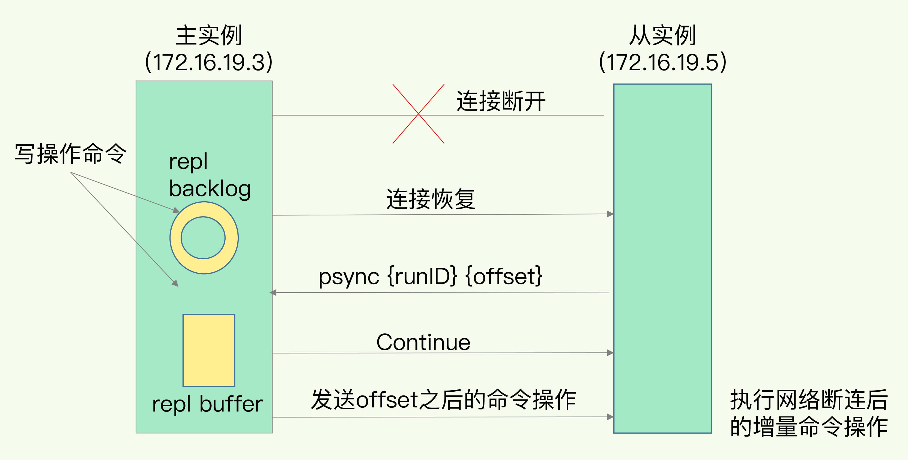

# Redis 高可用

## 主从复制

主从复制，是指将一台Redis服务器的数据，复制到其他的Redis服务器。前者称为主节点(master)，后者称为从节点(slave)；数据的复制是单向的，只能由主节点到从节点。

主从复制的作用主要包括：

* **数据冗余**：主从复制实现了数据的热备份，是持久化之外的一种数据冗余方式。
* **故障恢复**：当主节点出现问题时，可以由从节点提供服务，实现快速的故障恢复；实际上是一种服务的冗余。
* **负载均衡**：在主从复制的基础上，配合读写分离，可以由主节点提供写服务，由从节点提供读服务（即写Redis数据时应用连接主节点，读Redis数据时应用连接从节点），分担服务器负载；尤其是在写少读多的场景下，通过多个从节点分担读负载，可以大大提高Redis服务器的并发量。
* **高可用**：除了上述作用以外，主从复制还是哨兵和集群能够实施的基础，因此说主从复制是Redis高可用的基础。

主从库之间采用的是**读写分离**的方式：

* **读操作**：主库、从库都可以接收；
* **写操作**：首先到主库执行，然后，主库将写操作同步给从库。


### 全量复制

全量复制一般发生在第一次复制时，我们可以通过 `replicaof`（Redis 5.0 之前使用 `slaveof`）命令进行主库的一次全量同步。

```
replicaof ip port
```

全量复制分为以下三个阶段：


1. 建立连接、协商同步：从库和主库建立起连接，并告诉主库即将进行同步，主库确认回复后，主从库间就可以开始同步了。

从库给主库发送 `psync` 命令，表示要进行数据同步，主库根据这个命令的参数来启动复制。`psync` 命令包含了主库的 `runID` 和复制进度 `offset` 两个参数。`runID`，是每个 Redis 实例启动时都会自动生成的一个随机 ID，用来唯一标记这个实例。当从库和主库第一次复制时，因为不知道主库的 `runID`，所以将 `runID` 设为“？”。`offset`，此时设为 `-1`，表示第一次复制。主库收到 `psync` 命令后，会用 `fullresync` 响应命令带上两个参数：主库 `runID` 和主库目前的复制进度 `offset`，返回给从库。从库收到响应后，会记录下这两个参数。这里有个地方需要注意，`fullresync` 响应表示第一次复制采用的全量复制，也就是说，主库会把当前所有的数据都复制给从库。

2. 主库将所有数据同步给从库：从库收到快照RDB文件数据后，在本地完成数据加载。

主库执行 `bgsave` 命令，生成 RDB 文件，接着将文件发给从库。从库接收到 RDB 文件后，会先清空当前数据库，然后加载 RDB 文件。这是因为从库在通过 `replicaof` 命令开始和主库同步前，可能保存了其他数据。为了避免之前数据的影响，从库需要先把当前数据库清空。在主库将数据同步给从库的过程中，主库不会被阻塞，仍然可以正常接收请求。否则，Redis 的服务就被中断了。但是，这些请求中的写操作并没有记录到刚刚生成的 RDB 文件中。为了保证主从库的数据一致性，主库会在内存中用专门的 `replication buffer`，记录 RDB 文件生成后收到的所有写操作。

3. 主库会把第二阶段执行过程中新收到的写命令，再发送给从库。

当主库完成 RDB 文件发送后，就会把此时 `replication buffer` 中的修改操作发给从库，从库再重新执行这些操作。这样一来，主从库就实现同步了。

### 增量复制

如果主从库在命令传播时出现了网络闪断，那么，从库就会和主库重新进行一次全量复制，开销非常大。从 Redis 2.8 开始，网络断了之后，主从库会采用增量复制的方式继续同步。

增量复制的过程如下：



比较关键的两个缓冲区功能如下：

* `repl_backlog_buffer` ：它是为了从库断开之后，如何找到主从差异数据而设计的环形缓冲区，从而避免全量复制带来的性能开销。如果从库断开时间太久， `repl_backlog_buffer` 环形缓冲区被主库的写命令覆盖了，那么从库连上主库后只能乖乖地进行一次全量复制，所以 `repl_backlog_buffer` 配置尽量大一些，可以降低主从断开后全量复制的概率。而在 `repl_backlog_buffer` 中找主从差异的数据后，如何发给从库呢？这就用到了 `replication buffer` 。
* `replication buffer` ：Redis和客户端通信也好，和从库通信也好，Redis都需要给分配一个内存 `buffer` 进行数据交互，客户端是一个client，从库也是一个client，我们每个client连上Redis后，Redis都会分配一个client buffer，所有数据交互都是通过这个 `buffer` 进行的：Redis先把数据写到这个 `buffer` 中，然后再把 `buffer` 中的数据发到client socket中再通过网络发送出去，这样就完成了数据交互。所以主从在增量同步时，从库作为一个client，也会分配一个 `buffer` ，只不过这个 `buffer` 专门用来传播用户的写命令到从库，保证主从数据一致，我们通常把它叫做 `replication buffer` 。

如果在网络断开期间， `repl_backlog_size` 环形缓冲区写满之后，从库是会丢失掉那部分被覆盖掉的数据，还是直接进行全量复制呢？

1. 一个从库如果和主库断连时间过长，造成它在主库 `repl_backlog_buffer` 的 `slave_repl_offset` 位置上的数据已经被覆盖掉了，此时从库和主库间将进行全量复制。
2. 每个从库会记录自己的 `slave_repl_offset` ，每个从库的复制进度也不一定相同。在和主库重连进行恢复时，从库会通过 `psync` 命令把自己记录的 `slave_repl_offset` 发给主库，主库会根据从库各自的复制进度，来决定这个从库可以进行增量复制，还是全量复制。

### 读写分离引入的问题

* 数据不一致：主从复制的延迟会导致数据不一致。
* 数据过期：由于主节点的惰性删除和定期删除策略，都不能保证主节点及时对过期数据执行删除操作，因此，当客户端通过Redis从节点读取数据时，很容易读取到已经过期的数据。Redis 3.2中，从节点在读取数据时，增加了对数据是否过期的判断，如果该数据已过期，则不返回给客户端。
* 故障切换：在没有使用哨兵的读写分离场景下，故障节点手动切换特别麻烦，不易管理。

在使用读写分离之前，可以考虑其他方法增加Redis的读负载能力：如尽量优化主节点（减少慢查询、减少持久化等其他情况带来的阻塞等）提高负载能力；使用Redis集群同时提高读负载能力和写负载能力等。如果使用读写分离，可以使用哨兵，使主从节点的故障切换尽可能自动化，并减少对应用程序的侵入。

## 哨兵机制

## 分片技术

## 参考资料

* [Java全栈知识体系 - Redis进阶 - 高可用：主从复制详解](https://pdai.tech/md/db/nosql-redis/db-redis-x-copy.html)
* [Java全栈知识体系 - Redis进阶 - 高可用：哨兵机制（Redis Sentinel）详解](https://pdai.tech/md/db/nosql-redis/db-redis-x-sentinel.html)
* [Java全栈知识体系 - Redis进阶 - 高可拓展：分片技术（Redis Cluster）详解](https://pdai.tech/md/db/nosql-redis/db-redis-x-cluster.html)