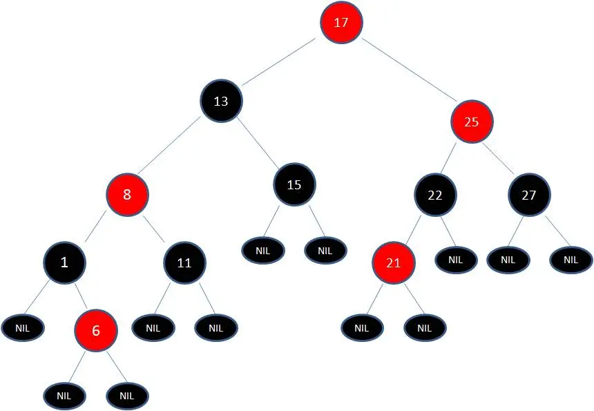
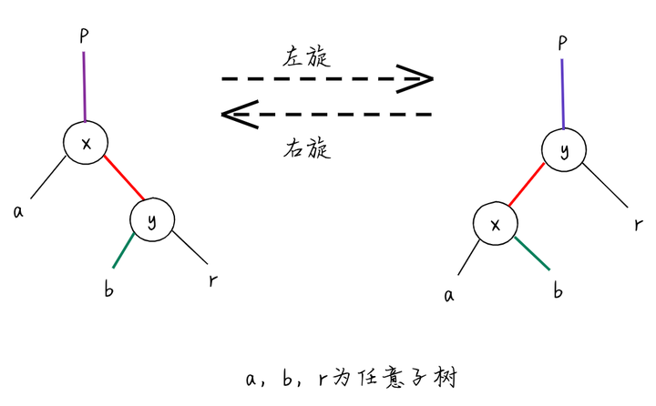

# BST, AVL, RBT

## BST 二叉查找树

二叉查找树（BST）具备以下特性：

1. 左子树上所有结点的值均小于或等于它的根结点的值。
2. 右子树上所有结点的值均大于或等于它的根结点的值。
3. 左、右子树也分别为二叉排序树。

二叉查找树（BST）的理想性能是 `O(log N)` 的时间复杂度，极端情况下，会退化成链表，查找时间复杂度降为 `O(N)` 。为了避免极端情况发生，发展出了平衡二叉树（AVL）和红黑树（red-black tree），它们的时间复杂度都严格为 `O(log N)` 。

## AVL 二叉平衡树

二叉平衡树（AVL）具备以下特性：

1. 它是一棵二叉查找树（BST）。
2. 每个节点的左右子节点的高度之差的绝对值最多为1。

在插入、删除树节点的时候，如果破坏了以上的特性，AVL树会通过旋转进行调整，再次使得以上特性成立。

### AVL 子树失衡的调整

AVL 子树失衡存在四种场景，可以通过对不平衡支点（pivot）左旋或右旋的方式进行调整：

1. 左左结构失衡：右旋
2. 右右结构失衡：左旋
3. 左右结构失衡：左旋+右旋
4. 右左结构失衡：右旋+左旋


### AVL 节点删除

* 当被删除节点为**叶子节点**时，直接删除，然后判断其父节点到根节点是否有失衡情况，有则通过旋转方式调整。
* 当被删除节点为**非叶子节点，且仅有左子树或者右子树**时，用左子树或右子树替代原来的位置，然后判断是否失衡，有则失衡调整。
* 当被删除节点为**非叶子节点，且有左子树和右子树**时，找到被删除节点值的前驱或者后驱节点替代原来的位置，然后判断是否失衡，有则失衡调整。

## RBT 红黑树

二叉平衡树（AVL）插入的时候很容易出现不平衡的情况，需要对失衡情况进行调整，操作过于频繁。红黑树（RBT）继承了AVL可自平衡的优点，同时在查询速率和平衡调整中寻找折中点，放宽了树的平衡条件，从而可以用于 **频繁增加或删除节点** 的场景。因此，AVL树更适用于**修改较少查询较多**的场景。


红黑树（RBT）除了是一棵二叉查找树（BST）外，还具备以下特性：

1. 节点是<font color="red">**红色**</font>或<font color="black">**黑色**</font>。
2. 根节点是<font color="black">**黑色**</font>。
3. 所有叶子节点都是<font color="black">**黑色**</font>的空（NIL）节点。
4. 每个<font color="red">**红色**</font>节点的两个子节点都是<font color="black">**黑色**</font>（从每个叶子到根的所有路径上不能有两个连续的<font color="red">**红色**</font>节点）（或者说不存在两个相邻的<font color="red">**红色**</font>节点，相邻指两个节点是父子关系）（或者说<font color="red">**红色**</font>节点的父节点和子节点均是<font color="black">**黑色**</font>的）。
5. 从任一节点到其每个叶子的所有简单路径都包含相同数目的<font color="black">**黑色**</font>节点。

红黑树并不是一颗**AVL平衡二叉搜索树**，从下图可以看到，节点13的左子树显然比右子树高。



在红黑树上进行插入操作和删除操作会导致不再符合红黑树的性质。恢复红黑树的性质需要少量 $O(\log{n})$ 的颜色变更（实际是非常快速的）和不超过三次树旋转（对于插入操作是两次）。虽然插入和删除很复杂，但操作时间仍可以保持为 $O(\log{n})$ 次。

### 失衡处理操作

#### 变色

为了满足红黑树的特性，节点的颜色由红变<font color="black">**黑**</font>或由黑变<font color="red">**红**</font>。

#### 左旋/右旋

同AVL树一样，红黑树



### 节点插入场景分析

在 Java 中的 `HashMap` 用到了红黑树，其数据结构定义如下：

```java
class Node<K,V> implements Map.Entry<K,V> {
    final int hash;
    final K key;
    volatile V val;
    volatile Node<K,V> next;
}

class TreeNode<K,V> extends Node<K,V> {
    TreeNode<K,V> parent;
    TreeNode<K,V> left;
    TreeNode<K,V> right;
    TreeNode<K,V> prev;
    boolean red;

    TreeNode(int hash, K key, V val, Node<K,V> next,
             TreeNode<K,V> parent) {
        super(hash, key, val, next);
        this.parent = parent;
    }
}
```

#### 场景1 空树无任何节点

插入根节点，并标记为黑色。

#### 场景2 插入节点的父节点为黑色

由于插入的节点是红色的，当插入节点的父节点是黑色时，不会影响红黑树的性质，直接插入无需做自平衡。

#### 场景3 插入节点的父节点为红色

根据性质2，根节点是黑色。如果插入节点的父节点为红色节点，那么该**父节点不可能为根节点**，所以插入节点总是存在祖父节点(三代关系)。

根据性质4，每个红色节点的两个子节点一定是黑色的。不能有两个红色节点相连。那么只能出现两种情况：

1. 父亲节点和叔父节点都为红色。
2. 父亲节点为红色，叔父节点为黑色。

接下来我们对两种情况分开讨论。

#### 场景3.1 父亲和叔父节点都为红色


根据性质4，红色节点不能相连，我们可以得出祖父节点G肯定为黑色节点。父亲P为红色，那么此时该插入子树的红黑树层数的颜色是黑红红，违背性质4。

所以我们需要变色，调整为红黑红，即祖父节点G变为红色，父亲节点P和叔父节点U变为黑色。

接下来我们把祖父节点G当做新节点处理。因为祖父节点G颜色变为了红色，如果G的父节点为红色，可能违背性质2或性质4，需要做自平衡操作恢复红黑树的性质。

#### 场景3.2 父亲节点为红色，叔父节点为黑色

#### 场景3.2.1 父亲节点为红色，叔父节点为黑色（LL型失衡）

描述：父节点P是红色而叔父节点U是黑色或缺少，新节点N是其父节点的左子节点，而父节点P又是其父节点G的左子节点。


1. 变色：父节点P变为黑色，祖父节点G变为红色。
2. 右旋：对节点P进行右旋操作。

#### 场景3.2.2 父亲节点为红色，叔父节点为黑色（LR型失衡）

描述：父节点P是红色而叔父节点U是黑色或缺少，并且新节点N是其父节点P的右子节点而父节点P又是其父节点的左子节点。


我们先进行一次左旋调换新节点N和其父节点P，然后就得到**场景3.2.1**的情况，再进行一次变色和右旋操作就能完成平衡操作。

#### 场景3.2.3 父亲节点为红色，叔父节点为黑色（RR型失衡）

描述：父节点P是红色而叔父节点U是黑色或缺少，新节点N是其父节点的右子节点，而父节点P又是其父节点G的右子节点。（**LL型镜像情况**）

1. 变色：父节点P变为黑色，祖父节点G变为红色。
2. 左旋：对节点P进行左旋操作。

#### 场景3.2.4 父亲节点为红色，叔父节点为黑色（RL型失衡）

描述：父节点P是红色而叔父节点U是黑色或缺少，并且新节点N是其父节点P的右子节点而父节点P又是其父节点的左子节点。（**LR型镜像情况**）

我们先进行一次右旋调换新节点N和其父节点P，然后就得到**场景3.2.3**的情况，再进行一次变色和左旋操作就能完成平衡操作。

### 节点删除场景分析

1. 待删除节点**有2个孩子**节点
    - 删除该节点，使用前驱或后驱节点替换，循环往复，一定会出现新要删除的节点**少于2个孩子**节点的情况
2. 待删除节点**有1个孩子**节点
   1. 待删除节点是红色
      - 其父亲和孩子节点一定是黑色，使用黑色孩子节点替换待删除节点
   2. 待删除节点是黑色
      1. 待删除节点的孩子节点是红色
         - 使用黑色孩子节点替换待删除节点，并修改颜色为红色
      2. 待删除节点的孩子节点是黑色
         - 情况最为复杂，下面分场景讨论
3. 待删除节点**无孩子**节点（叶子节点）
  - 我们可以把任意一个NIL节点看做孩子节点，问题转换为待删除节点**有1个孩子**节点

以下情况的大前提是待删除的节点仅有1个孩子节点，且其颜色和孩子节点的颜色都是黑色。黑色孩子节点将替换待删除节点，我们称这个节点为N，其兄弟节点为S，其父节点为P，S_L和S_R为S的左右孩子节点。

#### 场景1 N成为新的根

很完美，所有性质都满足。

#### 场景2 S是红色节点


我们对N的父节点P做左旋操作，然后对调P和S的颜色。现在N有了一个黑色的兄弟和一个红色的父亲，我们再通过场景4、场景5或场景6进行处理。

#### 场景3 N的父亲、S和S孩子节点都是黑色


我们重绘S为红色，此时通过S的所有路径都少了一个黑色节点，而N的路径正好被删了一个黑色节点，所以P下两边黑色节点数保持相同。但是经过P的路径少了一个黑色节点，会引起新的不平衡，接下来，我们从P开始，判断具体场景进行操作。

#### 场景4 S和S孩子节点都是黑色，但父节点是红色


交换S和P节点的颜色，完美满足性质5。

#### 场景5 S是黑色，S的左儿子是红色，S的右儿子是黑色，而N是它父亲的左儿子


我们对S做右旋操作，并交换S和S_L的颜色。现在N有了一个黑色兄弟，他的右儿子是红色的，所以我们进入了场景6。

#### 场景6 S是黑色，S的右儿子是红色，而N是它父亲的左儿子


我们对P做左旋操作，然后交换P和S的颜色，并是S_R变成黑色。

但是，N现在增加了一个黑色祖先：要么N的父亲变成黑色，要么它是黑色而S被增加为一个黑色祖父。所以，通过N的路径都增加了一个黑色节点。

此时，如果一个路径不通过N，则有两种可能性：

1. 它通过N的新兄弟。那么它以前和现在都必定通过S和N的父亲，而它们只是交换了颜色。所以路径保持了同样数目的黑色节点。
2. 它通过N的新叔父，S的右儿子。那么它以前通过S、S的父亲和S的右儿子，但是现在只通过S，它被假定为它以前的父亲的颜色，和S的右儿子，它被从红色改变为黑色。合成效果是这个路径通过了同样数目的黑色节点。

在任何情况下，在这些路径上的黑色节点数目都没有改变。所以我们恢复了性质4。在示意图中的白色节点可以是红色或黑色，但是在变换前后都必须指定相同的颜色。

# 参考资料

* [Wikipedia - 红黑树](https://zh.wikipedia.org/wiki/%E7%BA%A2%E9%BB%91%E6%A0%91)
* [掘金 - 漫画：什么是红黑树？ - 程序员小灰](https://juejin.cn/post/6844903519632228365)
* [博客园 - 红黑树](https://www.cnblogs.com/crazymakercircle/p/16320430.html)