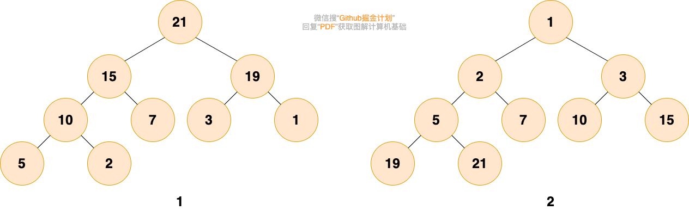

# Heap

堆（Heap）是一种特殊的二叉树，堆中的每一个节点值都大于等于（或小于等于）子树中所有节点的值。或者说，任意一个节点的值都大于等于（或小于等于）所有子节点的值。

如下图所示，左边是大顶堆，右边是小顶堆。

> **堆不一定是完全二叉树**
> 
> 二叉堆是一个数组，它可以被看成是一个 近似的完全二叉树。斐波那契堆和二项堆就不是完全二叉树，它们甚至都不是二叉树。

# 参考资料

* [Wikipedia - 堆](https://zh.wikipedia.org/wiki/%E5%A0%86%E7%A9%8D)
* [JavaGuide - 堆](https://javaguide.cn/cs-basics/data-structure/heap.html)