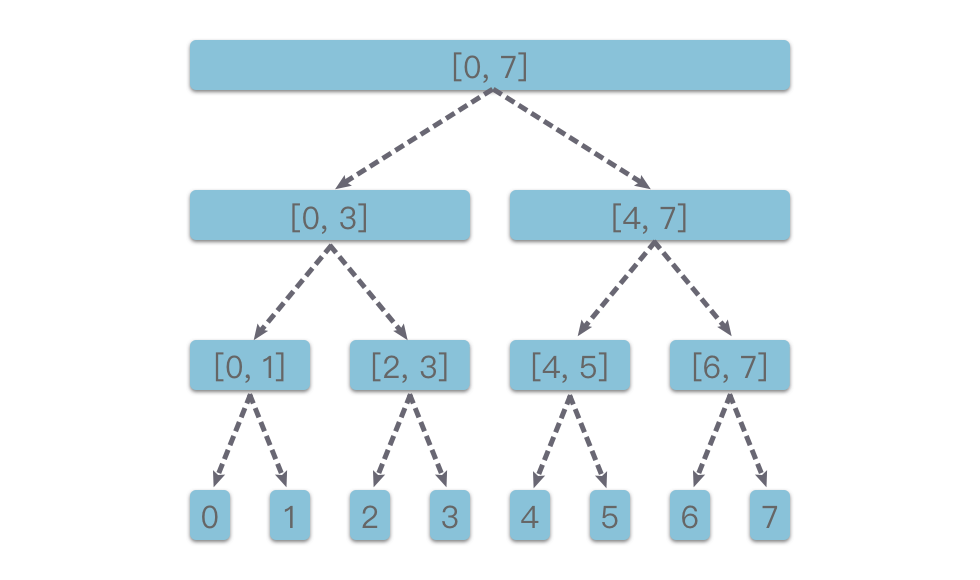

# 线段树

线段树（Segment tree）是一种二叉树形数据结构，1977年由乔恩·本特利发明，用以存储区间或线段，并且允许快速查询结构内包含某一点的所有区间。

一个包含 $n$ 个区间的线段树，空间复杂度为 $O(n)$，查询的时间复杂度则为 $O(\log{n}+k)$，其中 $k$ 是符合条件的区间数量。此数据结构亦可推广到高维度。

线段树是**一棵平衡二叉树**，树上的每个节点维护一个区间。根节点维护的是整个区间，每个节点维护的是父亲节点的区间二等分之后的其中一个子区间。当有 $n$ 个元素时，对区间的操作（单点更新、区间更新、区间查询等）可以在 $O(\log_{2}{n})$ 的时间复杂度内完成。

线段树的特点如下：

1. 线段树的每个节点都代表一个区间。
2. 线段树具有唯一的根节点，代表的区间是整个统计范围，比如 `[left,right]` 。
3. 线段树的每个叶子节点都代表一个长度为 $1$ 的单位区间 `[x,x]` 。
4. 对于每个内部节点 `[left,right]` ，它的左子节点是 `[left,(left+right)/2]`，右子节点是 `[(left+right)/2+1,right]` 。

## 线段树算法

### 存储结构

线段树近乎是完全二叉树，所以很适合用「顺序存储结构」来实现。可以采用与完全二叉树类似的编号方法来对线段树进行编号，方法如下：

* 根节点的编号为 $0$。
* 如果某二叉树节点（非叶子节点）的下标为 $i$，那么其左孩子节点下标为 $2×i+1$，右孩子节点下标为 $2×i+2$。
* 如果某二叉树节点（非根节点）的下标为 $i$，那么其父节点下标为 $(i−1)//2$（$//$ 表示整除）。

那么这个数组的大小应该设置为多少才合适？

* 在理想情况下，$n$ 个单位区间构成的线段树是一棵满二叉树，节点数为 $n+n/2+n/4+...+2+1=2×n−1$ 个。 因为 $2×n−1<2×n$，所以在理想情况下，只需要使用一个大小为 $2×n$ 的数组来存储线段树就足够了。
* 但是在一般情况下，有些区间元素需要开辟新的一层来存储元素。线段树的深度为 $⌈\log_{2}{n}⌉$，最坏情况下叶子节点（包括无用的节点）的数量为 $2^{⌈\log_{2}{n}⌉}$ 个，总节点数为 $2^{⌈\log_{2}{n}⌉+1}-1$ 个，可以近似看做是 $4n$，所以我们可以使用一个大小为 $4×n$ 的数组来存储线段树。

## 参考资料

* [算法通关知识 - 线段树知识](https://algo.itcharge.cn/07.Tree/03.Segment-Tree/01.Segment-Tree/)