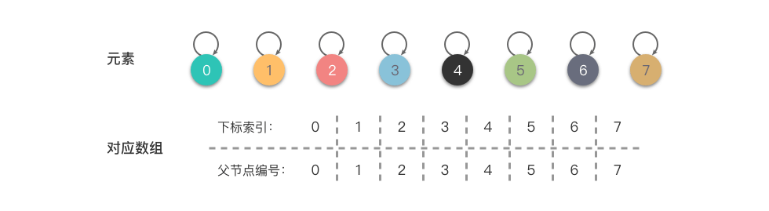
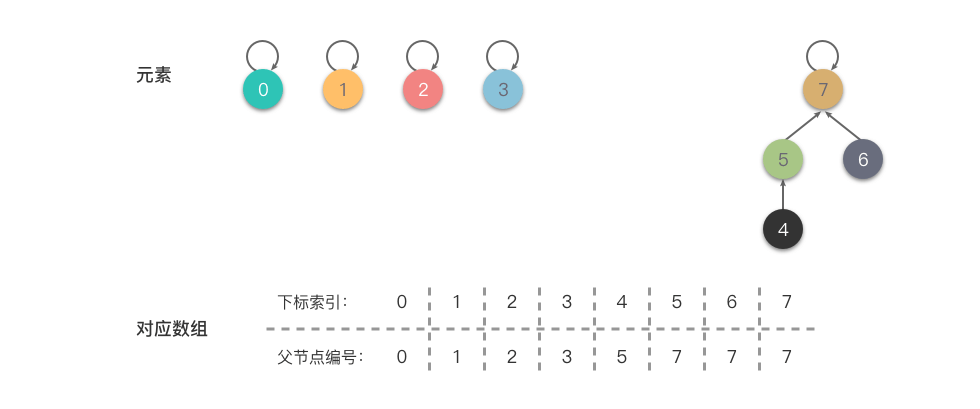

# 并查集

并查集是一种树型的数据结构，用于处理一些不相交集合的合并及查询问题。

并查集的思想是用一个数组表示了整片森林，树的根节点唯一标识了一个集合，我们只要找到了某个元素的的树根，就能确定它在哪个集合里。数组 `parent[i]` 一般表示为节点 `i` 的父节点或者根节点的编号值。

并查集主要支持两种操作：

* 合并（Union）：将两个集合合并成一个集合。
* 查找（Find）：确定某个元素属于哪个集合。通常是返回集合内的一个代表元素。

## 并查集算法

### 初始化

我们使用数组来表示 $7$ 个集合元素 $\{0\}$,$\{1\}$,$\{2\}$,$\{3\}$,$\{4\}$,$\{5\}$,$\{6\}$,$\{7\}$，每个集合只有一个元素，初始化时如下图：



### 集合合并

集合的合并是把其中一个集合的代表元素，也就是根节点连接到另外一个集合的节点上。

我们对上述的集合进行一系列的合并操作， `union(4, 5)`、`union(6, 7)`、`union(4, 7)` ，然后我们可以得到如下结果：



### 集合查找

### 路径压缩

#### 隔代压缩

#### 完全压缩

## 代码实现

```java showLineNumbers title="UnionFind.java"
public class UnionFind {
    private final int n;
    private final int[] parent;

    public UnionFind(int n) {
        this.n = n;
        this.parent = new int[n];
        for (int i = 0; i < n; i++) {
            this.parent[i] = i;
        }
    }

    public int count() {
        int count = 0;
        for (int i = 0; i < n; i++) {
            if (parent[i] == i) {
                count++;
            }
        }
        return count;
    }

    public int find(int i) {
        int r = i;
        // 找到根
        while (parent[r] != r) {
            r = parent[r];
        }
        // 完全压缩路径
        int j = i;
        while (parent[j] != j) {
            int p = parent[j];
            parent[j] = r;
            j = p;
        }
        return r;
    }

    public void union(int i, int j) {
        // 修改i的根
        parent[find(i)] = find(j);
    }
}
```

## 参考资料

* [算法通关手册 - 并查集知识](https://algo.itcharge.cn/07.Tree/05.Union-Find/01.Union-Find/)