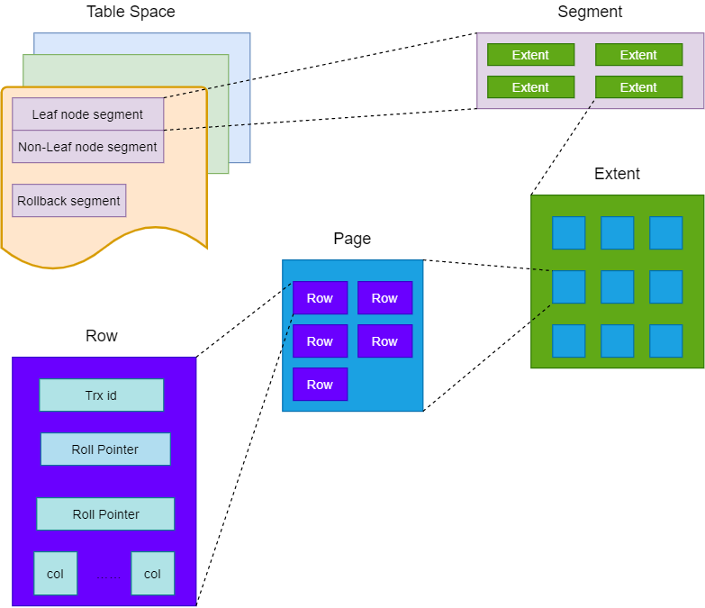
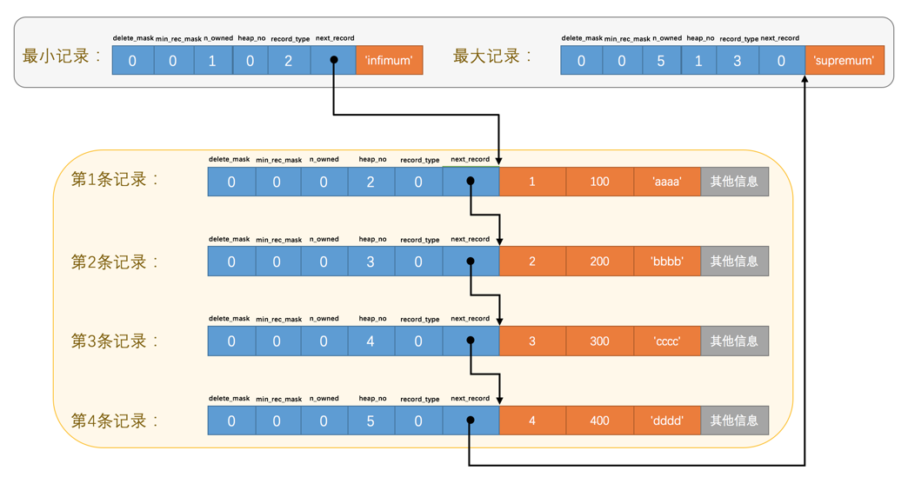
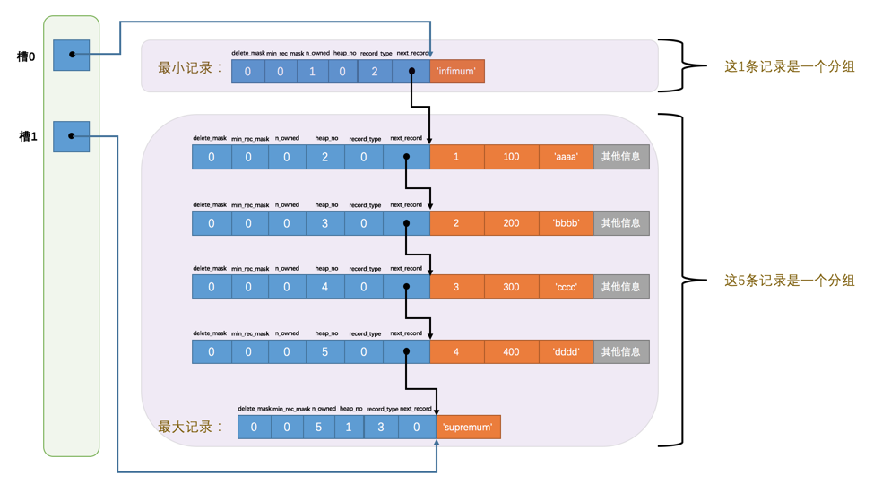

# InnoDB表

## 逻辑存储结构

InnoDB存储引擎中，所有数据都被逻辑存放在一个空间中，成为表空间。表空间又段（segment）、区（extent）、页（page）、行（row）多级组成。

* 段（segment）：常见的有数据段、索引段、回滚段等。
* 区（extent）：区的大小一般为1MB。
* 页（page）：也成为块block。默认大小为16KB，也就是一个区有64个页。页的大小可以通过 `innodb_page_size` 参数来指定。常见的页类型有：数据页、undo页、系统页、事务数据页、插入缓冲位图页、插入缓冲空闲列表页、未压缩的二进制大对象页、压缩的二进制大对象页等。
* 行（row）：InnoDB引擎按行存储数据。

默认情况下所有表都存放到共享表空间中，用户可以启用 `innodb_file_per_table` 参数让每张表的数据单独存放到一个表空间中，需要注意的是，每张表的表空间只存放数据、索引和插入缓冲Bitmap页，其他数据，例如回滚日志、插入缓冲索引页、系统事务信息、二次写缓冲等还是存放到共享表空间中。

## 行存储方式

MySQL默认在版本5.0之前采用 Redundant 的行格式，5.0以及之后5.7之前采用 Compact 行格式，5.7之后采用Dynamic 行格式。

### Redundant行格式

Redundant行格式是在MySQL5.0版本之前的行记录存储格式。

<table border="none">
    <tbody>
        <td style="background:red;color:white;">字段长度偏移列表</td>
        <td style="background:blue;color:white;">记录头信息</td>
        <td style="background:green;color:white;">隐藏列</td>
        <td style="background:pink;color:white;">不为NULL值的列值</td>
    </tbody>
</table>

* 字段偏移列表（1-n字节）：当列长度小于255字节，用1个字节表示，大于255字节，使用2个字节表示。列长度顺序逆序放置。注意字段包含定长类型字段，且存储的是偏移位置，不是列长度。
* NULL标识位（1-n字节）：为NULL则置bit位为1，否则为0。
* 记录头信息（6字节）：记录行的一些特征信息。
* row_id（6字节）：如果表没有定义主键时存在，否则不存在。
* trx_id（6字节）：事务ID。
* roll_ptr（7字节）：回滚指针。
* 不为NULL值的列值：非NULL的列值，占用字节由类型决定。

| 名称 | 大小 / bit | 描述 |
| :---: | :---: | --- |
| - | 1 | 未知 |
| - | 1 | 未知 |
| deleted_flag | 1 | 该行是否已被删除 |
| min_rec_flag | 1 | 该记录是否预先被定义为最小记录 |
| n_owned | 4 | 该记录拥有的记录数 |
| heap_no | 13 | 索引堆中该记录的排序记录 |
| n_fields | 10 | 记录中列的数量 |
| 1byte_offs_flags | 1 | 偏移列表为1字节还是2字节 |
| next_record | 16 | 页中下一条记录的相对位置 |

对于VARCHAR类型的NULL值，该格式不占用列存储空间，但是CHAR类型的NULL值需要占用空间。

### Compact行格式

Compact行记录是在MySQL5.0版本引入的。

<table border="none">
    <tbody>
        <td style="background:red;color:white;">变长字段长度列表</td>
        <td style="background:blue;color:white;">NULL标识位</td>
        <td style="background:green;color:white;">记录头信息</td>
        <td style="background:gray;color:white;">row_id</td>
        <td style="background:gray;color:white;">trx_id</td>
        <td style="background:gray;color:white;">roll_ptr</td>
        <td style="background:pink;color:white;">不为NULL值的列值</td>
    </tbody>
</table>

* 变长字段长度列表（1-n字节）：只包含变长字段长度，存储每个变长列的长度。变长字段指的是VARCHAR类型的列。当列长度小于255字节，用1个字节表示，大于255字节，使用2个字节表示。列长度顺序逆序放置。
* NULL标识位（1-n字节）：为NULL则置bit位为1，否则为0。
* 记录头信息（5字节）：记录行的一些特征信息。
* row_id（6字节）：如果表没有定义主键时存在，否则不存在。
* trx_id（6字节）：事务ID。
* roll_ptr（7字节）：回滚指针。
* 不为NULL值的列值：非NULL的列值，占用字节由类型决定。

| 名称 | 大小 / bit | 描述 |
| :---: | :---: | --- |
| - | 1 | 未知 |
| - | 1 | 未知 |
| deleted_flag | 1 | 该行是否已被删除 |
| min_rec_flag | 1 | 该记录是否预先被定义为最小记录 |
| n_owned | 4 | 该记录拥有的记录数 |
| heap_no | 13 | 索引堆中该记录的排序记录 |
| record_type| 3 | 记录类型，000表示普通，001表示B+树节点指针，010表示Infimum，011表示Supermum，1xx表示保留 |
| next_record | 16 | 页中下一条记录的相对位置 |

该格式下，VARCHAR类型和CHAR类型的列值都不会额外占用空间。

### 行溢出数据处理

MySQL提供VARCHAR类型列最多可以存储65535个字节，VARCHAR(n)中的n指的是字符个数，而非字节个数。另外因为有一些额外占用，实际并不是65535字节，而是65532字节，并且是指表中所有VARCHAR列的字节长度总和不超过65535字节。

对于VARCHAR类型的数据，行存储时采用如下策略：行内最多只保存前 `prefix_len` 个字节的前缀，如果长度溢出则剩下的存储到BLOB页，并在行内保存一个指针。经过测试，当阈值长度为 `8098` 时，会把 `prefix_len=768` 的前缀放到行内。

### Compressed 和 Dynamic 行格式

InnoDB 1.0.x版本引入了Dynamic 和 Compressed 两种新的行记录格式。这两种新的记录格式会把存放到BLOB中的数据采用 `prefix_len=0` 的策略，也就是只存放20个字节的指针，数据完全存放到Off Page中。另外，Compressed 格式会对BLOB、TEXT、VARCHAR类型的列数据使用zlib算法进行压缩。

### CHAR列类型存储方式

`CHAR(n)` 中的n指的是字符个数，对于默认的 `latin1` 编码，每个字符都是固定长度的，而对于UTF-8编码，字符长度是变长，`CHAR(10)` 所占用的字节长度就在10-30之间，所以InnoDB在存储CHAR类型的列时，也把它当做VARCHAR来处理。

## 数据页结构

### 文件头（File Header）

文件头用来记录页的一些头信息，共由 8 个部分组成，总共38个字节。

| 名称 | 大小/字节 | 描述 |
| :---: | :---: | --- |
| FIL_PAGE_SPACE_OR_CHKSUM | 4 |MySQL 4.0.14 之前为 0，之后的版本中该值代表页的 checksum |
| FIL_PAGE_OFFSET | 4 |	页号，表空间中页的偏移值，起始值为 0。如果某独立表空间 a.ibd 的大小为 1 GB，如果页的大小为 16 KB，那么总共有 65536 个页。偏移值代表该页在所有页中的位置。同时通过该部分的长度 4 个字节可以算出一个表空间最大支持 2^32 * 16 KB = 64 TB |
| FIL_PAGE_PREV	| 4 |	上一页的页号，B+Tree 的特性决定了叶子节点必须是双向列表 |
| FIL_PAGE_NEXT	| 4	| 下一页的页号，B+Tree 的特性决定了叶子节点必须是双向列表 |
| FIL_PAGE_LSN	| 8	| 最后被修改的日志序列的 LSN（Log Sequence Number）|
| FIL_PAGE_TYPE	| 2	| 页的类型，数据页对应的类型为 FIL_PAGE_INDEX，值为 0x45BF 代表存放的是数据页 |
| FIL_PAGE_FILE_FLUSH_LSN	| 8 |	仅在系统表空间的一个页中定义，代表文件成功刷新到磁盘的 LSN。|独立表空间中该值都是 0 |
| FIL_PAGE_ARCH_LOG_NO_OR_SPACE_ID |	4 |	从 MySQL 4.1 开始，该值代表页属于哪个表空间（存放的是表空间 ID）|

InnoDB存储引擎中的页的类型

| 名称 | 大小/字节 | 描述 |
| :---: | :---: | --- |
| FIL_PAGE_INDEX | 0x45BF | B+树叶子节点 |
| FIL_PAGE_UNDO_LOG | 0x0002 | Undo Log页 |
| FIL_PAGE_INODE | 0x0003 | 索引节点 |
| FIL_PAGE_IBNUF_FREE_LIST | 0x0004 | Insert Buffer空闲列表 |
| FIL_PAGE_TYPE_ALLOCATED | 0x0000 | 该页为最新分配 |
| FIL_PAGE_IBUF_BITMAP | 0x0005 | Insert Buffer 位图 |
| FIL_PAGE_TYPE_SYS | 0x0006 | 系统页 |
| FIL_PAGE_TYPE_TRX_SYS | 0x0007 | 事务系统数据 |
| FIL_PAGE_TYPE_FSP_HDR | 0x0008 | File Space Header |
| FIL_PAGE_TYPE_XDES | 0x0009 | 扩展描述页 |
| FIL_PAGE_TYPE_BLOB | 0x000A | BLOB页 |

### 页头（Page Header）

Page Header 用来记录数据页的状态信息，由 14 个部分组成，共占用 56 个字节。

| 名称 | 大小/字节 | 描述 |
| :---: | :---: | --- |
| PAGE_N_DIR_SLOTS	| 2| 	在 Page Directory 中 Slot 的数量 |
| PAGE_HEAP_TOP	| 2 |	堆中第一个记录的指针（记录在页中是以堆的形式存放的），该地址之后就是 Free Space |
| PAGE_N_HEAP	| 2 |	堆中的记录数（包括最小记录和最大记录以及标记为删除的记录），但是第 15 位表示行记录格式 |
| PAGE_FREE	| 2 |	指向可重用空间的首指针，即第一个标记为删除的记录的地址（已删除的记录通过 next_record 组成一个链表），如果这个页上有记录要插入，可以先从这里分配空间，如果空间不够，再从 Free Space 分配 |
| PAGE_GARBAGE	| 2 |	已删除的字节数，即行记录中 delete_mask 为 1 的记录大小的总和 |
| PAGE_LAST_INSERT	| 2 |	最后插入记录的位置（指向最近一个被插入的记录，主要用来方便后续的插入操作）|
| PAGE_DIRECTION	| 2 |	最后一个记录插入的方向。假如新插入的一条记录的主键值比上一条记录的主键值大，那么这条记录的插入方向是从右插入，反之则是从左插入 |
| PAGE_N_DIRECTION	| 2 |	一个方向连续插入的记录个数，如果最后一条记录的插入方向发生了改变，那么这个该值会被清零重新统计 |
| PAGE_N_RECS	| 2 |	该页中记录的数量（不包括最小记录和最大记录以及标记为删除的记录） |
| PAGE_MAX_TRX_ID	| 8 |	修改当前页的最大事务 ID，该值仅在二级索引中定义 |
| PAGE_LEVEL	| 2 |	当前页在索引树中的位置，0x00 代表叶子节点，即叶子节点总是在第 0 层 |
| PAGE_INDEX_ID	| 8 |	索引 ID，表示当前页属于哪个索引 |
| PAGE_BTR_SEG_LEAF	| 10 |	B+树数据页非叶子节点所在段的 segment header。该值仅在 B+树的 Root 页中定义 |
| PAGE_BTR_SEG_TOP |	10 |	B+树数据页所在段的 segment header。该值仅在 B+树的 Root 页中定义 |

### Infimum 和 Supermum 记录

在 InnoDB 中，每个数据页中都有两个虚拟的行记录，用来限定记录的边界。Infimum 记录比该页中任何记录都要小（对比主键值），而 Supremum 记录则比该页中任何可能大的记录都要大。这两个记录在页创建的时候建立，且在任何情况下都不会被删除。在 Compact 行格式和 Redundant 行格式中，两者占用的字节数不同。

这里需要提到行记录中的 next_record。它表示从当前记录的真实数据到下一条记录的真实数据的地址（即记录头信息和列数据的中间位置）偏移量。比如第一条记录的 next_record 为 32，那么就表示从第一条记录的真实数据的地址处向后找 32 个字节就是下一条记录的真实数据地址。同时需要注意的是，下一条记录并不是按照插入顺序，而是按照主键值由小到大的顺序，Infimum 记录的下一条就是本页中主键值最小的用户记录，而本页中主键值最大的用户记录的下一条就是 Supremum 记录。

### 用户记录和空闲空间

User Records 就是实际存储行记录的部分，Free Space 指的是空闲空间，它是一个链表结构。在一条记录被删除后，该记录的空间会加入到空闲链表中（与其说是加入，不如说是先从可重用链表中分配空间，空间不足再从空闲空间分配）。

### 页目录（Page Directory）

我们知道记录在页中是按照主键值从小到大的顺序组成了一个单链表，如果我们想根据主键值查找页中的某条记录，那么最笨的办法就是从 Infimum 记录开始，沿着链表向后查找（next_record）。这种线性查找的方式在页中存储了很多条记录时性能较差，InnoDB 的设计者们实现了一种更好的查询方式。

他们将页中所有的记录（包括最大和最小记录，但不包括标记为已删除的记录）划分为几个组。每个组的最后一条记录，也就是组内最大的那条记录的头信息中的 n_owned 属性表示组内一共有几条记录。最后将每个组的最后一条记录的地址偏移量（页面从 0 开始数，到该记录时的字节数）单独提取出来按照顺序存储到页目录中，页目录中的这些地址偏移量也被称为槽（Slot）。

在这个页目录中有两个槽，0 号槽的值为 99，代表最小记录的地址偏移量，1 号槽的值为 112，代表最大记录的地址偏移量。在最小记录的头信息中，n_owned 的值为 1，表示该分组中只有 1 条记录，也就是最小记录本身。最大记录的头信息中，n_owned 的值为 5，表示该分组中有 5 条记录。

InnoDB 中规定，对于最小记录所在的分组只能有 1 条记录，对于最大记录所在的分组拥有的记录数只能在 1 到 8 条之间，剩下的分组中记录的条数只能在 4 到 8 条之间。即在初始情况下，数据页中只有最小和最大两条记录，它们分为两个组。之后每插入一条记录，都会从页目录中找到主键值比插入记录的主键值大且差值最小的槽（确定该记录应该处于哪个分组中），然后把该槽对应记录的 n_owned 值加 1，直到该组中的记录数等于 8 个。接下来再插入记录时，会将最大记录所在的组拆分成两个，新分离出来的组中有 4 条记录，最大记录所在的组中有 5 条记录。接着上面的例子，我们再插入多条数据。

接下来我们再看一开始提出的问题，在页中查找指定主键值对应的记录。由于各个槽对应的记录的主键值都是按照从小到大的顺序排列的，因此我们可以用二分法进行快速查找。有 0 到 4 共五个槽，初始情况下最小的槽 low = 0，最大的槽 high = 4，假设需要查找的主键值为 6。那么首先计算中间槽的位置：(0 + 4) / 2 = 2，查看 2 号槽中对应的主键值为 8，而 6 又小于 8，所以设置 high = 2，low 保持不变。然后重新计算中间槽的位置为 1，查看槽位对应的主键值为 4，所以设置 low = 1，high 保持不变。由于此时 high 与 low 的差值为 1，所以可以确定主键值为 6 的记录在 2 号槽对应的分组中。此时可以从 1 号槽最大的记录向后查找，该条记录的下一条就是 2 号槽的最小记录，直到找到为止。

所以在一个数据页中查找指定主键值的记录可以分为两个步骤：首先通过二分法确定该记录所在的槽，并找到该槽所在分组中主键值最小的那条记录。接下来就可以通过该记录的 next_record 属性遍历所在分组的各个记录，直到找到为止。同时需要牢记的是，B+树索引本身并不能找到具体的一条记录，能找到的只是该记录所在的页。数据库把页载入内存，然后通过 Page Directory 再进行二叉查找。而在内存进行二分查找是很快的，通常会忽略这部分查找的时间开销。

### 文件尾（File Tailer）

数据在内存中被修改后再同步回磁盘，这个同步的过程相对较慢。如果在同步过程中出现了异常情况，比如机器宕机、断电、磁盘损坏等，数据就有可能会丢失。因此为了检测页的完整性，InnoDB 在页中设置了 File Trailer。文件尾中只有一个 `FIL_PAGE_END_LSN`，占用 8 个字节。前 4 个字节代表该页的 checksum 值，后 4 个字节与 File Header 中的 `FIL_PAGE_LSN` 相同。InnoDB 通过将这两个值与 File Header 中的 `FIL_PAGE_SPACE_OR_CHKSUM` 和 `FIL_PAGE_LSN` 进行比较（`checksum` 的比较需要使用 `checksum` 函数，不是简单的等值比较），看是否一致，以此来保证页的完整性。checksum 操作有一定的开销，可根据 `innodb_checksums` 参数来控制是否开启，另外可根据 `innodb_checksums_algorithm` 来选择校验和算法。

## 约束

InnoDB存储引擎提供了以下几种约束：

* Primary Key
* Unique Key
* Foreign Key
* Default
* NOT NULL

## 视图

## 分区

MySQL数据库只支持水平分区，且采用局部分区索引，即一个分区既存放数据又存放索引。

* 水平分区：将同一表中不同行的记录分配到不同的物理文件中。
* 垂直分区：将同一表中不同列的记录分配到不同的物理文件中。

当前MySQL数据库支持以下几种类型的分区：

1. RANGE分区：行数据基于属于一个给定连续区间的列值被放入分区。
2. LIST分区：和RANGE分区类似，只不过LIST分区面向的是离散的值。
3. HASH分区：根据用户自定义的表达式返回值来进行分区，返回值不能为负数。
4. KEY分区：根据MySQL数据库提供的哈希函数进行分区。

# 参考资料

* 《MySQL技术内幕 - InnoDB存储引擎》
* [博客 - MySQL 的 NULL 值是怎么存储的？](https://www.cnblogs.com/xiaolincoding/p/16941244.html)
* [掘金 - InnoDB引擎-四种行记录存储](https://juejin.cn/post/7004459098682949645)
* [掘金 - InnoDB引擎-行记录存储 Redundant行格式](https://juejin.cn/post/6847902223817506829)
* [掘金 - InnoDB引擎-行记录存储 Compact行格式](https://juejin.cn/post/6844903470860861454)
* [nekolr's blog - InnoDB 数据页结构](https://nekolr.github.io/2020/07/06/InnoDB%20%E6%95%B0%E6%8D%AE%E9%A1%B5%E7%BB%93%E6%9E%84/)
