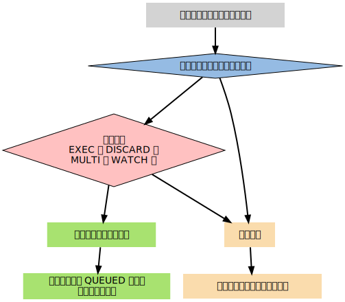

# Redis 实现

## 数据结构

|   键类型  | 底层数据结构 |   举例    |
|   --- |   --- |   --- |
|   字符串、整数  |   简单动态字符串 | `SET key "hello, world"` `SET key 1024`|
|   列表    |   压缩列表或双向链表  |   `LPUSH key 34` `LLEN key` |
|   集合    |   字典或整数集合  | `SADD db "mysql" "redis" "hbase"`  |
|   有序集合    |   压缩列表或 跳表和字典    |  `ZADD key 30.0 "weight"` |
|   哈希表  |   压缩列表或字典  |  `HMSET company name "google"` |

### SDS（Simple Dynamic String）

```c
struct sdshdr {
    // 记录buf数组中已使用字节的数量
    // 等于SDS所保存字符串的长度
    int len;
    // 记录buf数组中未使用的字节的数量
    int free;
    // 字节数组，用于保存字符串
    char buf[];
}
```

SDS遵循了C字符串以空字符结尾的惯例，保存空字符的1字节空间不计算在SDS的len属性里面，空字符的处理完全由SDS处理。

SDS的buf空间大小可以随着字符串长度的调整动态重分配，调整规则如下：

1. 如果最终字符串可由原来的buf保存，则无需重新分配。
2. 如果字符串变长之后的长度小于1MB，那么将把空间扩张成2倍len的大小，也就是free的大小和len大小相同。
3. 如果字符串变长之后的长度大于等于1MB，那么将把free的大小设置为1MB。
4. 如果字符串变短，那么无需重新分配。

需要注意的是，SDS并不仅仅用于字符串存储，数值等类型也可以用它进行存储。

### 双向链表（Linked-List）

```c
typedef struct list {
    // 头节点
    listNode *head;
    // 尾节点
    listNode *tail;
    // 链表所包含的节点数量
    unsigned long len;
    // 节点值复制函数
    void *(*dup) (void *ptr);
    // 节点值释放函数
    void *(*free) (void *ptr);
    // 节点值比较函数
    void *(*match) (void *ptr, void *key);
} list;

typedef struct listNode {
    struct listNode *prev;
    struct listNode *next;
    void *value;
} listNode;
```

### 字典（Dict）

```c
typedef struct dictEntry {
    // 键
    void *key;
    // 值
    union {
        void *val;
        uint64_tu64;
        int64_ts64;
    } v;
    // 指向下一个哈希节点，形成单向链表
    struct dictEntry *next;
} dictEntry;

typedef struct dictht {
    // 哈希表数组
    dictEntry **table;
    // 哈希表大小
    unsigned long size;
    // 等于size-1
    unsigned long sizemask;
    // 哈希表已有节点的数量
    unsigned long used;
} dictht;

typedef struct dict {
    // 类型指定函数
    dictType *type;
    // 私有数据
    void *privdata;
    // 2个哈希表，用于rehash切换
    dictht ht[2];
    // rehash索引，当未进行rehash时为-1
    int trehashidx;
} dict;

typedef struct dictType {
    // 计算哈希值的函数
    unsigned int (*hashFunction)(const void *key);
    // 复制键值的函数
    void *(*keyDup)(void *privdata, const void *key);
    // 复制值的函数
    void *(*valDup)(void *privdata, const void *obj);
    // 对比键的函数
    void (*keyDestrucor)(void *privdata, const void *key1, const void *key2);
    // 销毁键的函数
    void (*keyDestrucor)(void *privdata, void *key);
    // 销毁值的函数
    void (*valDestructor)(void *privdata, void *obj);
}
```

rehash 的过程是渐进式的，由 `trehashidx` 的值决定，为-1时不进行rehash，0到size-1为rehash完成的进度。

### 跳表（Skip-List）

```c
typedef struct zskiplistNode {
    // 层结构
    struct zskiplistLevel {
        struct zskiplistNode *forword;
        unsigned int span;
    } level[];
    // 节点后向指针
    struct zskiplistNode *backward;
    // 分数值
    double score;
    // 节点值
    robj *obj;
} zskiplistNode;
```


算法原理详解，请看[Skip-List算法](../../algorithm/skip-list.md)。

### 整数集合（intset）

```c
typedef struct intset {
    // 编码方式，支持INTSET_ENC_INT16，INTSET_ENC_INT32，INTSET_ENC_INT64等
    uint32_t encoding;
    // 集合元素个数
    uint32_t length;
    // 元素内容，按encoding动态组织
    uint8_t contents[];
}
```

在插入元素时，按元素大小对encoding进行动态调整。

### 压缩列表（ziplist）

压缩列表是Redis为了节约内存而开发的，是由一系列特殊编码的**连续内存块**组成的顺序型数据结构。
```
area        |<---- ziplist header ---->|<----------- entries ------------->|<-end->|

size          4 bytes  4 bytes  2 bytes    ?        ?        ?        ?     1 byte
            +---------+--------+-------+--------+--------+--------+--------+-------+
component   | zlbytes | zltail | zllen | entry1 | entry2 |  ...   | entryN | zlend |
            +---------+--------+-------+--------+--------+--------+--------+-------+
                                       ^                          ^        ^
address                                |                          |        |
                                ZIPLIST_ENTRY_HEAD                |   ZIPLIST_ENTRY_END
                                                                  |
                                                         ZIPLIST_ENTRY_TAIL
```

|   属性    |	类型	|   长度/字节   |    用途   |
|   :---:   |   :---:   |   :---:   |   :---:   |
|   zlbytes |	uint32_t	|   4   |   整个 ziplist 占用的内存字节数，对 ziplist 进行内存重分配，或者计算zlend位置时使用。|
|   zltail  |	uint32_t	|   4   |   到达 ziplist 表尾节点的偏移量。 通过这个偏移量，可以在不遍历整个 ziplist 的前提下，确定表尾节点位置。|
|   zllen   |	uint16_t    |	2   |   ziplist 中节点的数量。 当这个值小于 UINT16_MAX （65535）时，这个值就是 ziplist 中节点的数量； 当这个值等于 UINT16_MAX 时，节点的数量需要遍历整个 ziplist 才能计算得出。|
|   entryX  |	列表节点    |   不固定   |	ziplist 所保存的节点，各个节点的长度根据内容而定。|
|   zlend   |	uint8_t |  1  | 特殊值0xFF，用于标记 ziplist 的末端。|

#### 列表节点组成

一个 ziplist 可以包含多个节点，每个节点可以划分为以下几个部分：

```
area        |<------------------- entry -------------------->|

            +------------------+----------+--------+---------+
component   | pre_entry_length | encoding | length | content |
            +------------------+----------+--------+---------+
```

##### pre_entry_length

pre_entry_length 记录了前一个节点的长度，通过这个值，可以进行指针计算，从而跳转到上一个节点。

```
area        |<---- previous entry --->|<--------------- current entry ---------------->|

size          5 bytes                   1-5 bytes             ?          ?        ?
            +-------------------------+-----------------------------+--------+---------+
component   | ...                     | pre_entry_length | encoding | length | content |
            |                         |                  |          |        |         |
value       |                         | 0000 0101        |    ?     |   ?    |    ?    |
            +-------------------------+-----------------------------+--------+---------+
            ^                         ^
address     |                         |
            p = e - 5                 e
```

根据编码方式的不同， pre_entry_length 域可能占用 1 字节或者 5 字节：

* 1 字节：如果前一节点的长度小于 254 字节，便使用一个字节保存它的值。
* 5 字节：如果前一节点的长度大于等于 254 字节，那么将第 1 个字节的值设为 254 ，然后用接下来的 4 个字节保存实际长度。

##### encoding 和 length

encoding 和 length 两部分一起决定了 content 部分所保存的数据的类型（以及长度）。

其中， encoding 域的长度为两个 bit ， 它的值可以是 0b00, 0b01, 0b10 和 0b11 ：

* 0b00, 0b01 和 0b10 表示 content 部分保存着字符数组。
* 0b11 表示 content 部分保存着整数。

以 0b00, 0b01 和 0b10 开头的字符数组的编码方式如下：

|   编码    |	编码长度/字节    |	content 部分保存的值    |
| --- | :---: | --- |
|   00bbbbbb    |	1  |	长度小于等于 $2^6-1$ 字节的字符数组。|
|   01bbbbbb xxxxxxxx   |   2  |	长度小于等于 $2^{14}-1$ 字节的字符数组。|
|   10____ aaaaaaaa bbbbbbbb cccccccc dddddddd	|   5  |	长度小于等于 $2^{32}-1$ 的字符数组。|

表格中的下划线 _ 表示留空，而变量 b 、 x 等则代表实际的二进制数据。为了方便阅读，多个字节之间用空格隔开。

11 开头的整数编码如下：

|   编码    |	编码长度/字节    |	content 部分保存的值    |
|   --- |   :---: |   --- |
|   11000000    |	1   |	int16_t 类型的整数  |
|   11010000	|   1   |	int32_t 类型的整数  |
|   11100000	|   1   |	int64_t 类型的整数  |
|   11110000	|   1   |	24 bit 有符号整数   |
|   11111110	|   1   |	8 bit 有符号整数    |
|   1111xxxx	|   1   |	4 bit 无符号整数，介于 0 至 12 之间 |

##### content

content 部分保存着节点的内容，类型和长度由 encoding 和 length 决定。

#### 连锁更新

插入和删除操作会修改 pre_entry_length ，而它所占用的字节数不是固定的，可能是1字节，也可能是5字节，所以会导致节点的空间重新分配，极端情况下会导致多个连续节点连锁更新。因此，添加和删除操作的最坏复杂度为 O(N2)，不过，因为连锁更新的出现概率并不高，所以一般可以将添加和删除操作的复杂度视为 O(N)。

### 对象

Redis 让每个键都带有类型信息，使得程序可以检查键的类型，并为它选择合适的处理方式。

```c
typedef struct redisObject {
    // 类型，包含REDIS_STRING, REDIS_LIST, REDIS_HASH, REDIS_SET, REDIS_ZSET
    unsigned type：4;
    // 对齐位
    unsigned notused:2;
    // 编码
    unsigned encoding:4;
    // LRU 时间（相对于 server.lruclock）
    unsigned lru:22;
    // 引用计数
    int refcount;
    // 指向对象的值
    void *ptr;
} robj;
```

使用 `TYPE key` 命令可以查看键值对应的类型， `OBJECT ENCODING key` 命令可以查看键值对应的编码。

Redis数据类型以及编码对应关系如下：


#### 字符串对象

字符串对象编码的几种形式：

1. 字符串是整数值，使用int编码。
2. 字符串不是整数值，且长度小于等于32字节，使用embstr编码，会把redisObject和sdshdr放到一块连续的内存上。
3. 字符串不是整数值，且长度大于32字节，使用raw编码，会把redisObject和sdshdr放到两个不同的内存地址上。

#### 列表对象

列表对象的编码可以是ziplist或者linkedlist。当列表对象同时满足以下两个条件时，采用ziplist编码：

1. 列表对象保存的所有字符串元素的长度都小于64字节。
2. 列表对象保存的元素数量小于512个。

当列表不满足以下任意一个条件时会进行编码转换。

#### 哈希对象

哈希对象的编码可以是ziplist或者hashtable。当哈希对象同时满足以下两个条件时，采用ziplist编码：

1. 哈希对象保存的所有键值对的键和值的字符串长度都小于64字节。
2. 哈希对象保存的键值对数量小于512个。

#### 集合对象

集合对象的编码可以是intset或者hashtable。当集合对象同时满足以下两个条件时，采用intset编码：

1. 集合对象保存的所有元素都是整数值。
2. 集合对象保存的元素数量不超过512个。

#### 有序集合对象

有序集合的编码可以是ziplist或者skiplist。当有序集合对象同时满足以下两个条件时，采用ziplist编码：

1. 有序集合保存的元素数量小于128个。
2. 有序集合保存的所有元素成员的长度都小于64字节。

如果有序集合采用skiplist编码方式，**一个zset结构中会同时包含一个字典和一个跳跃表**，如下：

```c
typedef struct zset {
    zskiplist *zsl;
    dict *dict;
}
```

zset结构中的zsl跳跃表按分数值从小到大保存了所有集合元素，每个跳跃表节点都保存了一个集合元素，包含score和值。zset结构中的dict字典为有序集合创建了一个从成员到分数值的映射，字典中的每个键值对都保存了一个集合元素：字典中的键保存了元素的成员，而字典的值保存了元素的分值。通过dict结构，可以用O(1)复杂度查询给定成员的分数值。值得注意的是，这两种结构都会通过指针来共享相同元素的成员和分数值，所以在存储上不会重复存储成员和分数值，也就不会造成额外的空间浪费。

为什么有序集合需要同时使用跳跃表和字典来实现呢？

1. 仅使用字典：比如 `ZRANGE` 、 `ZRANK` 命令，程序需要遍历字段的所有元素并排序，需要O(NlogN)的时间复杂度，以及O(N)的空间复杂度。
2. 仅使用跳跃表：按分数值查找元素，时间复杂度将是O(logN)，而使用字典只需要O(1)。

#### 类型检查和命令多态

Redis中的某些命令只能针对特定类型的键执行，需要进行类型检查，比如 `HSET` 只能针对哈希键执行。命令多态指的是同一API有不同的实现，比如 `LLEN` 命令API，有ziplist和linkedlist两种不同的实现形式。

在实现上其实是通过RedisObject类型中的type和encoding进行判断的。

#### 内存回收和对象共享

内存回收通过 `RedisObject.refcount` 来记录引用计数，当计数为0对对象进行回收。同理，该字段也可以用来实现对象共享，redis中设计了小整数字符串的共享机制，减少了内存分配。

#### 对象的空闲时长

空闲时长的计算通过 `RedisObject.lru` 字段进行记录，通过 `OBJECT IDLETIME key` 指令即可得知。除了知道空闲时长之外，还可以用来内存回收，较长未使用的键将被优先持久化到硬盘。

## 更多功能

### HyperLogLog

HyperLogLog 主要的应用场景就是进行基数统计。

这个问题的应用场景其实是十分广泛的。例如：对于 Google 主页面而言，同一个账户可能会访问 Google 主页面多次。于是，在诸多的访问流水中，如何计算出 Google 主页面每天被多少个不同的账户访问过就是一个重要的问题。那么对于 Google 这种访问量巨大的网页而言，其实统计出有十亿 的访问量或者十亿零十万的访问量其实是没有太多的区别的，因此，在这种业务场景下，为了节省成本，其实可以只计算出一个大概的值，而没有必要计算出精准的值。

对于上面的场景，可以使用HashMap、BitMap和HyperLogLog来解决。对于这三种解决方案，这边做下对比：

* HashMap：算法简单，统计精度高，对于少量数据建议使用，但是对于大量的数据会占用很大内存空间；
* BitMap：位图算法，具体内容可以参考我的这篇文章，统计精度高，虽然内存占用要比HashMap少，但是对于大量数据还是会占用较大内存；
* HyperLogLog：存在一定误差，占用内存少，稳定占用 12k 左右内存，可以统计 2^64 个元素，对于上面举例的应用场景，建议使用。

#### 伯努利试验启发

伯努利过程就是一个抛硬币实验的过程。抛一枚正常硬币，落地可能是正面，也可能是反面，二者的概率都是 1/2 。伯努利过程就是一直抛硬币，直到落地时出现正面位置，并记录下抛掷次数k。比如说，抛一次硬币就出现正面了，此时 k 为 1; 第一次抛硬币是反面，则继续抛，直到第三次才出现正面，此时 k 为 3。

对于 n 次伯努利过程，我们会得到 n 个出现正面的投掷次数值 $k_1$, $k_2$, ... $k_n$ , 其中这里的最大值是$k_{max}$。

根据数学推导，我们可以得出一个结论：$2^{k_{max}}$ 来作为n的估计值。也就是说你可以根据最大投掷次数近似的推算出进行了几次伯努利过程。

#### HyperLogLog算法

HyperLogLog 在添加元素时，会通过Hash函数，将元素转为64位比特串，例如输入5，便转为101(省略前面的0，下同)。这些比特串就类似于一次抛硬币的伯努利过程。比特串中，0 代表了抛硬币落地是反面，1 代表抛硬币落地是正面，如果一个数据最终被转化了 10010000，那么从低位往高位看，我们可以认为，这串比特串可以代表一次伯努利过程，首次出现 1 的位数为5，就是抛了5次才出现正面。

所以 HyperLogLog 的基本思想是利用集合中数字的比特串第一个 1 出现位置的最大值来预估整体基数，但是这种预估方法存在较大误差，为了改善误差情况，HyperLogLog中引入分桶平均的概念，计算 m 个桶的调和平均值。

$$DV_{LL}=constant*m*{\frac{m}{\sum_{i=1}^m{\frac{1}{2^{x_i}}}}}$$

Redis 中 HyperLogLog 一共分了 2^14 个桶，也就是 16384 个桶。每个桶中是一个 6 bit 的数组。HyperLogLog 将上文所说的 64 位比特串的低 14 位单独拿出，它的值就对应桶的序号，然后将剩下 50 位中第一次出现 1 的位置值设置到桶中。50位中出现1的位置值最大为50，所以每个桶中的 6 位数组正好可以表示该值。在设置前，要设置进桶的值是否大于桶中的旧值，如果大于才进行设置，否则不进行设置。

```c
struct hllhdr {
    // 魔法值 "HYLL"
    char magic[4];
    // 密集结构或者稀疏结构 HLL_DENSE or HLL_SPARSE.
    uint8_t encoding;
    // 保留位, 全为0.
    uint8_t notused[3];
    // 基数大小的缓存
    uint8_t card[8];
    // 数据字节数组
    uint8_t registers[];
};
```

更多详情可参考 [微信公众号 - 用户日活月活怎么统计 - Redis HyperLogLog 详解](https://mp.weixin.qq.com/s/AvPoG8ZZM8v9lKLyuSYnHQ)。

### BitMap

Redis 提供了 `SETBIT` 、 `GETBIT` 、 `BITCOUNT` 、 `BITOP` 四个命令用于处理二进制数组。在底层实现上，其实是使用了 SDS 结构来存储，也就是 `redisObject.type` 的值为 `REDIS_STRING` .

#### BITCOUNT 算法

Redis 使用了**查表算法**和**variable-precision SWAR 算法**两种算法相结合的方式实现了 `BITCOUNT` 命令。查表算法使用键长为8位的表，表中记录了0x0000-0xFFFF在内的所有二进制位的汉明重量。另外每次循环载入128个二进制位，然后调用四次32位variable-precision SWAR 算法来计算128个二进制位的汉明重量。

* 如果二进制位长度大于等于128位，采用variable-precision SWAR 算法。
* 如果二进制位长度小于128位，采用查表算法来计算二进制位的汉明重量。

**遍历算法**

按bit位逐一比较，时间复杂度O(n)。

**查表算法**

k bit的表需要 $z^k$ 行记录来存储对应的bit位为1的数量，空间复杂度较高。

**variable-precision SWAR 算法**

汉明重量，指的是一个位数组中非0二进制位的数量。

```c
// 计算32位二进制的汉明重量
int32_t swar(int32_t i) {    
    i = (i & 0x55555555) + ((i >> 1) & 0x55555555);
    i = (i & 0x33333333) + ((i >> 2) & 0x33333333);
    i = (i & 0x0F0F0F0F) + ((i >> 4) & 0x0F0F0F0F);
    i = (i * (0x01010101) >> 24);
    return i
}
```

如下是使用0x3A70F21B作为输入的计算过程：

```
0x5=0b0101  0x3=0b0011  0xF=0b1111
input:
0011 1010 0111 0000 1111 0010 0001 1011 0x3A70F21B

step1（每2bit为一组）:
0001 0000 0101 0000 0101 0000 0001 0001 (i&0x55555555)
0001 0101 0001 0000 0101 0001 0000 0101 ((i>>1)&0x55555555)
0010 0101 0110 0000 1010 0001 0001 0110 (+)

step2（每4bit为一组）:
0010 0001 0010 0000 0010 0001 0001 0010 (i&0x33333333)
0000 0001 0001 0000 0010 0000 0000 0001 ((i>>2)&33333333)
0010 0010 0011 0000 0100 0001 0001 0011 (+)

step3（每8bit为一组）:
0000 0010 0000 0000 0000 0001 0000 0011 (i&0x0F0F0F0F)
0000 0010 0000 0011 0000 0100 0000 0001 ((i>>4)&0x0F0F0F0F)
0000 0100 0000 0011 0000 0101 0000 0100 (+)

step4（记录到高8bit位置）:
0001 0000 0000 1100 0000 1001 0000 0100 (i*0x01010101)
0000 0000 0000 0000 0000 0000 0001 0000 (i>>24)=16
```
### 发布与订阅

Redis 的发布与订阅功能由 `PUBLISH` 、 `SUBSCRIBE` 、 `PSUBSCRIBE` 等命令组成。

```c
typedef struct redisServer {
    // 保存所有频道的订阅关系（一对多，链表）
    dict *pubsub_channels;
    // 保存所有模式的订阅关系（一对多，链表）
    dict *pubsub_patterns;
    // ...
}
typedef struct pubsubPattern {
    // 订阅模式的客户端
    redisClient *client;
    // 被订阅的模式
    robj *pattern;
} pubsubPattern;
```

发布的实现逻辑伪代码如下：

```python
def publish(channel, message):
    channel_publish(channel, message)
    pattern_publish(channel, message)

def channel_publish(channel, message):
    if channel not in server.pubsub_channels:
        return

    # 遍历所有订阅频道 channel 的客户端
    for subscriber in server.pubsub_channels[channel]:
        # 将信息发送给订阅者
        send_message(subscriber, message)

def pattern_publish(channel, message):
    # 取出所有模式，以及订阅模式的客户端
    for pattern, client in server.pubsub_patterns:

        # 如果 channel 和模式匹配
        if match(channel, pattern):
            # 那么也将信息发给订阅这个模式的客户端
            send_message(client, message)
```

### 事务

Redis 通过 `MULTI` 、 `EXEC` 、 `DISCARD` 、 `WATCH` 等命令来实现事务功能。`MULTI` 命令标记事务的开始， `EXEC` 命令标记事务的提交， `WATCH` 用于监视一个或多个键是否被多个客户端修改，如果被修改则事务执行失败，

```c
typedef struct redisClient {
    // 事务状态
    multiState mstate;
    // ...
} redisClient;
typedef struct multiState {
    // 事务队列，FIFO
    multiCmd *commands;
    // 已入队命令计数
    int count;
} multiState;
typedef struct multiCmd {
    // 参数
    robj **argv;
    // 参数数量
    int argc;
    // 命令指针
    struct redisCommand *cmd;
} multiCmd;
```



```python
def execute_transaction():
    # 创建空白的回复队列
    reply_queue = []

    # 取出事务队列里的所有命令、参数和参数数量
    for cmd, argv, argc in client.transaction_queue:

        # 执行命令，并取得命令的返回值
        reply = execute_redis_command(cmd, argv, argc)

        # 将返回值追加到回复队列末尾
        reply_queue.append(reply)

    # 清除客户端的事务状态
    clear_transaction_state(client)

    # 清空事务队列
    clear_transaction_queue(client)

    # 将事务的执行结果返回给客户端
    send_reply_to_client(client, reply_queue)
```

#### WATCH 命令的实现

Redis 存储被监视的键的客户端字典，当有修改命令执行时，会通过调用 `touchWatchKey` 函数设置客户端对象的 `REDIS_DIRTY_CAS` 标识。

```c
typedef struct redisDb {
    // 正在被WATCH命令监视的键
    dict *watched_keys;
} redisDb;
```

```python
def touchWatchKey(db, key):
    if key in db.watched_keys:
        for client in db.watched_keys[key]:
            # 设置REDIS_DIRTY_CAS标识
            client.flags |= REDIS_DIRTY_CAS
```

当客户端发送 EXEC 命令、触发事务执行时， 服务器会对客户端的状态进行检查：

* 如果客户端的 `REDIS_DIRTY_CAS` 选项已经被打开，那么说明被客户端监视的键至少有一个已经被修改了，事务的安全性已经被破坏。服务器会放弃执行这个事务，直接向客户端返回空回复，表示事务执行失败。
* 如果 `REDIS_DIRTY_CAS` 选项没有被打开，那么说明所有监视键都安全，服务器正式执行事务。

可以用一段伪代码来表示这个检查：

```python
def check_safety_before_execute_trasaction():
    if client.state & REDIS_DIRTY_CAS:
        # 安全性已破坏，清除事务状态
        clear_transaction_state(client)
        # 清空事务队列
        clear_transaction_queue(client)
        # 返回空回复给客户端
        send_empty_reply(client)
    else:
        # 安全性完好，执行事务
        execute_transaction()
```

### Lua 脚本

Lua 脚本功能是 Reids 2.6 版本的最大亮点， 通过内嵌对 Lua 环境的支持， Redis 解决了长久以来不能高效地处理 CAS 命令的缺点， 并且可以通过组合使用多个命令， 轻松实现以前很难实现或者不能高效实现的模式。

#### Lua 环境初始化

整个初始化 Lua 环境的步骤如下：

1. 调用 lua_open 函数，创建一个新的 Lua 环境。
2. 载入指定的 Lua 函数库，包括：
   * 基础库（base lib）。
   * 表格库（table lib）。
   * 字符串库（string lib）。
   * 数学库（math lib）。
   * 调试库（debug lib）。
   * 用于处理 JSON 对象的 cjson 库。
   * 在 Lua 值和 C 结构（struct）之间进行转换的 struct 库（http://www.inf.puc-rio.br/~roberto/struct/）。
   * 处理 MessagePack 数据的 cmsgpack 库（https://github.com/antirez/lua-cmsgpack）。
3. 屏蔽一些可能对 Lua 环境产生安全问题的函数，比如 loadfile 。
4. 创建一个 Redis 字典，保存 Lua 脚本，并在复制（replication）脚本时使用。字典的键为 SHA1 校验和，字典的值为 Lua 脚本。
5. 创建一个 redis 全局表格到 Lua 环境，表格中包含了各种对 Redis 进行操作的函数，包括：
    * 用于执行 Redis 命令的 redis.call 和 redis.pcall 函数。
    * 用于发送日志（log）的 redis.log 函数，以及相应的日志级别（level）：
      * redis.LOG_DEBUG
      * redis.LOG_VERBOSE
      * redis.LOG_NOTICE
      * redis.LOG_WARNING
    * 用于计算 SHA1 校验和的 redis.sha1hex 函数。
    * 用于返回错误信息的 redis.error_reply 函数和 redis.status_reply 函数。
6. 用 Redis 自己定义的随机生成函数，替换 math 表原有的 math.random 函数和 math.randomseed 函数，新的函数具有这样的性质：每次执行 Lua 脚本时，除非显式地调用 math.randomseed ，否则 math.random 生成的伪随机数序列总是相同的。
7. 创建一个对 Redis 多批量回复（multi bulk reply）进行排序的辅助函数。
8. 对 Lua 环境中的全局变量进行保护，以免被传入的脚本修改。
9. 因为 Redis 命令必须通过客户端来执行，所以需要在服务器状态中创建一个无网络连接的伪客户端（fake client），专门用于执行 Lua 脚本中包含的 Redis 命令：当 Lua 脚本需要执行 Redis 命令时，它通过伪客户端来向服务器发送命令请求，服务器在执行完命令之后，将结果返回给伪客户端，而伪客户端又转而将命令结果返回给 Lua 脚本。
10. 将 Lua 环境的指针记录到 Redis 服务器的全局状态中，等候 Redis 的调用。

#### Lua 脚本的执行

### 监视器

Redis 中的 `MONITOR` 命令可以让客户端成为一个监视器，实时接收服务器当前处理的命令请求和相关信息。

```c
typedef struct redisServer {
    // 监视器链表
    list *monitors;
}
```

## 单机数据库实现

### 数据库

```c
typedef struct redisServer {
    // 服务器中数据库的个数
    int dbnum;
    // 一个数组，保存服务器中所有的数据库
    redisDb *db;
    // ...
} redisServer;
typedef struct redisDb {
    // 数据库键空间，保存这数据库中所有的键值对，KEYS、EXISTS等命令就是根据它进行操作的。
    dict *dict;
    // 键过期时间字典，精度为毫秒
    dict *expires;
    // ...
}
```

#### 键的生存时间

Redis 有四个命令可以设置键的生存时间（可以存活多久）和过期时间（什么时候到期）：

* `EXPIRE` ：以秒为单位设置键的生存时间；
* `PEXPIRE` ：以毫秒为单位设置键的生存时间；
* `EXPIREAT` ：以秒为单位，设置键的过期 UNIX 时间戳；
* `PEXPIREAT` ：以毫秒为单位，设置键的过期 UNIX 时间戳。

键是否过期的判断伪代码：

```python
def is_expired(key):

    # 取出键的过期时间
    key_expire_time = expires.get(key)

    # 如果过期时间不为空，并且当前时间戳大于过期时间，那么键已经过期
    if expire_time is not None and current_timestamp() > key_expire_time:
        return True

    # 否则，键未过期或没有设置过期时间
    return False
```

#### 过期键的删除策略

Redis 使用的过期键删除策略是惰性删除加上定期删除， 这两个策略相互配合，可以很好地在合理利用 CPU 时间和节约内存空间之间取得平衡。

1. 定时删除：在设置键的过期时间时，创建一个定时事件，当过期时间到达时，由事件处理器自动执行键的删除操作。
2. 惰性删除：放任键过期不管，但是在每次从 dict 字典中取出键值时，要检查键是否过期，如果过期的话，就删除它，并返回空；如果没过期，就返回键值。
3. 定期删除：每隔一段时间，对 expires 字典进行检查，删除里面的过期键。

#### RDB 和 AOF

Redis 分别提供了 RDB 和 AOF 两种持久化机制：

1. RDB 将数据库的快照（snapshot）以二进制的方式保存到磁盘中。
2. AOF 则以协议文本的方式，将所有对数据库进行过写入的命令（及其参数）记录到 AOF 文件，以此达到记录数据库状态的目的。

### RDB 持久化

Redis是内存数据库，为了保证数据不丢失，支持了RDB持久化的功能。RDB文件用用于文件到内存数据库的恢复工作。

Redis支持 `SAVE` 和 `BGSAVE` 两个命令用于RDB文件的生成。 `SAVE` 命令是阻塞式的，所以在持久化完成之前，所有客户端发出的命令都会被拒绝。而 `BGSAVE` 命令是异步非阻塞式，客户端发出的命令依然能够执行。

#### 自动间隔性保存

Redis支持使用 `SAVE duration mofify_times` 命令来设置多久时间且修改了多少次来进行同步。底层关键实现如下：

```c
typedef struct redisServer {
    // 修改计数器
    long long dirty;
    // 上一次执行保存的时间
    time_t lastsave;
    // 记录了保存条件的数组，任一条件满足即执行BGSAVE
    struct saveparam *saveparams;
};
typedef struct saveparam {
    time_t seconds;
    int changes;
}
```

#### RDB文件结构

RDB文件结构以及其中的DATABASES结构如下：

```
 5 bytes      4 bytes       n bytes   1 byte   8 bytes
+---------+-------------+-------------+-----+------------+
| "REDIS" | RDB-VERSION |  DATABASES  | EOF |  CHECK-SUM |
+---------+-------------+-------------+-----+------------+


   1 byte      1,2,5 bytes      n bytes        1 byte      1,2,5 bytes      n bytes
+-----------+-------------+-----------------+-----------+-------------+-----------------+
| SELECT-DB | DB_NUMBER 0 | KEY-VALUE-PAIRS | SELECT-DB | DB_NUMBER 5 | KEY-VALUE-PAIRS |
+-----------+-------------+-----------------+-----------+-------------+-----------------+

|<-------------------------------- 0 and 5 DATABASES ---------------------------------->|
```

##### key_value_pairs 结构

```
不带过期时间的键值对
     1 byte     n bytes n bytes
+---------------+-----+-------+
| TYPE-OF-VALUE | KEY | VALUE |
+---------------+-----+-------+

带过期时间的键值对
     1 byte         8 bytes        1 byte     n bytes n bytes
+---------------+-------------+---------------+-----+-------+
| EXPIRETIME_MS | EXPIRE-TIME | TYPE-OF-VALUE | KEY | VALUE |
+---------------+-------------+---------------+-----+-------+
```

TYPE支持类型如下：

* REDIS_RDB_TYPE_STRING：
  * 对于编码是 `REDIS_RDB_ENC_INT8` 或 `REDIS_RDB_ENC_INT16` 或 `REDIS_RDB_ENC_INT32`，采用 `[ENCODING|integer]` 格式；
  * 对于编码是 `REDIS_RDB_ENC_RAW` ，长度小于等于32，采用 `[len|string]` 格式;
  * 对于编码是 `REDIS_RDB_ENC_RAW` ，长度大于32，否则采用 `[REDIS_RDB_ENC_LZF|compressed_len|origin_len|compressed_string]` 格式。
* REDIS_RDB_TYPE_LIST：采用 `[list_length|item1|item2|...|itemN]` 格式。
* REDIS_RDB_TYPE_SET：采用 `[set_size|item1|item2|...|itemN]` 格式。
* REDIS_RDB_TYPE_ZSET：采用 `[sorted_set_size|element1|element2|...|elementN]` 格式。
* REDIS_RDB_TYPE_HASH：采用 `[hash_size|key1|value1|key2|value2|...|keyN|valueN]` 格式。
* REDIS_RDB_TYPE_SET_INSET：把元素整数转换成字符串，然后存储起来。
* REDIS_RDB_TYPE_LIST_ZIPLIST, REDIS_RDB_TYPE_ZSET_ZIPLIST, REDIS_RDB_TYPE_HASH_ZIPLIST：
  * 把压缩列表转换成字符串对象，然后再保存，读取反之。


### AOF 持久化

Redis除了提供RDB持久化功能之外，还提供了AOF（Append Only File）持久化功能，不同点在于AOF只记录执行的写命令操作。

除了 SELECT 命令是 AOF 程序自己加上去的之外， 其他命令都是之前我们在终端里执行的命令。

同步命令到 AOF 文件的整个过程可以分为三个阶段：

1. 命令传播：Redis 将执行完的命令、命令的参数、命令的参数个数等信息发送到 AOF 程序中。
2. 缓存追加：AOF 程序根据接收到的命令数据，将命令转换为网络通讯协议的格式，然后将协议内容追加到服务器的 AOF 缓存中。
3. 文件写入和保存：AOF 缓存中的内容被写入到 AOF 文件末尾，如果设定的 AOF 保存条件被满足的话， `fsync` 函数或者 `fdatasync` 函数会被调用，将写入的内容真正地保存到磁盘中。

Redis 目前支持三种 AOF 保存模式（appendfsync），它们分别是：

|   模式    |   描述    |   WRITE阻塞  |   SAVE阻塞    |   安全和效率效率    |
|   --- |   --- |   --- |   --- |   --- |
|   AOF_FSYNC_NO    |   每次写文件，但是文件的保存由操作系统控制    |   是  |   是  |   写入最快，但是容易丢数据  |
|   AOF_FSYNC_EVERYSEC  |   每一秒钟保存一次（系统默认）  |   是  |   否  |   效率较高，最多丢失1s的数据    |
|   AOF_FSYNC_ALWAYS    |   每执行一个命令保存一次  |   是  |   是  |   效率较低，但是最安全  |

```c
typedef struct redisServer {
    // AOF缓冲区
    sds aof_buf;
}
```

#### AOF文件载入和数据还原

AOF 文件保存了 Redis 的数据库状态， 而文件里面包含的都是符合 Redis 通讯协议格式的命令文本。只要根据 AOF 文件里的协议， 重新执行一遍里面指示的所有命令， 就可以还原 Redis 的数据库状态了。

Redis 读取 AOF 文件并还原数据库的详细步骤如下：

1. 创建一个不带网络连接的伪客户端（fake client）。
2. 读取 AOF 所保存的文本，并根据内容还原出命令、命令的参数以及命令的个数。
3. 根据命令、命令的参数和命令的个数，使用伪客户端执行该命令。
4. 执行 2 和 3 ，直到 AOF 文件中的所有命令执行完毕。

#### AOF文件重写

AOF 文件通过同步 Redis 服务器所执行的命令， 从而实现了数据库状态的记录， 但是， 这种同步方式会造成一个问题： 随着运行时间的流逝， AOF 文件会变得越来越大。

为了解决以上的问题， Redis 需要对 AOF 文件进行重写（rewrite）： 创建一个新的 AOF 文件来代替原有的 AOF 文件， 新 AOF 文件和原有 AOF 文件保存的数据库状态完全一样， 但新 AOF 文件的体积小于等于原有 AOF 文件的体积。

Redis在实现上通过现有键的状态，使用新的命令进行替换即完成了重写工作，伪代码如下：

```python
def AOF_REWRITE(tmp_tile_name):
  f = create(tmp_tile_name)

  # 遍历所有数据库
  for db in redisServer.db:
    # 如果数据库为空，那么跳过这个数据库
    if db.is_empty(): continue
    # 写入 SELECT 命令，用于切换数据库
    f.write_command("SELECT " + db.number)

    # 遍历所有键
    for key in db:
      # 如果键带有过期时间，并且已经过期，那么跳过这个键
      if key.have_expire_time() and key.is_expired(): continue

      if key.type == String:
        # 用 SET key value 命令来保存字符串键
        value = get_value_from_string(key)
        f.write_command("SET " + key + value)

      elif key.type == List:
        # 用 RPUSH key item1 item2 ... itemN 命令来保存列表键
        item1, item2, ..., itemN = get_item_from_list(key)
        f.write_command("RPUSH " + key + item1 + item2 + ... + itemN)

      elif key.type == Set:
        # 用 SADD key member1 member2 ... memberN 命令来保存集合键
        member1, member2, ..., memberN = get_member_from_set(key)
        f.write_command("SADD " + key + member1 + member2 + ... + memberN)

      elif key.type == Hash:
        # 用 HMSET key field1 value1 field2 value2 ... fieldN valueN 命令来保存哈希键
        field1, value1, field2, value2, ..., fieldN, valueN =\
        get_field_and_value_from_hash(key)
        f.write_command("HMSET " + key + field1 + value1 + field2 + value2 +\
                        ... + fieldN + valueN)

      elif key.type == SortedSet:
        # 用 ZADD key score1 member1 score2 member2 ... scoreN memberN
        # 命令来保存有序集键
        score1, member1, score2, member2, ..., scoreN, memberN = \
        get_score_and_member_from_sorted_set(key)
        f.write_command("ZADD " + key + score1 + member1 + score2 + member2 +\
                        ... + scoreN + memberN)

      else:
        raise_type_error()

      # 如果键带有过期时间，那么用 EXPIREAT key time 命令来保存键的过期时间
      if key.have_expire_time():
        f.write_command("EXPIREAT " + key + key.expire_time_in_unix_timestamp())
    # 关闭文件
    f.close()
```

Redis 采用后台子进程的形式对AOF进行重写。

### 客户端

```c
typedef struct redisServer {
    // 客户端链表
    redisClient *clients;
    redisClient *lua_client;
}
typedef struct redisClient {
    // 文件描述符，-1为伪客户端，用于处理AOF和Lua脚本，大于-1为普通客户端
    int fd;
    // 客户端名字，默认为NULL
    robj *name;
    // 二进制标志位
    int flags;
    // 身份认证
    int authenticated;
    // 输入缓冲区
    sds querybuf;
    // 命令和命令参数
    robj *argv;
    int argc;
    // 命令实现函数
    struct redisCommand *cmd;
    // 输出缓冲区
    char buf[REDIS_REPLY_CHUNK_BYTES];
    int bufpos;
    // 时间相关
    time_t ctime;
    time_t lastiteraction;
    time_t obuf_soft_limit_reached_time;
}
```

# 参考资料

* 《Redis设计与实现》
* [readthedocs.io - redisbook](https://redisbook.readthedocs.io/en/latest)
* [readthedocs.io - 压缩列表](https://redisbook.readthedocs.io/en/latest/compress-datastruct/ziplist.html)