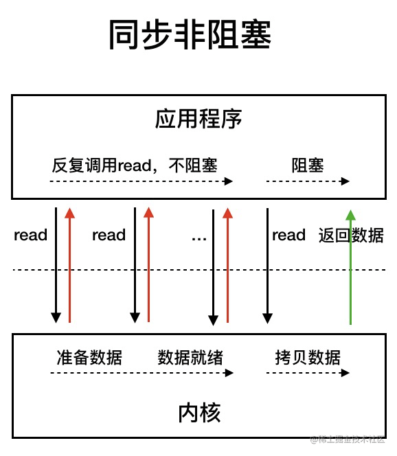

# I/O 模型

## 同步阻塞I/O模型

同步阻塞 IO 模型中，应用程序发起 `read` 调用后，会一直阻塞，直到内核把数据拷贝到用户空间。

## 同步非阻塞I/O模型

用户线程轮训发起 `read` 调用，如果数据未准备好，立即返回；如果数据准备好了，则阻塞等待数据从内核拷贝到用户空间，再唤起用户线程， `read` 调用完成。

这种I/O模型，应用程序不断进行 I/O 系统调用轮询数据是否已经准备好的过程是十分消耗 CPU 资源的。

## I/O多路复用模型

IO 多路复用模型中，线程首先发起 `select/epoll` 调用，询问内核数据是否准备就绪，等内核把数据准备好了，用户线程再发起 `read` 调用。`read` 调用的过程还是阻塞的。不同于同步非阻塞I/O模型的点是，有一个专用的线程轮训发起 `select/epoll` 调用，多个请求可以复用这个轮训请求，极大的提高了效率。

> 目前支持 IO 多路复用的系统调用，有 `select`，`epoll` 等等。`select` 系统调用，目前几乎在所有的操作系统上都有支持。
> * `select` 调用：内核提供的系统调用，它支持一次查询多个系统调用的可用状态。几乎所有的操作系统都支持。
> * `epoll` 调用：linux 2.6 内核，属于 `select` 调用的增强版本，优化了 IO 的执行效率。

IO 多路复用模型，通过减少无效的系统调用，减少了对 CPU 资源的消耗。

:::tip I/O多路复用和同步非阻塞有什么区别？
主要区别点在于轮训线程，I/O多路复用使用的是一个专用线程，多个用户线程可以复用这个轮训线程；而同步非阻塞使用的是用户线程本身。
:::

## 异步I/O模型

用户线程发起 `read` 调用的同时注册一个回调函数， `read` 立刻返回，等内核将数据准备好之后再调用回调函数。在整个过程中，用户线程没有阻塞。

## 参考资料

* [JavaGuide - Java IO 模型详解](https://javaguide.cn/java/io/io-model.html)