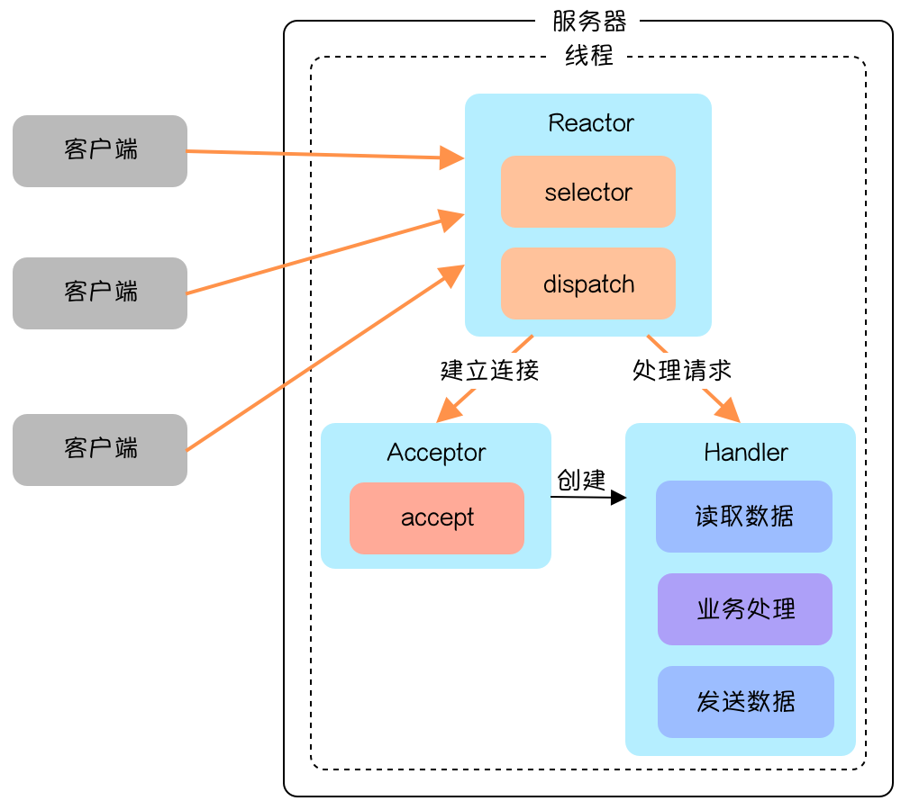
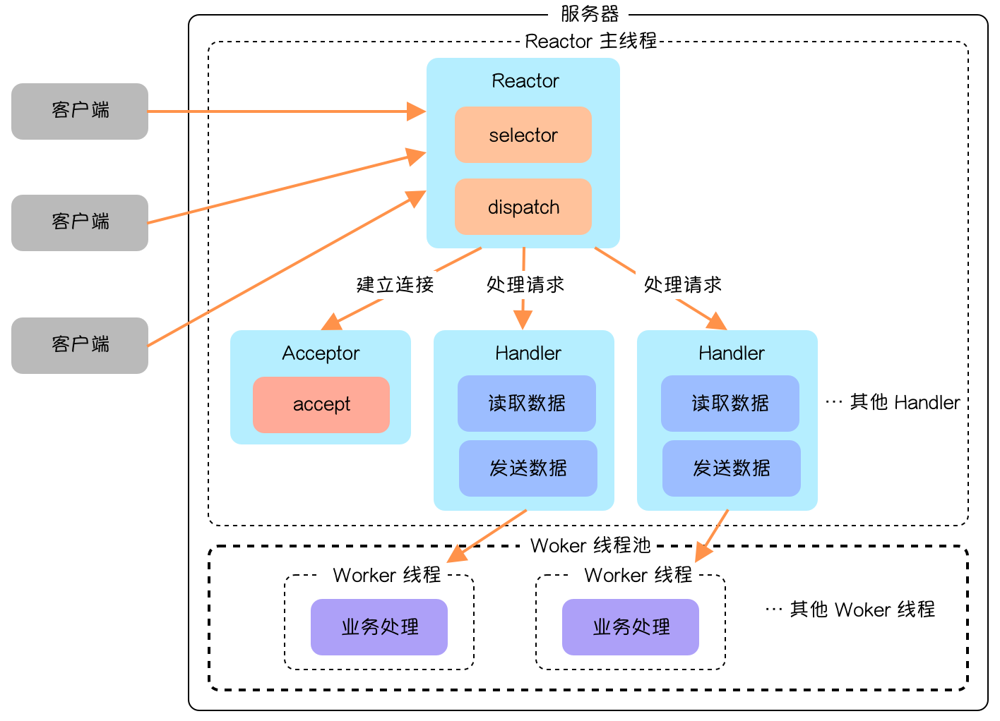
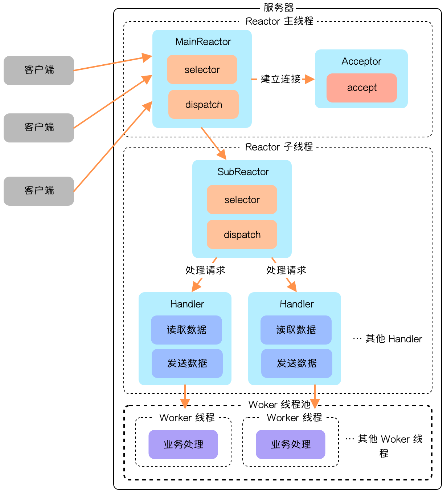

# Reactor

## 事件驱动（Event-driven）

事件驱动的核心是，以事件为连接点，当有IO事件准备就绪时，以事件的形式通知相关线程进行数据读写，进而业务线程可以直接处理这些数据，这一过程的后续操作方，都是被动接收通知。

:::tip 10个士兵执行一个时间未定的任务的方式
1. 这10个士兵自己掌握主动权，隔一段时间就会自己询问将军是否准备执行任务，这种模式比较低下，因为士兵需要花很多精力自己去确认任务执行时间，同时也会耽搁自己的训练时间。
2. 士兵接到即将执行秘密任务的通知后，会自己做好准备随时执行，在最终执行命名没下达之前，会继续自己的日常训练；等需要执行任务时，将军会立刻通知士兵们立即行动；很显然，这种模式，士兵们的时间资源并没有浪费。这种方式是事件驱动的一个举例。
:::

## Reactor 模型

Reactor 模型是指当服务器接收到多个请求时，服务器程序会把它们分派到不同的方法或线程去处理。Reactor 模式也被称作 Dispatcher 模式。它的核心是多路复用器，多路复用器收到事件后会进行分发，这点是网络服务器高并发的关键。

Reactor 模型分为三种：单 Reactor 单线程、单 Reactor 多线程和主从 Reactor 多线程。

### 单 Reactor 单线程

在 Reactor 单线程模型中，所有 I/O 操作（包括连接建立、数据读写、事件分发等）、业务处理，都是由一个线程完成的。

单线程模型逻辑简单，缺陷也十分明显：

* 一个线程支持处理的连接数非常有限，CPU 很容易打满，性能方面有明显瓶颈；
* 当多个事件被同时触发时，只要有一个事件没有处理完，其他后面的事件就无法执行，这就会造成消息积压及请求超时；
* 线程在处理 I/O 事件时，Select 无法同时处理连接建立、事件分发等操作；
* 如果 I/O 线程一直处于满负荷状态，很可能造成服务端节点不可用。

在单线程 Reactor 模式中，Reactor 和 Handler 都在同一条线程中执行。这样，带来了一个问题，当其中某个 Handler 阻塞时，会导致其他所有的 Handler 都得不到执行。

在这种场景下，被阻塞的 Handler 不仅仅负责输入和输出处理的传输处理器，还包括负责新连接监听的 Acceptor 处理器，可能导致服务器无响应。这是一个非常严重的缺陷，导致单线程反应器模型在生产场景中使用得比较少。

### 单 Reactor 多线程

多线程模型将业务逻辑交给多个线程进行处理。除此之外，多线程模型其他的操作与单线程模型是类似的，比如连接建立、IO事件读写以及事件分发等都是由一个线程来完成。

当客户端有数据发送至服务端时， `select` 会监听到可读事件，数据读取完毕后提交到业务线程池中并发处理。一般的请求中，耗时最长的一般是业务处理，所以用一个线程池来处理业务操作，在性能上的提升也是非常可观的。

当然，这种模型也有明显缺点，连接建立、IO事件读取以及事件分发完全有单线程处理；比如当某个连接通过系统调用正在读取数据，此时相对于其他事件来说，完全是阻塞状态，新连接无法处理、其他连接的IO查询/IO读写以及事件分发都无法完成。

对于像 Nginx、Netty 这种对高性能、高并发要求极高的网络框架，这种模式便显得有些吃力了。因为，无法及时处理新连接、就绪的IO事件以及事件转发等。

### 主从 Reactor 多线程

主从 Reactor 多线程模型又在前面的模型基础上做了进一步优化，增加了子 Reactor ，如下图所示：

整个流程大概可以分为以下几步：

1. 主线程的 MainReactor 负责监听连接请求，收到连接请求会由 Acceptor 进行处理，成功建立连接之后 MainReactor 会把连接分派给 SubReactor ，由 SubReactor 监听和处理数据请求；
2. SubReactor 监听到数据请求，会派发给 Handler 处理，Handler 只会处理读取数据和发送数据部分，中间业务处理部分也是放在线程池中完成。

主从 Reactor 多线程模型的优点如下：

* MainReactor 与 SubReactor 职责分明，一个处理连接事件，一个处理数据请求；
* MainReactor 与 SubReactor 交互逻辑比较简单，MainReactor 单向地将建立好的连接传递出去；
* 多 Reactor 设计能在高并发场景拥有更好的性能。

主从 Reactor 多线程模式是业界非常成熟的服务器程序设计模式，在很多中间件中都使用到了这种模式，像 Nginx、Memcached、Netty 等。这种模式也被称为 1 + M + N 模式，分别代指相对少的连接线程（不一定为 1 ），多个 I/O 线程和多个业务处理线程。

## 参考资料

* [掘金 - 高性能网络编程之 Reactor 网络模型](https://juejin.cn/post/7092436770519777311)
* [Zephyr - 多图详解 Netty](https://anye3210.github.io/2021/08/22/%E5%A4%9A%E5%9B%BE%E8%AF%A6%E8%A7%A3-Netty/)