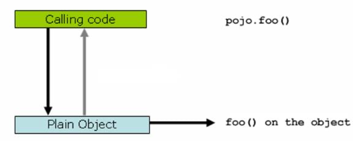
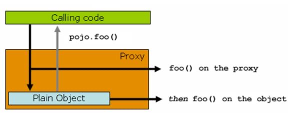

# Spring Cache

## 概述

Spring 3.1 引入了激动人心的基于注释（annotation）的缓存（cache）技术，它本质上不是一个具体的缓存实现方案（例如 EHCache 或者 OSCache），而是一个对缓存使用的抽象，通过在既有代码中添加少量它定义的各种 annotation，即能够达到缓存方法的返回对象的效果。

Spring 的缓存技术还具备相当的灵活性，不仅能够使用 SpEL（Spring Expression Language）来定义缓存的 key 和各种 condition，还提供开箱即用的缓存临时存储方案，也支持和主流的专业缓存例如 EHCache 集成。

其特点总结如下：
* 通过少量的配置 annotation 注释即可使得既有代码支持缓存
* 支持开箱即用 Out-Of-The-Box，即不用安装和部署额外第三方组件即可使用缓存
* 支持 Spring Express Language，能使用对象的任何属性或者方法来定义缓存的 key 和 condition
* 支持 AspectJ，并通过其实现任何方法的缓存支持
* 支持自定义 key 和自定义缓存管理者，具有相当的灵活性和扩展性

## 基本原理

和 spring 的事务管理类似，spring cache 的关键原理就是 spring AOP，通过 spring AOP，其实现了在方法调用前、调用后获取方法的入参和返回值，进而实现了缓存的逻辑。我们来看一下下面这个图：



上图显示，当客户端“Calling code”调用一个普通类 Plain Object 的 `foo()` 方法的时候，是直接作用在 `pojo` 类自身对象上的，客户端拥有的是被调用者的直接的引用。

而 Spring Cache 利用了 Spring AOP 的动态代理技术，即当客户端尝试调用 `pojo` 的 `foo()` 方法的时候，给他的不是 `pojo` 自身的引用，而是一个动态生成的代理类



如上图所示，这个时候，实际客户端拥有的是一个代理的引用，那么在调用 `foo()` 方法的时候，会首先调用 `proxy` 的 `foo()` 方法，这个时候 `proxy` 可以整体控制实际的 `pojo.foo()` 方法的入参和返回值，比如缓存结果，比如直接略过执行实际的 `foo()` 方法等，都是可以轻松做到的。

## 缓存注解

Spring Cache 提供了5种可在方法级别或类级别上使用的缓存注解。这些注解定义了哪些方法的返回值会被缓存或者从缓存中移除。注意，注解只有public方法才有效。

### @Cacheable

if cached, return; otherwise compute, cache and return

表 1. `@Cacheable` 作用和配置方法

|   @Cacheable 主要的参数   |   @Cacheable 的作用   |	主要针对方法配置，能够根据方法的请求参数对其结果进行缓存    |
| --- | --- | --- |
|   `value`   |	缓存的名称，在 spring 配置文件中定义，必须指定至少一个  |	例如：`@Cacheable(value="mycache")` 或者 `@Cacheable(value={"cache1","cache2"}`    |
|   `key` |	缓存的 `key` ，可以为空，如果指定要按照 SpEL 表达式编写，如果不指定，则缺省按照方法的所有参数进行组合	|   例如：`@Cacheable(value="testcache", key="#userName")`   |
|   `condition`   |	缓存的条件，可以为空，使用 SpEL 编写，返回 `true` 或者 `false` ，只有为 `true` 才进行缓存  |	例如：`@Cacheable(value="testcache",condition="#userName.length()>2"`) |

### @CachePut

compute, cache, and return.

表 2. `@CachePut` 作用和配置方法

|   `@CachePut` 主要的参数    |   `@CachePut` 的作用    |	主要针对方法配置，能够根据方法的请求参数对其结果进行缓存，和 `@Cacheable` 不同的是，它每次都会触发真实方法的调用  |
| --- | --- | --- |
|   `value`   |	缓存的名称，在 spring 配置文件中定义，必须指定至少一个  |	例如：`@Cacheable(value="mycache")` 或者 `@Cacheable(value={"cache1","cache2"}` |
|   `key` |	缓存的 `key` ，可以为空，如果指定要按照 SpEL 表达式编写，如果不指定，则缺省按照方法的所有参数进行组合  |	例如：`@Cacheable(value="testcache", key="#userName")` |
|   `condition`   |	缓存的条件，可以为空，使用 SpEL 编写，返回 `true` 或者 `false` ，只有为 `true` 才进行缓存	|   例如：`@Cacheable(value="testcache", condition="#userName.length()>2")`   |

### @CacheEvict

表 3. `@CacheEvict` 作用和配置方法

|   `@CacheEvict` 主要的参数  |   `@CachEvict` 的作用   |	主要针对方法配置，能够根据一定的条件对缓存进行清空	|
| --- | --- | --- |
|   `value`   |	缓存的名称，在 spring 配置文件中定义，必须指定至少一个  |	例如：
`@CachEvict(value="mycache")` 或者 `@CachEvict(value={"cache1", "cache2"}` |
|   `key` |	缓存的 `key` ，可以为空，如果指定要按照 SpEL 表达式编写，如果不指定，则缺省按照方法的所有参数进行组合  |	例如：`@CachEvict(value="testcache", key="#userName")` |
|   `condition`   |	缓存的条件，可以为空，使用 SpEL 编写，返回 `true` 或者 `false` ，只有为 `true` 才清空缓存  |	例如：`@CachEvict(value="testcache", condition="#userName.length()>2")`   |
|   `allEntries`  |	是否清空所有缓存内容，缺省为 `false` ，如果指定为 `true` ，则方法调用后将立即清空所有缓存 |	例如：`@CachEvict(value="testcache", allEntries=true)`
|   `beforeInvocation`    |   	是否在方法执行前就清空，缺省为 `false` ，如果指定为 true，则在方法还没有执行的时候就清空缓存，缺省情况下，如果方法执行抛出异常，则不会清空缓存	|   例如：`@CachEvict(value="testcache"，beforeInvocation=true)`    |
### @Caching

`@Cacheable`/`@CacheEvict`/`@CachePut`的组注解

```java
@Target({ElementType.TYPE, ElementType.METHOD})
@Retention(RetentionPolicy.RUNTIME)
@Inherited
public @interface Caching {
	Cacheable[] cacheable() default {};

	CachePut[] put() default {};

	CacheEvict[] evict() default {};
}
```


### @CacheConfig

类级别的全局缓存注解，用于简化共性配置

## 缓存管理器

`CacheManager` 是SPI，提供了访问缓存名称和缓存对象的方法，同时也提供了管理缓存、操作缓存和移除缓存的方法。
Spring Cache框架提供了 `SimpleCacheManager` 、 `NoOpCacheManager` 、 `ConcurrentMapCacheManager` 和 `CompositeCacheManager` 四种缓存管理器的实现。

## 代码示例

```java
public class SpringCacheTest {
    @Data
    static class User {
        private long userId;
        private int level;
        }
@Cacheable(cacheNames = {"users", "clients"}, key = "#userId", condition = "#level > 5")
    public User getUser(long userId, int level) {
        // business code
        return null;
    }
@CachePut(cacheNames = {"users", "clients"}, key = "#userId")
    public User updateUserLevel(long userId, int level) {
        User user = new User();
        user.setLevel(level);
        // business code
        return user;
    }
@CacheEvict(cacheNames = {"users", "clients"}, key = "#userId")
    public void unregisterUser(long userId) {
        // business code
    }
}
```

## 整合

Spring Cache 整合了EhCache、Guava、HazelCast、GemFire等，可以使用不同缓存框架实现不同的缓存管理。

## 参考资料

* [Spring - Spring Cache](https://spring.io/guides/gs/caching/)
