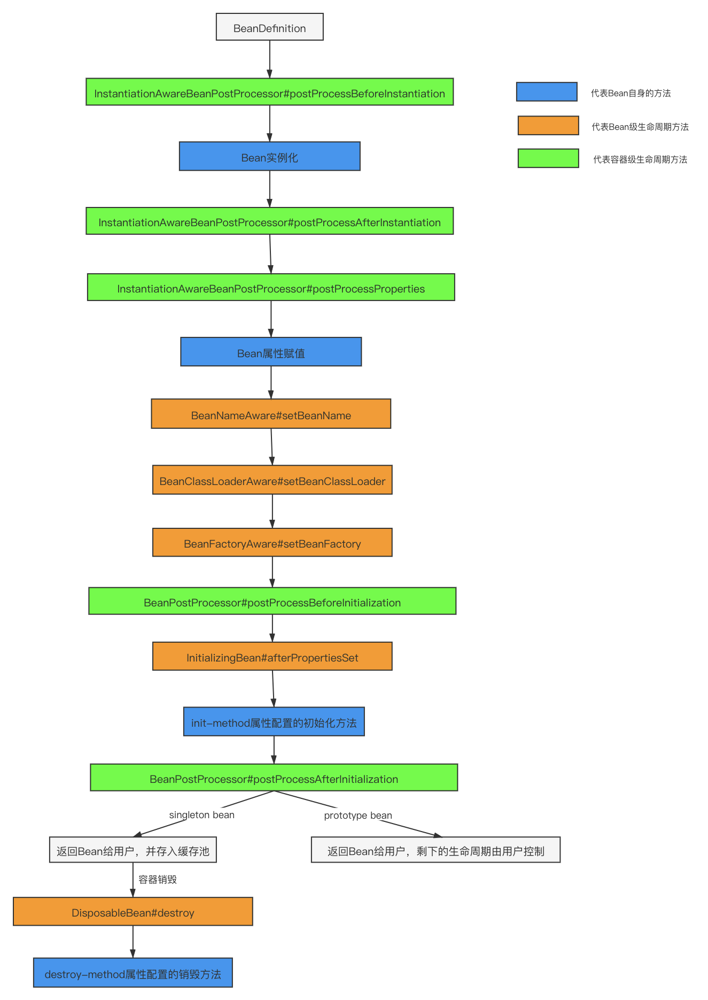

# Bean的生命周期

## Bean生命周期介绍

对于Spring Bean的生命周期来说，可以分为四个主要阶段：
1. 实例化（Instantiation）
2. 属性赋值（Populate）
3. 初始化（Initialization）
4. 销毁（Destruction）



```flow
st=>start: 容器启动
e=>end: 容器关闭

BeanDefinition=>operation: BeanDefinition
InstantiationAwareBeanPostProcessor_pre=>operation: InstantiationAwareBeanPostProcessor#postProcessBeforeInstantiation
initialization=>operation: 实例化Bean实例
InstantiationAwareBeanPostProcessor_after=>operation: InstantiationAwareBeanPostProcessor#postProcessAfterInstantiation
InstantiationAwareBeanPostProcessor_prop=>operation: InstantiationAwareBeanPostProcessor#postProcessProperties

populate=>operation: Bean属性赋值

BeanNameAware=>operation: BeanNameAware#setBeanName
BeanClassLoaderAware=>operation: BeanClassLoaderAware#setBeanClassLoader
BeanFactoryAware=>operation: BeanFactoryAware#setBeanFactory
BeanPostProcessor_pre=>operation: BeanPostProcessor#postProcessBeforeInitialization
InitializingBean=>operation: InitializingBean#afterPropertiesSet
init_method=>operation: init-method属性配置的初始化方法
BeanPostProcessor_after=>operation: BeanPostProcessor#postProcessAfterInitialization

ready=>operation: Bean已准备好

cond=>condition: Bean是否单例

singleton_bean=>operation: 返回Bean给用户，剩余生命周期交给用户控制
DisposableBean=>operation: DisposableBean#destroy
destroy_method=>operation: destroy-method属性配置的销毁方法

prototype_bean=>operation: Bean放入容器中，并返回给用户

st->BeanDefinition->InstantiationAwareBeanPostProcessor_pre->initialization->InstantiationAwareBeanPostProcessor_after->InstantiationAwareBeanPostProcessor_prop
InstantiationAwareBeanPostProcessor_prop->populate
populate->BeanNameAware->BeanClassLoaderAware->BeanFactoryAware->BeanPostProcessor_pre->InitializingBean->init_method->BeanPostProcessor_after

BeanPostProcessor_after->ready->cond
cond(yes)->singleton_bean->DisposableBean->destroy_method->e
cond(no)->prototype_bean
```

## Bean生命周期代码示例

1. UserBean.java
```java
@Component
public class UserBean implements InitializingBean, BeanNameAware, DisposableBean, ApplicationContextAware {
    private int id;

    private String name;

    public UserBean(int id, String name) {
        this.id = id;
        this.name = name;
        System.out.println("2. 调用构造函数");
    }

    public int getId() {
        return id;
    }

    public void setId(int id) {
        this.id = id;
        System.out.println("5. 属性注入 id");
    }

    public String getName() {
        return name;
    }

    public void setName(String name) {
        this.name = name;
        System.out.println("5. 属性注入 name");
    }

    @Override
    public void setBeanName(String name) {
        System.out.println("6. 调用 BeanNameAware.setBeanName() 方法");
    }

    @Override
    public void setApplicationContext(ApplicationContext applicationContext) throws BeansException {
        UserBean userBean = (UserBean) applicationContext.getBean("userBean");
        System.out.println(userBean);
        System.out.println("7. 调用 BeanNameAware.setBeanName() 方法");
    }

    @Override
    public void afterPropertiesSet() throws Exception {
        System.out.println("9. 调用 InitializingBean.afterPropertiesSet() 方法");
    }

    public void myInit() {
        System.out.println("10. 调用 init-method 方法");
    }

    @Override
    public void destroy() throws Exception {
        System.out.println("12. 调用 DisposableBean.destroy() 方法");
    }

    public void myDestroy() {
        System.out.println("13. 调用 destroy-method 方法");
    }

    @Override
    public String toString() {
        return "UserBean{id=" + id + ", name='" + name + '\'' + '}';
    }
}
```

2. MyInstantiationAwareBeanPostProcessor.java
```java
@Component
public class MyInstantiationAwareBeanPostProcessor implements InstantiationAwareBeanPostProcessor {
    @Override
    public Object postProcessBeforeInstantiation(Class<?> beanClass, String beanName) throws BeansException {
        if ("userBean".equals(beanName)) {
            System.out.println("1. 调用 InstantiationAwareBeanPostProcessor.postProcessBeforeInstantiation() 方法");
        }
        return null;
    }

    @Override
    public boolean postProcessAfterInstantiation(Object bean, String beanName) throws BeansException {
        if ("userBean".equals(beanName)) {
            UserBean userBean = (UserBean) bean;
            System.out.println("3. 调用 InstantiationAwareBeanPostProcessor.postProcessAfterInstantiation() 方法");
            System.out.println(userBean);
        }
        return true;
    }

    @Override
    public PropertyValues postProcessProperties(PropertyValues pvs, Object bean, String beanName) throws BeansException {
        if ("userBean".equals(beanName)) {
            System.out.println("4. 调用 InstantiationAwareBeanPostProcessor.postProcessProperties() 方法");
        }
        return null;
    }
}
```
3. MyBeanPostProcessor.java
```java
@Component
public class MyBeanPostProcessor implements BeanPostProcessor {
    @Override
    public Object postProcessBeforeInitialization(Object bean, String beanName) throws BeansException {
        if ("userBean".equals(beanName)) {
            System.out.println("8. 调用 BeanPostProcessor.postProcessBeforeInitialization() 方法");
        }
        return bean;
    }

    @Override
    public Object postProcessAfterInitialization(Object bean, String beanName) throws BeansException {
        if ("userBean".equals(beanName)) {
            System.out.println("11. 调用 BeanPostProcessor.postProcessAfterInitialization() 方法");
        }
        return bean;
    }
}
```
4. MyBeanFactoryPostProcessor.java
```java
@Component
public class MyBeanFactoryPostProcessor implements BeanFactoryPostProcessor {
    @Override
    public void postProcessBeanFactory(ConfigurableListableBeanFactory beanFactory) throws BeansException {
        System.out.println("0. 调用 BeanFactoryPostProcessor.postProcessBeanFactory() 方法");
    }
}
```
5. applicationContext.xml
```xml
<?xml version="1.0" encoding="UTF-8"?>
<beans xmlns="http://www.springframework.org/schema/beans"
       xmlns:xsi="http://www.w3.org/2001/XMLSchema-instance"
       xsi:schemaLocation="
        http://www.springframework.org/schema/beans
        https://www.springframework.org/schema/beans/spring-beans.xsd">

    <bean class="com.riemann.test.MyInstantiationAwareBeanPostProcessor" />

    <bean id="userBean" class="com.riemann.test.UserBean" init-method="myInit" destroy-method="myDestroy">
        <!-- 构造函数注入 -->
        <constructor-arg index="0" type="int">
            <value>1</value>
        </constructor-arg>
        <constructor-arg index="1" type="java.lang.String">
            <value>中文名</value>
        </constructor-arg>

        <!-- setter方法注入 -->
        <property name="id" value="2"/>
        <property name="name" value="riemann"/>
    </bean>

    <bean class="com.riemann.test.MyBeanPostProcessor" />
    <bean class="com.riemann.test.MyBeanFactoryPostProcessor" />
</beans>
```
6. BeanLifeCycleTest.java
```java
public class BeanLifeCycleTest {
    public static void main(String[] args) {
        ApplicationContext applicationContext = new ClassPathXmlApplicationContext("classpath:applicationContext.xml");
        UserBean user = (UserBean) applicationContext.getBean("userBean");
        ((AbstractApplicationContext) applicationContext).close();
    }
}
```

# 参考资料

* [SegmentFault - 一文读懂 Spring Bean 的生命周期](https://segmentfault.com/a/1190000040365130)
* [Java全栈知识体系 - Spring IOC实现原理详解之Bean实例化](https://pdai.tech/md/spring/spring-x-framework-ioc-source-3.html)