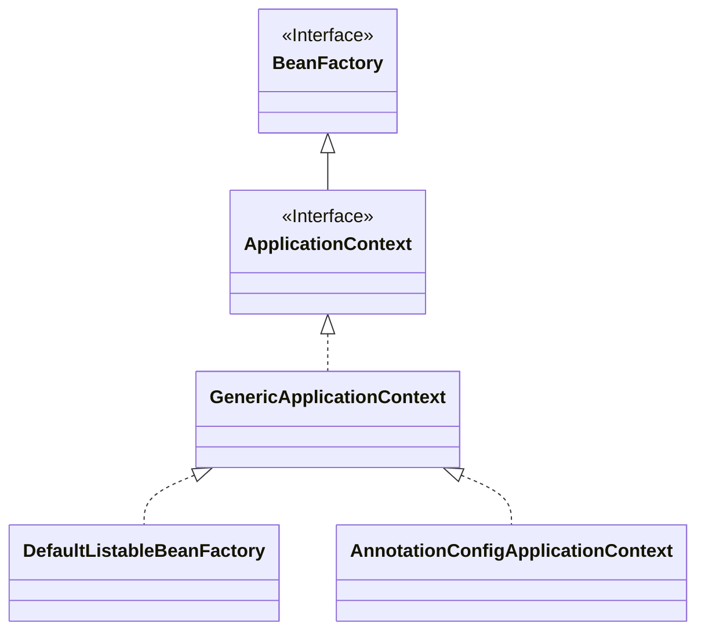

# 依赖注入

依赖注入（Dependency Injection，简称DI）是一个过程，objects在被创建之后，仅仅通过构造参数、工厂方法参数或者要设置的属性去定义他们的依赖。使用DI规则的代码更加清晰和高效的解耦，对象不会查找他的依赖，并且也不知道他们依赖的位置。因此，这些类变得很容易测试，特别是当依赖是接口或者抽象类的时候，可以通过stub或者mock实现来进行单元测试。

## 注入方式

三种注入方式：基于构造器的注入、基于setter方法的注入、基于属性Autowired的注入。

**选择基于构造器的注入，还是基于setter方法？** 建议选择构造器注入的方式，有几个好处：依赖可以是immutable的且确保依赖非空，对象新建之后就是初始化的状态。可能你的构造参数很多，说明这个类承载了太多的职责，应该考虑拆分到多个类中。当然，setter方法注入也有一些好处：依赖可以修改，也可以延迟注入。

## 依赖解决的流程

1. `ApplicationContext`根据配置元数据被创建和初始化。
2. 对于每个bean，它的依赖表示为属性、构造参数或静态工厂方法参数的形式。当bean被创建的时候，这些依赖被提供给这个bean。
3. 每个构造参数和属性被一个实际的值设置或者引用容器中的另外一个bean。Spring支持一些内建类型的转换，例如：int、long、String、boolean等。

## 循环引用

对于构造器注入的循环引用，可以使用setter方法来替代。

# Bean的Scope

通过定义一个`bean`的`definition`，你就能为创建实际的类实例创建一个配方recipe。通过`BeanDefinition`，你不仅能控制被插入一个对象的不同的依赖和配置值，也能控制对象的`scope`。Spring支持6种`scope`，通过配置你可以选择你创建对象的`scope`。

| Scope | 描述 |
| --- | --- |
| singleton | 默认值，为每个IoC容器限定单个`bean definition`为单个对象实例。 |
| prototype | 单个`bean definition`可以有任意数量的对象实例。|
| request | 仅在web容器支持。限定单个`bean definition`到单个HTTP请求的生命周期。|
| session | 仅在web容器支持。限定单个`bean definition`到单个HTTP请求`Session`的生命周期。|
| application | 仅在web容器支持。限定单个`bean definition`到单个`ServletContext`的生命周期。|
| websocket | 仅在web容器支持。限定单个`bean definition`到单个`WebSocket`的生命周期。|

对于Scope为`prototype`的bean来说，Spring容器并不会完全管理其生命周期，在初始化完成之后，就交由客户端来操作。

## 自定义Scope

1. 实现`org.springframework.beans.factory.config.Scope`接口，接口说明如下：

```java
public interface Scope {
    /**
     * 在scope中返回给定name的对象，如果不存在会进行创建
     */
    Object get(String name, ObjectFactory<?> objectFactory);

    /**
     * 在scope中删除给定name的对象，返回删除的对象，如果不存在返回null
     */
    Object remove(String name);

    /**
     * 可选，向scope中给定name的对象，注册解构回调
     */
    void registerDestructionCallback(String name, Runnable callback);

    /**
     * 解决给定key的上下文对象
     */
    Object resolveContextualObject(String key);

    /**
     * 获取会话ID，不同的scope不太一样，例如scope=session的可能是sessionId
     */
    String getConversationId();
}
```

2. 注册Scope的实例对象，就可以开始使用了

```java
Scope threadScope = new SimpleThreadScope();
beanFactory.registerScope("thread", threadScope);
```

```xml
<?xml version="1.0" encoding="UTF-8"?>
<beans xmlns="http://www.springframework.org/schema/beans"
    xmlns:xsi="http://www.w3.org/2001/XMLSchema-instance"
    xmlns:aop="http://www.springframework.org/schema/aop"
    xsi:schemaLocation="http://www.springframework.org/schema/beans
        https://www.springframework.org/schema/beans/spring-beans.xsd
        http://www.springframework.org/schema/aop
        https://www.springframework.org/schema/aop/spring-aop.xsd">

    <bean class="org.springframework.beans.factory.config.CustomScopeConfigurer">
        <property name="scopes">
            <map>
                <entry key="thread">
                    <bean class="org.springframework.context.support.SimpleThreadScope"/>
                </entry>
            </map>
        </property>
    </bean>

    <bean id="thing2" class="x.y.Thing2" scope="thread">
        <property name="name" value="Rick"/>
        <aop:scoped-proxy/>
    </bean>

    <bean id="thing1" class="x.y.Thing1">
        <property name="thing2" ref="thing2"/>
    </bean>

</beans>
```
指定scope就可以使用了：
```xml
<bean id="..." class="..." scope="thread">
```


# BeanFactory API

`BeanFactory` API 为Spring的IoC容器提供了基础功能，通过API可以很方便地获取到Bean。`BeanFactory`和相关的接口（例如`BeanFactoryAware`, `InitializingBean`, `DisposableBean`等）对其他框架组件来说是重要的整合点。

## ApplicationContext

`ApplicationContext`继承了`BeanFactory`，是它的超集。一般来说，更建议使用`ApplicationContext`，除非你有什么其他原因不这么做。它是Spring IoC容器的主要入口点，用于：加载配置文件、触发classpath扫描、编程注入bean和注解class、以及注册一些功能bean的定义。

`ApplicationContext`除了`BeanFactory`本身的功能外，还提供：
* 整合生命周期管理
* 自动`BeanPostProcessor`注册
* 自动`BeanFactoryPostProcessor`注册
* 方便的`MessageSource`访问
* 内建的`ApplicationEvent`发布
* 等等

下面是`ApplicationContext`的部分UML图：

