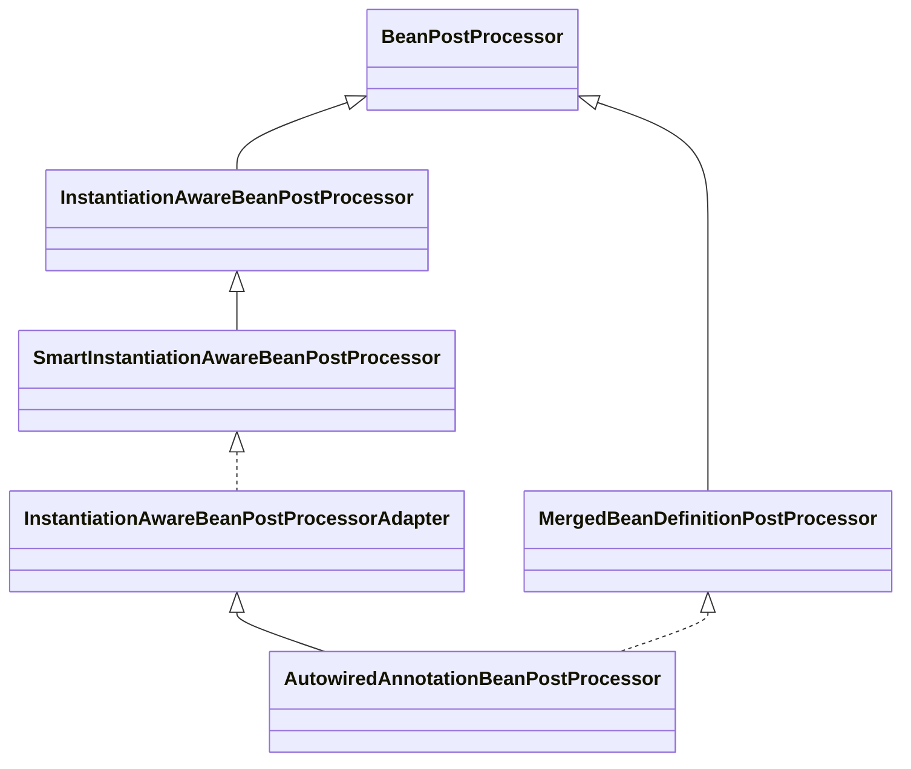
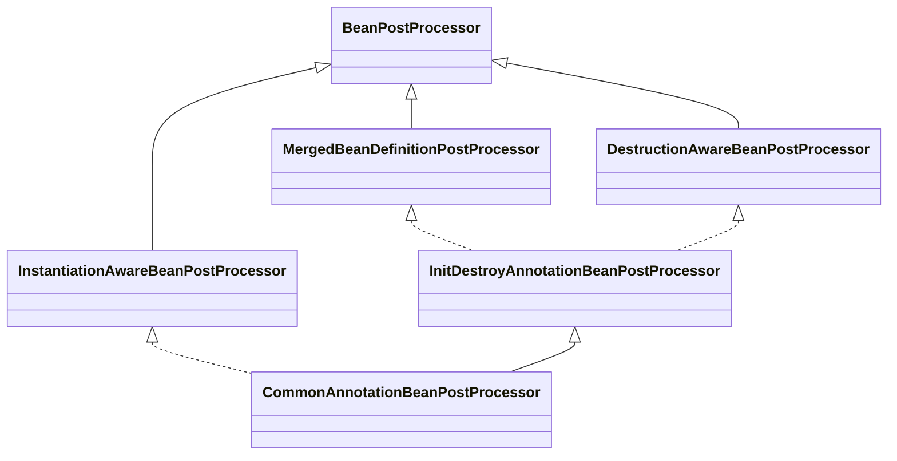

# @Autowired 和 @Resource 实现详解

# 基本原理

`@Autowired` 注解用于Bean属性和方法属性输入，所以其自动注入阶段是在Bean实例化之后的属性填充阶段，对应到处理器也就是 `InstantiationAwareBeanPostProcessor#postProcessProperties` 。在Spring的框架中存在两个核心的处理器： `AutowiredAnnotationBeanPostProcessor` 用于解析 `@Autowired` 和 `@Value` 注解， `CommonAnnotationBeanPostProcessor` 用于解析 `@Resource` 注解。

# 处理器的注册

当我们调用 `AnnotationConfigApplicationContext applicationContext = new AnnotationConfigApplicationContext(AppConfig.class)` 启动容器的时候，在构造方法中会调用到 `this()` 方法，在 `this()` 方法中会调用 `ClassPathBeanDefinitionScanner#scan` ，最终会调用到 `AnnotationConfigUtils#registerAnnotationConfigProcessors` 方法，在该方法中，Spring会向容器注册7个Spring内置的Bean，其中就包括 `AutowiredAnnotationBeanPostProcessor` 。如下代码所示：

```java
// ClassPathBeanDefinitionScanner.java
public int scan(String... basePackages) {
    // <1> 获取扫描前的 BeanDefinition 数量
    int beanCountAtScanStart = this.registry.getBeanDefinitionCount();

    // <2> 进行扫描，将过滤出来的所有的 .class 文件生成对应的 BeanDefinition 并注册
    doScan(basePackages);

    // Register annotation config processors, if necessary.
    // <3> 如果 `includeAnnotationConfig` 为 `true`（默认），则注册几个关于注解的 PostProcessor 处理器（关键）
    // 在其他地方也会注册，内部会进行判断，已注册的处理器不会再注册
    if (this.includeAnnotationConfig) {
        AnnotationConfigUtils.registerAnnotationConfigProcessors(this.registry);
    }

    // <4> 返回本次扫描注册的 BeanDefinition 数量
    return (this.registry.getBeanDefinitionCount() - beanCountAtScanStart);
}
```

```java
// AnnotationConfigUtils.java
public static void registerAnnotationConfigProcessors(BeanDefinitionRegistry registry) {
    registerAnnotationConfigProcessors(registry, null);
}

public static Set<BeanDefinitionHolder> registerAnnotationConfigProcessors(
        BeanDefinitionRegistry registry, @Nullable Object source) {
    //./..
    Set<BeanDefinitionHolder> beanDefs = new LinkedHashSet<>(8);

    // 处理 Spring 应用上下文中的配置类
    if (!registry.containsBeanDefinition(CONFIGURATION_ANNOTATION_PROCESSOR_BEAN_NAME)) {
        RootBeanDefinition def = new RootBeanDefinition(ConfigurationClassPostProcessor.class);
        def.setSource(source);
        beanDefs.add(registerPostProcessor(registry, def, CONFIGURATION_ANNOTATION_PROCESSOR_BEAN_NAME));
    }

    // 处理 @Autowired 以及 @Value 注解
    if (!registry.containsBeanDefinition(AUTOWIRED_ANNOTATION_PROCESSOR_BEAN_NAME)) {
        RootBeanDefinition def = new RootBeanDefinition(AutowiredAnnotationBeanPostProcessor.class);
        def.setSource(source);
        beanDefs.add(registerPostProcessor(registry, def, AUTOWIRED_ANNOTATION_PROCESSOR_BEAN_NAME));
    }

    //...
    return beanDefs;
}
```

# AutowiredAnnotationBeanPostProcessor

## 类图架构



## postProcessMergedBeanDefinition

`postProcessMergedBeanDefinition` 方法用于处理合并Bean的 `@Autowired` 和 `@Value` 注解。

```java
@Override
public void postProcessMergedBeanDefinition(RootBeanDefinition beanDefinition, Class<?> beanType, String beanName) {
    // 找到这个 Bean 所有需要注入的属性（@Autowired 或者 @Value 注解）
    InjectionMetadata metadata = findAutowiringMetadata(beanName, beanType, null);
    metadata.checkConfigMembers(beanDefinition);
}
```

### findAutowiringMetadata

```java
private InjectionMetadata findAutowiringMetadata(String beanName, Class<?> clazz, @Nullable PropertyValues pvs) {
    // Fall back to class name as cache key, for backwards compatibility with custom callers.
    // 生成一个缓存 Key
    String cacheKey = (StringUtils.hasLength(beanName) ? beanName : clazz.getName());
    // Quick check on the concurrent map first, with minimal locking.
    // 先尝试从缓存中获取
    InjectionMetadata metadata = this.injectionMetadataCache.get(cacheKey);
    if (InjectionMetadata.needsRefresh(metadata, clazz)) { // 是否需要刷新，也就是判断缓存是否命中
        synchronized (this.injectionMetadataCache) {
            metadata = this.injectionMetadataCache.get(cacheKey);
            if (InjectionMetadata.needsRefresh(metadata, clazz)) { // 加锁，再判断一次
                if (metadata != null) {
                    metadata.clear(pvs);
                }
                // 构建一个需要注入的元信息对象
                metadata = buildAutowiringMetadata(clazz);
                this.injectionMetadataCache.put(cacheKey, metadata);
            }
        }
    }
    return metadata;
}
```

首先尝试从缓存中获取这个 `Bean` 对应的注入元信息对象，没有找到的话则调用 `buildAutowiringMetadata(final Class<?> clazz)` 构建一个，然后再放入缓存中。

### buildAutowiringMetadata

```java
private InjectionMetadata buildAutowiringMetadata(final Class<?> clazz) {
    List<InjectionMetadata.InjectedElement> elements = new ArrayList<>();
    Class<?> targetClass = clazz;

    do {
        // <1> 创建 `currElements` 集合，用于保存 @Autowired、@Value 注解标注的字段
        final List<InjectionMetadata.InjectedElement> currElements = new ArrayList<>();

        // <2> 遍历这个 Class 对象的所有字段
        ReflectionUtils.doWithLocalFields(targetClass, field -> {
            // <2.1> 找到该字段的 @Autowired 或者 @Value 注解，返回 `ann` 对象，没有的话返回空对象，则直接跳过不进行下面的操作
            AnnotationAttributes ann = findAutowiredAnnotation(field);
            if (ann != null) {
                // <2.2> 进行过滤，static 修饰的字段不进行注入
                if (Modifier.isStatic(field.getModifiers())) {
                    if (logger.isInfoEnabled()) {
                        logger.info("Autowired annotation is not supported on static fields: " + field);
                    }
                    return;
                }
                // <2.3> 获取注解中的 `required` 配置
                boolean required = determineRequiredStatus(ann);
                // <2.4> 根据该字段和 `required` 构建一个 AutowiredFieldElement 对象，添加至 `currElements`
                currElements.add(new AutowiredFieldElement(field, required));
            }
        });

        // <3> 遍历这个 Class 对象的所有方法
        ReflectionUtils.doWithLocalMethods(targetClass, method -> {
            // <3.1> 尝试找到这个方法的桥接方法，没有的话就是本身这个方法
            Method bridgedMethod = BridgeMethodResolver.findBridgedMethod(method);
            // <3.2> 如果是桥接方法则直接跳过
            if (!BridgeMethodResolver.isVisibilityBridgeMethodPair(method, bridgedMethod)) {
                return;
            }
            // <3.3> 找到该方法的 @Autowired 或者 @Value 注解，返回 `ann` 对象，没有的话返回空对象，则直接跳过不进行下面的操作
            AnnotationAttributes ann = findAutowiredAnnotation(bridgedMethod);
            if (ann != null && method.equals(ClassUtils.getMostSpecificMethod(method, clazz))) {
                // <3.4> 进行过滤，static 修饰的方法不进行注入
                if (Modifier.isStatic(method.getModifiers())) {
                    if (logger.isInfoEnabled()) {
                        logger.info("Autowired annotation is not supported on static methods: " + method);
                    }
                    return;
                }
                if (method.getParameterCount() == 0) {
                    if (logger.isInfoEnabled()) {
                        logger.info("Autowired annotation should only be used on methods with parameters: " +
                                method);
                    }
                }
                // <3.5> 获取注解中的 `required` 配置
                boolean required = determineRequiredStatus(ann);
                PropertyDescriptor pd = BeanUtils.findPropertyForMethod(bridgedMethod, clazz);
                // <3.6> 构建一个 AutowiredMethodElement 对象，添加至 `currElements`
                currElements.add(new AutowiredMethodElement(method, required, pd));
            }
        });

        elements.addAll(0, currElements);
        // <4> 找到父类，循环遍历
        targetClass = targetClass.getSuperclass();
    }
    while (targetClass != null && targetClass != Object.class);

    // <5> 根据从这个 Bean 解析出来的所有 InjectedElement 对象生成一个 InjectionMetadata 注入元信息对象，并返回
    return new InjectionMetadata(clazz, elements);
}
```

过程如下：

1. 创建 `currElements` 集合，用于保存 `@Autowired`、`@Value` 注解标注的字段
2. 遍历这个 Class 对象的所有字段
   1. 找到该字段的 `@Autowired` 或者 `@Value` 注解，返回 `ann` 对象，没有的话返回空对象，则直接跳过不进行下面的操作
   2. 进行过滤，`static` 修饰的字段不进行注入
   3. 获取注解中的 `required` 配置
   4. 根据该字段和 `required` 构建一个 `AutowiredFieldElement` 对象，添加至 `currElements`
3. 遍历这个 Class 对象的所有方法
   1. 尝试找到这个方法的桥接方法，没有的话就是本身这个方法
   2. 如果是桥接方法则直接跳过
   3. 找到该方法的 `@Autowired` 或者 `@Value` 注解，返回 `ann` 对象，没有的话返回空对象，则直接跳过不进行下面的操作
   4. 进行过滤，`static` 修饰的方法不进行注入
   5. 获取注解中的 `required` 配置
   6. 构建一个 `AutowiredMethodElement` 对象，添加至 `currElements`
4. 找到父类，循环遍历
5. 根据从这个 Bean 解析出来的所有 `InjectedElement` 对象生成一个 `InjectionMetadata` 注入元信息对象，并返回

整个过程很简单，就是解析出所有 `@Autowired` 或者 `@Value` 注解标注的方法或者字段，然后构建一个 `InjectionMetadata` 注入元信息对象。

## postProcessProperties

`postProcessProperties` 方法用于解析并处理 `@Autowired` 和 `@Value` 注解。

```java
@Override
public PropertyValues postProcessProperties(PropertyValues pvs, Object bean, String beanName) {
    // 找到这个 Bean 的注入元信息对象
    InjectionMetadata metadata = findAutowiringMetadata(beanName, bean.getClass(), pvs);
    try {
        // 进行注入
        metadata.inject(bean, beanName, pvs);
    } catch (BeanCreationException ex) {
        throw ex;
    } catch (Throwable ex) {
        throw new BeanCreationException(beanName, "Injection of autowired dependencies failed", ex);
    }
    return pvs;
}
```

## InjectionMetadata

`InjectionMetadata` 类保存了某个 Class 的注入元素（属性和方法）的元数据，并提供了 `inject` 等方法。

```java
public class InjectionMetadata {
	private final Class<?> targetClass;

	/**
	 * 需要注入的字段（或方法）的元信息
	 */
	private final Collection<InjectedElement> injectedElements;

	@Nullable
	private volatile Set<InjectedElement> checkedElements;

	public InjectionMetadata(Class<?> targetClass, Collection<InjectedElement> elements) {
		this.targetClass = targetClass;
		this.injectedElements = elements;
	}

	public void inject(Object target, @Nullable String beanName, @Nullable PropertyValues pvs) throws Throwable {
		Collection<InjectedElement> checkedElements = this.checkedElements;
		Collection<InjectedElement> elementsToIterate =
				(checkedElements != null ? checkedElements : this.injectedElements);
		if (!elementsToIterate.isEmpty()) {
			for (InjectedElement element : elementsToIterate) {
				element.inject(target, beanName, pvs);
			}
		}
	}
}
```

对于属性上加了 `@Autowired` 注解的，经过上一步解析后，会将字段解析为 `AutowiredFieldElement` 类型；如果是方法上加了 `@Autowired` 注解，则会解析为 `AutowiredMethodElement` 类型。它们均是 `InjectedElement` 类的子类，里面封装了属性名，属性类型等信息。

### AutowiredFieldElement

```java
private class AutowiredFieldElement extends InjectionMetadata.InjectedElement {
    /** 是否必须 */
    private final boolean required;
    /** 是否缓存起来了 */
    private volatile boolean cached = false;
    /** 缓存的对象 */
    @Nullable
    private volatile Object cachedFieldValue;

    public AutowiredFieldElement(Field field, boolean required) {
        super(field, null);
        this.required = required;
    }

    @Override
    protected void inject(Object bean, @Nullable String beanName, @Nullable PropertyValues pvs) throws Throwable {
        // <1> 获取 `field` 字段
        Field field = (Field) this.member;
        Object value;
        // <2> 如果进行缓存了，则尝试从缓存中获取
        if (this.cached) {
            value = resolvedCachedArgument(beanName, this.cachedFieldValue);
        }
        // <3> 否则，开始进行解析
        else {
            // <3.1> 创建一个依赖注入描述器 `desc`
            DependencyDescriptor desc = new DependencyDescriptor(field, this.required);
            desc.setContainingClass(bean.getClass());
            Set<String> autowiredBeanNames = new LinkedHashSet<>(1);
            Assert.state(beanFactory != null, "No BeanFactory available");
            TypeConverter typeConverter = beanFactory.getTypeConverter();
            try {
                /**
                 * <3.2> 通过 {@link org.springframework.beans.factory.support.DefaultListableBeanFactory#resolveDependency} 方法
                 * 找到这个字段对应的 Bean（们）
                 */
                value = beanFactory.resolveDependency(desc, beanName, autowiredBeanNames, typeConverter);
            }
            catch (BeansException ex) {
                throw new UnsatisfiedDependencyException(null, beanName, new InjectionPoint(field), ex);
            }
            // <3.3> 和缓存相关，如果有必要则将本次找到的注入对象缓存起来，避免下次再进行解析
            synchronized (this) {
                if (!this.cached) {
                    if (value != null || this.required) {
                        this.cachedFieldValue = desc;
                        registerDependentBeans(beanName, autowiredBeanNames);
                        if (autowiredBeanNames.size() == 1) {
                            String autowiredBeanName = autowiredBeanNames.iterator().next();
                            if (beanFactory.containsBean(autowiredBeanName) &&
                                    beanFactory.isTypeMatch(autowiredBeanName, field.getType())) {
                                this.cachedFieldValue = new ShortcutDependencyDescriptor(
                                        desc, autowiredBeanName, field.getType());
                            }
                        }
                    }
                    else {
                        this.cachedFieldValue = null;
                    }
                    this.cached = true;
                }
            }
        }
        // <4> 如果获取到该字段对应的对象，则进行属性赋值（依赖注入）
        if (value != null) {
            ReflectionUtils.makeAccessible(field);
            field.set(bean, value);
        }
    }
}
```

注入的过程如下：

1. 获取 `field` 字段
2. 如果进行缓存了，则尝试从缓存中获取
3. 否则，开始进行解析
   1. 创建一个依赖注入描述器 `desc`
   2. 【核心】通过 `DefaultListableBeanFactory#resolveDependency(...)` 方法，找到这个字段对应的 `Bean`（们）
   3. 和缓存相关，如果有必要则将本次找到的注入对象缓存起来，避免下次再进行解析
4. 如果获取到该字段对应的对象，则进行属性赋值（依赖注入），底层就是通过反射机制为该字段赋值

可以看到整个的核心在于通过 `DefaultListableBeanFactory#resolveDependency(...)` 方法找到字段对应的 `Bean`，这里也许是一个集合对象，所以也可能找到的是多个 `Bean` 。

### AutowiredMethodElement

```java
private class AutowiredMethodElement extends InjectionMetadata.InjectedElement {
    /** 是否必须 */
    private final boolean required;
    /** 是否缓存起来了 */
    private volatile boolean cached = false;
    /** 缓存的方法参数对象 */
    @Nullable
    private volatile Object[] cachedMethodArguments;

    public AutowiredMethodElement(Method method, boolean required, @Nullable PropertyDescriptor pd) {
        super(method, pd);
        this.required = required;
    }

    @Override
    protected void inject(Object bean, @Nullable String beanName, @Nullable PropertyValues pvs) throws Throwable {
        if (checkPropertySkipping(pvs)) {
            return;
        }
        // <1> 获取 `method` 方法
        Method method = (Method) this.member;
        // <2> 如果进行缓存了，则尝试从缓存中获取方法参数对象
        Object[] arguments;
        if (this.cached) {
            // Shortcut for avoiding synchronization...
            arguments = resolveCachedArguments(beanName);
        }
        // <3> 否则，开始进行解析
        else {
            // <3.1> 获取方法的参数类型集合 `paramTypes`，根据参数位置确定参数
            Class<?>[] paramTypes = method.getParameterTypes();
            arguments = new Object[paramTypes.length];
            // <3.2> 构建一个依赖注入描述器数组 `descriptors`，用于保存后续创建的对象
            DependencyDescriptor[] descriptors = new DependencyDescriptor[paramTypes.length];
            Set<String> autowiredBeans = new LinkedHashSet<>(paramTypes.length);
            Assert.state(beanFactory != null, "No BeanFactory available");
            TypeConverter typeConverter = beanFactory.getTypeConverter();
            // <3.3> 根据参数顺序遍历该方法的参数
            for (int i = 0; i < arguments.length; i++) {
                // <3.3.1> 为第 `i` 个方法参数创建一个 MethodParameter 对象
                MethodParameter methodParam = new MethodParameter(method, i);
                // <3.3.2> 创建依赖描述器 `currDesc`，并添加至 `descriptors` 数组
                DependencyDescriptor currDesc = new DependencyDescriptor(methodParam, this.required);
                currDesc.setContainingClass(bean.getClass());
                descriptors[i] = currDesc;
                try {
                    /**
                     * <3.3.3> 通过 {@link org.springframework.beans.factory.support.DefaultListableBeanFactory#resolveDependency} 方法
                     * 找到这个方法参数对应的 Bean（们）
                     */
                    Object arg = beanFactory.resolveDependency(currDesc, beanName, autowiredBeans, typeConverter);
                    if (arg == null && !this.required) {
                        arguments = null;
                        break;
                    }
                    arguments[i] = arg;
                }
                catch (BeansException ex) {
                    throw new UnsatisfiedDependencyException(null, beanName, new InjectionPoint(methodParam), ex);
                }
            }
            // <3.4> 和缓存相关，如果有必要则将本次找到的方法参数对象缓存起来，避免下次再进行解析
            synchronized (this) {
                if (!this.cached) {
                    if (arguments != null) {
                        Object[] cachedMethodArguments = new Object[paramTypes.length];
                        System.arraycopy(descriptors, 0, cachedMethodArguments, 0, arguments.length);
                        registerDependentBeans(beanName, autowiredBeans);
                        if (autowiredBeans.size() == paramTypes.length) {
                            Iterator<String> it = autowiredBeans.iterator();
                            for (int i = 0; i < paramTypes.length; i++) {
                                String autowiredBeanName = it.next();
                                if (beanFactory.containsBean(autowiredBeanName) &&
                                        beanFactory.isTypeMatch(autowiredBeanName, paramTypes[i])) {
                                    cachedMethodArguments[i] = new ShortcutDependencyDescriptor(
                                            descriptors[i], autowiredBeanName, paramTypes[i]);
                                }
                            }
                        }
                        this.cachedMethodArguments = cachedMethodArguments;
                    }
                    else {
                        this.cachedMethodArguments = null;
                    }
                    this.cached = true;
                }
            }
        }
        // <4> 如果找到该方法的参数（们），则进行属性赋值（依赖注入）
        if (arguments != null) {
            try {
                ReflectionUtils.makeAccessible(method);
                // 通过反射机制调用该方法
                method.invoke(bean, arguments);
            }
            catch (InvocationTargetException ex) {
                throw ex.getTargetException();
            }
        }
    }
}
```

注入的过程如下：

1. 获取 `method` 方法
2. 如果进行缓存了，则尝试从缓存中获取方法参数对象
3. 否则，开始进行解析
   1. 获取方法的参数类型集合 `paramTypes` ，根据参数位置确定参数
   2. 构建一个依赖注入描述器数组 `descriptors`，用于保存后续创建的对象
   3. 根据参数顺序遍历该方法的参数
      1. 为第 `i` 个方法参数创建一个 `MethodParameter` 对象
      2. 创建依赖描述器 `currDesc`，并添加至 `descriptors` 数组
      3. 【核心】通过 `DefaultListableBeanFactory#resolveDependency(...)` 方法，找到这个方法参数对应的 `Bean`（们）
      4. 和缓存相关，如果有必要则将本次找到的方法参数对象缓存起来，避免下次再进行解析
4. 如果找到该方法的参数（们），则进行属性赋值（依赖注入），底层就是通过反射机制调用该方法

可以看到整个的核心也是通过 `DefaultListableBeanFactory#resolveDependency(...)` 方法找到方法参数对应的 `Bean` 。

----

# CommonAnnotationBeanPostProcessor

## 类图架构



可以看到 `CommonAnnotationBeanPostProcessor` 实现了 `MergedBeanDefinitionPostProcessor` 和 `InstantiationAwareBeanPostProcessor` 两个接口，还实现了 `DestructionAwareBeanPostProcessor` 接口，用于生命周期中的初始化和销毁的处理。

## 构造方法

```java
public class CommonAnnotationBeanPostProcessor extends InitDestroyAnnotationBeanPostProcessor
		implements InstantiationAwareBeanPostProcessor, BeanFactoryAware, Serializable {

	@Nullable
	private static Class<? extends Annotation> webServiceRefClass;

	@Nullable
	private static Class<? extends Annotation> ejbRefClass;

	static {
		try {
			@SuppressWarnings("unchecked")
			Class<? extends Annotation> clazz = (Class<? extends Annotation>)
					ClassUtils.forName("javax.xml.ws.WebServiceRef", CommonAnnotationBeanPostProcessor.class.getClassLoader());
			webServiceRefClass = clazz;
		}
		catch (ClassNotFoundException ex) {
			webServiceRefClass = null;
		}
		try {
			@SuppressWarnings("unchecked")
			Class<? extends Annotation> clazz = (Class<? extends Annotation>)
					ClassUtils.forName("javax.ejb.EJB", CommonAnnotationBeanPostProcessor.class.getClassLoader());
			ejbRefClass = clazz;
		}
		catch (ClassNotFoundException ex) {
			ejbRefClass = null;
		}
	}

	/**
	 * Create a new CommonAnnotationBeanPostProcessor,
	 * with the init and destroy annotation types set to
	 * {@link javax.annotation.PostConstruct} and {@link javax.annotation.PreDestroy},
	 * respectively.
	 */
	public CommonAnnotationBeanPostProcessor() {
		setOrder(Ordered.LOWEST_PRECEDENCE - 3);
		setInitAnnotationType(PostConstruct.class);
		setDestroyAnnotationType(PreDestroy.class);
		ignoreResourceType("javax.xml.ws.WebServiceContext");
	}
}
```
```java
public class InitDestroyAnnotationBeanPostProcessor
		implements DestructionAwareBeanPostProcessor, MergedBeanDefinitionPostProcessor, PriorityOrdered, Serializable {

	protected transient Log logger = LogFactory.getLog(getClass());

	/**
	 * 初始化注解，默认为 @PostConstruct
	 */
	@Nullable
	private Class<? extends Annotation> initAnnotationType;

	/**
	 * 销毁注解，默认为 @PreDestroy
	 */
	@Nullable
	private Class<? extends Annotation> destroyAnnotationType;

	private int order = Ordered.LOWEST_PRECEDENCE;

	@Nullable
	private final transient Map<Class<?>, LifecycleMetadata> lifecycleMetadataCache = new ConcurrentHashMap<>(256);

	public void setInitAnnotationType(Class<? extends Annotation> initAnnotationType) {
		this.initAnnotationType = initAnnotationType;
	}

	public void setDestroyAnnotationType(Class<? extends Annotation> destroyAnnotationType) {
		this.destroyAnnotationType = destroyAnnotationType;
	}
}
```

可以看到会设置初始化注解为 `@PostConstruct`，销毁注解为 `@PreDestroy`，这两个注解都是 `JSR-250` 注解；另外如果存在 `javax.xml.ws.WebServiceRef` 和 `javax.ejb.EJB` 注解也是会进行设置的。

## postProcessMergedBeanDefinition

`postProcessMergedBeanDefinition` 方法会找到 `@PostConstruct` 和 `@PreDestroy` 注解标注的方法，并构建 `LifecycleMetadata` 对象，找到 `@Resource` 注解标注的字段（或方法）的元信息，如下：

```java
// CommonAnnotationBeanPostProcessor.java
@Override
public void postProcessMergedBeanDefinition(RootBeanDefinition beanDefinition, Class<?> beanType, String beanName) {
    // 先调用父类的方法，找到 @PostConstruct 和 @PreDestroy 注解标注的方法，并构建 LifecycleMetadata 对象
    super.postProcessMergedBeanDefinition(beanDefinition, beanType, beanName);
    // 找到 @Resource 注解标注的字段（或方法），构建一个 InjectionMetadata 对象，用于后续的属性注入
    InjectionMetadata metadata = findResourceMetadata(beanName, beanType, null);
    metadata.checkConfigMembers(beanDefinition);
}
```

整个的过程原理和 `AutowiredAnnotationBeanPostProcessor` 差不多，先从缓存中获取，未命中则调用对应的方法进行构建，下面先来看看父类中的方法。

### buildLifecycleMetadata

```java
// InitDestroyAnnotationBeanPostProcessor.java
private LifecycleMetadata buildLifecycleMetadata(final Class<?> clazz) {
    List<LifecycleElement> initMethods = new ArrayList<>();
    List<LifecycleElement> destroyMethods = new ArrayList<>();
    Class<?> targetClass = clazz;

    do {
        final List<LifecycleElement> currInitMethods = new ArrayList<>();
        final List<LifecycleElement> currDestroyMethods = new ArrayList<>();

        ReflectionUtils.doWithLocalMethods(targetClass, method -> {
            if (this.initAnnotationType != null && method.isAnnotationPresent(this.initAnnotationType)) {
                LifecycleElement element = new LifecycleElement(method);
                currInitMethods.add(element);
                if (logger.isTraceEnabled()) {
                    logger.trace("Found init method on class [" + clazz.getName() + "]: " + method);
                }
            }
            if (this.destroyAnnotationType != null && method.isAnnotationPresent(this.destroyAnnotationType)) {
                currDestroyMethods.add(new LifecycleElement(method));
                if (logger.isTraceEnabled()) {
                    logger.trace("Found destroy method on class [" + clazz.getName() + "]: " + method);
                }
            }
        });

        initMethods.addAll(0, currInitMethods);
        destroyMethods.addAll(currDestroyMethods);
        targetClass = targetClass.getSuperclass();
    }
    while (targetClass != null && targetClass != Object.class);

    return new LifecycleMetadata(clazz, initMethods, destroyMethods);
}
```

整个过程比较简单，找到这个 `Bean` 中 `@PostConstruct` 和 `@PreDestroy` 注解标注的方法，然后构建一个 `LifecycleMetadata` 生命周期元信息对象。

### buildResourceMetadata

```java
// CommonAnnotationBeanPostProcessor.java
private InjectionMetadata buildResourceMetadata(final Class<?> clazz) {
    List<InjectionMetadata.InjectedElement> elements = new ArrayList<>();
    Class<?> targetClass = clazz;

    do {
        final List<InjectionMetadata.InjectedElement> currElements = new ArrayList<>();

        ReflectionUtils.doWithLocalFields(targetClass, field -> {
            if (webServiceRefClass != null && field.isAnnotationPresent(webServiceRefClass)) {
                if (Modifier.isStatic(field.getModifiers())) {
                    throw new IllegalStateException("@WebServiceRef annotation is not supported on static fields");
                }
                currElements.add(new WebServiceRefElement(field, field, null));
            } else if (ejbRefClass != null && field.isAnnotationPresent(ejbRefClass)) {
                if (Modifier.isStatic(field.getModifiers())) {
                    throw new IllegalStateException("@EJB annotation is not supported on static fields");
                }
                currElements.add(new EjbRefElement(field, field, null));
            } else if (field.isAnnotationPresent(Resource.class)) {
                if (Modifier.isStatic(field.getModifiers())) {
                    throw new IllegalStateException("@Resource annotation is not supported on static fields");
                }
                if (!this.ignoredResourceTypes.contains(field.getType().getName())) {
                    currElements.add(new ResourceElement(field, field, null));
                }
            }
        });

        ReflectionUtils.doWithLocalMethods(targetClass, method -> {
            Method bridgedMethod = BridgeMethodResolver.findBridgedMethod(method);
            if (!BridgeMethodResolver.isVisibilityBridgeMethodPair(method, bridgedMethod)) {
                return;
            }
            if (method.equals(ClassUtils.getMostSpecificMethod(method, clazz))) {
                if (webServiceRefClass != null && bridgedMethod.isAnnotationPresent(webServiceRefClass)) {
                    if (Modifier.isStatic(method.getModifiers())) {
                        throw new IllegalStateException("@WebServiceRef annotation is not supported on static methods");
                    }
                    if (method.getParameterCount() != 1) {
                        throw new IllegalStateException("@WebServiceRef annotation requires a single-arg method: " + method);
                    }
                    PropertyDescriptor pd = BeanUtils.findPropertyForMethod(bridgedMethod, clazz);
                    currElements.add(new WebServiceRefElement(method, bridgedMethod, pd));
                } else if (ejbRefClass != null && bridgedMethod.isAnnotationPresent(ejbRefClass)) {
                    if (Modifier.isStatic(method.getModifiers())) {
                        throw new IllegalStateException("@EJB annotation is not supported on static methods");
                    }
                    if (method.getParameterCount() != 1) {
                        throw new IllegalStateException("@EJB annotation requires a single-arg method: " + method);
                    }
                    PropertyDescriptor pd = BeanUtils.findPropertyForMethod(bridgedMethod, clazz);
                    currElements.add(new EjbRefElement(method, bridgedMethod, pd));
                } else if (bridgedMethod.isAnnotationPresent(Resource.class)) {
                    if (Modifier.isStatic(method.getModifiers())) {
                        throw new IllegalStateException("@Resource annotation is not supported on static methods");
                    }
                    Class<?>[] paramTypes = method.getParameterTypes();
                    if (paramTypes.length != 1) {
                        throw new IllegalStateException("@Resource annotation requires a single-arg method: " + method);
                    }
                    if (!this.ignoredResourceTypes.contains(paramTypes[0].getName())) {
                        PropertyDescriptor pd = BeanUtils.findPropertyForMethod(bridgedMethod, clazz);
                        currElements.add(new ResourceElement(method, bridgedMethod, pd));
                    }
                }
            }
        });

        elements.addAll(0, currElements);
        targetClass = targetClass.getSuperclass();
    }
    while (targetClass != null && targetClass != Object.class);

    return new InjectionMetadata(clazz, elements);
}
```

整个过程也比较简单，解析出这个 `Bean` 带有 `@Resource` 注解的所有字段（或方法），构建成对应的 `ResourceElement` 对象，然后再构建成一个 `InjectionMetadata` 注入元信息对象。

## postProcessProperties

根据 `@Resource` 注解标注的字段（或方法）的元信息进行依赖注入，如下：

```java
public PropertyValues postProcessProperties(PropertyValues pvs, Object bean, String beanName) {
    InjectionMetadata metadata = findResourceMetadata(beanName, bean.getClass(), pvs);
    try {
        // 进行注入
        metadata.inject(bean, beanName, pvs);
    } catch (Throwable ex) {
        throw new BeanCreationException(beanName, "Injection of resource dependencies failed", ex);
    }
    return pvs;
}
```

先找到这个 `Bean` 的注入元信息对象，上面已经讲过了，然后调用其 `inject(...)` 方法，该对象上面已经讲过了，实际就是调用其内部 `InjectedElement` 的 `inject(...)` 方法。

## postProcessBeforeInitialization

初始化 `Bean` 的时候会先执行 `@PostConstruct` 标注的初始化方法。

```java
// InitDestroyAnnotationBeanPostProcessor.java
@Override
public Object postProcessBeforeInitialization(Object bean, String beanName) throws BeansException {
    // 找到 @PostConstruct 和 @PreDestroy 注解标注的方法们所对应的 LifecycleMetadata 对象
    LifecycleMetadata metadata = findLifecycleMetadata(bean.getClass());
    try {
        // 执行 @PostConstruct 标注的初始化方法
        metadata.invokeInitMethods(bean, beanName);
    }
    catch (InvocationTargetException ex) {
        throw new BeanCreationException(beanName, "Invocation of init method failed", ex.getTargetException());
    }
    catch (Throwable ex) {
        throw new BeanCreationException(beanName, "Failed to invoke init method", ex);
    }
    return bean;
}
```
```java
// InitDestroyAnnotationBeanPostProcessor.LifecycleMetadata
public void invokeInitMethods(Object target, String beanName) throws Throwable {
    Collection<LifecycleElement> checkedInitMethods = this.checkedInitMethods;
    Collection<LifecycleElement> initMethodsToIterate =
            (checkedInitMethods != null ? checkedInitMethods : this.initMethods);
    if (!initMethodsToIterate.isEmpty()) {
        for (LifecycleElement element : initMethodsToIterate) {
            if (logger.isTraceEnabled()) {
                logger.trace("Invoking init method on bean '" + beanName + "': " + element.getMethod());
            }
            element.invoke(target);
        }
    }
}
```

## postProcessBeforeDestruction

销毁 `Bean` 的时候先执行 `@PreDestroy` 注解标注的销毁方法。

```java
// InitDestroyAnnotationBeanPostProcessor.java
@Override
public void postProcessBeforeDestruction(Object bean, String beanName) throws BeansException {
    // 找到 @PostConstruct 和 @PreDestroy 注解标注的方法们所对应的 LifecycleMetadata 对象
    LifecycleMetadata metadata = findLifecycleMetadata(bean.getClass());
    try {
        // 执行 @PreDestroy 标注的销毁方法
        metadata.invokeDestroyMethods(bean, beanName);
    }
    catch (InvocationTargetException ex) {
        String msg = "Destroy method on bean with name '" + beanName + "' threw an exception";
        if (logger.isDebugEnabled()) {
            logger.warn(msg, ex.getTargetException());
        }
        else {
            logger.warn(msg + ": " + ex.getTargetException());
        }
    }
    catch (Throwable ex) {
        logger.warn("Failed to invoke destroy method on bean with name '" + beanName + "'", ex);
    }
}
```
```java
// InitDestroyAnnotationBeanPostProcessor.LifecycleMetadata
public void invokeDestroyMethods(Object target, String beanName) throws Throwable {
    Collection<LifecycleElement> checkedDestroyMethods = this.checkedDestroyMethods;
    Collection<LifecycleElement> destroyMethodsToUse =
            (checkedDestroyMethods != null ? checkedDestroyMethods : this.destroyMethods);
    if (!destroyMethodsToUse.isEmpty()) {
        for (LifecycleElement element : destroyMethodsToUse) {
            if (logger.isTraceEnabled()) {
                logger.trace("Invoking destroy method on bean '" + beanName + "': " + element.getMethod());
            }
            element.invoke(target);
        }
    }
}
```

## ResourceElement

`CommonAnnotationBeanPostProcessor` 的私有内部类，`@Resource` 注入字段（或方法）对象。

### 构造方法

```java
protected abstract class LookupElement extends InjectionMetadata.InjectedElement {

    /** Bean 的名称 */
    protected String name = "";
	/** 是否为默认的名称（通过注解定义的） */
    protected boolean isDefaultName = false;
	/** Bean 的类型 */
    protected Class<?> lookupType = Object.class;

    @Nullable
    protected String mappedName;

    public LookupElement(Member member, @Nullable PropertyDescriptor pd) {
        super(member, pd);
    }
    
    public final DependencyDescriptor getDependencyDescriptor() {
        if (this.isField) {
            return new LookupDependencyDescriptor((Field) this.member, this.lookupType);
        }
        else {
            return new LookupDependencyDescriptor((Method) this.member, this.lookupType);
        }
    }
}

private class ResourceElement extends LookupElement {
	/** 是否延迟加载 */
    private final boolean lazyLookup;

    public ResourceElement(Member member, AnnotatedElement ae, @Nullable PropertyDescriptor pd) {
        super(member, pd);
        Resource resource = ae.getAnnotation(Resource.class);
        String resourceName = resource.name();
        Class<?> resourceType = resource.type();
        this.isDefaultName = !StringUtils.hasLength(resourceName);
        if (this.isDefaultName) {
            resourceName = this.member.getName();
            if (this.member instanceof Method && resourceName.startsWith("set") && resourceName.length() > 3) {
                resourceName = Introspector.decapitalize(resourceName.substring(3));
            }
        }
        else if (embeddedValueResolver != null) {
            resourceName = embeddedValueResolver.resolveStringValue(resourceName);
        }
        if (Object.class != resourceType) {
            checkResourceType(resourceType);
        }
        else {
            // No resource type specified... check field/method.
            resourceType = getResourceType();
        }
        this.name = (resourceName != null ? resourceName : "");
        this.lookupType = resourceType;
        String lookupValue = resource.lookup();
        this.mappedName = (StringUtils.hasLength(lookupValue) ? lookupValue : resource.mappedName());
        Lazy lazy = ae.getAnnotation(Lazy.class);
        this.lazyLookup = (lazy != null && lazy.value());
    }
}
```

`ResourceElement` 的构造方法会通过 `@Resource` 注解和该字段（或方法）解析出基本信息，可以看到还继承了 `InjectionMetadata` 的静态内部类 `InjectedElement` 。

### getResourceToInject

```java
@Override
protected Object getResourceToInject(Object target, @Nullable String requestingBeanName) {
    return (this.lazyLookup ? buildLazyResourceProxy(this, requestingBeanName) :
            getResource(this, requestingBeanName));
}

protected Object buildLazyResourceProxy(final LookupElement element, final @Nullable String requestingBeanName) {
    TargetSource ts = new TargetSource() {
        @Override
        public Class<?> getTargetClass() {
            return element.lookupType;
        }
        @Override
        public boolean isStatic() {
            return false;
        }
        @Override
        public Object getTarget() {
            return getResource(element, requestingBeanName);
        }
        @Override
        public void releaseTarget(Object target) {
        }
    };
    ProxyFactory pf = new ProxyFactory();
    pf.setTargetSource(ts);
    if (element.lookupType.isInterface()) {
        pf.addInterface(element.lookupType);
    }
    ClassLoader classLoader = (this.beanFactory instanceof ConfigurableBeanFactory ?
            ((ConfigurableBeanFactory) this.beanFactory).getBeanClassLoader() : null);
    return pf.getProxy(classLoader);
}
```

如果是延迟加载，则调用 `buildLazyResourceProxy(...)` 方法返回一个代理对象，否则，调用 `getResource(...)` 方法获取注入对象。

### getResource 和 autowireResource

```java
protected Object getResource(LookupElement element, @Nullable String requestingBeanName)
        throws NoSuchBeanDefinitionException {

    if (StringUtils.hasLength(element.mappedName)) {
        return this.jndiFactory.getBean(element.mappedName, element.lookupType);
    }
    if (this.alwaysUseJndiLookup) {
        return this.jndiFactory.getBean(element.name, element.lookupType);
    }
    if (this.resourceFactory == null) {
        throw new NoSuchBeanDefinitionException(element.lookupType,
                "No resource factory configured - specify the 'resourceFactory' property");
    }
    return autowireResource(this.resourceFactory, element, requestingBeanName);
}

protected Object autowireResource(BeanFactory factory, LookupElement element, @Nullable String requestingBeanName)
        throws NoSuchBeanDefinitionException {

    Object resource;
    Set<String> autowiredBeanNames;
    String name = element.name;

    if (factory instanceof AutowireCapableBeanFactory) {
        AutowireCapableBeanFactory beanFactory = (AutowireCapableBeanFactory) factory;
        DependencyDescriptor descriptor = element.getDependencyDescriptor();
        if (this.fallbackToDefaultTypeMatch && element.isDefaultName && !factory.containsBean(name)) {
            autowiredBeanNames = new LinkedHashSet<>();
            resource = beanFactory.resolveDependency(descriptor, requestingBeanName, autowiredBeanNames, null);
            if (resource == null) {
                throw new NoSuchBeanDefinitionException(element.getLookupType(), "No resolvable resource object");
            }
        }
        else {
            resource = beanFactory.resolveBeanByName(name, descriptor);
            autowiredBeanNames = Collections.singleton(name);
        }
    }
    else {
        resource = factory.getBean(name, element.lookupType);
        autowiredBeanNames = Collections.singleton(name);
    }

    if (factory instanceof ConfigurableBeanFactory) {
        ConfigurableBeanFactory beanFactory = (ConfigurableBeanFactory) factory;
        for (String autowiredBeanName : autowiredBeanNames) {
            if (requestingBeanName != null && beanFactory.containsBean(autowiredBeanName)) {
                beanFactory.registerDependentBean(autowiredBeanName, requestingBeanName);
            }
        }
    }

    return resource;
}
```

`@Resource` 注解相比于 `@Autowired` 注解的处理更加复杂点，可以如果 `@Resource` 指定了名称，则直接通过依赖查找获取该名称的 `Bean`，否则，和 `@Autowired` 一样去调用 `DefaultListableBeanFactory#resolveDependency(...)` 方法，找到对应的注入对象，该方法在后面进行分析。

----

# DefaultListableBeanFactory#resolveDependency

`DefaultListableBeanFactory#resolveDependency` 方法的作用是找到 `Bean` 对应的依赖。

## resolveDependency

```java
// DefaultListableBeanFactory.java
@Override
@Nullable
public Object resolveDependency(DependencyDescriptor descriptor, @Nullable String requestingBeanName,
        @Nullable Set<String> autowiredBeanNames, @Nullable TypeConverter typeConverter) throws BeansException {

    // <1> 设置参数名称探测器，例如通过它获取方法参数的名称
    descriptor.initParameterNameDiscovery(getParameterNameDiscoverer());
    // <2> 如果依赖类型为 Optional 类型
    if (Optional.class == descriptor.getDependencyType()) {
        // 调用 `createOptionalDependency(...)` 方法，先将 `descriptor` 注入表述器封装成 NestedDependencyDescriptor 对象
        // 底层处理和下面的 `5.2` 相同
        return createOptionalDependency(descriptor, requestingBeanName);
    }
    // <3> 否则，如果依赖类型为 ObjectFactory 或 ObjectProvider 类型
    else if (ObjectFactory.class == descriptor.getDependencyType() || ObjectProvider.class == descriptor.getDependencyType()) {
        // 返回一个 DependencyObjectProvider 私有内部类对象，并没有获取到实例的 Bean，需要调用其 getObject() 方法获取目标对象
        return new DependencyObjectProvider(descriptor, requestingBeanName);
    }
    // <4> 否则，如果依赖类型为 javax.inject.Provider 类型
    else if (javaxInjectProviderClass == descriptor.getDependencyType()) {
        // 返回一个 Jsr330Provider 私有内部类对象，该对象也继承 DependencyObjectProvider
        return new Jsr330Factory().createDependencyProvider(descriptor, requestingBeanName);
    }
    // <5> 否则，通用的处理逻辑
    else {
        // <5.1> 先通过 AutowireCandidateResolver 尝试获取一个代理对象，延迟依赖注入则会返回一个代理对象
        Object result = getAutowireCandidateResolver().getLazyResolutionProxyIfNecessary(descriptor, requestingBeanName);
        // <5.2> 如果上面没有返回代理对象，则进行处理，调用 `doResolveDependency(...)` 方法
        if (result == null) {
            result = doResolveDependency(descriptor, requestingBeanName, autowiredBeanNames, typeConverter);
        }
        return result;
    }
}
```

过程如下：
1. 设置参数名称探测器，例如通过它获取方法参数的名称
2. 如果依赖类型为 `Optional` 类型，则调用 `createOptionalDependency(...)` 方法，先将 `descriptor` 注入表述器封装成 `NestedDependencyDescriptor` 对象，底层处理和下面的 `5.2` 相同
3. 否则，如果依赖类型为 `ObjectFactory` 或 `ObjectProvider` 类型，直接返回一个 `DependencyObjectProvider` 私有内部类对象，并没有获取到实例的 `Bean`，需要调用其 `getObject()` 方法获取目标对象
4. 否则，如果依赖类型为 `javax.inject.Provider` 类型，直接返回一个 `Jsr330Provider` 私有内部类对象，该对象也继承 `DependencyObjectProvider`
5. 否则，通用的处理逻辑
   1. 先通过 `AutowireCandidateResolver` 尝试获取一个代理对象，延迟依赖注入则会返回一个代理对象
   2. 如果上面没有返回代理对象，则进行处理，调用 `doResolveDependency(...)` 方法

我们需要关注的是上面的第 `5.2` 步所调用 `doResolveDependency(...)` 方法，这一步是底层实现。

## doResolveDependency

```java
// DefaultListableBeanFactory.java
@Nullable
public Object doResolveDependency(DependencyDescriptor descriptor, @Nullable String beanName,
        @Nullable Set<String> autowiredBeanNames, @Nullable TypeConverter typeConverter) throws BeansException {

    // 设置当前线程的注入点，并返回上次的注入点，属于嵌套注入的一个保护点
    InjectionPoint previousInjectionPoint = ConstructorResolver.setCurrentInjectionPoint(descriptor);
    try {
        // <1> 针对给定的工厂给定一个快捷实现的方式，暂时忽略
        // 例如考虑一些预先解析的信息，在进入所有 Bean 的常规类型匹配算法之前，解析算法将首先尝试通过此方法解析快捷方式
        Object shortcut = descriptor.resolveShortcut(this);
        if (shortcut != null) {
            // 返回快捷的解析信息
            return shortcut;
        }

        // 依赖的类型
        Class<?> type = descriptor.getDependencyType();
        // <2> 获取注解中的 value 对应的值，例如 @Value、@Qualifier 注解配置的 value 属性值，注意 @Autowired 没有 value 属性配置
        Object value = getAutowireCandidateResolver().getSuggestedValue(descriptor);
        if (value != null) {
            if (value instanceof String) {
                // <2.1> 解析注解中的 value，因为可能是占位符，需要获取到相应的数据
                String strVal = resolveEmbeddedValue((String) value);
                BeanDefinition bd = (beanName != null && containsBean(beanName) ?
                        getMergedBeanDefinition(beanName) : null);
                value = evaluateBeanDefinitionString(strVal, bd);
            }
            TypeConverter converter = (typeConverter != null ? typeConverter : getTypeConverter());
            try {
                // <2.2> 进行类型转换，并返回
                return converter.convertIfNecessary(value, type, descriptor.getTypeDescriptor());
            }
            catch (UnsupportedOperationException ex) {
                // A custom TypeConverter which does not support TypeDescriptor resolution...
                return (descriptor.getField() != null ?
                        converter.convertIfNecessary(value, type, descriptor.getField()) :
                        converter.convertIfNecessary(value, type, descriptor.getMethodParameter()));
            }
        }

        // <3> 解析复合的依赖对象（Array、Collection、Map 类型），获取该属性元素类型的 Bean 们
        // 底层和第 `4` 原理一样，这里会将 `descriptor` 封装成 MultiElementDescriptor 类型
        Object multipleBeans = resolveMultipleBeans(descriptor, beanName, autowiredBeanNames, typeConverter);
        if (multipleBeans != null) {
            return multipleBeans;
        }

        // <4> 查找与类型相匹配的 Bean 们
        // 返回结果：key -> beanName；value -> 对应的 Bean
        Map<String, Object> matchingBeans = findAutowireCandidates(beanName, type, descriptor);
        // <5> 如果一个都没找到
        if (matchingBeans.isEmpty()) {
            // <5.1> 如果 @Autowired 配置的 required 为 true，表示必须，则抛出异常
            if (isRequired(descriptor)) {
                raiseNoMatchingBeanFound(type, descriptor.getResolvableType(), descriptor);
            }
            // <5.2> 否则，返回一个空对象
            return null;
        }

        String autowiredBeanName;
        Object instanceCandidate;

        // <6> 如果匹配的 Bean 有多个，则需要找出最优先的那个
        if (matchingBeans.size() > 1) {
            // <6.1> 找到最匹配的那个 Bean，通过 @Primary 或者 @Priority 来决定，或者通过名称决定
            autowiredBeanName = determineAutowireCandidate(matchingBeans, descriptor);
            if (autowiredBeanName == null) {
                if (isRequired(descriptor) || !indicatesMultipleBeans(type)) {
                    // <6.2> 如果没有找到最匹配的 Bean，则抛出 NoUniqueBeanDefinitionException 异常
                    return descriptor.resolveNotUnique(descriptor.getResolvableType(), matchingBeans);
                }
                else {
                    // In case of an optional Collection/Map, silently ignore a non-unique case:
                    // possibly it was meant to be an empty collection of multiple regular beans
                    // (before 4.3 in particular when we didn't even look for collection beans).
                    return null;
                }
            }
            // <6.3> 获取到最匹配的 Bean，传值引用给 `instanceCandidate`
            instanceCandidate = matchingBeans.get(autowiredBeanName);
        }
        // <7> 否则，只有一个 Bean，则直接使用其作为最匹配的 Bean
        else {
            // We have exactly one match.
            Map.Entry<String, Object> entry = matchingBeans.entrySet().iterator().next();
            autowiredBeanName = entry.getKey();
            instanceCandidate = entry.getValue();
        }

        // <8> 将依赖注入的 Bean 的名称添加至方法入参 `autowiredBeanNames` 集合，里面保存依赖注入的 beanName
        if (autowiredBeanNames != null) {
            autowiredBeanNames.add(autowiredBeanName);
        }
        // <9> 如果匹配的 Bean 是 Class 对象，则根据其 beanName 依赖查找到对应的 Bean
        if (instanceCandidate instanceof Class) {
            instanceCandidate = descriptor.resolveCandidate(autowiredBeanName, type, this);
        }
        Object result = instanceCandidate;
        if (result instanceof NullBean) {
            if (isRequired(descriptor)) {
                raiseNoMatchingBeanFound(type, descriptor.getResolvableType(), descriptor);
            }
            result = null;
        }
        if (!ClassUtils.isAssignableValue(type, result)) {
            throw new BeanNotOfRequiredTypeException(autowiredBeanName, type, instanceCandidate.getClass());
        }
        // <10> 返回依赖注入的 Bean
        return result;
    }
    finally {
        // 设置当前线程的注入点为上一次的注入点，因为本次注入结束了
        ConstructorResolver.setCurrentInjectionPoint(previousInjectionPoint);
    }
}
```

## doResolveDependency

依赖处理的过程稍微有点复杂，如下：
1. 针对给定的工厂给定一个快捷实现的方式，暂时忽略。
    例如考虑一些预先解析的信息，在进入所有 `Bean` 的常规类型匹配算法之前，解析算法将首先尝试通过此方法解析快捷方式
2. 获取注解中的 `value` 对应的值，例如 `@Value`、`@Qualifier` 注解配置的 `value` 属性值，注意 `@Autowired` 没有 `value` 属性配置
   1. 解析注解中的 `value`，因为可能是占位符，需要获取到相应的数据
   2. 进行类型转换，并返回
3. 解析复合的依赖对象（`Array`、`Collection`、`Map` 类型），获取该属性元素类型的 `Bean` 们，调用 `resolveMultipleBeans(...)` 方法
    底层和下面第 `4` 步原理一样，这里会将 `descriptor` 封装成 `MultiElementDescriptor` 类型，如果找到了则直接返回
4. 查找与类型相匹配的 `Bean` 们，调用 `findAutowireCandidates(...)` 方法
    返回结果：`key` -> `beanName`；`value` -> 对应的 `Bean`
5. 如果一个都没找到
   1. 如果 `@Autowired` 配置的 `required` 为 `true`，表示必须，则抛出异常
   2. 否则，返回一个空对象
6. 如果匹配的 `Bean` 有多个，则需要找出最优先的那个
   1. 找到最匹配的那个 `Bean`，通过 `@Primary` 或者 `@Priority` 来决定，或者通过名称决定，调用 `determineAutowireCandidate(...)` 方法
   2. 如果没有找到最匹配的 `Bean`，则抛出 `NoUniqueBeanDefinitionException` 异常
   3. 获取到最匹配的 `Bean`，传值引用给 `instanceCandidate`
7. 否则，只有一个 `Bean`，则直接使用其作为最匹配的 `Bean`
8. 将依赖注入的 `Bean` 的名称添加至方法入参 `autowiredBeanNames` 集合，里面保存依赖注入的 `beanName`
9. 如果匹配的 `Bean` 是 Class 对象，则根据其 `beanName` 依赖查找到对应的 Bean
10. 返回依赖注入的 `Bean`

关于上面第 `3` 步对于符合依赖对象的处理这里不做详细分析，因为底层和第 `4` 步一样，接下来分析上面第 `4` 、`6` 步所调用的方法

### findAutowireCandidates

```java
// DefaultListableBeanFactory.java
protected Map<String, Object> findAutowireCandidates(
        @Nullable String beanName, Class<?> requiredType, DependencyDescriptor descriptor) {

    // <1> 从当前上下文找到该类型的 Bean 们（根据类型）
    String[] candidateNames = BeanFactoryUtils.beanNamesForTypeIncludingAncestors(
            this, requiredType, true, descriptor.isEager());
    // <2> 定义一个 Map 对象 `result`，用于保存符合条件的 Bean
    Map<String, Object> result = new LinkedHashMap<>(candidateNames.length);
    /**
     * <3> 遍历 Spring 内部已处理的依赖对象集合，可以跳到 AbstractApplicationContext#prepareBeanFactory 方法中看看
     * 会有一下几个内置处理对象：
     * BeanFactory 类型 -> 返回 DefaultListableBeanFactory
     * ResourceLoader、ApplicationEventPublisher、ApplicationContext 类型 ->  返回 ApplicationContext 对象
     */
    for (Map.Entry<Class<?>, Object> classObjectEntry : this.resolvableDependencies.entrySet()) {
        Class<?> autowiringType = classObjectEntry.getKey();
        if (autowiringType.isAssignableFrom(requiredType)) {
            Object autowiringValue = classObjectEntry.getValue();
            autowiringValue = AutowireUtils.resolveAutowiringValue(autowiringValue, requiredType);
            if (requiredType.isInstance(autowiringValue)) {
                result.put(ObjectUtils.identityToString(autowiringValue), autowiringValue);
                break;
            }
        }
    }

    // <4> 遍历第 `1` 步找到的 Bean 的名称们
    for (String candidate : candidateNames) {
        // <4.1> 如果满足下面两个条件，则添加至 `result` 集合中
        if (!isSelfReference(beanName, candidate) // 如果不是自引用（这个 Bean 不是在需要依赖它的 Bean 的内部定义的）
                && isAutowireCandidate(candidate, descriptor)) { // 符合注入的条件
            addCandidateEntry(result, candidate, descriptor, requiredType);
        }
    }
    // <5> 如果没有找到符合条件的 Bean，则再尝试获取
    if (result.isEmpty()) {
        boolean multiple = indicatesMultipleBeans(requiredType);
        // Consider fallback matches if the first pass failed to find anything...
        DependencyDescriptor fallbackDescriptor = descriptor.forFallbackMatch();
        // <5.1> 再次遍历第 `1` 步找到的 Bean 的名称们
        for (String candidate : candidateNames) {
            // <5.2> 如果满足下面三个条件，则添加至 `result` 集合中
            if (!isSelfReference(beanName, candidate) // 如果不是自引用（这个 Bean 不是在需要依赖它的 Bean 的内部定义的）
                    && isAutowireCandidate(candidate, fallbackDescriptor) // 符合注入的条件
                    && (!multiple || getAutowireCandidateResolver().hasQualifier(descriptor))) { // 不是复合类型，或者有 @Qualifier 注解
                addCandidateEntry(result, candidate, descriptor, requiredType);
            }
        }
        // <6> 如果还没有找到符合条件的 Bean，则再尝试获取
        // 和上面第 `5` 步的区别在于必须是自引用（这个 Bean 不是在需要依赖它的 Bean 的内部定义的）
        if (result.isEmpty() && !multiple) {
            // Consider self references as a final pass...
            // but in the case of a dependency collection, not the very same bean itself.
            for (String candidate : candidateNames) {
                if (isSelfReference(beanName, candidate)
                        && (!(descriptor instanceof MultiElementDescriptor) || !beanName.equals(candidate))
                        && isAutowireCandidate(candidate, fallbackDescriptor)) {
                    addCandidateEntry(result, candidate, descriptor, requiredType);
                }
            }
        }
    }
    // <7> 返回 `result`，符合条件的 Bean
    return result;
}
```

过程大致如下：
1. 从当前上下文找到该类型的 `Bean` 们（根据类型）
2. 定义一个 `Map` 对象 `result` ，用于保存符合条件的 `Bean`
3. 遍历 `Spring` 内部已处理的依赖对象集合，例如你依赖注入 `BeanFactory` 类型的对象，则拿到的是 `DefaultListableBeanFactory` 对象，依赖注入 `ResourceLoader`、`ApplicationEventPublisher`、`ApplicationContext` 类型的对象， 拿到的就是当前 `Spring` 上下文 `ApplicationContext` 对象
4. 遍历第 `1` 步找到的 `Bean` 的名称们
   1. 如果满足下面两个条件，则添加至 `result` 集合中。如果不是自引用（这个 `Bean` 不是在需要依赖它的 `Bean` 的内部定义的）、符合注入的条件
5. 如果没有找到符合条件的 `Bean` ，则再尝试获取
   1. 再次遍历第 `1` 步找到的 `Bean` 的名称们
   2. 如果满足下面三个条件，则添加至 `result` 集合中
    如果不是自引用（这个 `Bean` 不是在需要依赖它的 `Bean` 的内部定义的）、符合注入的条件、不是复合类型，或者有 `@Qualifier` 注解
6. 如果还没有找到符合条件的 `Bean`，则再尝试获取，和上面第 `5` 步的区别在于必须是自引用（这个 `Bean` 是在需要依赖它的 `Bean` 的内部定义的）
7. 返回 `result` ，符合条件的 `Bean`

总结下来：从当前上下文找到所有该类型的依赖注入对象然后返回，注意，如果你依赖注入的对象就是本身这个 `Bean` 内部定义的对象有特殊处理。

例如注入一个集合对象，元素类型的 `Bean` 有一个是定义在本身这个 `Bean` 的内部，如果仅有这个 `Bean` 则会注入进行；如果除了本身这个 `Bean` 内部定义了，其他地方也定义了，那么本身这个 `Bean` 内部定义的 `Bean` 是不会被注入的；因为是自引用的 `Bean` 不会优先考虑，除非一个都没找到，才会尝试获取自引用的 `Bean`

### determineAutowireCandidate

```java
@Nullable
protected String determineAutowireCandidate(Map<String, Object> candidates, DependencyDescriptor descriptor) {
    Class<?> requiredType = descriptor.getDependencyType();
    // <1> 尝试获取一个 @Primary 注解标注的 Bean，如果有找到多个则会抛出异常
    String primaryCandidate = determinePrimaryCandidate(candidates, requiredType);
    // <2> 如果第 `1` 步找到了则直接返回
    if (primaryCandidate != null) {
        return primaryCandidate;
    }
    // <3> 尝试找到 @Priority 注解优先级最高的那个 Bean，如果存在相同的优先级则会抛出异常
    String priorityCandidate = determineHighestPriorityCandidate(candidates, requiredType);
    // <4> 如果第 `3` 步找到了则直接返回
    if (priorityCandidate != null) {
        return priorityCandidate;
    }
    // Fallback
    // <5> 兜底方法，遍历所有的 Bean
    for (Map.Entry<String, Object> entry : candidates.entrySet()) {
        String candidateName = entry.getKey();
        Object beanInstance = entry.getValue();
        // <5.1> 如果满足下面其中一个条件则直接返回
        if ((beanInstance != null 
            && this.resolvableDependencies.containsValue(beanInstance)) // 该 Bean 为 Spring 内部可处理的 Bean，例如 ApplicationContext
            || matchesBeanName(candidateName, descriptor.getDependencyName())) { // 名称相匹配
            return candidateName;
        }
    }
    // <6> 上面都没选出来则返回一个空对象
    return null;
}
```

如果找到了多个匹配的依赖注入对象，则需要找到最匹配的那个 `Bean`，过程大致如下：
1. 尝试获取一个 `@Primary` 注解标注的 `Bean`，如果有找到多个则会抛出异常
2. 如果第 `1` 步找到了则直接返回
3. 尝试找到 `@Priority` 注解优先级最高的那个 `Bean`，如果存在相同的优先级则会抛出异常
4. 如果第 `3` 步找到了则直接返回
5. 兜底方法，遍历所有的 `Bean`
   1. 如果满足下面其中一个条件则直接返回：该 `Bean` 为 `Spring` 内部可处理的 `Bean`（例如 `ApplicationContext`、`BeanFactory`）、名称相匹配
6. 上面都没选出来则返回一个空对象

# 参考资料

* [掘金 - @Autowired注解的实现原理](https://juejin.cn/post/6844903957135884295#heading-2)
* [CSDN -死磕Spring之IoC篇 - @Autowired 等注解的实现原理](https://www.cnblogs.com/lifullmoon/p/14453011.html)