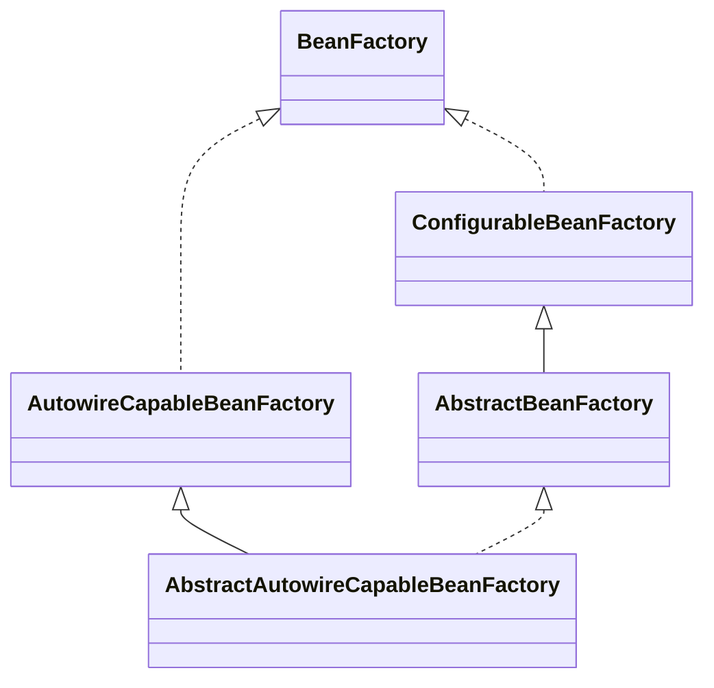

# Bean 的创建过程

在 `Bean` 的整个加载过程，通过显示或者隐式地调用 `AbstractBeanFactory#getBean(...)` 方法时，会触发 `Bean` 的加载。

对于不同作用域的 `Bean` ，底层都会调用 `AbstractAutowireCapableBeanFactory#createBean(...)` 方法进行创建，创建 `Bean` 的过程涉及到 `Bean` 生命周期的大部分阶段，例如**实例化阶段**、**属性赋值阶段**、**`Aware` 接口回调阶段**、**初始化阶段**都是在这个方法中完成的，这个核心方法将在本文进行详细分析。

# AbstractAutowireCapableBeanFactory



`AbstractAutowireCapableBeanFactory` 抽象类中有一个核心的方法 `createBean` 用于完成 `Bean` 的创建。

## createBean 方法

`createBean(String beanName, RootBeanDefinition mbd, @Nullable Object[] args)` 方法用于创建 `Bean`，方法如下：

入参：

* `beanName`：`Bean` 的名称。
* `mbd`：`Bean` 的 `BeanDefinition` 对象（合并后）。
* `args`：创建 `Bean` 的参数，我们通常不会传，所以这里为 `null`。

```java
@Override
protected Object createBean(String beanName, RootBeanDefinition mbd, @Nullable Object[] args) throws BeanCreationException {
    RootBeanDefinition mbdToUse = mbd;

    // Make sure bean class is actually resolved at this point, and
    // clone the bean definition in case of a dynamically resolved Class
    // which cannot be stored in the shared merged bean definition.
    // <1> 获取 `mbd` 对应的 Class 对象，确保当前 Bean 能够被创建出来
    Class<?> resolvedClass = resolveBeanClass(mbd, beanName);
    // 如果这里获取到了 Class 对象，但是 `mbd` 中没有 Class 对象的相关信息，表示这个 Class 对象是动态解析出来的
    if (resolvedClass != null && !mbd.hasBeanClass() && mbd.getBeanClassName() != null) {
        // 复制一份 `mbd`，并设置 Class 对象，因为动态解析出来的 Class 对象不被共享
        mbdToUse = new RootBeanDefinition(mbd);
        mbdToUse.setBeanClass(resolvedClass);
    }

    // Prepare method overrides.
    try {
        // <2> 对所有的 MethodOverride 进行验证和准备工作（确保存在对应的方法，并设置为不能重复加载）
        mbdToUse.prepareMethodOverrides();
    } catch (BeanDefinitionValidationException ex) {
        throw new BeanDefinitionStoreException(mbdToUse.getResourceDescription(),
                beanName, "Validation of method overrides failed", ex);
    }

    try {
        // Give BeanPostProcessors a chance to return a proxy instead of the target bean instance.
        /**
         * <3> 在实例化前进行相关处理，会先调用所有 {@link InstantiationAwareBeanPostProcessor#postProcessBeforeInstantiation}
         * 注意，如果这里返回对象不是 `null` 的话，不会继续往下执行原本初始化操作，直接返回，也就是说这个方法返回的是最终实例对象
         * 可以通过这种方式提前返回一个代理对象，例如 AOP 的实现，或者 RPC 远程调用的实现（因为本地类没有远程能力，可以通过这种方式进行拦截）
         */
        Object bean = resolveBeforeInstantiation(beanName, mbdToUse);
        if (bean != null) {
            return bean;
        }
    } catch (Throwable ex) {
        throw new BeanCreationException(mbdToUse.getResourceDescription(), beanName,
                "BeanPostProcessor before instantiation of bean failed", ex);
    }

    try {
        // <4> 创建 Bean 对象 `beanInstance`，如果上一步没有返回代理对象，就只能走常规的路线进行 Bean 的创建了
        Object beanInstance = doCreateBean(beanName, mbdToUse, args);
        if (logger.isTraceEnabled()) {
            logger.trace("Finished creating instance of bean '" + beanName + "'");
        }
        // <5> 将 `beanInstance` 返回
        return beanInstance;
    } catch (BeanCreationException | ImplicitlyAppearedSingletonException ex) {
        // A previously detected exception with proper bean creation context already,
        // or illegal singleton state to be communicated up to DefaultSingletonBeanRegistry.
        throw ex;
    } catch (Throwable ex) {
        throw new BeanCreationException(
                mbdToUse.getResourceDescription(), beanName, "Unexpected exception during bean creation", ex);
    }
}
```

过程大致如下：
1. 获取 `mbd` 对应的 Class 对象，确保当前 `Bean` 能够被创建出来，调用 `resolveBeanClass(...)` 方法。
2. 对所有的 MethodOverride 进行验证和准备工作（确保存在对应的方法，并设置为不能重复加载）。
3. 实例化前阶段在实例化前进行相关处理，会先调用所有 `InstantiationAwareBeanPostProcessor#postProcessBeforeInstantiation` 。
   注意，如果这里返回对象不是 `null` 的话，不会继续往下执行原本初始化操作，直接返回，也就是说这个方法返回的是最终实例对象。
   可以通过这种方式提前返回一个代理对象，例如 AOP 的实现，或者 RPC 远程调用的实现（因为本地类没有远程能力，可以通过这种方式进行拦截）。
4. 创建 `Bean` 对象 `beanInstance`，如果上一步没有返回代理对象，就只能走常规的路线进行 `Bean` 的创建了，调用 `doCreateBean(...)` 方法。
5. 将 `beanInstance` 返回。

可以看到这个方法中并没有开始真正 `Bean` 的创建，在这个方法的第 `4` 步会调用 `doCreateBean(...)` 方法创建 `Bean` 。

## doCreateBean 方法

`doCreateBean(final String beanName, final RootBeanDefinition mbd, final @Nullable Object[] args)`，创建 `Bean`，方法如下：

```java
protected Object doCreateBean(final String beanName, final RootBeanDefinition mbd, final @Nullable Object[] args)
        throws BeanCreationException {

    // Instantiate the bean.
    /**
     * <1> Bean 的实例化阶段，会将 Bean 的实例对象封装成 {@link BeanWrapperImpl} 包装对象
     * BeanWrapperImpl 承担的角色：
     * 1. Bean 实例的包装
     * 2. {@link org.springframework.beans.PropertyAccessor} 属性编辑器
     * 3. {@link org.springframework.beans.PropertyEditorRegistry} 属性编辑器注册表
     * 4. {@link org.springframework.core.convert.ConversionService} 类型转换器（Spring 3+，替换了之前的 TypeConverter）
     */
    BeanWrapper instanceWrapper = null;
    // <1.1> 如果是单例模式，则先尝试从 `factoryBeanInstanceCache` 缓存中获取实例对象，并从缓存中移除
    if (mbd.isSingleton()) {
        instanceWrapper = this.factoryBeanInstanceCache.remove(beanName);
    }
    // <1.2> 使用合适的实例化策略来创建 Bean 的实例：工厂方法、构造函数自动注入、简单初始化
    // 主要是将 BeanDefinition 转换为 BeanWrapper 对象
    if (instanceWrapper == null) {
        instanceWrapper = createBeanInstance(beanName, mbd, args);
    }
    // <1.3> 获取包装的实例对象 `bean`
    final Object bean = instanceWrapper.getWrappedInstance();
    // <1.4> 获取包装的实例对象的类型 `beanType`
    Class<?> beanType = instanceWrapper.getWrappedClass();
    if (beanType != NullBean.class) {
        mbd.resolvedTargetType = beanType;
    }

    // Allow post-processors to modify the merged bean definition.
    // <2> 对 RootBeanDefinition（合并后）进行加工处理
    synchronized (mbd.postProcessingLock) { // 加锁，线程安全
        // <2.1> 如果该 RootBeanDefinition 没有处理过，则进行下面的处理
        if (!mbd.postProcessed) {
            try {
                /**
                 * <2.2> 对 RootBeanDefinition（合并后）进行加工处理
                 * 调用所有 {@link MergedBeanDefinitionPostProcessor#postProcessMergedBeanDefinition}
                 * 【重要】例如有下面两个处理器：
                 * 1. AutowiredAnnotationBeanPostProcessor 会先解析出 @Autowired 和 @Value 注解标注的属性的注入元信息，后续进行依赖注入；
                 * 2. CommonAnnotationBeanPostProcessor 会先解析出 @Resource 注解标注的属性的注入元信息，后续进行依赖注入，
                 * 它也会找到 @PostConstruct 和 @PreDestroy 注解标注的方法，并构建一个 LifecycleMetadata 对象，用于后续生命周期中的初始化和销毁
                 */
                applyMergedBeanDefinitionPostProcessors(mbd, beanType, beanName);
            } catch (Throwable ex) {
                throw new BeanCreationException(mbd.getResourceDescription(), beanName,
                        "Post-processing of merged bean definition failed", ex);
            }
            // <2.3> 设置该 RootBeanDefinition 被处理过，避免重复处理
            mbd.postProcessed = true;
        }
    }

    // Eagerly cache singletons to be able to resolve circular references
    // even when triggered by lifecycle interfaces like BeanFactoryAware.
    // <3> 提前暴露这个 `bean`，如果可以的话，目的是解决单例模式 Bean 的循环依赖注入
    // <3.1> 判断是否可以提前暴露
    boolean earlySingletonExposure = (mbd.isSingleton() // 单例模式
            && this.allowCircularReferences // 允许循环依赖，默认为 true
            && isSingletonCurrentlyInCreation(beanName)); // 当前单例 bean 正在被创建，在前面已经标记过
    if (earlySingletonExposure) {
        if (logger.isTraceEnabled()) {
            logger.trace("Eagerly caching bean '" + beanName +
                    "' to allow for resolving potential circular references");
        }
        /**
         * <3.2>
         * 创建一个 ObjectFactory 实现类，用于返回当前正在被创建的 `bean`，提前暴露，保存在 `singletonFactories` （**三级 Map**）缓存中
         *
         * 可以回到前面的 {@link AbstractBeanFactory#doGetBean#getSingleton(String)} 方法
         * 加载 Bean 的过程会先从缓存中获取单例 Bean，可以避免单例模式 Bean 循环依赖注入的问题
         */
        addSingletonFactory(beanName,
                // ObjectFactory 实现类
                () -> getEarlyBeanReference(beanName, mbd, bean));
    }

    // Initialize the bean instance.
    // 开始初始化 `bean`
    Object exposedObject = bean;
    try {
        // <4> 对 `bean` 进行属性填充，注入对应的属性值
        populateBean(beanName, mbd, instanceWrapper);
        // <5> 初始化这个 `exposedObject`，调用其初始化方法
        exposedObject = initializeBean(beanName, exposedObject, mbd);
    } catch (Throwable ex) {
        if (ex instanceof BeanCreationException && beanName.equals(((BeanCreationException) ex).getBeanName())) {
            throw (BeanCreationException) ex;
        } else {
            throw new BeanCreationException(
                    mbd.getResourceDescription(), beanName, "Initialization of bean failed", ex);
        }
    }

    // <6> 循环依赖注入的检查
    if (earlySingletonExposure) {
        // <6.1> 获取当前正在创建的 `beanName` 被依赖注入的早期引用
        // 注意，这里有一个入参是 `false`，不会调用上面第 `3` 步的 ObjectFactory 实现类
        // 也就是说当前 `bean` 如果出现循环依赖注入，这里才能获取到提前暴露的引用
        Object earlySingletonReference = getSingleton(beanName, false);
        // <6.2> 如果出现了循环依赖注入，则进行接下来的检查工作
        if (earlySingletonReference != null) {
            // <6.2.1> 如果 `exposedObject` 没有在初始化阶段中被改变，也就是没有被增强
            // 则使用提前暴露的那个引用
            if (exposedObject == bean) {
                exposedObject = earlySingletonReference;
            }
            // <6.2.2> 否则，`exposedObject` 已经不是被别的 Bean 依赖注入的那个 Bean
            else if (!this.allowRawInjectionDespiteWrapping // 是否允许注入未加工的 Bean，默认为 false，这里取非就为 true
                    && hasDependentBean(beanName)) { // 存在依赖 `beanName` 的 Bean（通过 `depends-on` 配置）
                // 获取依赖当前 `beanName` 的 Bean 们的名称（通过 `depends-on` 配置）
                String[] dependentBeans = getDependentBeans(beanName);
                Set<String> actualDependentBeans = new LinkedHashSet<>(dependentBeans.length);
                // 接下来进行判断，如果依赖 `beanName` 的 Bean 已经创建
                // 说明当前 `beanName` 被注入了，而这里最终的 `bean` 被包装过，不是之前被注入的
                // 则抛出异常
                for (String dependentBean : dependentBeans) {
                    if (!removeSingletonIfCreatedForTypeCheckOnly(dependentBean)) {
                        actualDependentBeans.add(dependentBean);
                    }
                }
                if (!actualDependentBeans.isEmpty()) {
                    throw new BeanCurrentlyInCreationException(beanName,
                            "Bean with name '" + beanName + "' has been injected into other beans [" +
                            StringUtils.collectionToCommaDelimitedString(actualDependentBeans) +
                            "] in its raw version as part of a circular reference, but has eventually been " +
                            "wrapped. This means that said other beans do not use the final version of the " +
                            "bean. This is often the result of over-eager type matching - consider using " +
                            "'getBeanNamesOfType' with the 'allowEagerInit' flag turned off, for example.");
                }
            }
        }
    }

    // Register bean as disposable.
    try {
        /**
         * <7> 为当前 `bean` 注册 DisposableBeanAdapter（如果需要的话），用于 Bean 生命周期中的销毁阶段
         * 可以看到 {@link DefaultSingletonBeanRegistry#destroySingletons()} 方法
         */
        registerDisposableBeanIfNecessary(beanName, bean, mbd);
    }
    catch (BeanDefinitionValidationException ex) {
        throw new BeanCreationException(
                mbd.getResourceDescription(), beanName, "Invalid destruction signature", ex);
    }
    // <8> 返回创建好的 `exposedObject` 对象
    return exposedObject;
}
```
这个方法的处理过程有点长，如下：

1. `Bean` 的实例化阶段，会将 `Bean` 的实例对象封装成 `BeanWrapperImpl` 包装对象。
   1. 如果是单例模式，则先尝试从 `factoryBeanInstanceCache` 缓存中获取实例对象，并从缓存中移除。
   2. 使用合适的实例化策略来创建 `Bean` 的实例：**工厂方法**、**构造函数自动注入**、**简单初始化**，主要是将 `BeanDefinition` 转换为 `BeanWrapper` 对象。调用 `createBeanInstance(String beanName, RootBeanDefinition mbd, @Nullable Object[] args)` 方法。
   3. 获取包装的实例对象 `bean` 。
   4. 获取包装的实例对象的类型 `beanType` 。
2. 对 `RootBeanDefinition` （合并后）进行加工处理。
   1. 如果该 `RootBeanDefinition` 没有处理过，则进行下面的处理。
   2. 调用所有的 `MergedBeanDefinitionPostProcessor#postProcessMergedBeanDefinition`，这个过程非常重要，例如 `Spring` 内有下面两个处理器：
      1. `AutowiredAnnotationBeanPostProcessor`，会先解析出 `@Autowired` 和 `@Value` 注解标注的属性的注入元信息，后续进行依赖注入。
      2. `CommonAnnotationBeanPostProcessor`，会先解析出 `@Resource` 注解标注的属性的注入元信息，后续进行依赖注入，它也会找到 `@PostConstruct` 和 `@PreDestroy` 注解标注的方法，并构建一个 `LifecycleMetadata` 对象，用于后续生命周期中的初始化和销毁。
   3. 设置该 `RootBeanDefinition` 被处理过，避免重复处理。
3. 提前暴露这个 `bean`，如果可以的话，目的是解决单例模式 `Bean` 的循环依赖注入。
   1. 判断是否可以提前暴露，满足三个条件：单例模式、允许循环依赖（默认为 `true`）、当前单例 `bean` 正在被创建，在前面已经标记过。
   2. 创建一个 `ObjectFactory` 实现类，用于返回当前正在被创建的 `bean`，提前暴露，保存在 `singletonFactories` （三级 `Map`）缓存中。

接下来开始初始化上面的 `bean` 实例对象，会先创建一个 `Object exposedObject` 等于 `bean` （引用）：

4. 对 `bean` 进行属性填充，注入对应的属性值，调用 `populateBean(String beanName, RootBeanDefinition mbd, @Nullable BeanWrapper bw)` 方法。
5. 初始化这个 `exposedObject`，调用其初始化方法，调用 `initializeBean(final String beanName, final Object bean, @Nullable RootBeanDefinition mbd)` 方法。
6. 循环依赖注入的检查。
   1. 获取当前正在创建的 `beanName` 被依赖注入的早期引用，调用 `DefaultSingletonBeanRegistry#getSingleton(String beanName, boolean allowEarlyReference)` 方法。注意，这里有一个入参是 `false`，不会调用上面第 `3` 步的 `ObjectFactory` 实现类，也就是说当前 `bean` 如果出现循环依赖注入，这里才能获取到提前暴露的引用。
   2. 如果出现了循环依赖注入，则进行接下来的检查工作
      1. 如果 `exposedObject` 没有在初始化阶段中被改变，也就是没有被增强，则使用提前暴露的那个引用。
      2. 否则， `exposedObject` 已经不是被别的 `Bean` 依赖注入的那个 `Bean`，如果依赖当前 `beanName` 的 `Bean`（通过 `depends-on` 配置）已经被创建，则抛出异常。
7. 为当前 `bean` 注册 `DisposableBeanAdapter`（如果需要的话），用于 `Bean` 生命周期中的销毁阶段。
8. 返回创建好的 `exposedObject` 对象。

概括：
1. 首先获取对应的 Class 对象，创建一个实例对象。
2. 对这个实例对象进行属性填充。
3. 调用这个实例对象的初始化方法。

关于上面创建 `Bean` 的两个方法的相关步骤没有展开讨论，下面会依次进行分析。

## 1. 创建 Class 对象

对应代码段：
```java
// AbstractAutowireCapableBeanFactory#createBean(...) 方法
// <1> 获取 `mbd` 对应的 Class 对象，确保当前 Bean 能够被创建出来
Class<?> resolvedClass = resolveBeanClass(mbd, beanName);
// 如果这里获取到了 Class 对象，但是 `mbd` 中没有 Class 对象的相关信息，表示这个 Class 对象是动态解析出来的
if (resolvedClass != null && !mbd.hasBeanClass() && mbd.getBeanClassName() != null) {
    // 复制一份 `mbd`，并设置 Class 对象，因为动态解析出来的 Class 对象不被共享
    mbdToUse = new RootBeanDefinition(mbd);
    mbdToUse.setBeanClass(resolvedClass);
}
```
创建一个 Java 对象之前，需要确保存在对应的 Class 对象。如果这里获取到了 Class 对象，但是 `mbd` 中没有 Class 对象的相关信息，表示这个 Class 对象是动态解析出来的，则需要复制一份 `mbd`，并设置 Class 对象，因为动态解析出来的 Class 对象不被共享

### resolveBeanClass 方法

`resolveBeanClass(final RootBeanDefinition mbd, String beanName, final Class<?>... typesToMatch)`，获取 `beanName` 的 Class 对象，方法如下：

```java
// AbstractBeanFactory.java
@Nullable
protected Class<?> resolveBeanClass(final RootBeanDefinition mbd, String beanName, final Class<?>... typesToMatch)
        throws CannotLoadBeanClassException {
    try {
        // 有 Class 对象则直接返回
        if (mbd.hasBeanClass()) {
            return mbd.getBeanClass();
        }
        // 否则，调用 `doResolveBeanClass(...)` 方法，加载出一个 Class 对象
        if (System.getSecurityManager() != null) {
            return AccessController.doPrivileged((PrivilegedExceptionAction<Class<?>>) () -> 
                                                 doResolveBeanClass(mbd, typesToMatch), getAccessControlContext());
        } else {
            return doResolveBeanClass(mbd, typesToMatch);
        }
    }
    // ... 省略 catch 各种异常
}
```
如果有 Class 对象则直接返回，没有的话调用 `doResolveBeanClass(...)` 方法去获取 Class 对象。

### doResolveBeanClass 方法

```java
// AbstractBeanFactory.java
@Nullable
private Class<?> doResolveBeanClass(RootBeanDefinition mbd, Class<?>... typesToMatch)
        throws ClassNotFoundException {
    // 获取 ClassLoader 加载器
    ClassLoader beanClassLoader = getBeanClassLoader();
    ClassLoader dynamicLoader = beanClassLoader;
    boolean freshResolve = false;

    if (!ObjectUtils.isEmpty(typesToMatch)) {
        // When just doing type checks (i.e. not creating an actual instance yet),
        // use the specified temporary class loader (e.g. in a weaving scenario).
        ClassLoader tempClassLoader = getTempClassLoader();
        if (tempClassLoader != null) {
            dynamicLoader = tempClassLoader;
            freshResolve = true;
            if (tempClassLoader instanceof DecoratingClassLoader) {
                DecoratingClassLoader dcl = (DecoratingClassLoader) tempClassLoader;
                for (Class<?> typeToMatch : typesToMatch) {
                    dcl.excludeClass(typeToMatch.getName());
                }
            }
        }
    }

    // 获取 `className`
    String className = mbd.getBeanClassName();
    if (className != null) {
        // 根据 BeanExpressionResolver 表达式处理器计算出 `className` 对应的结果
        // 可能还是一个类名称，也可能是一个 Class 对象
        Object evaluated = evaluateBeanDefinitionString(className, mbd);
        if (!className.equals(evaluated)) {
            // A dynamically resolved expression, supported as of 4.2...
            if (evaluated instanceof Class) {
                return (Class<?>) evaluated;
            } else if (evaluated instanceof String) {
                className = (String) evaluated;
                freshResolve = true;
            } else {
                throw new IllegalStateException("Invalid class name expression result: " + evaluated);
            }
        }
        // 如果被处理过，则根据这个 `className` 创建一个 Class 对象
        // 创建的 Class 对象不会设置到 `mbd` 中
        if (freshResolve) {
            // When resolving against a temporary class loader, exit early in order
            // to avoid storing the resolved Class in the bean definition.
            if (dynamicLoader != null) {
                try {
                    return dynamicLoader.loadClass(className);
                } catch (ClassNotFoundException ex) {
                    if (logger.isTraceEnabled()) {
                        logger.trace("Could not load class [" + className + "] from " + dynamicLoader + ": " + ex);
                    }
                }
            }
            return ClassUtils.forName(className, dynamicLoader);
        }
    }

    // Resolve regularly, caching the result in the BeanDefinition...
    // 让 RootBeanDefinition 自己解析出 Class 对象
    return mbd.resolveBeanClass(beanClassLoader);
}
```

暂时忽略上面具体的每个细节，底层会根据 `className` 通过来加载器获取对应的 Class 对象，并设置到 `RootBeanDefinition` 。

注意，这个过程可能是动态解析出来的，例如 `className` 是一个表达式，通过 `BeanDefinition` 表达式解析器解析出来的，然后根据其获取 Class 对象，这里是不会设置到 `RootBeanDefinition` 中。

## 2. MethodOverride 的验证与准备

对应代码段：

```java
// AbstractAutowireCapableBeanFactory#createBean(...) 方法
try {
    // <2> 对所有的 MethodOverride 进行验证和准备工作（确保存在对应的方法，并设置为不能重复加载）
    mbdToUse.prepareMethodOverrides();
} catch (BeanDefinitionValidationException ex) {
    throw new BeanDefinitionStoreException(mbdToUse.getResourceDescription(),
            beanName, "Validation of method overrides failed", ex);
}
```

`<lookup-method />` 和 <replace-method /> 标签会被解析成 `LookupOverride` 和 `ReplaceOverride` 对象，用于实现或覆盖某个方法，这里会进行验证和准备工作，过程如下：

```java
// AbstractBeanDefinition.java
public void prepareMethodOverrides() throws BeanDefinitionValidationException {
    // Check that lookup methods exist and determine their overloaded status.
    if (hasMethodOverrides()) { // 如果存在 `methodOverrides`
        // 获取所有的 override method，遍历进行处理
        getMethodOverrides().getOverrides().forEach(this::prepareMethodOverride);
    }
}
protected void prepareMethodOverride(MethodOverride mo) throws BeanDefinitionValidationException {
    int count = ClassUtils.getMethodCountForName(getBeanClass(), mo.getMethodName());
    if (count == 0) {
        throw new BeanDefinitionValidationException(
                "Invalid method override: no method with name '" + mo.getMethodName() +
                "' on class [" + getBeanClassName() + "]");
    } else if (count == 1) {
        // Mark override as not overloaded, to avoid the overhead of arg type checking.
        mo.setOverloaded(false);
    }
}
```

确保这个类中存在对应的方法，并设置为不能重复加载。

## 3. 实例化前阶段

对应代码段：

```java
// AbstractAutowireCapableBeanFactory#createBean(...) 方法
try {
    // Give BeanPostProcessors a chance to return a proxy instead of the target bean instance.
    /**
     * <3> 在实例化前进行相关处理，会先调用所有 {@link InstantiationAwareBeanPostProcessor#postProcessBeforeInstantiation}
     * 注意，如果这里返回对象不是 `null` 的话，不会继续往下执行原本初始化操作，直接返回，也就是说这个方法返回的是最终实例对象
     * 可以通过这种方式提前返回一个代理对象，例如 AOP 的实现，或者 RPC 远程调用的实现（因为本地类没有远程能力，可以通过这种方式进行拦截）
     */
    Object bean = resolveBeforeInstantiation(beanName, mbdToUse);
    if (bean != null) {
        return bean;
    }
} catch (Throwable ex) {
    throw new BeanCreationException(mbdToUse.getResourceDescription(), beanName,
            "BeanPostProcessor before instantiation of bean failed", ex);
}
```
在开始创建 `Bean` 执行，调用 `resolveBeforeInstantiation(String beanName, RootBeanDefinition mbd)` 方法进行处理，尝试获取一个代理对象。

注意，如果这里返回对象不是 `null` 的话，不会继续往下执行原本初始化操作，直接返回，也就是说这个方法返回的是最终实例对象。可以通过这种方式提前返回一个代理对象，例如 AOP 的实现，或者 RPC 远程调用的实现（因为本地类没有远程能力，可以通过这种方式进行拦截）。

### resolveBeforeInstantiation 方法

```java
// AbstractAutowireCapableBeanFactory.java
@Nullable
protected Object resolveBeforeInstantiation(String beanName, RootBeanDefinition mbd) {
    Object bean = null;
    if (!Boolean.FALSE.equals(mbd.beforeInstantiationResolved)) {
        // Make sure bean class is actually resolved at this point.
        // 如果 RootBeanDefinition 不是用户定义的（由 Spring 解析出来的），并且存在 InstantiationAwareBeanPostProcessor 处理器
        if (!mbd.isSynthetic() && hasInstantiationAwareBeanPostProcessors()) {
            Class<?> targetType = determineTargetType(beanName, mbd);
            if (targetType != null) {
                 // 实例化前置处理
                bean = applyBeanPostProcessorsBeforeInstantiation(targetType, beanName);
                if (bean != null) {
                    // 后置处理
                    bean = applyBeanPostProcessorsAfterInitialization(bean, beanName);
                }
            }
        }
        mbd.beforeInstantiationResolved = (bean != null);
    }
    return bean;
}
```

如果 `RootBeanDefinition` 不是用户定义的（由 Spring 解析出来的），并且存在 `InstantiationAwareBeanPostProcessor` 处理器，则进行下面的处理：

实例化前置处理，调用 `applyBeanPostProcessorsBeforeInstantiation(Class<?> beanClass, String beanName)` 方法，如下：

```java
@Nullable
protected Object applyBeanPostProcessorsBeforeInstantiation(Class<?> beanClass, String beanName) {
    for (BeanPostProcessor bp : getBeanPostProcessors()) {
        if (bp instanceof InstantiationAwareBeanPostProcessor) {
            InstantiationAwareBeanPostProcessor ibp = (InstantiationAwareBeanPostProcessor) bp;
            Object result = ibp.postProcessBeforeInstantiation(beanClass, beanName);
            if (result != null) {
                return result;
            }
        }
    }
    return null;
}
```
遍历所有的 `InstantiationAwareBeanPostProcessor` 处理器，执行 `postProcessBeforeInstantiation` 方法，实例化前置处理，如果有一个处理后返回的结果不为空则直接返回

如果第 `1` 步返回的对象不为空，则调用 `applyBeanPostProcessorsAfterInitialization(Object existingBean, String beanName)` 方法，如下：

```java
// AbstractAutowireCapableBeanFactory.java
@Override
public Object applyBeanPostProcessorsAfterInitialization(Object existingBean, String beanName)
        throws BeansException {

    Object result = existingBean;
    // 遍历 BeanPostProcessor
    for (BeanPostProcessor processor : getBeanPostProcessors()) {
        // 处理
        Object current = processor.postProcessAfterInitialization(result, beanName);
        // 返回空，则返回 result
        if (current == null) {
            return result;
        }
        // 修改 result
        result = current;
    }
    return result;
}
```

遍历所有的 `BeanPostProcessor` 处理器，执行 `postProcessAfterInitialization` 方法，初始化后置处理。

## 4. Bean 的实例化

对应代码段：

```java
// AbstractAutowireCapableBeanFactory#doCreateBean(...) 方法
// Instantiate the bean.
/**
 * <1> Bean 的实例化阶段，会将 Bean 的实例对象封装成 {@link BeanWrapperImpl} 包装对象
 * BeanWrapperImpl 承担的角色：
 * 1. Bean 实例的包装
 * 2. {@link org.springframework.beans.PropertyAccessor} 属性编辑器
 * 3. {@link org.springframework.beans.PropertyEditorRegistry} 属性编辑器注册表
 * 4. {@link org.springframework.core.convert.ConversionService} 类型转换器（Spring 3+，替换了之前的 TypeConverter）
 */
BeanWrapper instanceWrapper = null;
// <1.1> 如果是单例模式，则先尝试从 `factoryBeanInstanceCache` 缓存中获取实例对象，并从缓存中移除
if (mbd.isSingleton()) {
    instanceWrapper = this.factoryBeanInstanceCache.remove(beanName);
}
// <1.2> 使用合适的实例化策略来创建 Bean 的实例：工厂方法、构造函数自动注入、简单初始化
// 主要是将 BeanDefinition 转换为 BeanWrapper 对象
if (instanceWrapper == null) {
    instanceWrapper = createBeanInstance(beanName, mbd, args);
}
// <1.3> 获取包装的实例对象 `bean`
final Object bean = instanceWrapper.getWrappedInstance();
// <1.4> 获取包装的实例对象的类型 `beanType`
Class<?> beanType = instanceWrapper.getWrappedClass();
if (beanType != NullBean.class) {
    mbd.resolvedTargetType = beanType;
}
```
`Bean` 的实例化阶段，会将 `Bean` 的实例对象封装成 `BeanWrapperImpl` `包装对象，BeanWrapperImpl` 承担的角色：
* `Bean` 实例的包装
* `PropertyAccessor` 属性编辑器
* `PropertyEditorRegistry` 属性编辑器注册表
* `ConversionService` 类型转换器（Spring 3+，替换了之前的 `TypeConverter`）

该过程大致如下：
1. 如果是单例模式，则先尝试从 `factoryBeanInstanceCache` 缓存中获取实例对象，并从缓存中移除。
2. 使用合适的实例化策略来创建 `Bean` 的实例：工厂方法、构造函数自动注入、简单初始化，主要是将 `BeanDefinition` 转换为 `BeanWrapper` 对象，调用 `createBeanInstance(String beanName, RootBeanDefinition mbd, @Nullable Object[] args)` 方法。
3. 获取包装的实例对象 `bean` 。
4. 获取包装的实例对象的类型 `beanType` 。

### createBeanInstance 方法

`createBeanInstance(String beanName, RootBeanDefinition mbd, @Nullable Object[] args)` 方法，创建一个 `Bean` 的实例对象，如下：

```java
// AbstractAutowireCapableBeanFactory.java
protected BeanWrapper createBeanInstance(String beanName, RootBeanDefinition mbd, @Nullable Object[] args) {
    // Make sure bean class is actually resolved at this point.
    // <1> 获取 `beanName` 对应的 Class 对象
    Class<?> beanClass = resolveBeanClass(mbd, beanName);

    if (beanClass != null && !Modifier.isPublic(beanClass.getModifiers()) && !mbd.isNonPublicAccessAllowed()) {
        throw new BeanCreationException(mbd.getResourceDescription(), beanName,
                "Bean class isn't public, and non-public access not allowed: " + beanClass.getName());
    }

    // <2> 如果存在 Supplier 实例化回调接口，则使用给定的回调方法创建一个实例对象
    Supplier<?> instanceSupplier = mbd.getInstanceSupplier();
    if (instanceSupplier != null) {
        return obtainFromSupplier(instanceSupplier, beanName);
    }

    // <3> 如果配置了 `factory-method` 工厂方法，则调用该方法来创建一个实例对象
    // 通过 @Bean 标注的方法会通过这里进行创建
    if (mbd.getFactoryMethodName() != null) {
        // 这个过程非常复杂，你可以理解为：
        // 找到最匹配的 Method 工厂方法，获取相关参数（依赖注入），然后通过调用该方法返回一个实例对象（反射机制）
        return instantiateUsingFactoryMethod(beanName, mbd, args);
    }

    // Shortcut when re-creating the same bean...
    // <4> 判断这个 RootBeanDefinition 的构造方法是否已经被解析出来了
    // 因为找到最匹配的构造方法比较繁琐，找到后会设置到 RootBeanDefinition 中，避免重复这个过程
    boolean resolved = false;
    boolean autowireNecessary = false;
    if (args == null) {
        synchronized (mbd.constructorArgumentLock) { // 加锁
            // <4.1> 构造方法已经解析出来了
            if (mbd.resolvedConstructorOrFactoryMethod != null) {
                resolved = true;
                // <4.2> 这个构造方法有入参，表示需要先获取到对应的入参（构造器注入）
                autowireNecessary = mbd.constructorArgumentsResolved;
            }
        }
    }

    // <5> 如果最匹配的构造方法已解析出来
    if (resolved) {
        // <5.1> 如果这个构造方法有入参
        if (autowireNecessary) {
            // 这个过程很复杂，你可以理解为：
            // 找到最匹配的构造方法，这里会拿到已经被解析出来的这个方法，并找到入参（构造器注入），然后调用该方法返回一个实例对象（反射机制）
            return autowireConstructor(beanName, mbd, null, null);
        }
        // <5.2> 否则，没有入参
        else {
            // 直接调用解析出来构造方法，返回一个实例对象（反射机制）
            return instantiateBean(beanName, mbd);
        }
    }

    // Candidate constructors for autowiring?
    // <6> 如果最匹配的构造方法还没开始解析，那么需要找到一个最匹配的构造方法，然后创建一个实例对象

    /**
     * <6.1> 尝试通过 SmartInstantiationAwareBeanPostProcessor 处理器的 determineCandidateConstructors 方法来找到一些合适的构造方法
     * 参考 {@link org.springframework.beans.factory.annotation.AutowiredAnnotationBeanPostProcessor#determineCandidateConstructors}
     */
    Constructor<?>[] ctors = determineConstructorsFromBeanPostProcessors(beanClass, beanName);
    // <6.2> 是否满足下面其中一个条件
    if (ctors != null // 上一步找到了合适的构造方法
            || mbd.getResolvedAutowireMode() == AUTOWIRE_CONSTRUCTOR // 构造器注入
            || mbd.hasConstructorArgumentValues() // 定义了构造方法的入参
            || !ObjectUtils.isEmpty(args)) // 当前方法指定了入参
    {
        // 找到最匹配的构造方法，如果 `ctors` 不为空，会从这里面找一个最匹配的，
        // 并找到入参（构造器注入），然后调用该方法返回一个实例对象（反射机制）
        return autowireConstructor(beanName, mbd, ctors, args);
    }

    // Preferred constructors for default construction?
    /**
     * <7> 如果第 `6` 步还不满足，那么尝试获取优先的构造方法
     * 参考 {@link org.springframework.context.support.GenericApplicationContext.ClassDerivedBeanDefinition}
     */
    ctors = mbd.getPreferredConstructors();
    if (ctors != null) {
        // 如果存在优先的构造方法，则从里面找到最匹配的一个，并找到入参（构造器注入），然后调用该方法返回一个实例对象（反射机制）
        return autowireConstructor(beanName, mbd, ctors, null);
    }

    // No special handling: simply use no-arg constructor.
    // <8> 如果上面多种情况都不满足，那只能使用兜底方法了，直接调用默认构造方法返回一个实例对象（反射机制）
    return instantiateBean(beanName, mbd);
}
```

过程大致如下：
1. 获取 `beanName` 对应的 Class 对象。
2. 如果存在 `Supplier` 实例化回调接口，则使用给定的回调方法创建一个实例对象。
3. 如果配置了 `factory-method` 工厂方法，则调用该方法来创建一个实例对象，通过 `@Bean` 标注的方法会通过这里进行创建。

如果上面两种情况都不是，那么就进行接下来正常创建 Bean 实例的一个过程
4. 判断这个 `RootBeanDefinition` 的构造方法是否已经被解析出来了，因为找到最匹配的构造方法比较繁琐，找到后会设置到 `RootBeanDefinition` 中，避免重复这个过程。
   1. `RootBeanDefinition` 的 `resolvedConstructorOrFactoryMethod` 是否不为空，不为空表示构造方法已经解析出来了。
   2. 构造方法已经解析出来了，则判断它的 `constructorArgumentsResolved` 是否不为空，不为空表示有入参，需要先获取到对应的入参（构造器注入）。
5. 如果最匹配的构造方法已解析出来。
   1. 如果这个构造方法有入参，则找到最匹配的构造方法，这里会拿到已经被解析出来的这个方法，并找到入参（构造器注入），然后调用该方法返回一个实例对象（反射机制）。
   2. 否则，没有入参，直接调用解析出来构造方法，返回一个实例对象（反射机制）。
6. 如果最匹配的构造方法还没开始解析，那么需要找到一个最匹配的构造方法，然后创建一个实例对象。
    1. 先尝试通过 `SmartInstantiationAwareBeanPostProcessor` 处理器找到一些合适的构造方法，保存在 `ctors` 中。
    2. 是否满足下面其中一个条件： `ctors` 不为空、构造器注入模式、定义了构造方法的入参、当前方法指定了入参，则找到最匹配的构造方法，如果 `ctors` 不为空，会从这里面找一个最匹配的，并找到入参（构造器注入），然后调用该方法返回一个实例对象（反射机制）。
7. 如果第 `6` 步还不满足，那么尝试从 `RootBeanDefinition` 中获取优先的构造方法。
    1. 如果存在优先的构造方法，则从里面找到最匹配的一个，并找到入参（构造器注入），然后调用该方法返回一个实例对象（反射机制。
8. 如果上面多种情况都不满足，那只能使用兜底方法了，直接调用默认构造方法返回一个实例对象（反射机制）。

整个的实例化过程非常的复杂，接下来进行概括：
1.  先拿到对应 Class 对象。
2. 如果设置了 `Supplier` 实例化回调接口，则通过该回调接口获取实例对象。
3. 如果配置了通过 `factory-method` 工厂方法获取实例对象，则通过这个方法创建实例对象，`@Bean` 标注的方法也是通过这里创建实例对象，方法入参会依赖注入。
4. 找到最匹配的一个构造方法，并找到对应的入参（构造器注入），通过调用该方法返回一个实例对象。
5. 兜底方法，调用默认构造方法创建一个实例对象。

## 5. 对 RootBeanDefinition 加工处理

对应代码段：

```java
// AbstractAutowireCapableBeanFactory#doCreateBean(...) 方法
// Allow post-processors to modify the merged bean definition.
// <2> 对 RootBeanDefinition（合并后）进行加工处理
synchronized (mbd.postProcessingLock) { // 加锁，线程安全
    // <2.1> 如果该 RootBeanDefinition 没有处理过，则进行下面的处理
    if (!mbd.postProcessed) {
        try {
            /**
             * <2.2> 对 RootBeanDefinition（合并后）进行加工处理
             * 调用所有 {@link MergedBeanDefinitionPostProcessor#postProcessMergedBeanDefinition}
             * 【重要】例如有下面两个处理器：
             * 1. AutowiredAnnotationBeanPostProcessor 会先解析出 @Autowired 和 @Value 注解标注的属性的注入元信息，后续进行依赖注入；
             * 2. CommonAnnotationBeanPostProcessor 会先解析出 @Resource 注解标注的属性的注入元信息，后续进行依赖注入，
             * 它也会找到 @PostConstruct 和 @PreDestroy 注解标注的方法，并构建一个 LifecycleMetadata 对象，用于后续生命周期中的初始化和销毁
             */
            applyMergedBeanDefinitionPostProcessors(mbd, beanType, beanName);
        }
        catch (Throwable ex) {
            throw new BeanCreationException(mbd.getResourceDescription(), beanName,
                    "Post-processing of merged bean definition failed", ex);
        }
        // <2.3> 设置该 RootBeanDefinition 被处理过，避免重复处理
        mbd.postProcessed = true;
    }
}
```

在创建好实例对象后，允许你通过 `MergedBeanDefinitionPostProcessor` 处理器对该 `RootBeanDefinition` 进行加工处理，也可以从中获取相关信息
1. 如果该 `RootBeanDefinition` 没有加工处理过，则进行下面的处理，否则忽略该过程。
2. 对 `RootBeanDefinition` （合并后）进行加工处理，调用 `applyMergedBeanDefinitionPostProcessors(RootBeanDefinition mbd, Class<?> beanType, String beanName)` 方法，如下：

```java
// AbstractAutowireCapableBeanFactory.java
protected void applyMergedBeanDefinitionPostProcessors(RootBeanDefinition mbd, Class<?> beanType, String beanName) {
    for (BeanPostProcessor bp : getBeanPostProcessors()) {
        if (bp instanceof MergedBeanDefinitionPostProcessor) {
            MergedBeanDefinitionPostProcessor bdp = (MergedBeanDefinitionPostProcessor) bp;
            bdp.postProcessMergedBeanDefinition(mbd, beanType, beanName);
        }
    }
}
```

调用所有 `MergedBeanDefinitionPostProcessor` 的 `postProcessMergedBeanDefinition` 方法对 `RootBeanDefinition` `进行加工处理，例如：AutowiredAnnotationBeanPostProcessor` 会先解析出` @Autowired` 和 `@Value` `注解标注的属性的注入元信息，后续进行依赖注入；CommonAnnotationBeanPostProcessor` 会先解析出 `@Resource` 注解标注的属性的注入元信息，后续进行依赖注入，它也会找到 `@PostConstruct` 和 `@PreDestroy` 注解标注的方法，并构建一个 `LifecycleMetadata` 对象，用于后续生命周期中的初始化和销毁。

3. 设置该 `RootBeanDefinition` 被处理过，避免重复处理。

这个过程在后续讲通过 `@Autowired` 依赖注入的实现原理会被提到。

## 6. 提前暴露当前 Bean

对应代码段：

```java
// AbstractAutowireCapableBeanFactory#doCreateBean(...) 方法
// Eagerly cache singletons to be able to resolve circular references
// even when triggered by lifecycle interfaces like BeanFactoryAware.
// <3> 提前暴露这个 `bean`，如果可以的话，目的是解决单例模式 Bean 的循环依赖注入
// <3.1> 判断是否可以提前暴露
boolean earlySingletonExposure = (mbd.isSingleton() // 单例模式
        && this.allowCircularReferences // 允许循环依赖，默认为 true
        && isSingletonCurrentlyInCreation(beanName)); // 当前单例 bean 正在被创建，在前面已经标记过
if (earlySingletonExposure) {
    if (logger.isTraceEnabled()) {
        logger.trace("Eagerly caching bean '" + beanName +
                "' to allow for resolving potential circular references");
    }
    /**
     * <3.2>
     * 创建一个 ObjectFactory 实现类，用于返回当前正在被创建的 `bean`，提前暴露，保存在 `singletonFactories` （**三级 Map**）缓存中
     *
     * 可以回到前面的 {@link AbstractBeanFactory#doGetBean#getSingleton(String)} 方法
     * 加载 Bean 的过程会先从缓存中获取单例 Bean，可以避免单例模式 Bean 循环依赖注入的问题
     */
    addSingletonFactory(beanName,
            // ObjectFactory 实现类
            () -> getEarlyBeanReference(beanName, mbd, bean));
}
```

在创建好实例对象后，此时还没有进行属性的填充和初始化等工作，先判断是否可以提前暴露这个实例对象，目的是解决单例模式 `Bean` 的循环依赖注入。
1. 判断是否可以提前暴露，满足这些条件：单例模式、允许循环依赖（默认为 `true` ）、当前单例 Bean 正在被创建（前面已经标记过）。
2. 如果可以的话，先通过 `Lambda` 表达式创建一个 `ObjectFactory` 实现类，如下：

```java
// AbstractAutowireCapableBeanFactory.java
protected Object getEarlyBeanReference(String beanName, RootBeanDefinition mbd, Object bean) {
    Object exposedObject = bean;
    if (!mbd.isSynthetic() // RootBeanDefinition 不是用户定义的（由 Spring 解析出来的）
        && hasInstantiationAwareBeanPostProcessors()) {
        for (BeanPostProcessor bp : getBeanPostProcessors()) {
            if (bp instanceof SmartInstantiationAwareBeanPostProcessor) {
                SmartInstantiationAwareBeanPostProcessor ibp = (SmartInstantiationAwareBeanPostProcessor) bp;
                exposedObject = ibp.getEarlyBeanReference(exposedObject, beanName);
            }
        }
    }
    return exposedObject;
}
```
入参 `bean` 为当前 `Bean` 的实例对象（未初始化），这个实现类允许通过 `SmartInstantiationAwareBeanPostProcessor` 对这个提前暴露的对象进行处理，最终会返回这个提前暴露的对象

3. 然后调用 `addSingletonFactory(String beanName, ObjectFactory<?> singletonFactory)` 方法，如下：

```java
// DefaultSingletonBeanRegistry.java
protected void addSingletonFactory(String beanName, ObjectFactory<?> singletonFactory) {
    Assert.notNull(singletonFactory, "Singleton factory must not be null");
    synchronized (this.singletonObjects) {
        if (!this.singletonObjects.containsKey(beanName)) {
            this.singletonFactories.put(beanName, singletonFactory);
            this.earlySingletonObjects.remove(beanName);
            this.registeredSingletons.add(beanName);
        }
    }
}
```
可以看到会往 `singletonFactories` 集合（三级 Map）中添加当前 `beanName` 和 `singletonFactory` （ `ObjectFactory` 实现类）的映射关系；

从 `earlySingletonObjects` 集合（二级 `Map` ）中移除当前 `beanName` ；

往 `registeredSingletons` 集合（已注册的 `Bean` 的名称集合）中添加当前 `beanName`

 `Bean` 出现循环依赖注入，可以通过这个 `ObjectFactory` 实现类获取到提前暴露的对象避免此类问题。


## 7. 属性填充

对应代码段：
```java
// AbstractAutowireCapableBeanFactory#doCreateBean(...) 方法
// Initialize the bean instance.
// 开始初始化 `bean`
Object exposedObject = bean;
try {
    // <4> 对 `bean` 进行属性填充，注入对应的属性值
    populateBean(beanName, mbd, instanceWrapper);
    // <5> 初始化这个 `exposedObject`，调用其初始化方法
    exposedObject = initializeBean(beanName, exposedObject, mbd);
}
catch (Throwable ex) {
    if (ex instanceof BeanCreationException && beanName.equals(((BeanCreationException) ex).getBeanName())) {
        throw (BeanCreationException) ex;
    }
    else {
        throw new BeanCreationException(
                mbd.getResourceDescription(), beanName, "Initialization of bean failed", ex);
    }
}
```

在创建好实例对象后，这个对象的属性还没有赋值，所以将这个实例对象的相关属性进行赋值，也就是上面的第 `<4>` 步

### populateBean 方法

`populateBean(String beanName, RootBeanDefinition mbd, @Nullable BeanWrapper bw)` 方法，属性填充，如下：

```java
// AbstractAutowireCapableBeanFactory.java
protected void populateBean(String beanName, RootBeanDefinition mbd, @Nullable BeanWrapper bw) {
    // <1> 如果实例对象为空，则进行下面的判断
    if (bw == null) {
        // <1.1> 这个 Bean 有属性，则抛出异常
        if (mbd.hasPropertyValues()) {
            throw new BeanCreationException(
                    mbd.getResourceDescription(), beanName, "Cannot apply property values to null instance");
        }
        // <1.2> 否则，不用属性填充，直接 `return`
        else {
            // Skip property population phase for null instance.
            return;
        }
    }

    // Give any InstantiationAwareBeanPostProcessors the opportunity to modify the
    // state of the bean before properties are set. This can be used, for example,
    // to support styles of field injection.
    // <2> 实例化阶段的后置处理，如果满足这两个条件
    if (!mbd.isSynthetic() // RootBeanDefinition 不是用户定义的（由 Spring 解析出来的）
            && hasInstantiationAwareBeanPostProcessors()) { // 是否有 InstantiationAwareBeanPostProcessor 处理器
        // <2.1> 遍历所有的 BeanPostProcessor
        for (BeanPostProcessor bp : getBeanPostProcessors()) {
            // 如果为 InstantiationAwareBeanPostProcessor 类型
            if (bp instanceof InstantiationAwareBeanPostProcessor) {
                InstantiationAwareBeanPostProcessor ibp = (InstantiationAwareBeanPostProcessor) bp;
                // <2.2> 对实例化对象进行后置处理
                // 注意如果返回 false，直接 `return`，不会调用后面的 InstantiationAwareBeanPostProcessor 处理器，也不会进行接下来的属性填充
                if (!ibp.postProcessAfterInstantiation(bw.getWrappedInstance(), beanName)) {
                    return;
                }
            }
        }
    }

    // <3> 获取 `pvs`，承载当前对象的属性值
    PropertyValues pvs = (mbd.hasPropertyValues() ? mbd.getPropertyValues() : null);

    // <4> 获取这个 Bean 的注入模式，默认为 **AUTOWIRE_NO**，例如可以通过 `@Bean` 注解的 `autowire` 属性配置注入模式
    int resolvedAutowireMode = mbd.getResolvedAutowireMode();
    // <4.1> 如果注入模式为 **AUTOWIRE_BY_NAME** 或者 **AUTOWIRE_BY_TYPE**，则通过下面的方式获取属性值
    if (resolvedAutowireMode == AUTOWIRE_BY_NAME || resolvedAutowireMode == AUTOWIRE_BY_TYPE) {
        // <4.2> 将 `pvs` 封装成 MutablePropertyValues 对象 `newPvs`（允许对属性进行相关操作）
        MutablePropertyValues newPvs = new MutablePropertyValues(pvs);
        // Add property values based on autowire by name if applicable.
        // <4.3> **AUTOWIRE_BY_NAME** 模式，通过名称获取相关属性值，保存在 `newPvs` 中
        if (resolvedAutowireMode == AUTOWIRE_BY_NAME) {
            autowireByName(beanName, mbd, bw, newPvs);
        }
        // Add property values based on autowire by type if applicable.
        // <4.4> **AUTOWIRE_BY_TYPE** 模式，通过类型获取相关属性值，保存在 `newPvs` 中
        if (resolvedAutowireMode == AUTOWIRE_BY_TYPE) {
            autowireByType(beanName, mbd, bw, newPvs);
        }
        // <4.5> 将 `newPvs` 复制给 `pvs`
        pvs = newPvs;
    }

    // 是否有 InstantiationAwareBeanPostProcessor 处理器
    boolean hasInstAwareBpps = hasInstantiationAwareBeanPostProcessors();
    // 是否需要进行依赖检查，默认为 true
    boolean needsDepCheck = (mbd.getDependencyCheck() != AbstractBeanDefinition.DEPENDENCY_CHECK_NONE);

    PropertyDescriptor[] filteredPds = null;
    // <5> 通过 InstantiationAwareBeanPostProcessor 处理器（如果有）对 `pvs` 进行处理
    if (hasInstAwareBpps) {
        if (pvs == null) {
            pvs = mbd.getPropertyValues();
        }

        // <5.1> 遍历所有的 BeanPostProcessor
        for (BeanPostProcessor bp : getBeanPostProcessors()) {
            // 如果为 InstantiationAwareBeanPostProcessor 类型
            if (bp instanceof InstantiationAwareBeanPostProcessor) {
                InstantiationAwareBeanPostProcessor ibp = (InstantiationAwareBeanPostProcessor) bp;
                /**
                 * Spring 内部的 InstantiationAwareBeanPostProcessor 处理器：
                 * {@link AutowiredAnnotationBeanPostProcessor#postProcessProperties} 会解析 @Autowired 和 @Value 注解标注的属性，获取对应属性值；
                 * {@link org.springframework.context.annotation.CommonAnnotationBeanPostProcessor#postProcessProperties} 会 解析 Resource 注解标注的属性，获取对应的属性值
                 */
                // <5.2> 调用处理器的 `postProcessProperties(...)` 方法，对 `pvs` 进行后置处理
                PropertyValues pvsToUse = ibp.postProcessProperties(pvs, bw.getWrappedInstance(), beanName);
                // <5.3> 如果上一步的处理结果为空，可能是新版本导致的（Spring 5.1 之前没有上面这个方法），则需要兼容老版本
                if (pvsToUse == null) {
                    // <5.3.1> 找到这个 Bean 的所有 `java.beans.PropertyDescriptor` 属性描述器（包含这个属性的所有信息）
                    if (filteredPds == null) {
                        filteredPds = filterPropertyDescriptorsForDependencyCheck(bw, mbd.allowCaching);
                    }
                    // <5.3.2> 调用处理器的 `postProcessPropertyValues(...)` 方法，对 `pvs` 进行后置处理
                    pvsToUse = ibp.postProcessPropertyValues(pvs, filteredPds, bw.getWrappedInstance(), beanName);
                    // <5.3.3> 如果处理后的 PropertyValues 对象为空，直接 `return`，则不会调用后面的 InstantiationAwareBeanPostProcessor 处理器，也不会进行接下来的属性填充
                    if (pvsToUse == null) {
                        return;
                    }
                }
                // <5.4> 将处理后的 `pvsToUse` 复制给 `pvs`
                pvs = pvsToUse;
            }
        }
    }
    // <6> 依赖检查
    if (needsDepCheck) {
        // <6.1> 找到这个 Bean 的所有 `java.beans.PropertyDescriptor` 属性描述器（包含这个属性的所有信息）
        if (filteredPds == null) {
            filteredPds = filterPropertyDescriptorsForDependencyCheck(bw, mbd.allowCaching);
        }
        // <6.2> 依赖检查，如果没有找到对应的属性值，则根据检查策略进行抛出异常（默认不会）
        checkDependencies(beanName, mbd, filteredPds, pvs);
    }

    // <7> 如果 `pvs` 不为空，则将里面的属性值设置到当前 Bean 对应的属性中（依赖注入）
    // 前面找到的属性值并没有设置到 Bean 中，且属性值可能是一个表达式，类型也可能也不对，需要先进行处理和类型转换，然后再设置到该实例对象中
    if (pvs != null) {
        applyPropertyValues(beanName, mbd, bw, pvs);
    }
}
```

过程大致如下：
1. 如果实例对象为 `null` ，则进行下面的判断。
   1. 这个 `Bean` 有属性，则抛出异常。
   2. 否则，不用属性填充，直接 `return` 。
2. 实例化阶段的后置处理，如果满足这两个条件： `RootBeanDefinition` 不是用户定义的（由 `Spring` 解析出来的）、有 `InstantiationAwareBeanPostProcessor` 处理器。
   1. 遍历所有的 `BeanPostProcessor` 。
   2. 如果为 `InstantiationAwareBeanPostProcessor` 类型，则对实例化对象进行后置处理。注意，如果返回 `false` ，直接 `return` ，不会调用后面的 `InstantiationAwareBeanPostProcessor` 处理器，也不会进行接下来的属性填充。
3. 获取 `pvs` ，承载当前对象的属性值。
4. 获取这个 `Bean` 的注入模式，默认为 `AUTOWIRE_NO`，例如可以通过 `@Bean` 注解的 `autowire` 属性配置注入模式。
   1. 如果注入模式为 `AUTOWIRE_BY_NAME` 或者 `AUTOWIRE_BY_TYPE`，则通过下面的方式获取属性值。
   2. 将 `pvs` 封装成 `MutablePropertyValues` 对象 `newPvs`（允许对属性进行相关操作）。
   3. `AUTOWIRE_BY_NAME` 模式，通过名称获取相关属性值，保存在 `newPvs` 中，调用 `autowireByName(...)` 方法。
   4. `AUTOWIRE_BY_TYPE` 模式，通过类型获取相关属性值，保存在 `newPvs` 中，调用 `autowireByType(...)` 方法。
   5. 将 `newPvs` 复制给 `pvs` 。
5. 通过 `InstantiationAwareBeanPostProcessor` 处理器（如果有）对 pvs 进行处理。
   1. 遍历所有的 `BeanPostProcessor` 。
   2. 如果为 `InstantiationAwareBeanPostProcessor` 类型，则调用其 `postProcessProperties(...)` 方法，对 `pvs` 进行后置处理。
   3. 如果上一步的处理结果为空，可能是新版本导致的（Spring 5.1 之前没有上面这个方法），则需要兼容老版本。
      1. 尝试找到这个 `Bean` 的所有 `java.beans.PropertyDescriptor` 属性描述器（包含这个属性的所有信息）。
      2. 调用处理器的 `postProcessPropertyValues(...)` 方法，对 `pvs` 进行后置处理。
      3. 如果处理后的 `PropertyValues` 对象为空，直接 `return`，则不会调用后面的处理器，也不会进行接下来的属性填充。
   4. 将处理后的 `pvsToUse` 复制给 `pvs` 。
6. 依赖检查。
   1. 找到这个 `Bean` 的所有 `java.beans.PropertyDescriptor` 属性描述器（包含这个属性的所有信息）。
   2. 进行依赖检查，如果没有找到对应的属性值，则根据检查策略进行抛出异常（默认不会）。
7. 如果 `pvs` 不为空，则将里面的属性值设置到当前 `Bean` 对应的属性中（依赖注入），调用 `applyPropertyValues(...)` 方法。前面找到的属性值并没有设置到 `Bean` 中，且属性值可能是一个表达式，类型也可能也不对，需要先进行处理和类型转换，然后再设置到该实例对象中。

整个的属性填充过程非常的复杂，接下来进行概括：
* 允许你对实例化对象进行后置处理，处理结果为 `false` 表示不需要进行接下来的属性填充过程。
* 根据注入模式，找到没有配置属性值的对象属性，然后找到对应的 `Bean`，默认注入模式为不注入。
* 允许你对属性值进行后置处理，例如 `@Autowired`、`@Value` 等注解标注的属性会通过这里找到对应的属性值（或对象）。
* 上述过程仅找到了属性值，还没设置到当前实例对象中，所以最后一步才是真正的属性填充。

## 8. 初始化 Bean

对应代码段：

```java
// AbstractAutowireCapableBeanFactory#doCreateBean(...) 方法
// Initialize the bean instance.
// 开始初始化 `bean`
Object exposedObject = bean;
try {
    // <4> 对 `bean` 进行属性填充，注入对应的属性值
    populateBean(beanName, mbd, instanceWrapper);
    // <5> 初始化这个 `exposedObject`，调用其初始化方法
    exposedObject = initializeBean(beanName, exposedObject, mbd);
} catch (Throwable ex) {
    if (ex instanceof BeanCreationException && beanName.equals(((BeanCreationException) ex).getBeanName())) {
        throw (BeanCreationException) ex;
    } else {
        throw new BeanCreationException(
                mbd.getResourceDescription(), beanName, "Initialization of bean failed", ex);
    }
}
```
实例对象已经有了，且相关属性已经填充了，那么接下来需要进行相关初始化工作，也就是上面的第 `<5>` 步

### initializeBean

```java
// AbstractAutowireCapableBeanFactory.java
protected Object initializeBean(final String beanName, final Object bean, @Nullable RootBeanDefinition mbd) {
    if (System.getSecurityManager() != null) { // 安全模式
        // <1> Aware 接口的回调
        AccessController.doPrivileged((PrivilegedAction<Object>) () -> { 
            invokeAwareMethods(beanName, bean);
            return null;
        }, getAccessControlContext());
    } else {
        // <1> Aware 接口的回调
        invokeAwareMethods(beanName, bean);
    }

    /**
     * <2> **初始化**阶段的**前置处理**，执行所有 BeanPostProcessor 的 postProcessBeforeInitialization 方法
     *
     * 在 {@link AbstractApplicationContext#prepareBeanFactory} 方法中会添加 {@link ApplicationContextAwareProcessor} 处理器
     * 用于处理其他 Aware 接口的回调，例如ApplicationContextAware、EnvironmentAware、ApplicationEventPublisherAware
     *
     * 在 {@link AnnotationConfigUtils#registerAnnotationConfigProcessors} 方法中会注册 {@link CommonAnnotationBeanPostProcessor} 处理器
     * 在这里会执行 @PostConstruct 注解标注的方法
     */
    Object wrappedBean = bean;
    if (mbd == null || !mbd.isSynthetic()) {
        wrappedBean = applyBeanPostProcessorsBeforeInitialization(wrappedBean, beanName);
    }

    try {
        // <3> 激活自定义的初始化方法
        invokeInitMethods(beanName, wrappedBean, mbd);
    } catch (Throwable ex) {
        throw new BeanCreationException(
                (mbd != null ? mbd.getResourceDescription() : null),
                beanName, "Invocation of init method failed", ex);
    }

    /**
     * <4> **初始化**阶段的**后置处理**，执行所有 BeanPostProcessor 的 postProcessAfterInitialization 方法
     *
     * 在 {@link AbstractApplicationContext#prepareBeanFactory} 方法中会添加 {@link ApplicationListenerDetector} 处理器
     * 如果是单例 Bean 且为 ApplicationListener 类型，则添加到 Spring 应用上下文，和 Spring 事件相关
     */
    if (mbd == null || !mbd.isSynthetic()) {
        wrappedBean = applyBeanPostProcessorsAfterInitialization(wrappedBean, beanName);
    }
    return wrappedBean;
}
```

初始化过程如下：

1. `Aware` 接口的回调，调用 `invokeAwareMethods(final String beanName, final Object bean)` 方法，如下：

```java
// AbstractAutowireCapableBeanFactory.java
private void invokeAwareMethods(final String beanName, final Object bean) {
    if (bean instanceof Aware) {
        if (bean instanceof BeanNameAware) {
            ((BeanNameAware) bean).setBeanName(beanName);
        }
        if (bean instanceof BeanClassLoaderAware) {
            ClassLoader bcl = getBeanClassLoader();
            if (bcl != null) {
                ((BeanClassLoaderAware) bean).setBeanClassLoader(bcl);
            }
        }
        if (bean instanceof BeanFactoryAware) {
            ((BeanFactoryAware) bean).setBeanFactory(AbstractAutowireCapableBeanFactory.this);
        }
    }
}
```

如果是 `BeanNameAware`、`BeanClassLoaderAware` 或 `BeanFactoryAware`，则调用其 `setXxx` 方法。

2. 初始化阶段的前置处理，执行所有 `BeanPostProcessor` 的 `postProcessBeforeInitialization` 方法，如下：

```java
// AbstractAutowireCapableBeanFactory.java
@Override
public Object applyBeanPostProcessorsBeforeInitialization(Object existingBean, String beanName)
        throws BeansException {

    Object result = existingBean;
    // 遍历所有 BeanPostProcessor
    for (BeanPostProcessor processor : getBeanPostProcessors()) {
        // 初始化的前置处理，返回 `current` 处理结果
        Object current = processor.postProcessBeforeInitialization(result, beanName);
        // 处理结果为空，则直接返回 `result`
        if (current == null) {
            return result;
        }
        // 否则，`result` 复制 `current`
        result = current;
    }
    return result;
}
```

例如 Spring 内部有下面两个处理器
* `ApplicationContextAwareProcessor`：`ApplicationContextAware`、`ApplicationEventPublisherAware`、`EnvironmentAware` 等其他 `Aware` 接口的回调。
* `CommonAnnotationBeanPostProcessor`： `@PostConstruct` 注解标注的方法的调用。

3. 激活自定义的初始化方法，如下：

```java
protected void invokeInitMethods(String beanName, final Object bean, @Nullable RootBeanDefinition mbd)
        throws Throwable {
    // <1> InitializingBean 接口的回调（如果是）
    boolean isInitializingBean = (bean instanceof InitializingBean);
    if (isInitializingBean && (mbd == null || !mbd.isExternallyManagedInitMethod("afterPropertiesSet"))) {
        if (logger.isTraceEnabled()) {
            logger.trace("Invoking afterPropertiesSet() on bean with name '" + beanName + "'");
        }
        if (System.getSecurityManager() != null) { // 安全模式
            try {
                AccessController.doPrivileged((PrivilegedExceptionAction<Object>) () -> {
                    // 调用其 afterPropertiesSet() 方法
                    ((InitializingBean) bean).afterPropertiesSet();
                    return null;
                }, getAccessControlContext());
            } catch (PrivilegedActionException pae) {
                throw pae.getException();
            }
        } else {
            // 调用其 afterPropertiesSet() 方法
            ((InitializingBean) bean).afterPropertiesSet();
        }
    }
    if (mbd != null && bean.getClass() != NullBean.class) {
        String initMethodName = mbd.getInitMethodName();
        if (StringUtils.hasLength(initMethodName) 
            && !(isInitializingBean && "afterPropertiesSet".equals(initMethodName)) 
            && !mbd.isExternallyManagedInitMethod(initMethodName)) {
            // <2> 调用通过 `init-method` 指定的初始化方法（反射机制）
            invokeCustomInitMethod(beanName, bean, mbd);
        }
    }
}
```

1. `InitializingBean` 接口的回调（如果是），调用其 `afterPropertiesSet()` 方法。
2. 调用通过 `init-method` 指定的初始化方法（反射机制）。
3. 初始化阶段的后置处理，执行所有 `BeanPostProcessor` 的 `postProcessAfterInitialization` 方法，如下：

```java
// AbstractAutowireCapableBeanFactory.java
@Override
public Object applyBeanPostProcessorsAfterInitialization(Object existingBean, String beanName)
        throws BeansException {
    Object result = existingBean;
    // 遍历所有 BeanPostProcessor
    for (BeanPostProcessor processor : getBeanPostProcessors()) {
        // 初始化的后置处理，返回 `current` 处理结果
        Object current = processor.postProcessAfterInitialization(result, beanName);
        // 处理结果为空，则直接返回 `result`
        if (current == null) {
            return result;
        }
        // 否则，`result` 复制 `current`
        result = current;
    }
    return result;
}
```

例如 Spring 内部有一个 `ApplicationListenerDetector` 处理器，如果是单例 Bean 且为 `ApplicationListener` 类型，则添加到 Spring 应用上下文，和 Spring 事件相关。

整个的初始化过程并不复杂，其中也有对应的扩展点，初始化前置处理和后置处理，总的概括如下：
* `Aware` 接口的回调。
* JSR-250 `@PostConstruct` 标注的方法的调用。
* `InitializingBean#afterPropertiesSet` 方法的回调。
* `init-method` 初始化方法的调用。

## 9. 循环依赖注入的检查

对应代码段：

```java
// AbstractAutowireCapableBeanFactory#doCreateBean(...) 方法
// <6> 循环依赖注入的检查
if (earlySingletonExposure) {
    // <6.1> 获取当前正在创建的 `beanName` 被依赖注入的早期引用
    // 注意，这里有一个入参是 `false`，不会调用上面第 `3` 步的 ObjectFactory 实现类
    // 也就是说当前 `bean` 如果出现循环依赖注入，这里才能获取到提前暴露的引用
    Object earlySingletonReference = getSingleton(beanName, false);
    // <6.2> 如果出现了循环依赖注入，则进行接下来的检查工作
    if (earlySingletonReference != null) {
        // <6.2.1> 如果 `exposedObject` 没有在初始化阶段中被改变，也就是没有被增强
        // 则使用提前暴露的那个引用
        if (exposedObject == bean) {
            exposedObject = earlySingletonReference;
        }
        // <6.2.2> 否则，`exposedObject` 已经不是被别的 Bean 依赖注入的那个 Bean
        else if (!this.allowRawInjectionDespiteWrapping // 是否允许注入未加工的 Bean，默认为 false，这里取非就为 true
                && hasDependentBean(beanName)) { // 存在依赖 `beanName` 的 Bean（通过 `depends-on` 配置）
            // 获取依赖当前 `beanName` 的 Bean 们的名称（通过 `depends-on` 配置）
            String[] dependentBeans = getDependentBeans(beanName);
            Set<String> actualDependentBeans = new LinkedHashSet<>(dependentBeans.length);
            // 接下来进行判断，如果依赖 `beanName` 的 Bean 已经创建
            // 说明当前 `beanName` 被注入了，而这里最终的 `bean` 被包装过，不是之前被注入的
            // 则抛出异常
            for (String dependentBean : dependentBeans) {
                if (!removeSingletonIfCreatedForTypeCheckOnly(dependentBean)) {
                    actualDependentBeans.add(dependentBean);
                }
            }
            if (!actualDependentBeans.isEmpty()) {
                throw new BeanCurrentlyInCreationException(beanName,
                        "Bean with name '" + beanName + "' has been injected into other beans [" +
                        StringUtils.collectionToCommaDelimitedString(actualDependentBeans) +
                        "] in its raw version as part of a circular reference, but has eventually been " +
                        "wrapped. This means that said other beans do not use the final version of the " +
                        "bean. This is often the result of over-eager type matching - consider using " +
                        "'getBeanNamesOfType' with the 'allowEagerInit' flag turned off, for example.");
            }
        }
    }
}
```

在前面 **6. 提前暴露当前 Bean**小节中，如果提前暴露了 `Bean`，则可能存在循环依赖注入，这里需要进行一些检查，过程大致如下：
1. 获取当前正在创建的 `beanName` 被依赖注入的早期引用，这里调用方法也就是从缓存中获取单例 `Bean` 的方法。注意，这里有一个入参是 `false`，不会调用前面 6. 提前暴露当前 `Bean` 小节中缓存的 `ObjectFactory` 实现类，也就是说当前 `bean` 如果出现循环依赖注入，这里才能获取到提前暴露的引用。
2. 如果上一步获取到了提前暴露的引用，也就是出现了循环依赖注入，则进行接下来的检查工作。
   1. 如果 `exposedObject` 没有在初始化阶段中被改变，也就是没有被增强，则使用提前暴露的那个引用。
   2. 否则，`exposedObject` 已经不是被别的 `Bean` 依赖注入的那个 `Bean`，则进行相关判断。

当出现循环依赖注入，这里会检查填充属性和初始化的过程中是否改变了这个 `beanName`，改变了的话需要判断依赖当前 `beanName` 的 `Bean` 们是否已经创建了，如果已经创建了，那么可能它拿到的 `beanName` 不是这里初始化后的对象（被修改了），所以需要抛出异常。

## 10. 注册可销毁的 Bean

对应代码段：

```java
// AbstractAutowireCapableBeanFactory#doCreateBean(...) 方法
// Register bean as disposable.
try {
    /**
     * <7> 为当前 `bean` 注册 DisposableBeanAdapter（如果需要的话），用于 Bean 生命周期中的销毁阶段
     * 可以看到 {@link DefaultSingletonBeanRegistry#destroySingletons()} 方法
     */
    registerDisposableBeanIfNecessary(beanName, bean, mbd);
}
catch (BeanDefinitionValidationException ex) {
    throw new BeanCreationException(
            mbd.getResourceDescription(), beanName, "Invalid destruction signature", ex);
}
```

这里会调用 `registerDisposableBeanIfNecessary(String beanName, Object bean, RootBeanDefinition mbd)` 方法，如下：

```java
// AbstractBeanFactory.java
protected void registerDisposableBeanIfNecessary(String beanName, Object bean, RootBeanDefinition mbd) {
    AccessControlContext acc = (System.getSecurityManager() != null ? getAccessControlContext() : null);
    if (!mbd.isPrototype() // 不是原型模式
            && requiresDestruction(bean, mbd)) // 有销毁的必要，也就是定义了销毁方法
    {
        if (mbd.isSingleton()) { // 单例模式
            // Register a DisposableBean implementation that performs all destruction work for the given bean: 
            // DestructionAwareBeanPostProcessors, DisposableBean interface, custom destroy method.
            // 创建一个 DisposableBeanAdapter 对象封装这个 Bean，然后保存在 `disposableBeans` Map 集合中
            registerDisposableBean(beanName, new DisposableBeanAdapter(bean, beanName, mbd, getBeanPostProcessors(), acc));
        }
        else { // 其他模式
            // A bean with a custom scope...
            Scope scope = this.scopes.get(mbd.getScope());
            if (scope == null) {
                throw new IllegalStateException("No Scope registered for scope name '" + mbd.getScope() + "'");
            }
            // 创建一个 DisposableBeanAdapter 对象封装这个 Bean，往其他模式的 Scope 对象里面注册
            scope.registerDestructionCallback(beanName,
                    new DisposableBeanAdapter(bean, beanName, mbd, getBeanPostProcessors(), acc));
        }
    }
}
```

如果不是原型模式，并且有销毁的必要，也就是定义了销毁方法，则需要创建一个 `DisposableBeanAdapter` 对象封装这个 `Bean`，在生命周期的销毁阶段需要先通过这个对象先执行销毁方法，这个对象如何存储的：
* 单例模式：保存在 `disposableBeans` `Map` 集合中。
* 其他模式：往 `Scope` 对象里面注册。

## 11. 返回 Bean

经过上面一系列的过程，实例化、属性填充、初始化等阶段，已经创建好了这个 `Bean`，最后直接返回。

# 总结

当我们显示或者隐式地调用 `AbstractBeanFactory` 的 `getBean(...)` 方法时，会触发 `Bean` 的加载。对于不同作用域的 `Bean`，底层都会调用 `AbstractAutowireCapableBeanFactory` 的 `createBean(...)` 方法进行创建，创建 `Bean` 的过程如下：
1. Class 对象加载阶段。
2. 实例化前阶段（如果返回了一个对象则直接返回，不会进行下面的阶段）。
3. 实例化阶段。
4. 实例化后阶段。
5. 提前暴露单例 `Bean`（循环依赖处理的关键）。
6. 属性填充阶段。
7. `Aware` 接口回调阶段。
8. 初始化前阶段。
9. 初始化阶段。
10. 初始化后阶段。

创建 `Bean` 的过程非常复杂，在不同的阶段都会讲到 `BeanPostProcessor`（及其子类）的身影，Spring 内部很多功能都是基于该处理器接口实现的，当然开发者也可以通过其进行拓展，使得框架变得非常灵活。其中 `Bean` 的实例化和属性填充两个阶段比较复杂，这里没有深入分析，可参考后续文章。提前暴露单例 `Bean` 循环依赖处理的关键，后续文章也会再次分析。

# 参考资料

* [CSDN - 死磕Spring之IoC篇 - Bean 的创建过程](https://www.cnblogs.com/lifullmoon/p/14452842.html)