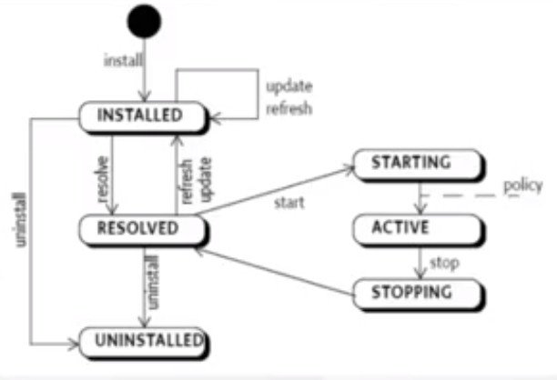

[toc]

# OSGI

OSGI的核心思想是模块化和动态。基于OSGI就可以模块化的开发java应用，模块化的部署java应用，还可以动态管理模块。

## 什么是OSGI ？
OSGi(Open Service Gateway Initiative) 技术是 Java **动态化模块化系统**的一系列规范。OSGi 一方面指维护 OSGi 规范的 OSGi Alliance(OSGi 联盟)，另一方面指的是该组织维护的基于 Java 语言的服务(业务)规范。简单来说，OSGi 可以认为是 Java 平台的模块层，为大型分布式系统以及嵌入式系统提供一种模块化架构减少了软件的复杂度。OSGi服务平台向Java提供服务，这些服务使Java成为软件集成和软件开发的首选环境。OSGi技术提供允许应用程序使用精炼、可重用和可协作的组件构建的标准化原语，这些组件能够组装进一个应用和部署中。

在传统Web开发中，我们为了进行功能的分离，经常会进行模块划分，比如基础信息模块交由A和B做，接口信息模块交由C和D做，最终，再汇集到一起，组成一个完整的项目。在这整一个流程中，我们做到的只是逻辑上的解耦，最终这些模块还是运行于同一服务器上，共享同一个classpath。这时就会出现一个局限性问题，比如现在接口规范改了，我只想停掉接口信息模块，而基础信息模块仍能正常运行，这显然是无法实现的。

而使用OSGI可以完美解决这个问题，OSGI是基于模块（**Bundle**）驱动的，<u>每个模块都有属于自己的classpath和类加载器，模块之间通过包暴露和引入进行关联，每个模块有着自己独立的生命周期</u>，我们可以动态地对模块进行加载、卸载、更新。如此看来，OSGI可以用一句话描述，就是一个为Java提供的动态模块化的系统。

## OSGi 标准
OSGI R1 于 2000 年发布，现在最新的标准版本是 R5，到现在为止应用最广泛的当属是 2005 年发布的 R4。

其中主要定义了 OSGi 框架。OSGi 框架提供了一个通用安全可管理的 java 框架，能够支持可扩展可下载的应用(即 bundles)的部署。<u>OSGi 框架是 OSGi 技术最基础也是最核心的部分。</u>

这里你需要理解 OSGi 框架的三个最重要部分：**模块层**、**生命周期层**、**服务层**。

* **模块层** ：关注打包和代码共享。
OSGi 是严格要求模块化的，模块有个专有名词 bundle。每个模块都是一个 bundle，一个 Business Logic 由多个 bundle 来实现。
* **生命周期层** ：关注提供执行模块管理和对底层 OSGi 框架的访问。
bundle 是需要 OSGi 进行解析的，每个 bundle 在变得可用之前，都需要完整经历该生命周期。
* **服务层** ：关注模块，特别是模块内的组件的交互和通讯。
OSGi 技术全面贯彻了 SOA，每个 bundle 都是其他 bundle 提供服务，夸张一点说，不提供服务的 bundle 就没有存在的价值。

### OSGi 三层架构-模块层
模块化其实就是：将一个大型系统分解为多个较小的互相协作的逻单元，通过强制设定模块之间的逻辑边界来改善系统的维护性和封装性。

模块层定义了 OSGi 中的模块 bundle：

* bundle 是以 jar 包形式存在的个模块化物理单元，里面包含了代码，资源文件和元数据(metadata)，井且 jar 包的物理边界也同时是运行时逻辑模块的封装边界。
* bundle 是开发、部署 OSGi 应用的基本单元。
* bundle 的核心是 META-NF 目录下的 MANIFEST.MF 文件。
* bundle 定义了其所包含的包的可见性、可以认为是在 public/private/protected 的基础上的一个扩展。
* bundle 的 java 包共享、屏蔽的规则。通过 Export-Package、Import-Package 方式进行交互。
* 每个 bundle 都有单独的类加加载器。

### OSGi 三层架构-生命周期

状态是 Bundle 在运行期的一项动态属性，不同状态的 Bundle 具有不同的行为，生命周期层规范定义了 Bundle 生命周期过程之中的 6 种状态。

OSGi 生命周期层有两种不同的作用:
1. 在应用程序外部，定义了对 bundle 生命周期的相关操作。OSGi 生命周期层允许在执行时，从外部安装、启动、更新、停止、卸载不同的 bundle 进而定制应用的配置。
2. 在应用程序内部，定义了 bundle 访问其执行上下文的方式，为 bundle 提供了一种与 OSGi 框架交互的途径以及一些执行时的便利条件。

### OSGI 三层架构-服务层

OSGi 的服务层除了面向服务的编程模型，还有一个区别于其他很多类似模型的特性。也就是说，当一个 bundle 发现并开始使用 OSGi 中的一个服务了以后，这个服务可能在任何的时候改变或者是消失。

OSGi 框架有一个中心化的注册表，这个注册表从 publish-find-bind 模型：

## OSGI 纲要规范
除了上述 OSGi 核心规范(core specification)中的服务，OSGi 联盟也定义了一组非核心的(non-core)标准服务，称为 compendium 服务。Core 服务在任何运行的 OSGi 框架内都是可用的，这要求所有的 OSGi 框架都要实现核心服务。而 compendium 服务则不然。这些服务以分离的 bundle 的形式出现，由框架实施者或者第三方实现并提供，能在任何框架上运行。

* LOG Service(日志服务)
* HTTP Service(注册 servlet 和资源)
* Configuration Admin(配置管理)
* Event Admin(事件通知)
* Declarative Services(定义轻量级的面向服务的组件模型)
* Blueprint(一个类似 IOC 容器的实现)

## OSGI 特点

从开发的角度：
1. 复杂性的降低：基于 OSGi 的组件横型 bundle 能够隐藏内部实现，bundle 基于服务进行交互。
2. 复用：很多第三方的组件可以以 bundle 的形式进行复用。
3. 简单：核心的 API 总过包括不超过 30 个类和接口。
4. 小巧: OSGi R4 和实现仅需要 300KB 的 JAR file 就足够。在系统中引入 OSGi 几乎有什么开销。
5. 非侵入式：服务可以以 POJO 的形式实现，不需要关注特定的接口。

从可维护的角度：
1. 切合真实运行环境：OSGi 框架是动态的，bundle 能够进行即时的更新，服务可以根据需要动态增加或者删除。
易于部署：OSGi 定义了组件是如何安装和管理的，标准化的管理 API 使得 OSGi。 能够和现有和将来的各种系统有机的集成。
2. 动态更新：这是 OSGi 被最经常提起的一个特性，即所谓的 "热插拔" 特性，bundle 能够动态的安装、启动、停止、更新和卸载，而整个系统无需重启。
3. 适配性：这主要得益于 OSGi 提供的服务机制、组件可以动态的注册、获取和监听服务，使得系统能够在 OSGi 环境调整自己的功能。
4. 版本化：bundle 可以版本化，多版本能够共存而不会影响系统功能。
5. 懒加载：OSGi 技术采用了很多懒加载机制。比如服务可以被注册，但是直到被使用时才创建。

一些缺点：
1. 入门门槛高，OSGI规范多达几十个，并包含上千个API；
2. 增加系统不稳定性，由于OSGI类加载机制比较特别，经常会出现不明原因的ClassNotFoundException等异常；
3. 应用性不强，运用OSGI大部分是因为其“热插拔”和Jar隔离特性，但是，如果不是对动态性要求特别高的项目，引入OSGI似乎只是徒增麻烦。

## OSGI 开源框架介绍

1. Equinox：OSGi R4 core framework 的一个实现，一组实现各种可选的 OSGi bundle 和一些开发基于 OSGi 技术的系统所需要的基础构件。 Eclipse 是基于 Equinox 项目开发的一个典型例子。具体内容可以从 http://www.eclipse.org/equinox/ 下载。
比较适合不需要集成太多外部技术的应用，如桌面应用开发，当需要进行集成时，会遇到相当多的兼容性问题;
2. Apache Felix：实现 OSGi R4 规范(包括 OSGi 框架，Standard Service 和其它 OSGi 相关技术)的另一个开源项目。具体内容可以从 http://felix.apache.org/ 下载。
与 Equinox 非常相似，都属于基础环境。但也有一个最大的不同，其兼容性、可扩展性都比较强，能够很方便的集成 Web Container、DataSource 管理等许多实际开发中必须具备的组件。但是这里有个很大的隐患：所有的集成都需要手工完成，质量、测试都无法保证，作为系统最重要的基础运行环境，其稳定性、可靠性是至关重要的。
3. Apache Karaf：一个基于 OSGi 的运行环境，它提供了一个轻量级的 OSGi 容器，可以用于部署各种组件和应用程序。它提供了很多的组件和功能用于帮助开发人员更加灵活的部署应用，更适合作为商业化产品的开发、运行平台。具体内容可以从 http://karaf.apache.org/ 下载。

## 参考资料

* [百度百科 - OSGI](https://baike.baidu.com/item/OSGI/16158)
* [简书 - Java模块化之路 OSGI介绍](https://www.jianshu.com/p/11dcea36b957)
* [博客园 - OSGi 系列（一）之什么是 OSGi](https://www.cnblogs.com/binarylei/p/8525388.html)
