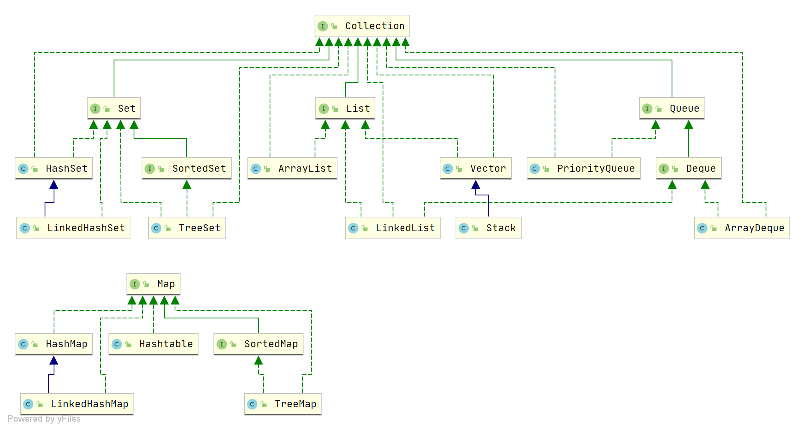

# Java集合

Java 集合包含两大类，一种是存放多个元素的集合，抽象层接口是 `Collection` ，另一种是存放键值对的集合，抽象层接口是 `Map` 。

对于 `Collection` 类的集合，第二层抽象是 `List` 、 `Set` 、 `Queue` ，用于存放不同特性的元素集合。

Java 中的集合框架大致如下，里面只包含了一些比较核心的类：

## Collection

### List

* `ArrayList` ：最常用的 `List` 类，可以随机访问，底层结构是 `Object[]` ，可动态缩扩容。
* `LinkedList` ：双向链表，不可以随机访问，但是对于随意添加和删除元素特别友好。
* `Vector` ：底层结构也是 `Object[]` ，不过与 `ArrayList` 不同，它是线程安全的。
* `Stack` ：继承于 `Vector` ，它也是线程安全的，具有先进后出的栈结构特点。

### Set

* `HashSet` ：最常用的 `Set` 类，底层实际是使用 `HashMap` 实现的，只不过 `value` 值固定。
* `LinkedHashSet` ：在 `HashSet` 的基础上增加了 `LinkedList` 类来实现有序的 `Set` 集合。
* `TreeSet` ：底层红黑树实现。

### Queue

* `ArrayDeque` ：可双向扩容的队列。
* `PriorityQueue` ：`Object[]` 数组来实现小顶堆。
* `DelayQueue` ：
* `BlockingQueue` ：常用于生产者-消费者模型中。

#### Queue 与 Deque

`Queue` 是单端队列，只能从一端插入元素，另一端删除元素，实现上一般遵循 先进先出（FIFO） 规则。

| Queue 接口 |	抛出异常 |	返回特殊值 |
| --- | --- | --- |
| 插入队尾 |	`boolean add(E e)` |	`boolean offer(E e)` |
| 删除队首 |	`E remove()` |	`E poll()` |
| 查询队首元素 |	`E element()` |	`E peek()` |

`Deque` 是双端队列，在队列的两端均可以插入或删除元素。`Deque` 扩展了 `Queue` 的接口, 增加了在队首和队尾进行插入和删除的方法，

| Deque 接口 | 抛出异常 | 返回特殊值 | 备注 |
| --- | --- | --- | --- |
| 插入队首 | `void addFirst(E e)` | `boolean offerFirst(E e)` | |
| 插入队尾 | `void addLast(E e)` | `boolean offerLast(E e)` | `#offer` 等价于 `#offerLast` |
| 删除队首 | `E removeFirst()` | `E pollFirst()` | `#poll` 等价于 `#pollFirst` |
| 删除队尾 | `E removeLast()` | `E pollLast()` | |
| 查询队首元素 | `E getFirst()` | `E peekFirst()` | |
| 查询队尾元素 | `E getLast()` | `E peekLast()` | |
| 入栈元素 | `void push(E e)` | | `#push` 等价于 `#addFirst` |
| 出栈元素 | `E pop()` | | `#pop` 等价于 `#removeFirst` |

事实上，`Deque` 还提供有 `push()` 和 `pop()` 等其他方法，可用于模拟栈。

`ArrayDeque` 和 `LinkedList` 都实现了 `Deque` 接口，两者都具有队列的功能，但两者也有什么区别：

* `ArrayDeque` 是基于可变长的数组和双指针来实现，而 `LinkedList` 则通过链表来实现。
* `ArrayDeque` 不支持存储 `NULL` 数据，但 `LinkedList` 支持。
* `ArrayDeque` 是在 JDK1.6 才被引入的，而 `LinkedList` 早在 JDK1.2 时就已经存在。
* `ArrayDeque` 插入时可能存在扩容过程, 不过均摊后的插入操作依然为 `O(1)`。虽然 `LinkedList` 不需要扩容，但是每次插入数据时均需要申请新的堆空间，均摊性能相比更慢。

从性能的角度上，选用 `ArrayDeque` 来实现队列要比 `LinkedList` 更好。此外，`ArrayDeque` 也可以用于实现栈。

#### BlockingQueue

| BlockingQueue 接口 | 抛出异常 | 返回特殊值 |
| --- | --- | --- |
| 阻塞式插入 | `void put(E e)` | |
| 阻塞式提取 | `E take()` | |

* `ArrayBlockingQueue` ：使用数组实现的有界阻塞队列。在创建时需要指定容量大小，并支持**公平**和**非公平**两种方式的锁访问机制。
* `LinkedBlockingQueue` ：使用单向链表实现的可选有界阻塞队列。在创建时可以指定容量大小，如果不指定则默认为 `Integer.MAX_VALUE` 。和 `ArrayBlockingQueue` 不同的是， 它**仅支持非公平**的锁访问机制。
* `PriorityBlockingQueue` ：支持优先级排序的无界阻塞队列。元素必须实现 `Comparable` 接口或者在构造函数中传入 `Comparator` 对象，并且不能插入 `null` 元素。
* `SynchronousQueue` ：同步队列，是一种不存储元素的阻塞队列。每个插入操作都必须等待对应的删除操作，反之删除操作也必须等待插入操作。因此， `SynchronousQueue` 通常用于线程之间的直接传递数据。
* `DelayQueue` ：延迟队列，其中的元素只有到了其指定的延迟时间，才能够从队列中出队。

## Map

* `HashMap` ：采用数组+链表实现的哈希表，JDK1.8 以后进行了一些优化，对于链表元素太多会转换成红黑树以减少查找时间。
* `LinkedHashMap` ：在 `HashMap` 的基础上增加了 `LinkedList` 类来实现有序的 `Map` 。
* `Hashtable` ：数组+链表组成的，线程安全。但是锁粒度比较粗，更推荐使用 `ConcurrentHashMap` 。需要注意的是，不允许有 `null` 键和 `null` 值。
* `TreeMap` ：底层是红黑树实现的，有序的 `Map` ，它实现了 `NavigableMap` 接口和 `SortedMap` 接口。
* `ConcurrentHashMap` ：线程安全的哈希表，采用分段式细粒度锁拥有更好的性能。

## 参考资料

* [JavaGuide - Java集合常见面试题总结(上)](https://javaguide.cn/java/collection/java-collection-questions-01.html)