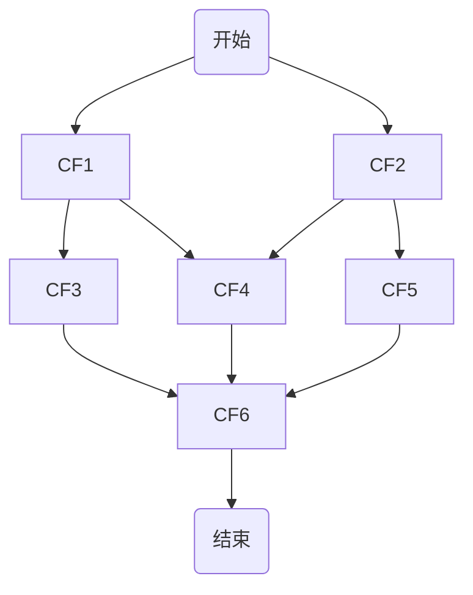
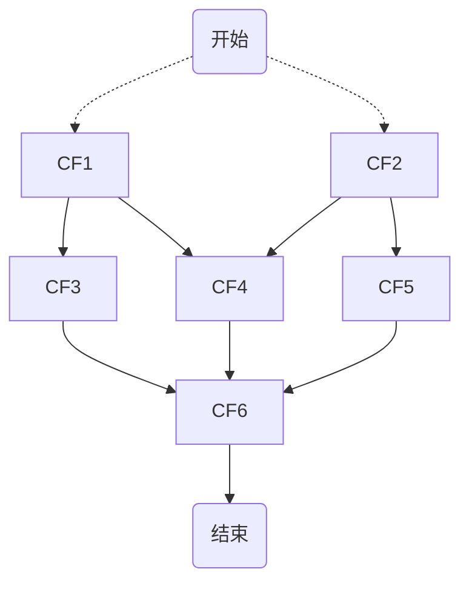
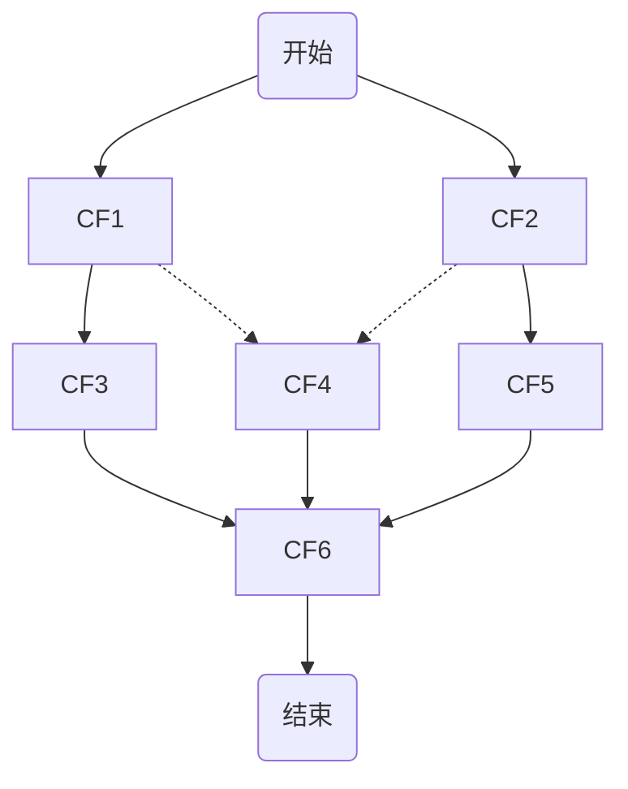
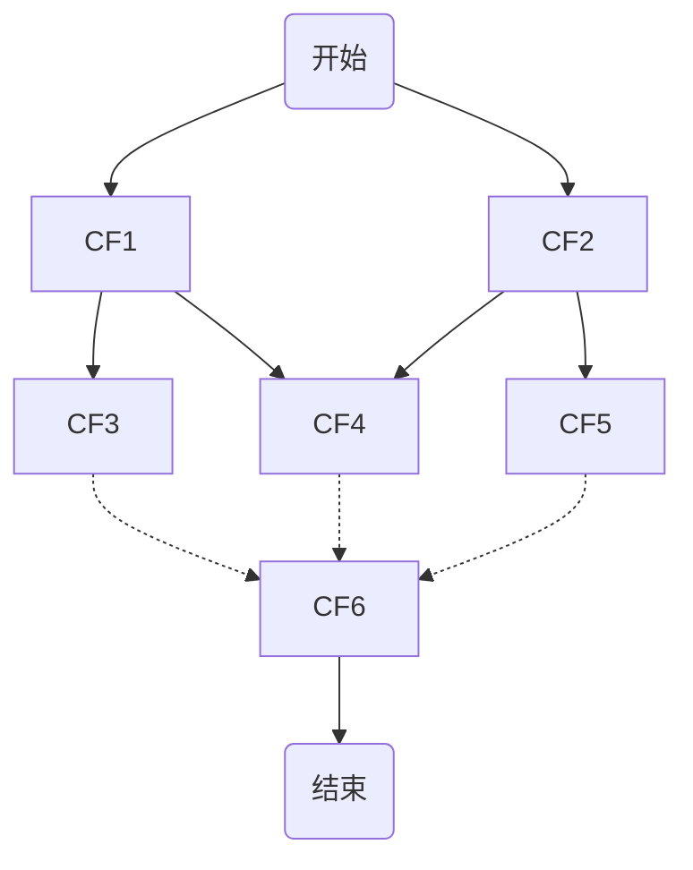

# Future 知识回顾

**`Future` 接口用于代表异步计算的结果**，通过 `Future` 接口提供的方法可以查看异步计算是否执行完成，或者等待执行结果并获取执行结果，同时还可以取消执行。以下是 `Future` 接口的方法：

* **`get()`**：获取任务执行结果，如果任务还没完成则会阻塞等待直到任务执行完成。如果任务被取消则会抛出 `CancellationException` 异常，如果任务执行过程发生异常则会抛出 `ExecutionException` 异常，如果阻塞等待过程中被中断则会抛出 `InterruptedException` 异常。
* **`get(long timeout,Timeunit unit)`**：带超时时间的 `get()` 方法，如果阻塞等待过程中超时则会抛出 `TimeoutException` 异常。
* **`cancel()`**：用于取消异步任务的执行。如果异步任务已经完成或者已经被取消，或者由于某些原因不能取消，则会返回 `false` 。如果任务还没有被执行，则会返回 `true` 并且异步任务不会被执行。如果任务已经开始执行了但是还没有执行完成，若 `mayInterruptIfRunning` 为 `true` ，则会立即中断执行任务的线程并返回 `true，若` `mayInterruptIfRunning` 为 `false` ，则会返回 `true` 且不会中断任务执行线程。
* **`isCanceled()`**：判断任务是否被取消，如果任务在结束(正常执行结束或者执行异常结束)前被取消则返回 `true` ，否则返回 `false` 。
* **`isDone()`**：判断任务是否已经完成，如果完成则返回 `true` ，否则返回 `false` 。需要注意的是：任务执行过程中发生异常、任务被取消也属于任务已完成，也会返回 `true` 。

假设我们有个查询商品信息的需求，需要合并①获取商品基本信息 ②获取商品图片信息 ③获取商品促销活动信息 ④获取商品各种类的基本信息，使用 `Future` 的实现样例如下：

```java
public static void main(String[] args) {
	// 快速创建线程池
	ExecutorService executorService = Executors.newFixedThreadPool(4);
	// 获取商品基本信息（可以使用Lambda表达式简化Callable接口，这里为了便于观察不使用）
	Future<String> future1 = executorService.submit(new Callable<String>() {
		@Override
		public String call() throws Exception {
			return "获取到商品基本信息";
		}
	});
	// 获取商品图片信息
	Future<String> future2 = executorService.submit(new Callable<String>() {
		@Override
		public String call() throws Exception {
			return "获取商品图片信息";
		}
	});
	// 获取商品促销信息
	Future<String> future3 = executorService.submit(new Callable<String>() {
		@Override
		public String call() throws Exception {
			return "获取商品促销信息";
		}
	});
	// 获取商品各种类基本信息
	Future<String> future4 = executorService.submit(new Callable<String>() {
		@Override
		public String call() throws Exception {
			return "获取商品各种类基本信息";
		}
	});
        // 获取结果
	try {
		System.out.println(future1.get());
		System.out.println(future2.get());
		System.out.println(future3.get());
		System.out.println(future4.get());
	} catch (InterruptedException | ExecutionException e) {
		e.printStackTrace();
	} finally {
		executorService.shutdown();
	}
}
```

`Future` 接口的弊端：

* **不支持手动完成**：当提交了一个任务，但是执行太慢了，通过其他路径已经获取到了任务结果，现在没法把这个任务结果通知到正在执行的线程，所以必须主动取消或者一直等待它执行完成。
* **不支持进一步的非阻塞调用**：通过 `Future#get()` 方法会一直阻塞到任务完成，但是想在获取任务之后执行额外的任务，因为 `Future` 不支持回调函数，所以无法实现这个功能。
* **不支持链式调用**：对于 `Future` 的执行结果，想继续传到下一个 `Future` 处理使用，从而形成一个链式的pipline调用，这在 `Future` 中无法实现。
* **不支持多个 `Future` 合并**：比如有10个 `Future` 并行执行，想在所有的 `Future` 运行完毕之后，执行某些函数，是无法通过 `Future` 实现的。
* **不支持异常处理**： `Future` 的API没有任何的异常处理的api，所以在异步运行时，如果出了异常问题不好定位。

使用 `Future` 接口可以通过 `get()` 阻塞式获取结果或者通过轮询＋ `isDone()` 非阻塞式获取结果，但是前一种方法会阻塞，后一种会耗费CPU资源，所以JDK的 `Future` 接口实现异步执行对获取结果不太友好，所以在JDK8时推出了 `CompletableFuture` 实现异步编排。

# CompletableFuture 和 Future 的对比

`CompletableFuture` 是JDK8中新增的异步编程工具类，它是 `Future` 的扩展，提供了更加强大的异步编程能力。主要区别如下：

1. `CompletableFuture` 可以手动设置结果，而 `Future` 只能被动获取结果。
2. `CompletableFuture` 支持链式调用，可以将多个异步操作串联起来，而 `Future` 不支持。
3. `CompletableFuture` 可以通过回调函数处理异步操作的结果，而 `Future` 需要通过轮询或阻塞等方式获取结果。
4. `CompletableFuture` 提供了更多的操作方法，比如 `whenComplete`、`handle`、`thenApply`、`thenCombine`等，而 `Future` 只提供了 `get` 和 `isDone` 方法。
5. `CompletableFuture` 支持异常处理，可以通过 `exceptionally`、`handle` 等方法处理异常，而 `Future` 只能通过 `try-catch` 块处理异常。

综上所述， `CompletableFuture` 比 `Future` 更加灵活和强大，可以更方便地进行异步编程。

# CompletableFuture 提供的API

JDK8中新增加了一个包含50个方法左右的类 `CompletableFuture` ，提供了非常强大的 `Future` 的扩展功能，可以帮助我们简化异步编程的复杂性，提供了函数式编程的能力，可以通过回调的方式处理计算结果，并且提供了转换和组合 `CompletableFuture` `的方法。CompletableFuture` 类实现了 `Future` 接口和 `CompletionStage` 接口。 `CompletionStage` 的方法可参考源码进行查看。

```java
public class CompletableFuture<T> implements Future<T>, CompletionStage<T> {
    ...
}
```

## CompletableFuture 的创建

```java
// 无返回值或固定值构造
new CompletableFuture<>();
public static <U> CompletableFuture<U> completedFuture(U value);

// 无返回值Runnable构造
public static CompletableFuture<Void> runAsync(Runnable runnable);
public static CompletableFuture<Void> runAsync(Runnable runnable, Executor executor);

// 有返回值Supplier构造
public static <U> CompletableFuture<U> supplyAsync(Supplier<U> supplier)
public static <U> CompletableFuture<U> supplyAsync(Supplier<U> supplier, Executor executor);
```

## 获取异步执行结果

除了 `Future` 提供的方法之外，还有：

```java
// 会立刻获取结果不会阻塞等待。如果任务完成则直接返回执行完成后的结果，如果任务没有完成，则返回调用方法时传入的参数valueIfAbsent值。
public T getNow(T valueIfAbsent);

// 类似于get()方法，只是不会抛出异常。
public T join();

// 主动触发计算，返回异步是否执行完毕。如果异步执行完成，调用get()的结果是计算结果，否则是参数给定的value结果。
public boolean complete(T value);
```

## 对异步执行结果的处理

```java
// 等待前面任务执行完再执行当前action处理，action的第一个参数是计算结果，第二个是异常
public CompletableFuture<T> whenComplete(BiConsumer<? super T, ? super Throwable> action);
public CompletableFuture<T> whenCompleteAsync(BiConsumer<? super T, ? super Throwable> action);
public CompletableFuture<T> whenCompleteAsync(BiConsumer<? super T, ? super Throwable> action, Executor executor);

// 区别于complete的点是，不关系异常
public CompletableFuture<Void> thenAccept(Consumer<? super T> action);
public CompletableFuture<Void> thenAcceptAsync(Consumer<? super T> action);
public CompletableFuture<Void> thenAcceptAsync(Consumer<? super T> action, Executor executor);

// 对异步计算结果的二次计算
public <U> CompletableFuture<U> thenApply(Function<? super T,? extends U> fn);
public <U> CompletableFuture<U> thenApplyAsync(Function<? super T,? extends U> fn);
public <U> CompletableFuture<U> thenApplyAsync(Function<? super T,? extends U> fn, Executor executor);
```

### 异常处理

```java
// 中断型地异常处理，相当于try-catch
public CompletableFuture<T> exceptionally(Function<Throwable, ? extends T> fn);
// 非中断型地异常处理，异常发生之后会继续处理并返回结果，类似于try-finally执行
public <U> CompletableFuture<U> handle(BiFunction<? super T, Throwable, ? extends U> fn);
public <U> CompletableFuture<U> handleAsync(BiFunction<? super T, Throwable, ? extends U> fn);
public <U> CompletableFuture<U> handleAsync(BiFunction<? super T, Throwable, ? extends U> fn, Executor executor);
```

## 多任务执行

### 任务串行化

```java
public CompletableFuture<Void> thenRun(Runnable action);
public CompletableFuture<Void> thenRunAsync(Runnable action);
public CompletableFuture<Void> thenRunAsync(Runnable action, Executor executor);

// 实现两组任务按前后顺序执行，例如A.thenCompose(B)，相当于顺序执行A、B
public <U> CompletableFuture<U> thenCompose(Function<? super T, ? extends CompletionStage<U>> fn);
public <U> CompletableFuture<U> thenComposeAsync(Function<? super T, ? extends CompletionStage<U>> fn);
public <U> CompletableFuture<U> thenComposeAsync(Function<? super T, ? extends CompletionStage<U>> fn, Executor executor);
```

### 任务赛跑，取最快的任务

```java
// 比较两组任务的执行速度，谁先执行完就用谁的执行结果。
public <U> CompletableFuture<U> applyToEither(CompletionStage<? extends T> other, Function<? super T, U> fn);
public <U> CompletableFuture<U> applyToEitherAsync(CompletionStage<? extends T> other, Function<? super T, U> fn);
public <U> CompletableFuture<U> applyToEitherAsync(CompletionStage<? extends T> other, Function<? super T, U> fn, Executor 
executor);
// 类似于applyToEither，只不过直接消费，没有返回值
public CompletableFuture<Void> acceptEither(CompletionStage<? extends T> other, Consumer<? super T> action);
public CompletableFuture<Void> acceptEitherAsync(CompletionStage<? extends T> other, Consumer<? super T> action);
public CompletableFuture<Void> acceptEitherAsync(CompletionStage<? extends T> other, Consumer<? super T> action, Executor executor);
// 
CompletableFuture<Void> runAfterEither(CompletionStage<?> other, Runnable action);
CompletableFuture<Void> runAfterEitherAsync(CompletionStage<?> other, Runnable action);
CompletableFuture<Void> runAfterEitherAsync(CompletionStage<?> other, Runnable action, Executor executor);
```

### 两任务结果合并

```java
// 两组任务都完成后，将两组任务的执行结果一起交给当前方法的BiFunction处理
public <U,V> CompletableFuture<V> thenCombine(CompletionStage<? extends U> other, BiFunction<? super T,? super U,? extends V> fn);
public <U,V> CompletableFuture<V> thenCombineAsync(CompletionStage<? extends U> other, BiFunction<? super T,? super U,? extends V> fn);
public <U,V> CompletableFuture<V> thenCombineAsync(CompletionStage<? extends U> other, BiFunction<? super T,? super U,? extends V> fn, Executor executor);

// 类似于thenCombine，只不过直接消费，没有返回值
public <U> CompletableFuture<Void> thenAcceptBoth(CompletionStage<? extends U> other, BiConsumer<? super T, ? super U> action);
public <U> CompletableFuture<Void> thenAcceptBothAsync(CompletionStage<? extends U> other, BiConsumer<? super T, ? super U> action);
public <U> CompletableFuture<Void> thenAcceptBothAsync(CompletionStage<? extends U> other, BiConsumer<? super T, ? super U> action, Executor executor);

// 两个任务都执行完再执行其他action
public CompletableFuture<Void> runAfterBoth(CompletionStage<?> other, Runnable action);
public CompletableFuture<Void> runAfterBothAsync(CompletionStage<?> other, Runnable action);
public CompletableFuture<Void> runAfterBothAsync(CompletionStage<?> other, Runnable action, Executor executor);
```

### 多任务组合

```java
// 等待所有的任务执行完毕再返回
public static CompletableFuture<Void> allOf(CompletableFuture<?>... cfs);
// 任何一个任务完成就返回
public static CompletableFuture<Object> anyOf(CompletableFuture<?>... cfs);
```

## API总结

* 后跟无返回值Consumer的关键词方法：**`when`, `accept`, `run`**。
* 后跟有返回值的方法： **`apply`, `handle`, `compose`, `combine`**。
* 两个任务的联合操作：**`both`, `compose`, `combine`, `either`**。

## 使用样例

```java
/**
 * 该方法用于获取单个商品的所有信息
 * 1. 商品的基本信息
 * 2. 商品的图片信息
 * 3. 商品的销售属性组合
 * 4. 商品的各种分类基本信息
 * 5. 商品的促销信息
 */
@Override
public SkuItemVo item(Long skuId) throws ExecutionException, InterruptedException {
	// 创建商品Vo通过各个任务去完善Vo的信息
	SkuItemVo skuItemVo = new SkuItemVo();
	
	// 获取商品基本信息 查询到后设置进Vo中，返回基本信息给后续任务消费 （使用自定义的线程池进行异步）
	CompletableFuture<SkuInfoEntity> infoFuture = CompletableFuture.supplyAsync(() -> {
		SkuInfoEntity info = this.getById(skuId);
		skuItemVo.setInfo(info);
		return info;
	}, executor);

	// 获取商品的图片信息 获取后设置进Vo中，此处不需要消费图片信息，也不需要返回结果。所以使用runAsync即可
	CompletableFuture<Void> imageFuture = CompletableFuture.runAsync(() -> {
		List<SkuImagesEntity> imagesEntities = skuImagesService.getImagesBySkuId(skuId);
		skuItemVo.setImages(imagesEntities);
	}, executor);

	// 获取商品销售属性 因为要利用之前查询到的基本信息，但后续任务不需要消费销售属性（不需要返回结果），所以使用thenAcceptAsync消费之前的基本信息，不返回销售信息。
	CompletableFuture<Void> saleAttrFuture = infoFuture.thenAcceptAsync((res) -> {
		List<SkuItemSaleAttrVo> saleAttrVos = skuSaleAttrValueService.getSaleAttrBySpuId(res.getSpuId());
		skuItemVo.setSaleAttr(saleAttrVos);
	}, executor);

	// 获取商品各分类基本信息，同样要消费之前的基本信息，但无需返回，所以使用thenAcceptAsync即可
	CompletableFuture<Void> descFuture = infoFuture.thenAcceptAsync((res) -> {
		SpuInfoDescEntity spuInfoDescEntity = spuInfoDescService.getById(res.getSpuId());
		skuItemVo.setDesc(spuInfoDescEntity);
	}, executor);

	// 获取商品的促销信息 这个也不需要消费之前任务的结果，也不需要返回结果。所以直接使用runAsync即可
	CompletableFuture<Void> seckillFuture = CompletableFuture.runAsync(() -> {
		R skuSeckilInfo = seckillFeignService.getSkuSeckilInfo(skuId);
		if (skuSeckilInfo.getCode() == 0) {
			SeckillSkuVo seckilInfoData = skuSeckilInfo.getData("data", new TypeReference<SeckillSkuVo>() {
			});
			skuItemVo.setSeckillSkuVo(seckilInfoData);

			if (seckilInfoData != null) {
				long currentTime = System.currentTimeMillis();
				if (currentTime > seckilInfoData.getEndTime()) {
					skuItemVo.setSeckillSkuVo(null);
				}
			}
		}
	}, executor);

	// 使用allOf()组合所有任务，并且使用get()阻塞，等待所有任务完成。
        // 补充：infoFuture不能放入allOf中，因为allOf是并行无序执行（需要多个条件是无依赖性的）的，当上面任务中有需要消费infoFuture的结果，所以需要先执行infoFuture。
	CompletableFuture.allOf(imageFuture，saleAttrFuture,descFuture,seckillFuture).get();
	
	// 最后返回商品Vo
	return skuItemVo;
}
```

# 原理详解

## 任务依赖

如下是 `CompletableFuture` 任务的依赖树关系图样例，描述了6个任务之间的依赖关系，任务之间有串行，也有并行。



根据 `CompletableFuture` 依赖的数量，可以把依赖分为几种类型：零依赖、一元依赖、二元依赖和多元依赖。

1. 零依赖



2. 一元依赖

 `CompletableFuture` 中的方法 `thenApply`、`thenAccept`、`thenCompose` 就可以表示一元依赖关系。


3. 二元依赖

 `CompletableFuture` 中的方法 `thenCombine` 就可以表示二元依赖关系。



4. 多元依赖

 `CompletableFuture` 中的方法 `allOf`、`anyOf` 就可以表示多元依赖关系。


# 参考资料

* [掘金 - CompletableFuture实现异步编排](https://juejin.cn/post/7193589084915236901)
* [掘金 - 搞定 CompletableFuture，并发异步编程和编写串行程序还有什么区别？](https://juejin.cn/post/6854573213108666381)
* [简书 - CompletableFuture原理解析](https://www.jianshu.com/p/abfa29c01e1d)
* [美团技术 - CompletableFuture原理与实践-外卖商家端API的异步化](https://tech.meituan.com/2022/05/12/principles-and-practices-of-completablefuture.html)