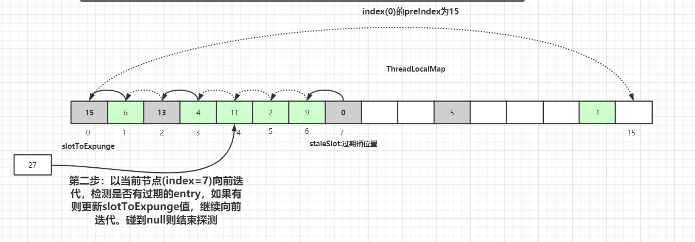
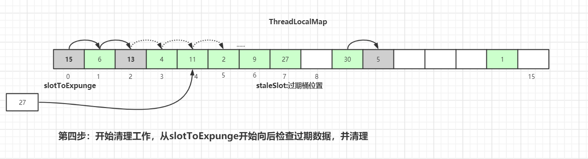

# ThreadLocal

## 介绍

> This class provides thread-local variables. These variables differ from their normal counterparts in that each thread that accesses one (via its get or set method) has its own, independently initialized copy of the variable. ThreadLocal instances are typically private static fields in classes that wish to associate state with a thread (e.g., a user ID or Transaction ID).

`ThreadLocal` 是一个将在多线程中为每一个线程创建单独的变量副本的类; 当使用 `ThreadLocal` 来维护变量时, `ThreadLocal` 会为每个线程创建单独的变量副本, 避免因多线程操作共享变量而导致的数据不一致的情况。

## 使用场景

## 数据结构

### ThreadLocal数据结构

`Thread` 类有一个类型为 `ThreadLocal.ThreadLocalMap` 的实例变量 `threadLocals` ，也就是说每个线程有一个自己的 `ThreadLocalMap` 。`ThreadLocalMap` 有自己的独立实现，可以简单地将它的 `key` 视作 `ThreadLocal` （实际上 `key` 并不是 `ThreadLocal` 本身，而是它的一个弱引用）， `value` 为代码中放入的值。每个线程在往 `ThreadLocal` 里放值的时候，都会往自己的 `ThreadLocalMap` 里存，读也是以 `ThreadLocal` 作为引用，在自己的 `map` 里找对应的 `key` ，从而实现了线程隔离。 `ThreadLocalMap` 有点类似 `HashMap` 的结构，只是 `HashMap` 是由数组+链表实现的，而 `ThreadLocalMap` 中并没有链表结构。我们还要注意 `Entry` ， 它的 `key` 是 `ThreadLocal<?> k `，继承自 `WeakReference` ，也就是我们常说的弱引用类型。


下面是来自 `ThreadLocal` 的部分核心源码，可以很清晰地看出上图的原理：

```java
public class ThreadLocal<T> {
    public T get() {
        Thread t = Thread.currentThread();
        ThreadLocalMap map = getMap(t);
        if (map != null) {
            ThreadLocalMap.Entry e = map.getEntry(this);
            if (e != null) {
                T result = (T)e.value;
                return result;
            }
        }
        return setInitialValue();
    }

    ThreadLocalMap getMap(Thread t) {
        return t.threadLocals;
    }

    public void set(T value) {
        Thread t = Thread.currentThread();
        ThreadLocalMap map = getMap(t);
        if (map != null) {
            map.set(this, value);
        } else {
            createMap(t, value);
        }
    }

    void createMap(Thread t, T firstValue) {
        t.threadLocals = new ThreadLocalMap(this, firstValue);
    }

    public void remove() {
         ThreadLocalMap m = getMap(Thread.currentThread());
         if (m != null) {
             m.remove(this);
         }
    }
}
```

### ThreadLocalMap数据结构

```java
static class ThreadLocalMap {
    /**
     * The initial capacity -- MUST be a power of two.
     */
    private static final int INITIAL_CAPACITY = 16;

    /**
     * The table, resized as necessary.
     * table.length MUST always be a power of two.
     */
    private Entry[] table;

    /**
     * The number of entries in the table.
     */
    private int size = 0;

    /**
     * The next size value at which to resize.
     */
    private int threshold; // Default to 0

    static class Entry extends WeakReference<ThreadLocal<?>> {
        /** The value associated with this ThreadLocal. */
        Object value;

        Entry(ThreadLocal<?> k, Object v) {
            super(k);
            value = v;
        }
    }
}
```

### ThreadLocal的Entry设计


#### 为什么Entry要使用弱引用？

弱引用对象有更短暂的生命周期，不管内存空间是否剩余，都有可能会被回收。

假如每个 `key` 都强引用指向 `ThreadLocal` 的对象，也就是上图虚线那里是个强引用，那么这个 `ThreadLocal` 对象就会因为和 `Entry` 对象存在强引用关联而无法被GC回收，造成**内存泄漏**，除非线程结束后，线程被回收了， `map` 也跟着回收。

#### 为什么还是会出现内存泄露？

当把 `ThreadLocal` 对象的引用置为 `null` 后，没有任何强引用指向内存中的 `ThreadLocal` 实例，`threadLocals` 的 `key` 是它的弱引用，故它将会被GC回收。

但线程中 `threadLocals` 里的 `value` 却没有被回收，因为存在着一条从当前线程对象连接过来的强引用，且因为无法再通过 `ThreadLocal` 对象的 `get` 方法获取到这个 `value` ，它永远不会被访问到了，所以还存在内存泄漏问题。
同样的，只有在当前线程结束后，线程对象的引用不再存在于栈中，强引用断开，内存中的 Current `Thread`、`ThreadLocalMap`、`value` 才会全部被GC回收。

解决内存泄露的方法：当线程的某个 `ThreadLocal` 对象使用完了，马上调用 `remove` 方法，删除 `Entry` 对象。只要这个线程对象及时被GC回收，这个内存泄露问题影响不大，只发生在 `ThreadLocal` 对象的引用设为 `null` 到线程结束的这段时间内。但在使用线程池的时候，线程结束是不会被销毁的，会再次使用，就可能出现真正的内存泄露。

#### 在 ThreadLocal.get()的时候，发生GC之后，key 是否为null？

网上有相关的源码调试可以进行测：[CSDN - 测试ThreadLocal 在gc后引发的threadLocalMap的key为null,但value不为null的情况](https://blog.csdn.net/thewindkee/article/details/103726942)。

`ThreadLocal.get()` 操作， `ThreadLocal` 的对象引用被Stack持有，此时还是有强引用存在的，所以 `key` 并不为 `null` ，也就是不会被GC回收，如下图所示：


## ThreadLocal底层实现

### ThreadLocal的Hash算法

```java
public class ThreadLocal<T> {
    private final int threadLocalHashCode = nextHashCode();
    private static AtomicInteger nextHashCode = new AtomicInteger();
    private static final int HASH_INCREMENT = 0x61c88647;

    private static int nextHashCode() {
        return nextHashCode.getAndAdd(HASH_INCREMENT);
    }

    static class ThreadLocalMap {
        ThreadLocalMap(ThreadLocal<?> firstKey, Object firstValue) {
            table = new Entry[INITIAL_CAPACITY];
            // Entry偏移量hash计算方式
            int i = firstKey.threadLocalHashCode & (INITIAL_CAPACITY - 1);

            table[i] = new Entry(firstKey, firstValue);
            size = 1;
            setThreshold(INITIAL_CAPACITY);
        }
    }
}
```

`ThreadLocalMap` 中hash算法很简单，`firstKey.threadLocalHashCode & (INITIAL_CAPACITY - 1)` 的值就是当前 `key` 在散列表中对应的数组下标位置。

每当创建一个 `ThreadLocal` 对象，这个 `ThreadLocal.nextHashCode` 这个值就会增长 `0x61c88647` 。这个值是**斐波那契数**，也叫**黄金分割数**，可以使散列效果非常好。

### ThreadLocalMap的Hash冲突

虽然 `ThreadLocalMap` 中使用了黄金分割数来作为 `hash` 计算因子，大大减少了 `hash` 冲突的概率，但是仍然会存在冲突。`HashMap` 中解决冲突的方法是在数组上构造一个链表结构，冲突的数据挂载到链表上，如果链表长度超过一定数量则会转化成红黑树。而 `ThreadLocalMap` 中并没有链表结构，所以这里不能使用 `HashMap` 解决冲突的方式了。


> 注明：示例图中，绿色块Entry代表正常数据，灰色块代表Entry的key值为null，已被垃圾回收。白色块表示Entry为null。

如上图所示，如果我们插入一个 `value=27` 的数据，通过 `hash` 计算后应该落入槽位 `4` 中，而槽位 `4` 已经有了 `Entry` 数据。此时就会线性向后查找，一直找到 `Entry` 为 `null` 的槽位才会停止查找，将当前元素放入此槽位中。当然迭代过程中还有其他的情况，比如遇到了 `Entry` 不为 `null` 且 `key` 值相等的情况，还有 `Entry` 中的 `key` 值为 `null` 的情况等等都会有不同的处理，后面会一一详细讲解。

这里还画了一个 `Entry` 中的 `key` 为 `null` 的数据（`Entry=2` 的灰色块数据），因为 `key` 值是弱引用类型，所以会有这种数据存在。在 `set` 过程中，如果遇到了 `key` 过期的 `Entry` 数据，实际上是会进行一轮探测式清理操作的，具体操作方式后面会讲到。

### ThreadLocalMap的get原理

下面是 `ThreadLocalMap.get()` 方法的核心代码实现：

```java
    private Entry getEntry(ThreadLocal<?> key) {
        int i = key.threadLocalHashCode & (table.length - 1);
        Entry e = table[i];
        if (e != null && e.get() == key)
            return e;
        else
            return getEntryAfterMiss(key, i, e);
    }
    
    private Entry getEntryAfterMiss(ThreadLocal<?> key, int i, Entry e) {
        Entry[] tab = table;
        int len = tab.length;

        while (e != null) {
            ThreadLocal<?> k = e.get();
            if (k == key)
                return e;
            if (k == null)
                expungeStaleEntry(i);
            else
                i = nextIndex(i, len);
            e = tab[i];
        }
        return null;
    }
```

第一种情况： 通过查找 `key` 值计算出散列表中 `slot` 位置，然后该 `slot` 位置中的 `Entry.key` 和查找的 `key` 一致，则直接返回：


第二种情况： `slot` 位置中的 `Entry.key` 和要查找的 `key` 不一致。我们以 `get(ThreadLocal1)` 为例，通过 `hash` 计算后，正确的 `slot` 位置应该是 `4` ，而 `index=4` 的槽位已经有了数据，且 `key` 值不等于 `ThreadLocal1` ，所以需要继续往后迭代查找。


迭代到 `index=5` 的数据时，此时 `Entry.key=null` ，触发一次**探测式数据回收**操作，即执行 `expungeStaleEntry()` 方法（参考后续的介绍），执行完后，`index 5,8`的数据都会被回收，而`index 6,7`的数据都会前移。`index 6,7`前移之后，继续从 `index=5` 往后迭代，于是就在 `index=5` 找到了 `key` 值相等的 `Entry` 数据，如下图所示：


### ThreadLocalMap的set原理

下面是 `ThreadLocalMap.set()` 方法的核心代码实现：

```java
    private void set(ThreadLocal<?> key, Object value) {
        // We don't use a fast path as with get() because it is at
        // least as common to use set() to create new entries as
        // it is to replace existing ones, in which case, a fast
        // path would fail more often than not.

        Entry[] tab = table;
        int len = tab.length;
        int i = key.threadLocalHashCode & (len-1);

        for (Entry e = tab[i]; e != null; e = tab[i = nextIndex(i, len)]) {
            ThreadLocal<?> k = e.get();
            if (k == key) {
                e.value = value;
                return;
            }
            if (k == null) {
                replaceStaleEntry(key, value, i);
                return;
            }
        }

        tab[i] = new Entry(key, value);
        int sz = ++size;
        if (!cleanSomeSlots(i, sz) && sz >= threshold)
            rehash();
    }
```

往 `ThreadLocalMap` 中 `set` 数据（新增或者更新数据）分为好几种情况，针对不同的情况我们画图来说明。

第一种情况： 通过hash计算后的槽位对应的Entry数据为空，这里直接将数据放到该槽位即可：


第二种情况： 槽位数据不为空，`key` 值与当前 `ThreadLocal` 通过 `hash` 计算获取的 `key` 值一致：这里直接更新该槽位的数据。


第三种情况： 槽位数据不为空，往后遍历过程中，在找到 `Entry` 为 `null` 的槽位之前，没有遇到 `key` 过期的 `Entry` 。遍历散列数组，线性往后查找，如果找到 `Entry` 为 `null` 的槽位，则将数据放入该槽位中，或者往后遍历过程中，遇到了 `key` 值相等的数据，直接更新即可。


第四种情况： 槽位数据不为空，往后遍历过程中，在找到 `Entry` 为 `null` 的槽位之前，遇到 `key` 过期的 `Entry` ，如下图，往后遍历过程中，遇到了 `index=7` 的槽位数据 Entry 的 `key=null`：


散列数组下标为 `7` 位置对应的 `Entry` 数据 `key` 为 `null` ，表明此数据 `key` 值已经被垃圾回收掉了。此时就会执行 `replaceStaleEntry()` 方法，该方法含义是替换过期数据的逻辑，以 `index=7` 位起点开始遍历，进行**探测式数据清理**工作（后一章节会详细介绍），最后替换新的值 。

替换完成后也是进行过期元素清理工作，清理工作主要是有两个方法：`expungeStaleEntry()` 和 `cleanSomeSlots()` ，具体细节后续章节详细介绍。

### ThreadLocalMap清理机制

`ThreadLocalMap` 过期 `key` 的两种清理方式：**探测式清理(`expungeStaleEntry()`)**、**启发式清理(`cleanSomeSlots()`)**。

#### 探测式清理

##### replaceStaleEntry()

该方法主要用在 `ThreadLocalMap.set()` 方法，用来清理数据，并进行填充 `Entry`。

```java
    private void replaceStaleEntry(ThreadLocal<?> key, Object value, int staleSlot) {
        Entry[] tab = table;
        int len = tab.length;
        Entry e;

        // Back up to check for prior stale entry in current run.
        // We clean out whole runs at a time to avoid continual
        // incremental rehashing due to garbage collector freeing
        // up refs in bunches (i.e., whenever the collector runs).
        int slotToExpunge = staleSlot;
        for (int i = prevIndex(staleSlot, len); (e = tab[i]) != null; i = prevIndex(i, len))
            if (e.get() == null)
                slotToExpunge = i;

        // Find either the key or trailing null slot of run, whichever
        // occurs first
        for (int i = nextIndex(staleSlot, len); (e = tab[i]) != null; i = nextIndex(i, len)) {
            ThreadLocal<?> k = e.get();

            // If we find key, then we need to swap it
            // with the stale entry to maintain hash table order.
            // The newly stale slot, or any other stale slot
            // encountered above it, can then be sent to expungeStaleEntry
            // to remove or rehash all of the other entries in run.
            if (k == key) {
                e.value = value;
                tab[i] = tab[staleSlot];
                tab[staleSlot] = e;

                // Start expunge at preceding stale entry if it exists
                if (slotToExpunge == staleSlot)
                    slotToExpunge = i;
                cleanSomeSlots(expungeStaleEntry(slotToExpunge), len);
                return;
            }

            // If we didn't find stale entry on backward scan, the
            // first stale entry seen while scanning for key is the
            // first still present in the run.
            if (k == null && slotToExpunge == staleSlot)
                slotToExpunge = i;
        }

        // If key not found, put new entry in stale slot
        tab[staleSlot].value = null;
        tab[staleSlot] = new Entry(key, value);

        // If there are any other stale entries in run, expunge them
        if (slotToExpunge != staleSlot)
            cleanSomeSlots(expungeStaleEntry(slotToExpunge), len);
    }
```

1. 假定散列数组下标为 `7` 位置对应的 `Entry` 数据 `key` 为 `null` ：


2. 以当前 `staleSlot` 开始向前迭代查找，找其他过期的数据，然后更新过期数据起始扫描下标 `slotToExpunge` 。`for` 循环迭代，直到碰到 `Entry` 为 `null` 结束。初始化探测式清理过期数据扫描的开始位置：`slotToExpunge = staleSlot = 7` 。以当前节点(`index=7`)向前迭代，检测是否有过期的 `Entry` 数据，如果有则更新 `slotToExpunge` 值。碰到 `null` 则结束探测。以上图为例 `slotToExpunge` 被更新为 `0` 。



3. 接着开始以 `staleSlot` 位置(`index=7`)向后迭代，如果找到了相同 `key` 值的 `Entry` 数据：


4. 从当前节点 `staleSlot` 向后查找 `key` 值相等的 `Entry` 元素，找到后更新 `Entry` 的值并交换 `staleSlot` 元素的位置( `staleSlot` 位置为过期元素)，更新 `Entry` 数据，然后开始进行过期 `Entry` 的清理工作，如下图所示：



5. 向后遍历过程中，如果没有找到相同 `key` 值的 `Entry` 数据，直到 `Entry` 为 `null` 则停止寻找。创建新的 `Entry` ，替换 `table[stableSlot]` 位置：


##### expungeStaleEntry()

探测式清理 `expungeStaleEntry` 方法，遍历散列数组，从开始位置向后探测清理过期数据，将过期数据的 `Entry` 设置为 `null` ，沿途中碰到未过期的数据则将此数据 `rehash` 后重新在 `table` 数组中定位，如果定位的位置已经有了数据，则会将未过期的数据放到最靠近此位置的 `Entry=null` 的桶中，使 `rehash` 后的 `Entry` 数据距离正确的桶的位置更近一些。

```java
    private int expungeStaleEntry(int staleSlot) {
        Entry[] tab = table;
        int len = tab.length;

        // expunge entry at staleSlot
        tab[staleSlot].value = null;
        tab[staleSlot] = null;
        size--;

        // Rehash until we encounter null
        Entry e;
        int i;
        for (i = nextIndex(staleSlot, len); (e = tab[i]) != null; i = nextIndex(i, len)) {
            ThreadLocal<?> k = e.get();
            if (k == null) {
                e.value = null;
                tab[i] = null;
                size--;
            } else {
                int h = k.threadLocalHashCode & (len - 1);
                if (h != i) {
                    tab[i] = null;
                    // Unlike Knuth 6.4 Algorithm R, we must scan until
                    // null because multiple entries could have been stale.
                    while (tab[h] != null)
                        h = nextIndex(h, len);
                    tab[h] = e;
                }
            }
        }
        return i;
    }
```

1. 如下图，`set(27)` 经过 `hash` 计算后应该落到 `index=4` 的桶中，由于 `index=4` 桶已经有了数据，所以往后迭代最终数据放入到 `index=7` 的桶中，放入后一段时间后 `index=5` 中的 `Entry` 数据 `key` 变为了 `null` 。如果再有其他数据 `set` 到 `map` 中，就会触发探测式清理操作。


2. 执行探测式清理后，`index=5` 的数据被清理掉，继续往后迭代，到 `index=7` 的元素时，经过 `rehash` 后发现该元素正确的 `index=4` ，而此位置已经有了数据，往后查找离 `index=4` 最近的 `Entry=null` 的节点(刚被探测式清理掉的数据：`index=5` )，找到后移动 `index=7` 的数据到 `index=5` 中，此时桶的位置离正确的位置 `index=4` 更近了。经过一轮探测式清理后， `key` 过期的数据会被清理掉，没过期的数据经过 `rehash` 重定位后所处的桶位置理论上更接近 `i = key.hashCode & (tab.len - 1)` 的位置。这种优化会提高整个散列表查询性能。


#### 启发式清理

探测式清理是以当前 `Entry` 往后清理，遇到值为 `null` 则结束清理，属于线性探测清理。而启发式清理被作者定义为：`Heuristically scan some cells looking for stale entries.`。

```java
    private boolean cleanSomeSlots(int i, int n) {
        boolean removed = false;
        Entry[] tab = table;
        int len = tab.length;
        do {
            i = nextIndex(i, len);
            Entry e = tab[i];
            if (e != null && e.get() == null) {
                n = len;
                removed = true;
                i = expungeStaleEntry(i);
            }
        } while ( (n >>>= 1) != 0);
        return removed;
    }
```


### ThreadLocalMap扩容机制

在 `ThreadLocalMap.set()` 方法的最后，如果执行完启发式清理工作后，未清理到任何数据，且当前散列数组中 `Entry` 的数量已经达到了列表的扩容阈值(`len*2/3`)，就开始执行 `rehash()` 逻辑：

```java
    private void set(ThreadLocal<?> key, Object value) {
        // ...
        if (!cleanSomeSlots(i, sz) && sz >= threshold)
            rehash();
    }

    private void rehash() {
        expungeStaleEntries();
        // Use lower threshold for doubling to avoid hysteresis
        if (size >= threshold - threshold / 4)
            resize();
    }

    private void expungeStaleEntries() {
        Entry[] tab = table;
        int len = tab.length;
        for (int j = 0; j < len; j++) {
            Entry e = tab[j];
            if (e != null && e.get() == null)
                expungeStaleEntry(j);
        }
    }
```

在 `expungeStaleEntries()` 方法中会进行探测式清理工作，从 `table` 的起始位置往后清理，上面有分析清理的详细流程。清理完成之后， `table中` 可能有一些 `key` 为 `null` 的 `Entry` 数据被清理掉，所以此时通过判断 `size >= threshold - threshold / 4` 也就是 `size >= threshold * 3/4` 来决定是否扩容。我们还记得上面进行 `rehash()` 的阈值是 `size >= threshold`，这两个阈值容易混淆，所以一定要清楚这两个的区别：


接下来就是最关键的扩容方法的实现了：
```java
    private void resize() {
        Entry[] oldTab = table;
        int oldLen = oldTab.length;
        int newLen = oldLen * 2;
        Entry[] newTab = new Entry[newLen];
        int count = 0;

        for (int j = 0; j < oldLen; ++j) {
            Entry e = oldTab[j];
            if (e != null) {
                ThreadLocal<?> k = e.get();
                if (k == null) {
                    e.value = null; // Help the GC
                } else {
                    int h = k.threadLocalHashCode & (newLen - 1);
                    while (newTab[h] != null)
                        h = nextIndex(h, newLen);
                    newTab[h] = e;
                    count++;
                }
            }
        }

        setThreshold(newLen);
        size = count;
        table = newTab;
    }
```

扩容后的 `tab` 的大小为 `oldLen * 2` ，接着遍历老的散列表，重新计算 `hash` 位置，然后放到新的 `tab` 数组中，如果出现 `hash` 冲突则往后寻找最近的 `entry` 为 `null` 的槽位，遍历完成之后， `oldTab` 中所有的 `entry` 数据都已经放入到新的 `tab` 中了。重新计算 `tab` 下次扩容的阈值。

## ThreadLocal的多线程继承

有些业务场景需要在多线程之前传递 `ThreadLocal` 的值，例如：

1. 分布式跟踪系统 或 全链路压测（即链路打标）
2. 日志收集记录系统上下文
3. Session级Cache
4. 应用容器或上层框架跨应用代码给下层SDK传递信息

### InheritableThreadLocal

我们使用 `ThreadLocal` 的时候，在异步场景下是无法给子线程共享父线程中创建的线程副本数据的。为了解决这个问题，JDK 中还有一个 `InheritableThreadLocal` 类。

其实现原理是子线程是通过在父线程中通过调用 `new Thread()` 方法来创建子线程，`Thread#init` 方法在 `Thread` 的构造方法中被调用。在 `init` 方法中拷贝父线程数据到子线程中：

```java
private void init(ThreadGroup g, Runnable target, String name,
                      long stackSize, AccessControlContext acc,
                      boolean inheritThreadLocals) {
    if (name == null) {
        throw new NullPointerException("name cannot be null");
    }

    if (inheritThreadLocals && parent.inheritableThreadLocals != null)
        this.inheritableThreadLocals =
            ThreadLocal.createInheritedMap(parent.inheritableThreadLocals);
    this.stackSize = stackSize;
    tid = nextThreadID();
}
```

但 `InheritableThreadLocal` 仍然有缺陷，一般我们做异步化处理都是使用的线程池，而 `InheritableThreadLocal` 是在new `Thread` 中的 `init()` 方法给赋值的，而线程池是线程复用的逻辑，所以这里会存在问题。

当然，有问题出现就会有解决问题的方案，阿里巴巴开源了一个 `TransmittableThreadLocal` 组件就可以解决这个问题。

### TransmittableThreadLocal

`TransmittableThreadLocal(TTL)`，解决了 `InheritableThreadLocal` 的不足，在使用线程池等会池化复用线程的执行组件情况下，提供 `ThreadLocal` 值的传递功能，很好地解决异步执行时上下文传递的问题。具体实现可参考[GitHub - alibaba/transmittable-thread-local](https://github.com/alibaba/transmittable-thread-local)。

#### TTL使用教程

1. 直接使用方式：

```java
TransmittableThreadLocal<String> context = new TransmittableThreadLocal<>();

// =====================================================
// 在父线程中设置
context.set("value-set-in-parent");

// =====================================================
// 在子线程中可以读取，值是"value-set-in-parent"
String value = context.get();
```

2. 修饰 `Runnable` 和 `Callable`

```java
TransmittableThreadLocal<String> context = new TransmittableThreadLocal<>();

// =====================================================
// 在父线程中设置
context.set("value-set-in-parent");

Callable call = new CallableTask();
// 额外的处理，生成修饰了的对象ttlCallable
Callable ttlCallable = TtlCallable.get(call);
executorService.submit(ttlCallable);

// =====================================================
// Call中可以读取，值是"value-set-in-parent"
String value = context.get();
```

3. 修饰线程池

```java
ExecutorService executorService = ...
// 额外的处理，生成修饰了的对象executorService
executorService = TtlExecutors.getTtlExecutorService(executorService);

TransmittableThreadLocal<String> context = new TransmittableThreadLocal<>();

// =====================================================
// 在父线程中设置
context.set("value-set-in-parent");

Runnable task = new RunnableTask();
Callable call = new CallableTask();
executorService.submit(task);
executorService.submit(call);

// =====================================================
// Task或是Call中可以读取，值是"value-set-in-parent"
String value = context.get();
```

4. Java Agent 修饰

```
java -javaagent:path/to/transmittable-thread-local-2.x.y.jar \
    -cp classes \
    com.alibaba.demo.ttl.agent.AgentDemo

# 如果修改了TTL jar文件名 或 TTL版本是 2.6.0 之前
# 则还需要显式设置 -Xbootclasspath 参数
java -javaagent:path/to/ttl-foo-name-changed.jar \
    -Xbootclasspath/a:path/to/ttl-foo-name-changed.jar \
    -cp classes \
    com.alibaba.demo.ttl.agent.AgentDemo

java -javaagent:path/to/transmittable-thread-local-2.5.1.jar \
    -Xbootclasspath/a:path/to/transmittable-thread-local-2.5.1.jar \
    -cp classes \
    com.alibaba.demo.ttl.agent.AgentDemo
```

#### 核心原理介绍

## 参考资料

* [JavaGuide - ThreadLocal详解](https://javaguide.cn/java/concurrent/threadlocal.html)
* [微信公众号 - Java AQS 核心数据结构-CLH 锁](https://mp.weixin.qq.com/s/jEx-4XhNGOFdCo4Nou5tqg)
* [GitHub - alibaba/transmittable-thread-local](https://github.com/alibaba/transmittable-thread-local)
* [CSDN - 测试ThreadLocal 在gc后引发的threadLocalMap的key为null,但value不为null的情况](https://blog.csdn.net/thewindkee/article/details/103726942)