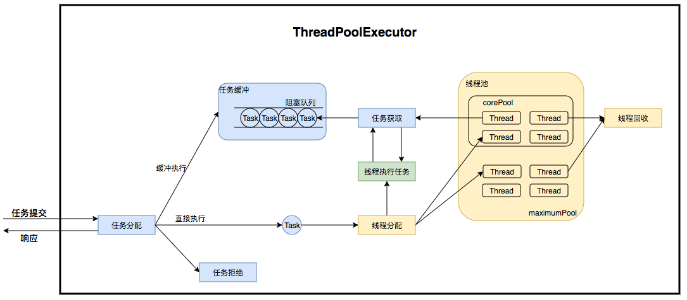
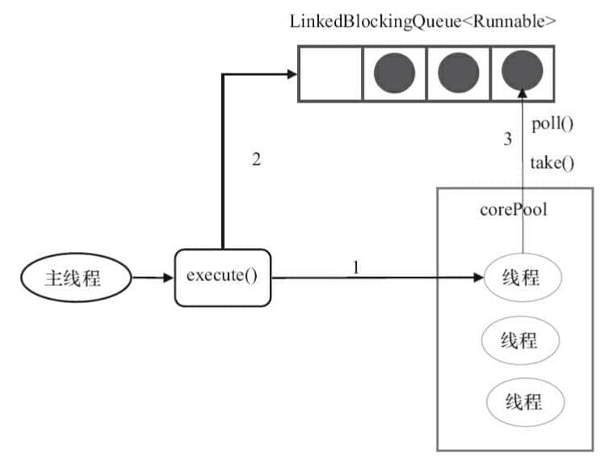
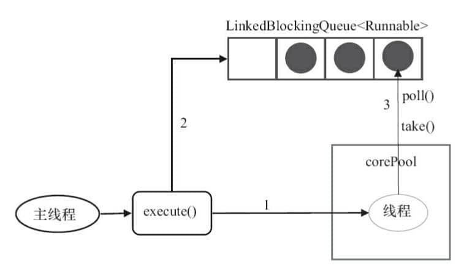
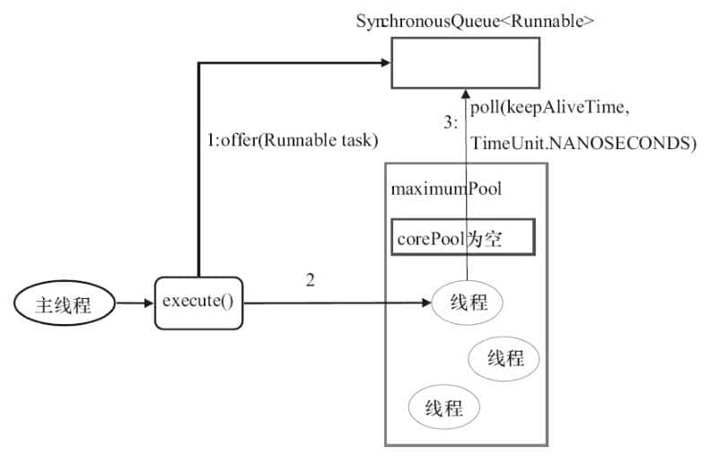
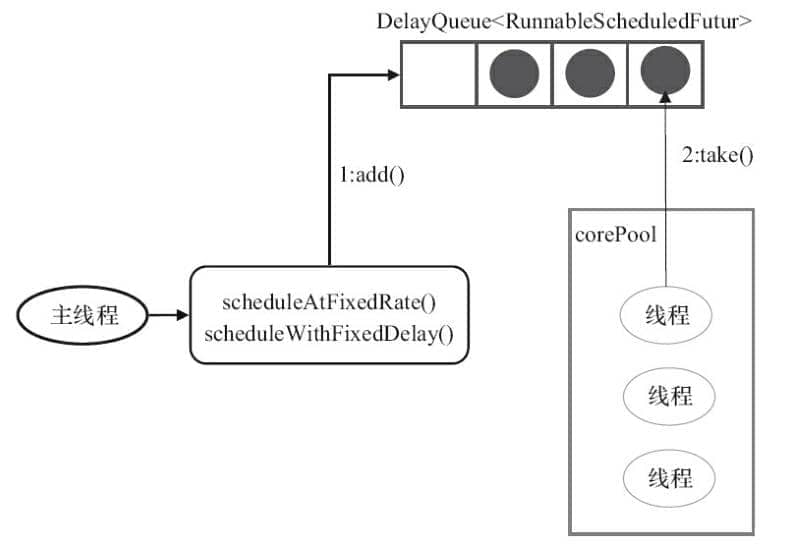
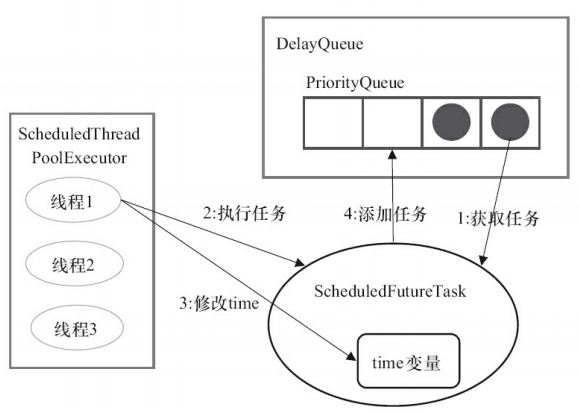
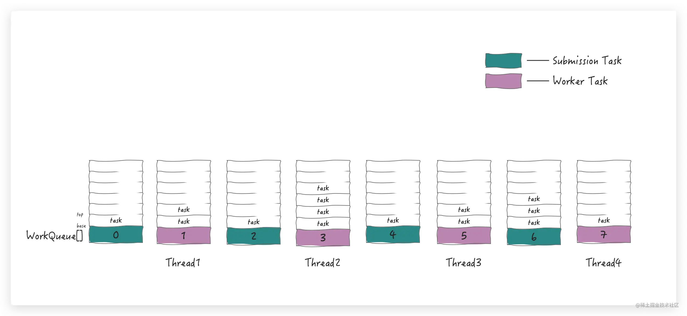
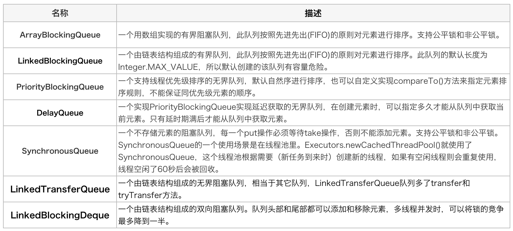

# 什么是线程池？为什么要使用线程池？

池化技术想必大家已经屡见不鲜了，线程池、数据库连接池、HTTP 连接池等等都是对这个思想的应用。池化技术的思想主要是为了减少每次获取资源的消耗，提高对资源的利用率。线程池提供了一种限制和管理资源（包括执行一个任务）的方式。 每个线程池还维护一些基本统计信息，例如已完成任务的数量。

这里借用《Java 并发编程的艺术》提到的来说一下使用线程池的好处：
* **降低资源消耗**：通过重复利用已创建的线程降低线程创建和销毁造成的消耗。
* **提高响应速度**：当任务到达时，任务可以不需要等到线程创建就能立即执行。
* **提高线程的可管理性**：线程是稀缺资源，如果无限制的创建，不仅会消耗系统资源，还会降低系统的稳定性，使用线程池可以进行统一的分配，调优和监控。

# 前置知识

## Runnable 和 Callable

`Runnable`和`Callable`都是java提供的任务接口，两者的区别是有没有结果返回，对于有接口返回的需要处理异常。源码如下：

```java
@FunctionalInterface
public interface Runnable {
    /**
     * When an object implementing interface <code>Runnable</code> is used
     * to create a thread, starting the thread causes the object's
     * <code>run</code> method to be called in that separately executing
     * thread.
     * <p>
     * The general contract of the method <code>run</code> is that it may
     * take any action whatsoever.
     */
    public abstract void run();
}
```
```java
@FunctionalInterface
public interface Callable<V> {
    /**
     * Computes a result, or throws an exception if unable to do so.
     *
     * @return computed result
     * @throws Exception if unable to compute a result
     */
    V call() throws Exception;
}
```

## Future

`Future`接口是一个异步计算结果的表示，接口提供了一些操作用来检查任务是否完成，等待完成，以及获取结果等。

一般我们把任务提交给`ThreadPoolExecutor`或`ScheduledThreadPoolExecutor`执行，可以调用`#submit`方法获取`FutureTask`对象，`FutureTask`是`Future`接口的一个具体实现。

```java
public interface Future<V> {

    /**
     * Attempts to cancel execution of this task.  This attempt will
     * fail if the task has already completed, has already been cancelled,
     * or could not be cancelled for some other reason. If successful,
     * and this task has not started when {@code cancel} is called,
     * this task should never run.  If the task has already started,
     * then the {@code mayInterruptIfRunning} parameter determines
     * whether the thread executing this task should be interrupted in
     * an attempt to stop the task.
     *
     * <p>After this method returns, subsequent calls to {@link #isDone} will
     * always return {@code true}.  Subsequent calls to {@link #isCancelled}
     * will always return {@code true} if this method returned {@code true}.
     *
     * @param mayInterruptIfRunning {@code true} if the thread executing this
     * task should be interrupted; otherwise, in-progress tasks are allowed
     * to complete
     * @return {@code false} if the task could not be cancelled,
     * typically because it has already completed normally;
     * {@code true} otherwise
     */
    boolean cancel(boolean mayInterruptIfRunning);

    /**
     * Returns {@code true} if this task was cancelled before it completed
     * normally.
     */
    boolean isCancelled();

    /**
     * Returns {@code true} if this task completed.
     *
     * Completion may be due to normal termination, an exception, or
     * cancellation -- in all of these cases, this method will return
     * {@code true}.
     */
    boolean isDone();

    /**
     * Waits if necessary for the computation to complete, and then
     * retrieves its result.
     */
    V get() throws InterruptedException, ExecutionException;

    /**
     * Waits if necessary for at most the given time for the computation
     * to complete, and then retrieves its result, if available.
     */
    V get(long timeout, TimeUnit unit)
        throws InterruptedException, ExecutionException, TimeoutException;
}
```

## RunnableFuture 和 FutureTask

`RunnableFuture`是`Runnable`和`Callable`的二合一接口，`FutureTask`是`RunnableFuture`的一个具体实现，也是线程池经常使用的一个类。

## Executor 和 ExecutorService

`Executor`和`ExecutorService`都是任务的执行器，`ExecutorService`继承了`Executor`，扩展了任务的提交和任务结果的获取，还提供了更多关于执行器生命周期的操作，例如：关闭执行器、检查是否关闭、是否停止等。

```java
public interface Executor {
    /**
     * Executes the given command at some time in the future.  The command
     * may execute in a new thread, in a pooled thread, or in the calling
     * thread, at the discretion of the {@code Executor} implementation.
     */
    void execute(Runnable command);
}
```
```java
public interface ExecutorService extends Executor {
    /**
     * Initiates an orderly shutdown in which previously submitted
     * tasks are executed, but no new tasks will be accepted.
     * Invocation has no additional effect if already shut down.
     *
     * <p>This method does not wait for previously submitted tasks to
     * complete execution.  Use {@link #awaitTermination awaitTermination}
     * to do that.
     */
    void shutdown();

    /**
     * Attempts to stop all actively executing tasks, halts the
     * processing of waiting tasks, and returns a list of the tasks
     * that were awaiting execution.
     *
     * <p>This method does not wait for actively executing tasks to
     * terminate.  Use {@link #awaitTermination awaitTermination} to
     * do that.
     *
     * <p>There are no guarantees beyond best-effort attempts to stop
     * processing actively executing tasks.  For example, typical
     * implementations will cancel via {@link Thread#interrupt}, so any
     * task that fails to respond to interrupts may never terminate.
     */
    List<Runnable> shutdownNow();

    /**
     * Returns {@code true} if this executor has been shut down.
     */
    boolean isShutdown();

    /**
     * Returns {@code true} if all tasks have completed following shut down.
     * Note that {@code isTerminated} is never {@code true} unless
     * either {@code shutdown} or {@code shutdownNow} was called first.
     */
    boolean isTerminated();

    /**
     * Blocks until all tasks have completed execution after a shutdown
     * request, or the timeout occurs, or the current thread is
     * interrupted, whichever happens first.
     */
    boolean awaitTermination(long timeout, TimeUnit unit)
        throws InterruptedException;

    /**
     * Submits a value-returning task for execution and returns a
     * Future representing the pending results of the task. The
     * Future's {@code get} method will return the task's result upon
     * successful completion.
     *
     * <p>
     * If you would like to immediately block waiting
     * for a task, you can use constructions of the form
     * {@code result = exec.submit(aCallable).get();}
     *
     * <p>Note: The {@link Executors} class includes a set of methods
     * that can convert some other common closure-like objects,
     * for example, {@link java.security.PrivilegedAction} to
     * {@link Callable} form so they can be submitted.
     */
    <T> Future<T> submit(Callable<T> task);

    /**
     * Submits a Runnable task for execution and returns a Future
     * representing that task. The Future's {@code get} method will
     * return the given result upon successful completion.
     */
    <T> Future<T> submit(Runnable task, T result);

    /**
     * Submits a Runnable task for execution and returns a Future
     * representing that task. The Future's {@code get} method will
     * return {@code null} upon <em>successful</em> completion.
     */
    Future<?> submit(Runnable task);

    /**
     * Executes the given tasks, returning a list of Futures holding
     * their status and results when all complete.
     * {@link Future#isDone} is {@code true} for each
     * element of the returned list.
     * Note that a <em>completed</em> task could have
     * terminated either normally or by throwing an exception.
     * The results of this method are undefined if the given
     * collection is modified while this operation is in progress.
     */
    <T> List<Future<T>> invokeAll(Collection<? extends Callable<T>> tasks)
        throws InterruptedException;

    /**
     * Executes the given tasks, returning a list of Futures holding
     * their status and results
     * when all complete or the timeout expires, whichever happens first.
     * {@link Future#isDone} is {@code true} for each
     * element of the returned list.
     * Upon return, tasks that have not completed are cancelled.
     * Note that a <em>completed</em> task could have
     * terminated either normally or by throwing an exception.
     * The results of this method are undefined if the given
     * collection is modified while this operation is in progress.
     */
    <T> List<Future<T>> invokeAll(Collection<? extends Callable<T>> tasks,
                                  long timeout, TimeUnit unit)
        throws InterruptedException;

    /**
     * Executes the given tasks, returning the result
     * of one that has completed successfully (i.e., without throwing
     * an exception), if any do. Upon normal or exceptional return,
     * tasks that have not completed are cancelled.
     * The results of this method are undefined if the given
     * collection is modified while this operation is in progress.
     */
    <T> T invokeAny(Collection<? extends Callable<T>> tasks)
        throws InterruptedException, ExecutionException;

    /**
     * Executes the given tasks, returning the result
     * of one that has completed successfully (i.e., without throwing
     * an exception), if any do before the given timeout elapses.
     * Upon normal or exceptional return, tasks that have not
     * completed are cancelled.
     * The results of this method are undefined if the given
     * collection is modified while this operation is in progress.
     */
    <T> T invokeAny(Collection<? extends Callable<T>> tasks,
                    long timeout, TimeUnit unit)
        throws InterruptedException, ExecutionException, TimeoutException;
}
```

### 几个对比

`execute()` vs `submit()`

* `execute()`方法用于提交不需要返回值的任务，所以无法判断任务是否被线程池执行成功与否；
* `submit()`方法用于提交需要返回值的任务。线程池会返回一个 `Future` 类型的对象，通过这个 `Future` 对象可以判断任务是否执行成功，并且可以通过 `Future` 的 `get()`方法来获取返回值，`get()`方法会阻塞当前线程直到任务完成，而使用 `get(long timeout，TimeUnit unit)`方法的话，如果在 `timeout` 时间内任务还没有执行完，就会抛出 `java.util.concurrent.TimeoutException`。

`shutdown()` vs `shutdownNow()`

* `shutdown()`：关闭线程池，线程池的状态变为 SHUTDOWN。线程池不再接受新任务了，但是队列里的任务得执行完毕。
* `shutdownNow()` :关闭线程池，线程的状态变为 STOP。线程池会终止当前正在运行的任务，并停止处理排队的任务并返回正在等待执行的 List。

`isTerminated()` vs `isShutdown()`

* `isShutDown`：当调用 `shutdown()` 方法后返回为`true`。
* `isTerminated`：当调用 `shutdown()` 方法后，并且所有提交的任务完成后返回为 `true`。

### `Executor`框架介绍


1. 主线程首先要创建实现 `Runnable` 或者 `Callable` 接口的任务对象。
2. 把创建完成的实现 `Runnable`/`Callable`接口的 对象直接交给 `ExecutorService` 执行: `ExecutorService.execute`（Runnable command））或者也可以把 Runnable 对象或Callable 对象提交给 `ExecutorService` 执行（`ExecutorService.submit`（Runnable task）或 `ExecutorService.submit`（Callable&lt;T&gt; task））。
3. 如果执行 E`xecutorService.submit(…)`，`ExecutorService` 将返回一个实现`Future`接口的对象（我们刚刚也提到过了执行 `execute()`方法和 `submit()`方法的区别，`submit(`)会返回一个 `FutureTask` 对象）。由于 `FutureTask` 实现了 `Runnable`，我们也可以创建 `FutureTask`，然后直接交给 `ExecutorService` 执行。
4. 最后，主线程可以执行 `FutureTask.get()`方法来等待任务执行完成。主线程也可以执行 `FutureTask.cancel(boolean mayInterruptIfRunning)`来取消此任务的执行。

# 线程池介绍（ThreadPoolExecutor）

`ThreadPoolExecutor`是`ExecutorService`的一个具体实现类，也就是java中提供的最核心的线程池类。

## 线程池的运行机制

线程池在内部实际上构建了一个**生产者消费者模型，将线程和任务两者解耦**，并不直接关联，从而良好的缓冲任务，复用线程。线程池的运行主要分成两部分：**任务管理**、**线程管理**。任务管理部分充当生产者的角色，当任务提交后，线程池会判断该任务后续的流转：（1）直接申请线程执行该任务；（2）缓冲到队列中等待线程执行；（3）拒绝该任务。线程管理部分是消费者，它们被统一维护在线程池内，根据任务请求进行线程的分配，当线程执行完任务后则会继续获取新的任务去执行，最终当线程获取不到任务的时候，线程就会被回收。

线程池运行机制如下图所示：


## 线程池的核心参数

`ThreadPoolExecutor` 类中提供的四个构造方法。我们来看最长的那个，其余三个都是在这个构造方法的基础上产生（其他几个构造方法说白点都是给定某些默认参数的构造方法比如默认制定拒绝策略是什么）。
```java
    /**
     * Creates a new ThreadPoolExecutor with the given initial parameters.
     */
    public ThreadPoolExecutor(int corePoolSize, // 线程池的核心线程数
                              int maximumPoolSize, // 线程池的最大线程数
                              long keepAliveTime, // 当线程数大于核心线程数时，多余的空闲线程存活的最长时间
                              TimeUnit unit,
                              BlockingQueue<Runnable> workQueue, // 任务队列，用来储存等待执行任务的队列
                              ThreadFactory threadFactory, // 线程工厂，用来创建线程，一般默认即可
                              RejectedExecutionHandler handler //拒绝策略，当提交的任务过多而不能及时处理时，我们可以定制策略来处理任务
                              ) {
        if (corePoolSize < 0 ||
            maximumPoolSize <= 0 ||
            maximumPoolSize < corePoolSize ||
            keepAliveTime < 0)
            throw new IllegalArgumentException();
        if (workQueue == null || threadFactory == null || handler == null)
            throw new NullPointerException();
        this.acc = System.getSecurityManager() == null ?
                null :
                AccessController.getContext();
        this.corePoolSize = corePoolSize;
        this.maximumPoolSize = maximumPoolSize;
        this.workQueue = workQueue;
        this.keepAliveTime = unit.toNanos(keepAliveTime);
        this.threadFactory = threadFactory;
        this.handler = handler;
    }
```
**`ThreadPoolExecutor`3个最重要的参数：**
* **corePoolSize** : 核心线程数线程数定义了最小可以同时运行的线程数量。
* **maximumPoolSize** : 当队列中存放的任务达到队列容量的时候，当前可以同时运行的线程数量变为最大线程数。
* **workQueue**: 当新任务来的时候会先判断当前运行的线程数量是否达到核心线程数，如果达到的话，新任务就会被存放在队列中。

为了更加容易理解这几个参数的含义，下面列举了几种情况：
1. 首先检测线程池运行状态，如果不是RUNNING，则直接拒绝，线程池要保证在RUNNING的状态下执行任务。
2. 如果workerCount < corePoolSize，则创建并启动一个线程来执行新提交的任务。
3. 如果workerCount >= corePoolSize，且线程池内的阻塞队列未满，则将任务添加到该阻塞队列中。
4. 如果workerCount >= corePoolSize && workerCount < maximumPoolSize，且线程池内的阻塞队列已满，则创建并启动一个线程来执行新提交的任务。
5. 如果workerCount >= maximumPoolSize，并且线程池内的阻塞队列已满, 则根据拒绝策略来处理该任务, 默认的处理方式是直接抛异常。

`ThreadPoolExecutor`的keepAliveTime：

当线程池中的线程数量大于`corePoolSize`的时候，如果这时没有新的任务提交，核心线程外的线程不会立即销毁，而是会等待，直到等待的时间超过了 `keepAliveTime`才会被回收销毁；


`ThreadPoolExecutor`的饱和策略（当前同时运行的线程数量达到最大线程数量并且队列也已经被放满了任务时）：
* **`ThreadPoolExecutor.AbortPolicy`** ：抛出 RejectedExecutionException来拒绝新任务的处理。
* **`ThreadPoolExecutor.CallerRunsPolicy`** ：调用执行自己的线程运行任务，也就是直接在调用execute方法的线程中运行(run)被拒绝的任务，如果执行程序已关闭，则会丢弃该任务。因此这种策略会降低对于新任务提交速度，影响程序的整体性能。如果您的应用程序可以承受此延迟并且你要求任何一个任务请求都要被执行的话，你可以选择这个策略。
* **`ThreadPoolExecutor.DiscardPolicy`** ：不处理新任务，直接丢弃掉。
* **`ThreadPoolExecutor.DiscardOldestPolicy`** ： 此策略将丢弃最早的未处理的任务请求。

> Spring 通过 `ThreadPoolTaskExecutor` 或者我们直接通过 `ThreadPoolExecutor` 的构造函数创建线程池的时候，当我们不指定 `RejectedExecutionHandler` 饱和策略的话来配置线程池的时候默认使用的是 `ThreadPoolExecutor.AbortPolicy``。在默认情况下，ThreadPoolExecutor` 将抛出 `RejectedExecutionException` 来拒绝新来的任务 ，这代表你将丢失对这个任务的处理。 对于可伸缩的应用程序，建议使用 `ThreadPoolExecutor.CallerRunsPolicy`。当最大池被填满时，此策略为我们提供可伸缩队列。

## 线程池的使用样例

### 使用线程池提交`Runnable`任务

```java
public class ThreadPoolExecutorDemo {
    private static final int CORE_POOL_SIZE = 5;
    private static final int MAX_POOL_SIZE = 10;
    private static final int QUEUE_CAPACITY = 100;
    private static final Long KEEP_ALIVE_TIME = 1L;

    public static void main(String[] args) {
        //使用阿里巴巴推荐的创建线程池的方式
        //通过ThreadPoolExecutor构造函数自定义参数创建
        ThreadPoolExecutor executor = new ThreadPoolExecutor(
                CORE_POOL_SIZE,
                MAX_POOL_SIZE,
                KEEP_ALIVE_TIME,
                TimeUnit.SECONDS,
                new ArrayBlockingQueue<>(QUEUE_CAPACITY),
                new ThreadPoolExecutor.CallerRunsPolicy());

        for (int i = 0; i < 10; i++) {
            //创建WorkerThread对象（WorkerThread类实现了Runnable 接口）
            Runnable worker = new Runnable {
                private String command = "task" + i;

                @Override
                public void run() {
                    System.out.println(Thread.currentThread().getName() + " Start. Time = " + new Date());
                    processCommand();
                    System.out.println(Thread.currentThread().getName() + " End. Time = " + new Date());
                }

                private void processCommand() {
                    try {
                        Thread.sleep(5000);
                    } catch (InterruptedException e) {
                        e.printStackTrace();
                    }
                }
            };
            //执行Runnable
            executor.execute(worker);
        }
        //终止线程池
        executor.shutdown();
        while (!executor.isTerminated()) {
        }
        System.out.println("Finished all threads");
    }
}
```
Output：
```
pool-1-thread-3 Start. Time = Sun Apr 12 11:14:37 CST 2020
pool-1-thread-5 Start. Time = Sun Apr 12 11:14:37 CST 2020
pool-1-thread-2 Start. Time = Sun Apr 12 11:14:37 CST 2020
pool-1-thread-1 Start. Time = Sun Apr 12 11:14:37 CST 2020
pool-1-thread-4 Start. Time = Sun Apr 12 11:14:37 CST 2020
pool-1-thread-3 End. Time = Sun Apr 12 11:14:42 CST 2020
pool-1-thread-4 End. Time = Sun Apr 12 11:14:42 CST 2020
pool-1-thread-1 End. Time = Sun Apr 12 11:14:42 CST 2020
pool-1-thread-5 End. Time = Sun Apr 12 11:14:42 CST 2020
pool-1-thread-1 Start. Time = Sun Apr 12 11:14:42 CST 2020
pool-1-thread-2 End. Time = Sun Apr 12 11:14:42 CST 2020
pool-1-thread-5 Start. Time = Sun Apr 12 11:14:42 CST 2020
pool-1-thread-4 Start. Time = Sun Apr 12 11:14:42 CST 2020
pool-1-thread-3 Start. Time = Sun Apr 12 11:14:42 CST 2020
pool-1-thread-2 Start. Time = Sun Apr 12 11:14:42 CST 2020
pool-1-thread-1 End. Time = Sun Apr 12 11:14:47 CST 2020
pool-1-thread-4 End. Time = Sun Apr 12 11:14:47 CST 2020
pool-1-thread-5 End. Time = Sun Apr 12 11:14:47 CST 2020
pool-1-thread-3 End. Time = Sun Apr 12 11:14:47 CST 2020
pool-1-thread-2 End. Time = Sun Apr 12 11:14:47 CST 2020
```

### 使用线程池提交`Callable`任务

```java
public class ThreadPoolExecutorDemo {
    private static final int CORE_POOL_SIZE = 5;
    private static final int MAX_POOL_SIZE = 10;
    private static final int QUEUE_CAPACITY = 100;
    private static final Long KEEP_ALIVE_TIME = 1L;

    public static void main(String[] args) {
        //使用阿里巴巴推荐的创建线程池的方式
        //通过ThreadPoolExecutor构造函数自定义参数创建
        ThreadPoolExecutor executor = new ThreadPoolExecutor(
                CORE_POOL_SIZE,
                MAX_POOL_SIZE,
                KEEP_ALIVE_TIME,
                TimeUnit.SECONDS,
                new ArrayBlockingQueue<>(QUEUE_CAPACITY),
                new ThreadPoolExecutor.CallerRunsPolicy());

        List<Future<String>> futureList = new ArrayList<>();
        Callable<String> callable = new Callable {
            @Override
            public String call() throws Exception {
                Thread.sleep(1000);
                //返回执行当前 Callable 的线程名字
                return Thread.currentThread().getName();
            }
        };
        for (int i = 0; i < 10; i++) {
            //提交任务到线程池
            Future<String> future = executor.submit(callable);
            //将返回值 future 添加到 list，我们可以通过 future 获得 执行 Callable 得到的返回值
            futureList.add(future);
        }
        for (Future<String> fut : futureList) {
            try {
                System.out.println(new Date() + "::" + fut.get());
            } catch (InterruptedException | ExecutionException e) {
                e.printStackTrace();
            }
        }
        //关闭线程池
        executor.shutdown();
    }
}
```
Output：
```
Wed Nov 13 13:40:41 CST 2019::pool-1-thread-1
Wed Nov 13 13:40:42 CST 2019::pool-1-thread-2
Wed Nov 13 13:40:42 CST 2019::pool-1-thread-3
Wed Nov 13 13:40:42 CST 2019::pool-1-thread-4
Wed Nov 13 13:40:42 CST 2019::pool-1-thread-5
Wed Nov 13 13:40:42 CST 2019::pool-1-thread-3
Wed Nov 13 13:40:43 CST 2019::pool-1-thread-2
Wed Nov 13 13:40:43 CST 2019::pool-1-thread-1
Wed Nov 13 13:40:43 CST 2019::pool-1-thread-4
Wed Nov 13 13:40:43 CST 2019::pool-1-thread-5
```

# 常见线程池及工厂

## Execotors工厂

java提供了线程池构造工厂`Executors`，使用示例如下：
```java
ThreadFactory threadFactory = Executors.defaultThreadFactory();
ExecutorService threadPool = Executors.newFixedThreadPool(10, threadFactory);
ExecutorService threadPool2 = Executors.newSingleThreadExecutor(threadFactory);
ExecutorService threadPool3 = Executors.newCachedThreadPool(threadFactory);
ExecutorService threadPool4 = Executors.newScheduledThreadPool(20, threadFactory);
ExecutorService threadPool5 = Executors.newWorkStealingPool(10);
```

## FixedThreadPool

`FixedThreadPool` 的 `corePoolSize` 和 `maximumPoolSize` 都被设置为 `nThreads`，这个 `nThreads` 参数为固定的线程池个数。

```java
public static ExecutorService newFixedThreadPool(int nThreads, ThreadFactory threadFactory) {
    return new ThreadPoolExecutor(nThreads, nThreads, 0L, TimeUnit.MILLISECONDS, new LinkedBlockingQueue<Runnable>(), threadFactory);
}
```
`FixedThreadPool#execute()` 方法运行示意图（该图片来源：《Java 并发编程的艺术》）：


需要注意的是，`FixedThreadPool`使用无界队列来排队提交的任务，所以不会拒绝任意的提交任务，可能导致OOM，所以**不建议直接使用`Executors.newFixedThreadPool()`来创建固定数量的线程池**。

《阿里巴巴 Java 开发手册》中强制线程池不允许使用 Executors 去创建，而是通过 ThreadPoolExecutor 构造函数的方式，这样的处理方式让写的同学更加明确线程池的运行规则，规避资源耗尽的风险。

## SingleThreadExecutor

同`FixedThreadPool`，**不建议直接使用`Executors.newSingleThreadExecutor()`来创建固定数量的线程池**。
```java
public static ExecutorService newSingleThreadExecutor(ThreadFactory threadFactory) {
    return new FinalizableDelegatedExecutorService(new ThreadPoolExecutor(1, 1, 0L, TimeUnit.MILLISECONDS, new LinkedBlockingQueue<Runnable>(), threadFactory));
}
```

`SingleThreadExecutor#execute()` 方法运行示意图（该图片来源：《Java 并发编程的艺术》）：


## CachedThreadPool

`CachedThreadPool`的`corePoolSize`等于0，`maximumPoolSize`等于`Integer.MAX.VALUE`，意味着线程池在空闲期可能一个线程都没有，当有大量任务提交时，会创建大量的线程，极端情况下会耗尽CPU和内存资源，违反了线程池设计的目的。所以也**不建议直接使用`Executors.newCachedThreadPool()`来创建固定数量的线程池**。
```java
public static ExecutorService newCachedThreadPool(ThreadFactory threadFactory) {
    return new ThreadPoolExecutor(0, Integer.MAX_VALUE, 60L, TimeUnit.SECONDS, new SynchronousQueue<Runnable>(), threadFactory);
}
```

`CachedThreadPool#execute()` 方法运行示意图（该图片来源：《Java 并发编程的艺术》）：


## ScheduledThreadPoolExecutor

```java
public static ScheduledExecutorService newScheduledThreadPool(int corePoolSize, ThreadFactory threadFactory) {
    return new ScheduledThreadPoolExecutor(corePoolSize, threadFactory);
}
```



`ScheduledThreadPoolExecutor` 的执行主要分为两大部分：
1. 当调用 `ScheduledThreadPoolExecutor` 的 `scheduleAtFixedRate()` 方法或者 `scheduleWithFixedDelay()` 方法时，会向 `ScheduledThreadPoolExecutor` 的 `DelayQueue` 添加一个实现了 `RunnableScheduledFuture` 接口的 `ScheduledFutureTask` 。
2. 线程池中的线程从 `DelayQueue` 中获取 `ScheduledFutureTask`，然后执行任务。

`ScheduledThreadPoolExecutor` 为了实现周期性的执行任务，对 `ThreadPoolExecutor `做了如下修改：使用 `DelayQueue` 作为任务队列；获取任务的方不同执行周期任务后，增加了额外的处理。



`ScheduledThreadPoolExecutor` 执行周期任务的步骤：
1. 线程 1 从 `DelayQueue` 中获取已到期的 `ScheduledFutureTask`（`DelayQueue.take()`）。到期任务是指 `ScheduledFutureTask`的 `time` 大于等于当前系统的时间；
2. 线程 1 执行这个 `ScheduledFutureTask`；
3. 线程 1 修改 `ScheduledFutureTask` 的 `time` 变量为下次将要被执行的时间；
4. 线程 1 把这个修改 `time` 之后的 `ScheduledFutureTask` 放回 `DelayQueue` 中（`DelayQueue.add()`)。


### ScheduledThreadPoolExecutor 和 Timer 的比较

* `Timer` 对系统时钟的变化敏感，`ScheduledThreadPoolExecutor`不是；
* `Timer` 只有一个执行线程，因此长时间运行的任务可以延迟其他任务。 `ScheduledThreadPoolExecutor` 可以配置任意数量的线程。 此外，如果你想（通过提供 `ThreadFactory`），你可以完全控制创建的线程;
* `在TimerTask` 中抛出的运行时异常会杀死一个线程，从而导致 `Timer` 死机:-( ...即计划任务将不再运行。`ScheduledThreadExecutor` 不仅捕获运行时异常，还允许您在需要时处理它们（通过重写 `afterExecute` 方法`ThreadPoolExecutor`）。抛出异常的任务将被取消，但其他任务将继续运行。

综上，在 JDK1.5 之后，你没有理由再使用 `Timer` 进行任务调度了。

## ForkJoinPool

 `ForkJoinPool` 采用了**分治法（Divide-and-Conquer）**的思想把任务拆成多个子任务进行解决然后合并子任务的计算结果。用了最大化利用CPU资源，采用了**工作窃取（work-stealing）**的算法，允许空闲线程窃取其他线程的队列任务。

```java
public static ExecutorService newWorkStealingPool(int parallelism) {
    return new ForkJoinPool(parallelism, ForkJoinPool.defaultForkJoinWorkerThreadFactory, null, true);
}
```

在 `ForkJoinPool` 中，线程池中每个工作线程 `ForkJoinWorkerThread` 都对应一个任务队列 `WorkQueue` ，工作线程优先处理来自自身队列的任务(**LIFO**或**FIFO**顺序，参数 `mode` 决定)，然后以FIFO的顺序随机窃取其他队列中的任务。

具体思路如下：
* 每个线程都有自己的一个 `WorkQueue` ，该工作队列是一个双端队列，支持三个功能 `push` 、`pop` 、`poll`。
* 任务主要分为两种：外部提交任务（submission task）放在 `WorkQueue` 的偶数下标中，任务自己 fork 的任务（worker task）放在 `WorkQueue` 的奇数下标中，只有奇数下标有线程。
* `push` 和 `pop` 只能被队列的所有者线程调用，而 `poll` 可以被其他线程调用。划分的子任务调用 `fork` 时，都会被 `push` 到自己的队列中。通过 `poll` 操作窃取其他线程的任务。
* 默认情况下，工作线程从自己的双端队列获出任务并执行。当自己的队列为空时，线程随机从另一个线程的队列末尾调用 `poll` 方法窃取任务。



更多内容可以阅览 [掘金 - ForkJoinPool大型图文现场（一阅到底 vs 直接收藏）](https://juejin.cn/post/6932632481526972430)。

# 线程池原理详解

## 状态及生命周期

线程池运行的状态，并不是用户显式设置的，而是伴随着线程池的运行，由内部来维护。线程池内部使用一个变量维护两个值：**运行状态(runState)和线程数量 (workerCount)**。在具体实现中，线程池将运行状态(runState)、线程数量 (workerCount)两个关键参数的维护放在了一起，如下代码所示：

```java
private final AtomicInteger ctl = new AtomicInteger(ctlOf(RUNNING, 0));
private static final int COUNT_BITS = Integer.SIZE - 3;
private static final int CAPACITY   = (1 << COUNT_BITS) - 1;
```

`ctl`这个AtomicInteger类型，是对线程池的运行状态和线程池中有效线程的数量进行控制的一个字段， 它同时包含两部分的信息：线程池的运行状态 (runState) 和线程池内有效线程的数量 (workerCount)，**高3位保存runState，低29位保存workerCount**，两个变量之间互不干扰。用一个变量去存储两个值，可避免在做相关决策时，出现不一致的情况，不必为了维护两者的一致，而占用锁资源。通过阅读线程池源代码也可以发现，经常出现要同时判断线程池运行状态和线程数量的情况。线程池也提供了若干方法去供用户获得线程池当前的运行状态、线程个数。这里都使用的是位运算的方式，相比于基本运算，速度也会快很多。

关于内部封装的获取生命周期状态、获取线程池线程数量的计算方法如以下代码所示：

```java
// Packing and unpacking ctl
private static int runStateOf(int c)     { return c & ~CAPACITY; }
private static int workerCountOf(int c)  { return c & CAPACITY; }
private static int ctlOf(int rs, int wc) { return rs | wc; }
```

ThreadPoolExecutor的运行状态有5种，分别为：

```java
// runState is stored in the high-order bits
private static final int RUNNING    = -1 << COUNT_BITS;
private static final int SHUTDOWN   =  0 << COUNT_BITS;
private static final int STOP       =  1 << COUNT_BITS;
private static final int TIDYING    =  2 << COUNT_BITS;
private static final int TERMINATED =  3 << COUNT_BITS;
```

| 线程池状态 | 状态描述 |
| --- | --- |
| RUNNING | 能接受新提交的任务，也能处理队列中的任务 |
| SHUTDOWN | 关闭状态，不再接受新提交的任务，但能处理队列中的任务 |
| STOP | 不能接受新提交的任务，也不再处理队列中的任务，会中断正在处理任务的线程 |
| TIDYING | 所有任务都已终止，workCount为0 |
| TERMINATED | 在`terminate()`方法处理完成之后进入该状态 |

其生命周期转换如下入所示：


## 任务执行机制

### 任务调度

任务调度是线程池的主要入口，当用户提交了一个任务，接下来这个任务将如何执行都是由这个阶段决定的。了解这部分就相当于了解了线程池的核心运行机制。所有任务的调度都是由execute方法完成的，这部分完成的工作是：检查现在线程池的运行状态、运行线程数、运行策略，决定接下来执行的流程，是直接申请线程执行，或是缓冲到队列中执行，亦或是直接拒绝该任务。其执行流程如下图所示：


### 任务缓冲

任务缓冲模块是线程池能够管理任务的核心部分。线程池的本质是对任务和线程的管理，而做到这一点最关键的思想就是将**任务和线程两者解耦**，不让两者直接关联，才可以做后续的分配工作。线程池中是以生产者消费者模式，通过一个阻塞队列来实现的。阻塞队列缓存任务，工作线程从阻塞队列中获取任务。

阻塞队列(BlockingQueue)是一个支持两个附加操作的队列。这两个附加的操作是：在队列为空时，获取元素的线程会等待队列变为非空。当队列满时，存储元素的线程会等待队列可用。阻塞队列常用于生产者和消费者的场景，生产者是往队列里添加元素的线程，消费者是从队列里拿元素的线程。阻塞队列就是生产者存放元素的容器，而消费者也只从容器里拿元素。

使用不同的队列可以实现不一样的任务存取策略。常见的阻塞队列有：


### 任务申请

由上文的任务分配部分可知，任务的执行有两种可能：一种是任务直接由新创建的线程执行。另一种是线程从任务队列中获取任务然后执行，执行完任务的空闲线程会再次去从队列中申请任务再去执行。第一种情况仅出现在线程初始创建的时候，第二种是线程获取任务绝大多数的情况。

线程需要从任务缓存模块中不断地取任务执行，帮助线程从阻塞队列中获取任务，实现线程管理模块和任务管理模块之间的通信。这部分策略由getTask方法实现，其执行流程如下图所示：


getTask这部分进行了多次判断，为的是控制线程的数量，使其符合线程池的状态。如果线程池现在不应该持有那么多线程，则会返回null值。工作线程Worker会不断接收新任务去执行，而当工作线程Worker接收不到任务的时候，就会开始被回收。

### 任务拒绝

任务拒绝模块是线程池的保护部分，线程池有一个最大的容量，**当线程池的任务缓存队列已满，并且线程池中的线程数目达到maximumPoolSize时，就需要拒绝掉该任务**，采取任务拒绝策略，保护线程池。拒绝策略是一个接口，其设计如下：

```java
public interface RejectedExecutionHandler {
    /**
     * Method that may be invoked by a {@link ThreadPoolExecutor} when
     * {@link ThreadPoolExecutor#execute execute} cannot accept a
     * task.  This may occur when no more threads or queue slots are
     * available because their bounds would be exceeded, or upon
     * shutdown of the Executor.
     *
     * <p>In the absence of other alternatives, the method may throw
     * an unchecked {@link RejectedExecutionException}, which will be
     * propagated to the caller of {@code execute}.
     */
    void rejectedExecution(Runnable r, ThreadPoolExecutor executor);
}
```

用户可以通过实现这个接口去定制拒绝策略，也可以选择JDK提供的四种已有拒绝策略，其特点如下：

| 饱和策略 | 策略描述 |
| --- | --- |
| `ThreadPoolExecutor.AbortPolicy` | 丢弃任务并抛出`RejectedExecutionException`来拒绝新任务的处理。对于关键业务，推荐用此策略，能保护系统免受资源耗尽。|
| `ThreadPoolExecutor.CallerRunsPolicy` | 由调用线程（提交任务的线程）来处理该任务。这种策略能保证任务不被丢弃，总有线程来处理，线程池只是减少了资源的创建销毁。|
| `ThreadPoolExecutor.DiscardPolicy` | 丢弃任务，也不抛出异常。慎用此策略，不能感知任务的失败。|
| `ThreadPoolExecutor.DiscardOldestPolicy` | 丢弃队列中最早提交的任务，然后提交新任务。看业务场景是否需要该策略。|

## 工作线程管理

### Worker线程简介

线程池为了掌握线程的状态并维护线程的生命周期，设计了线程池内的工作线程Worker。我们来看一下它的部分代码：

```java
private final class Worker extends AbstractQueuedSynchronizer implements Runnable {
    final Thread thread;
    /** Initial task to run.  Possibly null. */
    Runnable firstTask;
    /** Per-thread task counter */
    volatile long completedTasks;
    ...
}
```

Worker这个工作线程，实现了Runnable接口，并持有一个线程thread，一个初始化的任务firstTask。thread是在调用构造方法时通过ThreadFactory来创建的线程，可以用来执行任务；firstTask用它来保存传入的第一个任务，这个任务可以有也可以为null。如果这个值是非空的，那么线程就会在启动初期立即执行这个任务，也就对应核心线程创建时的情况；如果这个值是null，那么就需要创建一个线程去执行任务列表（workQueue）中的任务，也就是非核心线程的创建。

Worker执行任务的模型如下图所示：


线程池需要管理线程的生命周期，需要在线程长时间不运行的时候进行回收。线程池使用一张Hash表去持有线程的引用，这样可以通过添加引用、移除引用这样的操作来控制线程的生命周期。这个时候重要的就是如何判断线程是否在运行。

​Worker是通过继承AQS，使用AQS来实现独占锁这个功能。没有使用可重入锁ReentrantLock，而是使用AQS，为的就是实现不可重入的特性去反应线程现在的执行状态。

1. lock方法一旦获取了独占锁，表示当前线程正在执行任务中。
2. 如果正在执行任务，则不应该中断线程。
3. 如果该线程现在不是独占锁的状态，也就是空闲的状态，说明它没有在处理任务，这时可以对该线程进行中断。
4. 线程池在执行shutdown方法或tryTerminate方法时会调用interruptIdleWorkers方法来中断空闲的线程，interruptIdleWorkers方法会使用tryLock方法来判断线程池中的线程是否是空闲状态；如果线程是空闲状态则可以安全回收。

在线程回收过程中就使用到了这种特性，回收过程如下图所示：


### Worker线程增加

增加线程是通过线程池中的addWorker方法，该方法的功能就是增加一个线程，该方法不考虑线程池是在哪个阶段增加的该线程，这个分配线程的策略是在上个步骤完成的，该步骤仅仅完成增加线程，并使它运行，最后返回是否成功这个结果。addWorker方法有两个参数：firstTask、core。firstTask参数用于指定新增的线程执行的第一个任务，该参数可以为空；core参数为true表示在新增线程时会判断当前活动线程数是否少于corePoolSize，false表示新增线程前需要判断当前活动线程数是否少于maximumPoolSize，其执行流程如下图所示：


### Worker线程处理任务

在Worker类中的run方法调用了runWorker方法来执行任务，runWorker方法的执行过程如下：
1.while循环不断地通过getTask()方法获取任务。 2.getTask()方法从阻塞队列中取任务。 3.如果线程池正在停止，那么要保证当前线程是中断状态，否则要保证当前线程不是中断状态。 4.执行任务。 5.如果getTask结果为null则跳出循环，执行processWorkerExit()方法，销毁线程。
执行流程如下图所示：


### Worker线程回收

线程池中线程的销毁依赖JVM自动的回收，线程池做的工作是根据当前线程池的状态维护一定数量的线程引用，防止这部分线程被JVM回收，当线程池决定哪些线程需要回收时，只需要将其引用消除即可。Worker被创建出来后，就会不断地进行轮询，然后获取任务去执行，核心线程可以无限等待获取任务，非核心线程要限时获取任务。当Worker无法获取到任务，也就是获取的任务为空时，循环会结束，Worker会主动消除自身在线程池内的引用。

```java
    final void runWorker(Worker w) {
        // ...
        try {
            while (task != null || (task = getTask()) != null) {
                // task execution
            }
            completedAbruptly = false;
        } finally {
            processWorkerExit(w, completedAbruptly);
        }
    }
```

线程回收的工作是在processWorkerExit方法完成的。在这个方法中，将线程引用移出线程池就已经结束了线程销毁的部分。但由于引起线程销毁的可能性有很多，线程池还要判断是什么引发了这次销毁，是否要改变线程池的现阶段状态，是否要根据新状态，重新分配线程。

# 线程池配置和调优

## 动态线程池配置

可参考[美团技术团队 - Java线程池实现原理及其在美团业务中的实践](https://tech.meituan.com/2020/04/02/java-pooling-pratice-in-meituan.html)文中的动态化线程池一节。

# 参考资料

* [JavaGuide - Java 线程池详解](https://javaguide.cn/java/concurrent/java-thread-pool-summary.html)
* [美团技术团队 - Java线程池实现原理及其在美团业务中的实践](https://tech.meituan.com/2020/04/02/java-pooling-pratice-in-meituan.html)
* [硬核干货：4W字从源码上分析JUC线程池ThreadPoolExecutor的实现原理](https://www.throwx.cn/2020/08/23/java-concurrency-thread-pool-executor/)
* [掘金 - ForkJoinPool大型图文现场（一阅到底 vs 直接收藏）](https://juejin.cn/post/6932632481526972430)
* [JUC线程池: Fork/Join框架详解](https://pdai.tech/md/java/thread/java-thread-x-juc-executor-ForkJoinPool.html)