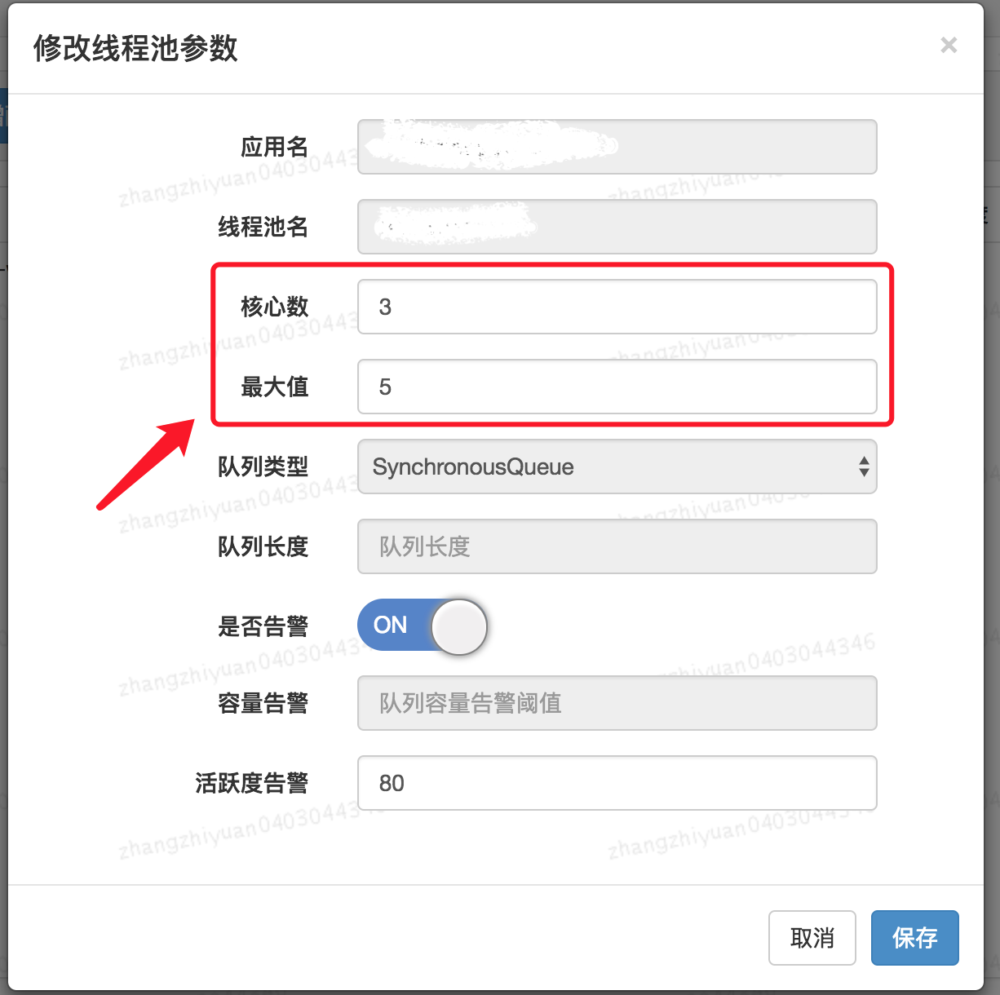

# ThreadPool 实践

## 线程池参数配置

### 如何确定线程个数

#### CPU 密集型任务

这种任务消耗的主要是 CPU 资源，可以将线程数设置为 N（CPU 核心数）+1。比 CPU 核心数多出来的一个线程是为了防止线程偶发的缺页中断，或者其它原因导致的任务暂停而带来的影响。一旦任务暂停，CPU 就会处于空闲状态，而在这种情况下多出来的一个线程就可以充分利用 CPU 的空闲时间。

$$
N_{thread}=N_{cpu}+1
$$

#### I/O 密集型任务

对于这种任务应用，系统会用大部分的时间来处理 I/O 交互，而线程在处理 I/O 的时间段内不会占用 CPU 来处理，这时就可以将 CPU 交出给其它线程使用。

下面是一个参考的最有线程数的计算公式，其中 $U_{cpu}$ 表示 CPU 的利用率，$\frac{W}{C}$ 表示等待时间和计算时间的比例。

$$
N_{thread}=N_{cpu}*U_{cpu}*(1+\frac{W}{C})
$$

### 动态线程池配置

美团技术团队的思路是主要对线程池的核心参数实现自定义可配置。这三个核心参数是：

* `corePoolSize` : 核心线程数线程数定义了最小可以同时运行的线程数量。
* `maximumPoolSize` : 当队列中存放的任务达到队列容量的时候，当前可以同时运行的线程数量变为最大线程数。
* `workQueue`: 当新任务来的时候会先判断当前运行的线程数量是否达到核心线程数，如果达到的话，新任务就会被存放在队列中。

可参考[美团技术团队 - Java线程池实现原理及其在美团业务中的实践](https://tech.meituan.com/2020/04/02/java-pooling-pratice-in-meituan.html)文中的动态化线程池一节。

其他开源项目参考：

* [Hippo4j](https://github.com/opengoofy/hippo4j)：异步线程池框架，支持线程池动态变更&监控&报警，无需修改代码轻松引入。支持多种使用模式，轻松引入，致力于提高系统运行保障能力。
* [Dynamic TP](https://github.com/dromara/dynamic-tp)：轻量级动态线程池，内置监控告警功能，集成三方中间件线程池管理，基于主流配置中心（已支持 Nacos、Apollo，Zookeeper、Consul、Etcd，可通过 SPI 自定义实现）。

## 参考资料

* [JavaGuide - Java线程池最佳实践](https://javaguide.cn/java/concurrent/java-thread-pool-best-practices.html)
* [美团技术团队 - Java线程池实现原理及其在美团业务中的实践](https://tech.meituan.com/2020/04/02/java-pooling-pratice-in-meituan.html)
