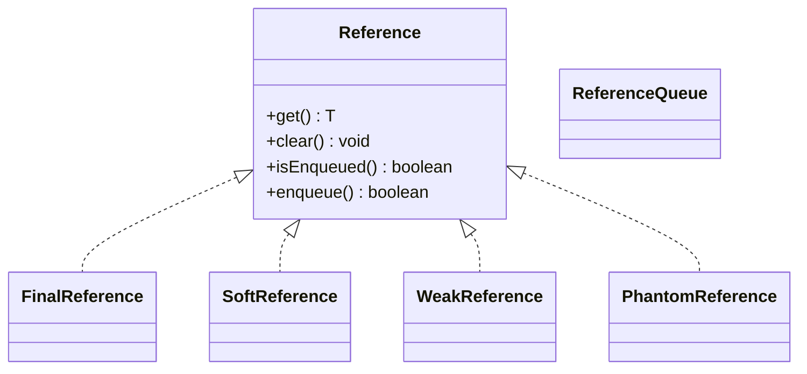

[toc]

# 对象的四种引用类型

Java执行GC判断对象是否存活有两种方式，其中一种是引用计数，Java堆中每一个对象都有一个引用计数属性，引用每新增1次计数加1，引用每释放1次计数减1。

从JDK 1.2版本开始，对象的引用被划分为4种级别，从而使程序能更加灵活地控制对象的生命周期。这4种级别由高到低依次为：**强引用、软引用、弱引用和虚引用**。



## 强引用

强引用是使用最普遍的引用。**如果一个对象具有强引用，那垃圾回收器绝不会回收它。** 如下：

```java
 Object strongReference = new Object();
```

当内存空间不足时，Java虚拟机宁愿抛出 `OutOfMemoryError` 错误，使程序异常终止，也不会靠随意回收具有强引用的对象来解决内存不足的问题。 如果强引用对象不使用时，需要弱化从而使GC能够回收，如下：

```java
strongReference = null;
```

显式地设置 `strongReference` 对象为 `null` ，或让其超出对象的生命周期范围，则GC认为该对象不存在引用，这时就可以回收这个对象。具体什么时候收集这要取决于GC算法。

在一个方法的内部有一个强引用，这个引用保存在Java栈中，而真正的引用对象保存在Java堆中。当这个方法运行完成后，就会退出方法栈，则引用对象的引用数为0，这个对象会被回收。但是如果这个 `strongReference` 是全局变量时，就需要在不用这个对象时赋值为 `null` ，因为强引用不会被垃圾回收。

`ArrayList#clear()` 方法：

```java
    public void clear() {
        modCount++;

        // clear to let GC do its work
        for (int i = 0; i < size; i++)
            elementData[i] = null;

        size = 0;
    }
```

在 `ArrayList` 类中定义了一个 `elementData` 数组，在调用 `clear` 方法清空数组时，每个数组元素被赋值为 `null` 。
不同于 `elementData=null` ，强引用仍然存在，避免在后续调用 `add()` 等方法添加元素时进行内存的重新分配。使用如 `clear()` 方法内存数组中存放的引用类型进行内存释放特别适用，这样就可以及时释放内存。

## 软引用

如果一个对象只具有软引用，**内存空间充足时垃圾回收器就不会回收它；如果内存空间不足了，就会回收这些对象的内存。** 只要垃圾回收器没有回收它，该对象就可以被程序使用。**软引用可用来实现内存敏感的高速缓存。**

```java
// 强引用
String strongReference = new String("abc");
// 软引用
String str = new String("abc");
SoftReference<String> softReference = new SoftReference<String>(str);
```

软引用可以和一个引用队列 `ReferenceQueue` 联合使用。如果软引用所引用对象被垃圾回收，Java虚拟机就会把这个软引用加入到与之关联的引用队列中。

```java
ReferenceQueue<String> referenceQueue = new ReferenceQueue<>();
String str = new String("abc");
SoftReference<String> softReference = new SoftReference<>(str, referenceQueue);

str = null;
// Notify GC
System.gc();

System.out.println(softReference.get()); // abc
Reference<? extends String> reference = referenceQueue.poll();
System.out.println(reference); //null
```

> 注意：软引用对象是在JVM内存不够的时候才会被回收，我们调用 `System.gc()` 方法只是起通知作用，JVM什么时候扫描回收对象是JVM自己的状态决定的。就算扫描到软引用对象也不一定会回收它，只有内存不够的时候才会回收。

当内存不足时，JVM首先将软引用中的对象引用置为 `null` ，然后通知垃圾回收器进行回收。垃圾收集线程会在虚拟机抛出 `OutOfMemoryError` 之前回收软引用对象，而且虚拟机会尽可能优先回收长时间闲置不用的软引用对象。对那些刚构建的或刚使用过的 **较新的软对象会被虚拟机尽可能保留**，这就是引入引用队列 `ReferenceQueue` 的原因。

> 应用场景 - 浏览器的后退处理
> 
> 当点击后退时，这个后退时显示的网页内容是重新进行请求还是从缓存中取出呢？这就要看具体的实现策略了。如果一个网页在浏览结束时就进行内容的回收，则按后退查看前面浏览过的页面时，需要重新构建；如果将浏览过的网页存储到内存中会造成内存的大量浪费，甚至会造成内存溢出。这时候就可以使用软引用，很好的解决了实际的问题。

## 弱引用

弱引用与软引用的区别在于：**只具有弱引用的对象拥有更短暂的生命周期**。在垃圾回收器线程扫描它所管辖的内存区域的过程中，一旦发现了只具有弱引用的对象，**不管当前内存空间足够与否，都会回收它的内存**。不过，由于垃圾回收器是一个优先级很低的线程，因此不一定会很快发现那些只具有弱引用的对象。

如果一个对象是偶尔或很少使用，并且希望在使用时随时就能获取到，但又不想影响此对象的垃圾收集，那么你应该用 `WeakReference` 来记住此对象。

当然，一个弱引用对象也可以再次变为一个强引用，如下：

```java
 String str = new String("abc");
WeakReference<String> weakReference = new WeakReference<>(str);
// 弱引用转强引用
String strongReference = weakReference.get();
```

同样，弱引用可以和一个引用队列 `ReferenceQueue` 联合使用，如果弱引用所引用的对象被垃圾回收，Java虚拟机就会把这个弱引用加入到与之关联的引用队列中。

```java
public class GCTarget {
    public String id;
    byte[] buffer = new byte[1024];

    public GCTarget(String id) {
        this.id = id;
    }

    protected void finalize() throws Throwable {
        System.out.println("Finalizing GCTarget, id is : " + id);
    }
}

public class GCTargetWeakReference extends WeakReference<GCTarget> {
    public String id;

    public GCTargetWeakReference(GCTarget gcTarget,
              ReferenceQueue<? super GCTarget> queue) {
        super(gcTarget, queue);
        this.id = gcTarget.id;
    }

    protected void finalize() {
        System.out.println("Finalizing GCTargetWeakReference " + id);
    }
}

public class WeakReferenceTest {
    private final static ReferenceQueue<GCTarget> REFERENCE_QUEUE = new ReferenceQueue<>();// 弱引用队列

    public static void main(String[] args) {
        LinkedList<GCTargetWeakReference> gcTargetList = new LinkedList<>();

        // 创建弱引用的对象，依次加入链表中
        for (int i = 0; i < 5; i++) {
            GCTarget gcTarget = new GCTarget(String.valueOf(i));
            GCTargetWeakReference weakReference = new GCTargetWeakReference(gcTarget, REFERENCE_QUEUE);
            gcTargetList.add(weakReference);

            System.out.println("Just created GCTargetWeakReference obj: " + gcTargetList.getLast());
        }

        System.gc();// 通知GC进行垃圾回收

        try {
            Thread.sleep(6000);// 休息几分钟，等待上面的垃圾回收线程运行完成
        } catch (InterruptedException e) {
            e.printStackTrace();
        }

        // 检查关联的引用队列是否为空
        Reference<? extends GCTarget> reference;
        while((reference = REFERENCE_QUEUE.poll()) != null) {
            if(reference instanceof GCTargetWeakReference) {
                System.out.println("In queue, id is: " + ((GCTargetWeakReference) (reference)).id);
            }
        }
    }
}
```

运行WeakReferenceTest.java，可观察垃圾回收的日志。

弱引用通常用来实现规范化映射（canonicalizing mappings），例如 `WeakHashMap`、`WeakCache` 。

## 虚引用

虚引用顾名思义，就是**形同虚设**。与其他几种引用都不同，**虚引用并不会决定对象的生命周期**。如果一个对象仅持有虚引用，那么它就和没有任何引用一样，**在任何时候都可能被垃圾回收器回收**。虚引用主要用来跟踪对象被垃圾回收器回收的活动。

 虚引用与软引用和弱引用的一个区别在于，虚引用必须和引用队列 `ReferenceQueue` 联合使用。当垃圾回收器准备回收一个对象时，如果发现它还有虚引用，就会在回收对象的内存之前，把这个虚引用加入到与之关联的引用队列中。

 ```java
String str = new String("abc");
ReferenceQueue queue = new ReferenceQueue();
// 创建虚引用，要求必须与一个引用队列关联
PhantomReference pr = new PhantomReference(str, queue);
 ```

程序可以**通过判断引用队列中是否已经加入了虚引用，来了解被引用的对象是否将要进行垃圾回收**。如果程序发现某个虚引用已经被加入到引用队列，那么就可以在所引用的对象的内存被回收之前采取必要的行动。在JDK中，虚引用用来做堆外内存管理。

## 总结

> 四种引用级别和强度：强引用 > 软引用 > 弱引用 > 虚引用

| 引用类型 | 被垃圾回收时间 | 用途 | 生存时间 |
| --- | --- | --- | --- |
| 强引用 | 从来不会 | 对象的一般状态 | JVM停止运行时终止 |
| 软引用 | 内存不足时 | 对象缓存 | 内存不足时终止 |
| 弱引用 | 正常垃圾回收时 | 对象缓存 | 垃圾回收后终止 |
| 虚引用 | 正常垃圾回收时 | 跟踪对象的垃圾回收 | 垃圾回收后终止 |


# 参考资料

* [掘金 - 理解Java的强引用、软引用、弱引用和虚引用](https://juejin.cn/post/6844903665241686029)
* [腾讯云 - 虚引用管理堆外内存](https://cloud.tencent.com/developer/article/1843330)