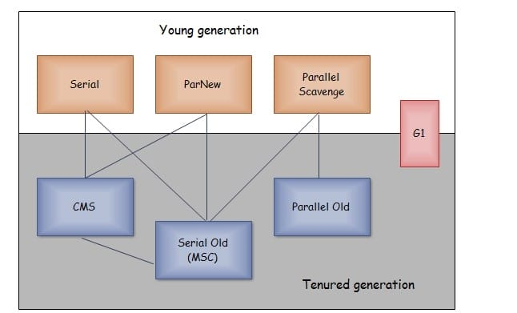
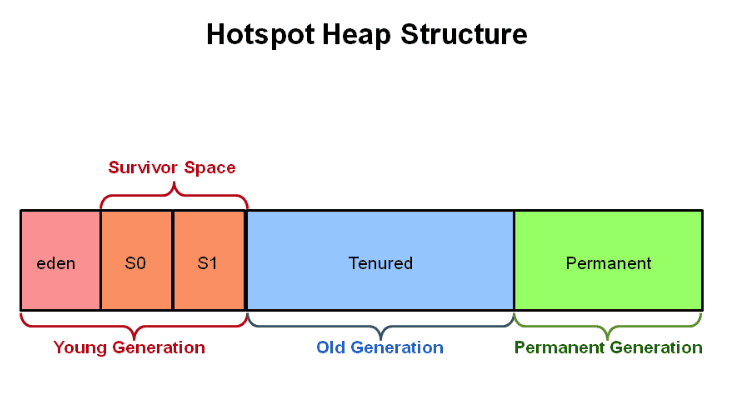

[toc]

# 垃圾回收

## 对象的四种引用类型

Java执行GC判断对象是否存活有两种方式，其中一种是引用计数，Java堆中每一个对象都有一个引用计数属性，引用每新增1次计数加1，引用每释放1次计数减1。

从JDK 1.2版本开始，对象的引用被划分为4种级别，从而使程序能更加灵活地控制对象的生命周期。这4种级别由高到低依次为：**强引用、软引用、弱引用和虚引用**。


### 强引用

强引用是使用最普遍的引用。**如果一个对象具有强引用，那垃圾回收器绝不会回收它。** 如下：

```java
 Object strongReference = new Object();
```

当内存空间不足时，Java虚拟机宁愿抛出 `OutOfMemoryError` 错误，使程序异常终止，也不会靠随意回收具有强引用的对象来解决内存不足的问题。 如果强引用对象不使用时，需要弱化从而使GC能够回收，如下：

```java
strongReference = null;
```

显式地设置 `strongReference` 对象为 `null` ，或让其超出对象的生命周期范围，则GC认为该对象不存在引用，这时就可以回收这个对象。具体什么时候收集这要取决于GC算法。

在一个方法的内部有一个强引用，这个引用保存在Java栈中，而真正的引用对象保存在Java堆中。当这个方法运行完成后，就会退出方法栈，则引用对象的引用数为0，这个对象会被回收。但是如果这个 `strongReference` 是全局变量时，就需要在不用这个对象时赋值为 `null` ，因为强引用不会被垃圾回收。

`ArrayList#clear()` 方法：

```java
    public void clear() {
        modCount++;

        // clear to let GC do its work
        for (int i = 0; i < size; i++)
            elementData[i] = null;

        size = 0;
    }
```

在 `ArrayList` 类中定义了一个 `elementData` 数组，在调用 `clear` 方法清空数组时，每个数组元素被赋值为 `null` 。
不同于 `elementData=null` ，强引用仍然存在，避免在后续调用 `add()` 等方法添加元素时进行内存的重新分配。使用如 `clear()` 方法内存数组中存放的引用类型进行内存释放特别适用，这样就可以及时释放内存。

### 软引用

如果一个对象只具有软引用，**内存空间充足时垃圾回收器就不会回收它；如果内存空间不足了，就会回收这些对象的内存。** 只要垃圾回收器没有回收它，该对象就可以被程序使用。**软引用可用来实现内存敏感的高速缓存。**

```java
// 强引用
String strongReference = new String("abc");
// 软引用
String str = new String("abc");
SoftReference<String> softReference = new SoftReference<String>(str);
```

软引用可以和一个引用队列 `ReferenceQueue` 联合使用。如果软引用所引用对象被垃圾回收，Java虚拟机就会把这个软引用加入到与之关联的引用队列中。

```java
ReferenceQueue<String> referenceQueue = new ReferenceQueue<>();
String str = new String("abc");
SoftReference<String> softReference = new SoftReference<>(str, referenceQueue);

str = null;
// Notify GC
System.gc();

System.out.println(softReference.get()); // abc
Reference<? extends String> reference = referenceQueue.poll();
System.out.println(reference); //null
```

> 注意：软引用对象是在JVM内存不够的时候才会被回收，我们调用 `System.gc()` 方法只是起通知作用，JVM什么时候扫描回收对象是JVM自己的状态决定的。就算扫描到软引用对象也不一定会回收它，只有内存不够的时候才会回收。

当内存不足时，JVM首先将软引用中的对象引用置为 `null` ，然后通知垃圾回收器进行回收。垃圾收集线程会在虚拟机抛出 `OutOfMemoryError` 之前回收软引用对象，而且虚拟机会尽可能优先回收长时间闲置不用的软引用对象。对那些刚构建的或刚使用过的 **较新的软对象会被虚拟机尽可能保留**，这就是引入引用队列 `ReferenceQueue` 的原因。

> 应用场景 - 浏览器的后退处理
> 
> 当点击后退时，这个后退时显示的网页内容是重新进行请求还是从缓存中取出呢？这就要看具体的实现策略了。如果一个网页在浏览结束时就进行内容的回收，则按后退查看前面浏览过的页面时，需要重新构建；如果将浏览过的网页存储到内存中会造成内存的大量浪费，甚至会造成内存溢出。这时候就可以使用软引用，很好的解决了实际的问题。

### 弱引用

弱引用与软引用的区别在于：**只具有弱引用的对象拥有更短暂的生命周期**。在垃圾回收器线程扫描它所管辖的内存区域的过程中，一旦发现了只具有弱引用的对象，**不管当前内存空间足够与否，都会回收它的内存**。不过，由于垃圾回收器是一个优先级很低的线程，因此不一定会很快发现那些只具有弱引用的对象。

如果一个对象是偶尔或很少使用，并且希望在使用时随时就能获取到，但又不想影响此对象的垃圾收集，那么你应该用 `WeakReference` 来记住此对象。

当然，一个弱引用对象也可以再次变为一个强引用，如下：

```java
 String str = new String("abc");
WeakReference<String> weakReference = new WeakReference<>(str);
// 弱引用转强引用
String strongReference = weakReference.get();
```

同样，弱引用可以和一个引用队列 `ReferenceQueue` 联合使用，如果弱引用所引用的对象被垃圾回收，Java虚拟机就会把这个弱引用加入到与之关联的引用队列中。

```java
public class GCTarget {
    public String id;
    byte[] buffer = new byte[1024];

    public GCTarget(String id) {
        this.id = id;
    }

    protected void finalize() throws Throwable {
        System.out.println("Finalizing GCTarget, id is : " + id);
    }
}

public class GCTargetWeakReference extends WeakReference<GCTarget> {
    public String id;

    public GCTargetWeakReference(GCTarget gcTarget,
              ReferenceQueue<? super GCTarget> queue) {
        super(gcTarget, queue);
        this.id = gcTarget.id;
    }

    protected void finalize() {
        System.out.println("Finalizing GCTargetWeakReference " + id);
    }
}

public class WeakReferenceTest {
    private final static ReferenceQueue<GCTarget> REFERENCE_QUEUE = new ReferenceQueue<>();// 弱引用队列

    public static void main(String[] args) {
        LinkedList<GCTargetWeakReference> gcTargetList = new LinkedList<>();

        // 创建弱引用的对象，依次加入链表中
        for (int i = 0; i < 5; i++) {
            GCTarget gcTarget = new GCTarget(String.valueOf(i));
            GCTargetWeakReference weakReference = new GCTargetWeakReference(gcTarget, REFERENCE_QUEUE);
            gcTargetList.add(weakReference);

            System.out.println("Just created GCTargetWeakReference obj: " + gcTargetList.getLast());
        }

        System.gc();// 通知GC进行垃圾回收

        try {
            Thread.sleep(6000);// 休息几分钟，等待上面的垃圾回收线程运行完成
        } catch (InterruptedException e) {
            e.printStackTrace();
        }

        // 检查关联的引用队列是否为空
        Reference<? extends GCTarget> reference;
        while((reference = REFERENCE_QUEUE.poll()) != null) {
            if(reference instanceof GCTargetWeakReference) {
                System.out.println("In queue, id is: " + ((GCTargetWeakReference) (reference)).id);
            }
        }
    }
}
```

运行WeakReferenceTest.java，可观察垃圾回收的日志。

弱引用通常用来实现规范化映射（canonicalizing mappings），例如 `WeakHashMap`、`WeakCache` 。

### 虚引用

虚引用顾名思义，就是**形同虚设**。与其他几种引用都不同，**虚引用并不会决定对象的生命周期**。如果一个对象仅持有虚引用，那么它就和没有任何引用一样，**在任何时候都可能被垃圾回收器回收**。虚引用主要用来跟踪对象被垃圾回收器回收的活动。

 虚引用与软引用和弱引用的一个区别在于，虚引用必须和引用队列 `ReferenceQueue` 联合使用。当垃圾回收器准备回收一个对象时，如果发现它还有虚引用，就会在回收对象的内存之前，把这个虚引用加入到与之关联的引用队列中。

 ```java
String str = new String("abc");
ReferenceQueue queue = new ReferenceQueue();
// 创建虚引用，要求必须与一个引用队列关联
PhantomReference pr = new PhantomReference(str, queue);
 ```

程序可以**通过判断引用队列中是否已经加入了虚引用，来了解被引用的对象是否将要进行垃圾回收**。如果程序发现某个虚引用已经被加入到引用队列，那么就可以在所引用的对象的内存被回收之前采取必要的行动。在JDK中，虚引用用来做堆外内存管理。

### 总结

> 四种引用级别和强度：强引用 > 软引用 > 弱引用 > 虚引用

| 引用类型 | 被垃圾回收时间 | 用途 | 生存时间 |
| --- | --- | --- | --- |
| 强引用 | 从来不会 | 对象的一般状态 | JVM停止运行时终止 |
| 软引用 | 内存不足时 | 对象缓存 | 内存不足时终止 |
| 弱引用 | 正常垃圾回收时 | 对象缓存 | 垃圾回收后终止 |
| 虚引用 | 正常垃圾回收时 | 跟踪对象的垃圾回收 | 垃圾回收后终止 |

## 对象回收算法

### 引用计数算法

给对象添加一个引用计数器，当对象增加一个引用时计数器加 1，引用失效时计数器减 1。引用计数为 0 的对象可被回收。两个对象出现循环引用的情况下，此时引用计数器永远不为 0，导致无法对它们进行回收。正因为循环引用的存在，因此 Java 虚拟机不使用引用计数算法。

### 可达性分析算法

通过 GC Roots 作为起始点进行搜索，能够到达到的对象都是存活的，不可达的对象可被回收。


Java 虚拟机使用该算法来判断对象是否可被回收，在 Java 中 GC Roots 一般包含以下内容:

* 虚拟机栈中引用的对象
* 本地方法栈中引用的对象
* 方法区中类静态属性引用的对象
* 方法区中的常量引用的对象

## 垃圾回收算法

### 标记-清除法

将存活的对象进行标记，然后清理掉未被标记的对象。

缺点如下：

* 标记和清除过程效率都不高。
* 会产生大量不连续的内存碎片，导致无法给大对象分配内存。


### 标记-整理法

让所有存活的对象都向一端移动，然后直接清理掉端边界以外的内存。


### 复制法

将内存划分为大小相等的两块，每次只使用其中一块，当这一块内存用完了就将还存活的对象复制到另一块上面，然后再把使用过的内存空间进行一次清理。

缺点如下：

* 每次都只使用了一半的内存。


现在的商业虚拟机都采用这种收集算法来回收新生代，但是并不是将新生代划分为大小相等的两块，而是分为一块较大的 Eden 空间和两块较小的 Survivor 空间，每次使用 Eden 空间和其中一块 Survivor。在回收时，将 Eden 和 Survivor 中还存活着的对象一次性复制到另一块 Survivor 空间上，最后清理 Eden 和使用过的那一块 Survivor。

HotSpot 虚拟机的 Eden 和 Survivor 的大小比例默认为 8:1，保证了内存的利用率达到 90%。如果每次回收有多于 10% 的对象存活，那么一块 Survivor 空间就不够用了，此时需要依赖于老年代进行分配担保，也就是借用老年代的空间存储放不下的对象。

### 分代收集法

根据对象存活周期将内存划分为几块，不同块采用适当的收集算法。一般将堆分为新生代和老年代，不同代使用不同方法：

* 新生代使用: 复制算法
* 老年代使用: 标记 - 清除 或者 标记 - 整理 算法

## 垃圾收集器

以下是 HotSpot 虚拟机中的 7 个垃圾收集器，连线表示垃圾收集器可以配合使用。

* 单线程与多线程：单线程指的是垃圾收集器只使用一个线程进行收集，而多线程使用多个线程。
* 串行与并行：串行指的是垃圾收集器与用户程序交替执行，这意味着在执行垃圾收集的时候需要停顿用户程序；并形指的是垃圾收集器和用户程序同时执行。除了 CMS 和 G1 之外，其它垃圾收集器都是以串行的方式执行。



### 1. Serial 收集器


单线程的串行收集器，只会使用一个线程进行垃圾收集工作。优点是简单高效，对于单个 CPU 环境来说，由于没有线程交互的开销，因此拥有最高的单线程收集效率。

它是 Client 模式下的默认新生代收集器，因为在用户的桌面应用场景下，分配给虚拟机管理的内存一般来说不会很大。Serial 收集器收集几十兆甚至一两百兆的新生代停顿时间可以控制在一百多毫秒以内，只要不是太频繁，这点停顿是可以接受的。

### 2. ParNew 收集器


ParNew 收集器是 Serial 收集器的多线程版本。它是 Server 模式下的虚拟机首选新生代收集器，除了性能原因外，主要是因为除了 Serial 收集器，只有它能与 CMS 收集器配合工作。

默认开启的线程数量与 CPU 数量相同，可以使用 `-XX:ParallelGCThreads` 参数来设置线程数。

### 3. Parallel Scavenge 收集器

与 ParNew 一样是多线程收集器。其它收集器关注点是尽可能缩短垃圾收集时用户线程的停顿时间，而它的目标是达到一个可控制的吞吐量，它被称为**“吞吐量优先”收集器**。这里的吞吐量指 CPU 用于运行用户代码的时间占总时间的比值。

停顿时间越短就越适合需要与用户交互的程序，良好的响应速度能提升用户体验。而高吞吐量则可以高效率地利用 CPU 时间，尽快完成程序的运算任务，主要适合在后台运算而不需要太多交互的任务。

缩短停顿时间是以牺牲吞吐量和新生代空间来换取的：**新生代空间变小，垃圾回收变得频繁，导致吞吐量下降**。

可以通过一个开关参数打开 **GC 自适应的调节策略(GC Ergonomics)**，就不需要手动指定新生代的大小(`-Xmn`)、Eden 和 Survivor 区的比例、晋升老年代对象年龄等细节参数了。虚拟机会根据当前系统的运行情况收集性能监控信息，动态调整这些参数以提供最合适的停顿时间或者最大的吞吐量。

### 4. Serial Old 收集器


Serial Old 收集器是 Serial 收集器的老年代版本，也是给 Client 模式下的虚拟机使用。如果用在 Server 模式下，它有两大用途：

1. 在 JDK 1.5 以及之前版本(Parallel Old 诞生以前)中与 Parallel Scavenge 收集器搭配使用。
2. 作为 CMS 收集器的后备预案，在并发收集发生 Concurrent Mode Failure 时使用。

### 5. Parallel Old 收集器


Parallel Old 收集器是 Parallel Scavenge 收集器的老年代版本。

在注重吞吐量以及 CPU 资源敏感的场合，都可以优先考虑 Parallel Scavenge 加 Parallel Old 收集器。

### 6. CMS（Concurrent Mark Sweep）收集器


CMS收集垃圾分为以下四个步骤：

1. **初始标记**：仅仅只是标记一下 GC Roots 能直接关联到的对象，速度很快，需要停顿。
2. **并发标记**：进行 GC Roots Tracing 的过程，它在整个回收过程中耗时最长，不需要停顿。
3. **重新标记**：为了修正并发标记期间因用户程序继续运作而导致标记产生变动的那一部分对象的标记记录，需要停顿。
4. **并发清除**：不需要停顿。

在整个过程中耗时最长的并发标记和并发清除过程中，收集器线程都可以与用户线程一起工作，不需要进行停顿。

缺点如下：

* **吞吐量低**：低停顿时间是以牺牲吞吐量为代价的，导致 CPU 利用率不够高。
* **无法处理浮动垃圾，可能出现 Concurrent Mode Failure**：浮动垃圾是指并发清除阶段由于用户线程继续运行而产生的垃圾，这部分垃圾只能到下一次 GC 时才能进行回收。由于浮动垃圾的存在，因此需要预留出一部分内存，意味着 CMS 收集不能像其它收集器那样等待老年代快满的时候再回收。如果预留的内存不够存放浮动垃圾，就会出现 Concurrent Mode Failure，这时虚拟机将临时启用 Serial Old 来替代 CMS。
* **标记-清除算法导致的空间碎片**：往往出现老年代空间剩余，但无法找到足够大连续空间来分配当前对象，不得不提前触发一次 Full GC。

### 7. G1（Garbage-First）收集器

G1是一款面向服务端应用的垃圾收集器，在多 CPU 和大内存的场景下有很好的性能。HotSpot 开发团队赋予它的使命是未来可以替换掉 CMS 收集器。

堆被分为新生代和老年代，其它收集器进行收集的范围都是整个新生代或者老年代，而 G1 可以直接对**新生代和老年代一起回收**。



G1 把堆划分成多个大小相等的独立区域(Region)，新生代和老年代不再物理隔离。通过引入 **Region** 的概念，从而将原来的一整块内存空间划分成多个的小空间，使得每个小空间可以单独进行垃圾回收。


这种划分方法带来了很大的灵活性，使得可预测的停顿时间模型成为可能。通过记录每个 Region 垃圾回收时间以及回收所获得的空间(这两个值是通过过去回收的经验获得)，并维护一个优先列表，每次根据允许的收集时间，**优先回收价值最大的 Region**。


每个 Region 都有一个 **Remembered Set**，用来记录该 Region 对象的引用对象所在的 Region。通过使用 Remembered Set，在做可达性分析的时候就可以避免全堆扫描。

如果不计算维护 Remembered Set 的操作，G1 收集器的运作大致可划分为以下几个步骤：

1. **初始标记**
2. **并发标记**
3. **最终标记**：为了修正在并发标记期间因用户程序继续运作而导致标记产生变动的那一部分标记记录，虚拟机将这段时间对象变化记录在线程的 Remembered Set Logs 里面，最终标记阶段需要把 Remembered Set Logs 的数据合并到 Remembered Set 中。这阶段需要停顿线程，但是可并行执行。
4. **筛选回收**：首先对各个 Region 中的回收价值和成本进行排序，根据用户所期望的 GC 停顿时间来制定回收计划。此阶段其实也可以做到与用户程序一起并发执行，但是因为只回收一部分 Region，时间是用户可控制的，而且停顿用户线程将大幅度提高收集效率。

具备如下特点：

* **空间整理**：整体来看是**基于标记-整理算法**实现的收集器，从局部(两个 Region 之间)上来看是基于“复制”算法实现的，这意味着运行期间**不会产生内存空间碎片**。
* **可预测的停顿**：能让使用者明确指定在一个长度为 M 毫秒的时间片段内，消耗在 GC 上的时间不得超过 N 毫秒。

## 垃圾回收策略

### Minor GC、Major GC、Full GC

JVM 在进行 GC 时，并非每次都对堆内存（新生代、老年代；方法区）区域一起回收的，大部分时候回收的都是指新生代。

针对 HotSpot VM 的实现，它里面的 GC 按照回收区域又分为两大类：部分收集（Partial GC），整堆收集（Full GC）

* **部分收集（Partial GC）**：对部分垃圾进行清理。
  *  **新生代收集（Minor GC/Young GC）**：只是新生代的垃圾收集
  *  **老年代收集（Major GC/Old GC）**：只是老年代的垃圾收集。目前，只有 **CMS 回收器**会有单独收集老年代的行为。很多时候，Major GC 会和 Full GC 混合使用，需要具体分辨是老年代回收还是整堆回收。
  * **混合收集（Mixed GC）**：收集整个新生代以及部分老年代的垃圾收集。目前只有 **G1 回收器**会有这种行为。
* **整堆收集（Full GC）**：收集整个 Java 堆和方法区的垃圾。

### Full GC 的触发条件

对于 Minor GC，其触发条件非常简单，当 Eden 空间满时，就将触发一次 Minor GC。而 Full GC 则相对复杂，有以下条件:

#### 1. 调用 System.gc()

只是建议虚拟机执行 Full GC，但是虚拟机不一定真正去执行。不建议使用这种方式，而是让虚拟机管理内存。

#### 2. 老年代空间不足

老年代空间不足的常见场景为前文所讲的大对象直接进入老年代、长期存活的对象进入老年代等。为了避免以上原因引起的 Full GC，应当**尽量不要创建过大的对象以及数组**。除此之外，可以通过 `-Xmn` 虚拟机参数调大新生代的大小，让对象尽量在新生代被回收掉，不进入老年代。还可以通过 `-XX:MaxTenuringThreshold` 调大对象进入老年代的年龄，让对象在新生代多存活一段时间。

#### 3. 空间分配担保失败

使用复制算法的 Minor GC 需要老年代的内存空间作担保，如果担保失败会执行一次 Full GC。

#### 4. JDK 1.7 及以前的永久代空间不足

在 JDK 1.7 及以前，HotSpot 虚拟机中的方法区是用永久代实现的，永久代中存放的为一些 Class 的信息、常量、静态变量等数据。当系统中要加载的类、反射的类和调用的方法较多时，永久代可能会被占满，在未配置为采用 CMS GC 的情况下也会执行 Full GC。如果经过 Full GC 仍然回收不了，那么虚拟机会抛出 `java.lang.OutOfMemoryError`。为避免以上原因引起的 Full GC，可采用的方法为增大永久代空间或转为使用 CMS GC。

#### 5. Concurrent Mode Failure

执行 CMS GC 的过程中同时有对象要放入老年代，而此时老年代空间不足，可能是 GC 过程中浮动垃圾过多导致暂时性的空间不足。便会报 **Concurrent Mode Failure** 错误，并触发 Full GC。

### 内存分配策略

为了更好地进行垃圾回收，JVM在内存分配上也有一些策略。

#### 对象优先在 Eden

分配大多数情况下，对象在新生代 Eden 区分配，当 Eden 区空间不够时，发起 Minor GC。

#### 大对象直接进入老年代

大对象是指需要连续内存空间的对象，最典型的大对象是那种很长的字符串以及数组。经常出现大对象会提前触发垃圾收集以获取足够的连续空间分配给大对象。`-XX:PretenureSizeThreshold`，大于此值的对象直接在老年代分配，避免在 Eden 区和 Survivor 区之间的大量内存复制。

#### 长期存活的对象进入老年代

为对象定义年龄计数器，对象在 Eden 出生并经过 Minor GC 依然存活，将移动到 Survivor 中，年龄就增加 1 岁，增加到一定年龄则移动到老年代中。`-XX:MaxTenuringThreshold` 用来定义年龄的阈值。

#### 动态对象年龄判定

虚拟机并不是永远地要求对象的年龄必须达到 `MaxTenuringThreshold` 才能晋升老年代，如果在 Survivor 中相同年龄所有对象大小的总和大于 Survivor 空间的一半，则年龄大于或等于该年龄的对象可以直接进入老年代，无需等到 `MaxTenuringThreshold` 中要求的年龄。

#### 空间分配担保

在发生 Minor GC 之前，虚拟机先检查老年代最大可用的连续空间是否大于新生代所有对象总空间，如果条件成立的话，那么 Minor GC 可以确认是安全的。

如果不成立的话虚拟机会查看 `HandlePromotionFailure` 设置值是否允许担保失败，如果允许那么就会继续检查老年代最大可用的连续空间是否大于历次晋升到老年代对象的平均大小，如果大于，将尝试着进行一次 Minor GC；如果小于，或者 `HandlePromotionFailure` 设置不允许冒险，那么就要进行一次 Full GC。


## 参考资料

* [掘金 - 理解Java的强引用、软引用、弱引用和虚引用](https://juejin.cn/post/6844903665241686029)
* [腾讯云 - 虚引用管理堆外内存](https://cloud.tencent.com/developer/article/1843330)
* [Java全栈知识体系 - GC - Java 垃圾回收基础知识](https://pdai.tech/md/java/jvm/java-jvm-gc.html)