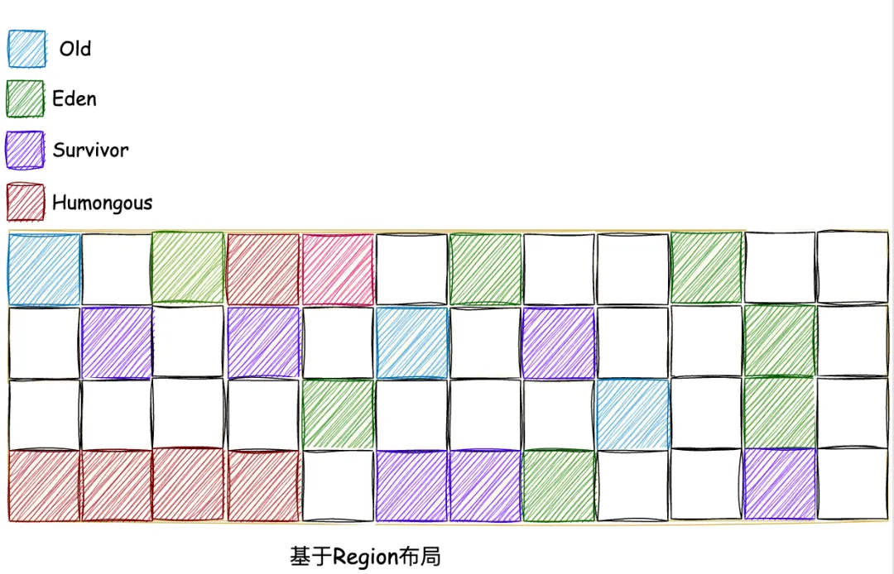

# G1垃圾回收器

G1（Garbage First 缩写）垃圾回收器，是在JDK7中加入JVM，在JDK9中成为了默认的垃圾收集器。

* **基于Region的内存布局**：内存堆被分割为很多固定大小的 Region 块，垃圾回收器按 Region 为单位进行内存管理。
* **停顿时间模型**：垃圾回收能够支持指定在一个长度为M毫秒的时间片段内，消耗在垃圾收集上的时间大概率不超过N毫秒。

## G1的内存模型

### 分区 Region

G1采用了分区 Region 的思路，将整个堆空间分成若干个大小相等的内存区域，每次分配对象空间将逐段地使用内存。因此，在堆的使用上，G1并不要求对象的存储一定是物理上连续的，只要逻辑上连续即可；每个分区也不会确定地为某个代服务，可以按需在年轻代和老年代之间切换。启动时可以通过参数 `-XX:G1HeapRegionSize=n` 可指定分区大小(**1MB~32MB**，且必须是2的幂)，**默认将整堆划分为 `2048` 个分区**。

### 卡片 Card

在每个分区内部又被分成了若干个大小为 **`512 Byte` 卡片（Card）**，标识堆内存最小可用粒度所有分区的卡片将会记录在**全局卡片表（Global Card Table）**中，分配的对象会占用物理上连续的若干个卡片，当查找对分区内对象的引用时便可通过记录卡片来查找该引用对象。每次对内存的回收，都是对指定分区的卡片进行处理。

### 分代管理

与其他垃圾收集器类似，G1将内存在逻辑上划分为**年轻代**和**老年代**，其中年轻代又划分为 **Eden空间**和 **Survivor空间**。但年轻代空间并不是固定不变的，当现有年轻代分区占满时，JVM会分配新的空闲分区加入到年轻代空间。

整个年轻代内存会在初始空间 `-XX:G1NewSizePercent` （默认整堆5%）与最大空间（默认60%）之间动态变化，且由参数目标暂停时间 `-XX:MaxGCPauseMillis` (默认200ms)、需要扩缩容的大小以 `-XX:G1MaxNewSizePercent` 及分区的已记忆集合(RSet)计算得到。当然，G1依然可以设置固定的年轻代大小(参数 `-XX:NewRatio` 、`-Xmn` )，但同时暂停目标将失去意义。

### Humongous 对象

Region 中还有一类特殊的 **Humongous 区域**，专门用来存储大对象，可以简单理解为对应着老年代。只要大小超过了一个 Region 容量一半的对象（即超过1.5个region）即可判定为大对象。

巨型对象会独占一个、或多个连续分区，其中第一个分区被标记为开始巨型（StartsHumongous），相邻连续分区被标记为连续巨型（ContinuesHumongous）。由于无法享受Lab带来的优化，并且确定一片连续的内存空间需要扫描整堆，因此确定巨型对象开始位置的成本非常高，如果可以，应用程序应避免生成巨型对象。

### 记忆集合

在每个分区记录了一个已记忆集合(RSet)，内部类似一个反向指针，记录引用分区内对象的卡片索引。当要回收该分区时，通过扫描分区的RSet，来确定引用本分区内的对象是否存活，进而确定本分区内的对象存活情况。由于Region数量较多，每个Region都维护有自己的记忆集，光是存储记忆集这块就要占用相当一部分内存，G1比其他圾收集器有着更高的内存占用负担。

事实上，并非所有的引用都需要记录在RSet中，如果一个分区确定需要扫描，那么无需RSet也可以无遗漏的得到引用关系。那么引用源自本分区的对象，当然不用落入RSet中；同时，G1 GC每次都会对年轻代进行整体收集，因此引用源自年轻代的对象，也不需要在RSet中记录。最后只有老年代的分区可能会有RSet记录，这些分区称为拥有RSet分区(an RSet’s owning region)。

### 本地分配缓冲

由于分区的思想，每个线程均可以"认领"某个分区用于线程本地的内存分配，而不需要顾及分区是否连续。因此，每个应用线程和GC线程都会独立的使用分区，进而减少同步时间，提升GC效率，这个分区称为本地分配缓冲区(Lab)。

## 参考资料

* [Java全栈知识体系 - Java 垃圾回收器之G1详解](https://pdai.tech/md/java/jvm/java-jvm-gc-g1.html)
* [微信公众号 - 深入解析G1垃圾回收器 - by Java随想录](https://mp.weixin.qq.com/s/j6Zit61yEfWSThd3E6DWQQ)