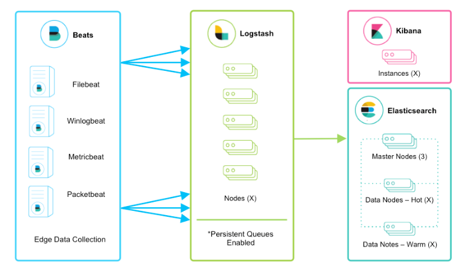

# ELK

ELK架构就是由**Elasticsearch**、**Logstash**、**Kibana**这三个开源项目进行搭建的日志收集处理器。

## 简介

### FileBeat

> Filebeat是用于转发和集中日志数据的轻量级传送程序。作为服务器上的代理安装，Filebeat监视您指定的日志文件或位置，收集日志事件，并将它们转发到ElasticSearch或Logstash进行索引。

### Logstash

> Logstash是具有实时流水线功能的开源数据收集引擎。Logstash可以动态统一来自不同来源的数据，并将数据标准化到您选择的目标位置。清除所有数据并使其民主化，以用于各种高级下游分析和可视化用例。 虽然Logstash最初推动了日志收集方面的创新，但其功能远远超出了该用例。可以使用各种输入，过滤器和输出插件来丰富和转换任何类型的事件，其中许多本机编解码器进一步简化了提取过程。Logstash通过利用更大数量和更多种类的数据来加快您的见解。

### ElasticSearch

> Elasticsearch是位于Elastic Stack核心的分布式搜索和分析引擎。Logstash和Beats有助于收集，聚合和丰富您的数据并将其存储在Elasticsearch中。使用Kibana，您可以交互式地探索，可视化和共享对数据的见解，并管理和监视堆栈。Elasticsearch是发生索引，搜索和分析魔术的地方。 Elasticsearch为所有类型的数据提供近乎实时的搜索和分析。无论您是结构化文本还是非结构化文本，数字数据或地理空间数据，Elasticsearch都能以支持快速搜索的方式有效地对其进行存储和索引。您不仅可以进行简单的数据检索，还可以汇总信息来发现数据中的趋势和模式。随着数据和查询量的增长，Elasticsearch的分布式特性使您的部署可以随之顺畅地无缝增长。

### Kibana

> - 搜索，观察和保护。 从发现文档到分析日志再到发现安全漏洞，Kibana是您访问这些功能及其他功能的门户。
> - 可视化和分析您的数据。 搜索隐藏的见解，可视化您在图表，仪表，地图等中找到的内容，并将其组合在仪表板中。
> - 管理，监视和保护弹性堆栈。 管理索引和提取管道，监视Elastic Stack集群的运行状况，并控制哪些用户可以访问哪些功能。

## 参考资料

[Elastic官网 - ELK-STACK](https://www.elastic.co/cn/what-is/elk-stack)
[博客园 - 搞懂ELK并不是一件特别难的事（ELK）](https://www.cnblogs.com/zsql/p/13164414.html)