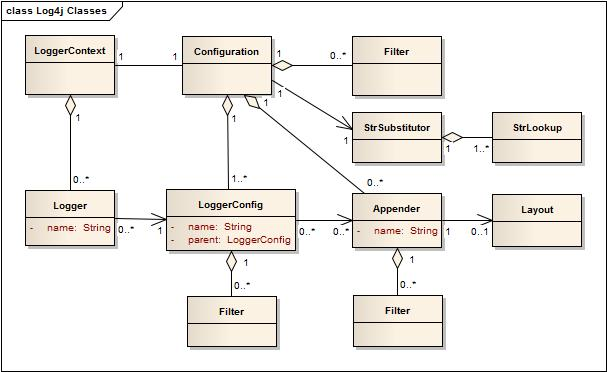

# LOG4J

> Log4j 是 Apache 的一个开放源代码项目，通过使用 Log4j，我们可以控制日志信息输送的目的地是控制台、文件、GUI组件、甚至是套接口服务器、NT的事件记录器、UNIX Syslog守护进程等；我们也可以控制每一条日志的输出格式；通过定义每一条日志信息的级别，我们能够更加细致地控制日志的生成过程。最令人感兴趣的就是，这些可以通过一个配置文件来灵活地进行配置，而不需要修改应用的代码。

> 此外，通过 Log4j 其他语言接口，您可以在 C、C+ +、.Net、PL/SQL 程序中使用 Log4j，其语法和用法与在 Java 程序中一样，使得多语言分布式系统得到一个统一一致的日志组件模块。而且，通过使用各种第三方扩展，您可以很方便地将 Log4j 集成到 J2EE、JINI 甚至是 SNMP 应用中。****

## Log4j2新功能

## Log4j性能表现

性能评估主要评估两个指标：**吞吐量**和**延迟**。

异步日志峰值吞吐量比较：


异步日志响应时长比较：


异步日志消息参数化比较


## Log4j日志框架

Log4j的核心组件类图如下：



应用方使用Log4j2的API，指定的`name`请求`LogManager`获取`Logger`。`LogManager`会定位到一个`LoggerContext`，然后由它获取`Logger`，如果`Logger`需要新建的话，则会关联一个`LoggerConfig`。`LoggerConfig`由`Logger`的配置生成，有三种来源：`Logger`同名、父目录包或根目录包配置，然后关联到发送`LogEvents`的`Appenders`。

### Logger

`Logger`由`LogManager.getLogger(name)`创建，本身没有直接的行为。`Logger`有个name，并且关联一个`LoggerConfig`。不同的配置会生成不同的`LoggerConfig`，也就产生了不同的`Logger`行为。

#### Named Hierarchy

如果一个`LoggerConfig`的名称(下一个字符是“.”)是后代logger的前缀，则称它是另外一个`LoggerConfig`的祖先。类似于java的包层级关系，例如“`java.util.Vector`”。特殊地，根名称是`LogManager.ROOT_LOGGER_NAME`，可通过`LogManager.getLogger(LogManager.ROOT_LOGGER_NAME)`或者`LogManager.getRootLogger()`获取根`Logger`。

#### LoggerConfig

`LoggerConfig`包含一个传递到`Appender`之前的`Filters`的集合，同时包含一个用来处理Event的`Appenders`的集合。

#### 日志等级

* ALL
* TRACE
* DEBUG
* INFO
* WARN
* ERROR
* FATAL
* OFF

除此之外，log4j也支持自定义日志等级。另外一种获取更多粒度的方法是使用`Marker`。

Log4j和Logback一样，都有`Level Inheritance`概念。

### Filter

除了日志等级过滤之外，log4j提供的`Filter`还可以应用到不同的阶段：`LoggerConfig`之前、`Appenders`之前、每一个`Appender`。`Filter`有三种返回结果：**Accept**（不会执行其他Filters，将处理事件）， **Deny**（不会执行其他Filters，将丢弃事件），**Neutral**（继续执行其他Filters）。

### Appender

Log4j允许日志请求输出到不同的目的地，比如控制台、文件、远程网络服务器、Flume、JMS、远程UNIX 日志进程、不同的数据库API等。

对于一个给定的logger，每个启用的日志请求将发送到所有`LoggerConfig`中的`Appenders`，并且parent的`LoggerConfigs`也会。也就是，从`LoggerConfig`的来说具有继承可加性（appender additivity）。

**Appender Additivitity**

> `Logger` L的一条日志语句的输出将发送到与L关联的`LoggerConfig`中的所有`Appender`以及该 `LoggerConfig`的祖先。
> 但是，如果与 `Logger` L关联的 `LoggerConfig`的祖先（例如 P）将可加性标志设置为 false，那么L的输出将被定向到L的 `LoggerConfig`中的所有 `appender`，它的祖先直到并包括P，但不包括P的任何祖先中的`Appender`。默认情况下，`Logger`的可加性标志设置为`true`。

### Layout

`Layout`用于指定日志事件`LogEvent`的输出格式，而`Appender`更多的是把`Layout`格式化的输出结果输出到目的地。

`PatternLayout`是log4j的一部分，可以让用户按类似于C语言的printf格式进行格式化。例如，"%r [%t] %-5p %c - %m%n"的格式可能输出如下信息：
```text
176 [main] INFO  org.foo.Bar - Located nearest gas station.

```

Log4j附带了很多格式的`Layout`，例如JSON、XML、HTML、Syslog等。数据库相关的其他`Layout`将按指定字段进行填充。

## 配置架构

Log4j配置体现为Tree-Structure，节点包含一些列属性集合，孩子节点集合和一个PluginType，插件体现了节点的行为。

Log4j支持的每个文档类型都有一个`ConfigurationFactory`，工厂本身描述了它支持的文件扩展和优先级。properties、yaml、json、xml的优先级从高到低。当自动配置的时候，Log4j会按顺序决定使用哪一个factory，然后创建对应的`Configuration`。

一旦节点树被创建，控制将委托给`AbstractConfiguration`，它会使用Log4j的插件系统把节点转换成java对象，并提供一些能力。

## Log4j2配置

Log4j2的配置有四种方式：
1. XML、JSON、YAML或properties的配置文件。
2. 创建`ConfigurationFactory`和`Configuration`实现的编程方式。
3. 调用`Configuration`的API接口添加组件到默认配置的编程方式。
4. 调用内部的`Logger`类方法的编程方式。

上述四种配置方式都是函数等价的。一般来说，配置文件会更加友好。编程方式可以参考[Extending Log4j2](https://logging.apache.org/log4j/2.x/manual/extending.html) 和 [Programmatic Log4j Configuration](https://logging.apache.org/log4j/2.x/manual/customconfig.html)。

### 配置优先级

1. 系统属性`log4j2.configurationFile`所定义的文件位置
2. `log4j2-test.properties`
3. `log4j2-test.yaml` 或 `log4j2-test.yml`
4. `log4j2-test.json` 或 `log4j2-test.jsn`
5. `log4j2-test.xml`
6. `log4j2.properties`
7. `log4j2.yaml` 或 `log4j2.yml`
8. `log4j2.json` 或 `log4j2.jsn`
9. `log4j2.xml`
10. Log4j的`DefaultConfiguration`，日志输出到控制台

### 配置语法

Log4j可以让你很容易地重定义logger的行为，而不用修改你的应用代码。

在XML文件中的配置元素接收的属性有如下：

| 属性名 | 描述 |
| --- | --- |
| advertiser | Advertiser 插件名称，将用于宣称单个`FileAppender` 或 `SocketAppender` 配置。提供了唯一插件是“multicastdns”。（可选） |
| dest |	可以是对于stderr的"err"、stdout的"out"、文件路径、或者一个链接。 |
| monitorInterval |	在检查文件配置是否更改之前必须经过的最短时间（单位秒），用于自动配置刷新。 |
| name | 配置名称 |
| packages | 用于搜索插件的包名称的点号分隔列表。每个类加载器只加载一次插件，因此更改此值可能不会对重新配置产生任何影响。 |
| schema | 标识类加载器的位置，用于校验XML模式的配置，只在严格模式下进行校验。 |
| shutdownHook | 指定Log4j是否在JVM关闭的时候自动关闭，shutdownHook默认开启，可设置为false禁用。 |
| shutdownTimeout |	指定JVM关闭的时候`Appenders`和后台任务在多少毫秒内关闭。默认为0表示每个`Appender`使用默认值，而不会等待后台任务，也并不是所有的`Appenders`都需要这个，它也不是一个绝对的保证时效性。 |
| status | 日志输出到控制台的Log4j的内部事件等级。Log4j将打印初始化、回滚或者一些内部的行为。|
| strict | 是否开启XML的严格模式，JSON格式不支持。|

### XML配置语法

精简版语法（Concise Syntax）
```xml
<?xml version="1.0" encoding="UTF-8"?>;
<Configuration>
  <Properties>
    <Property name="name1">value</property>
    <Property name="name2" value="value2"/>
  </Properties>
  <filter  ... />
  <Appenders>
    <appender ... >
      <filter  ... />
    </appender>
    ...
  </Appenders>
  <Loggers>
    <Logger name="name1">
      <filter  ... />
    </Logger>
    ...
    <Root level="level">
      <AppenderRef ref="name"/>
    </Root>
  </Loggers>
</Configuration>
```

严格版语法（Strict Syntax）
```xml
<?xml version="1.0" encoding="UTF-8"?>;
<Configuration>
  <Properties>
    <Property name="name1">value</property>
    <Property name="name2" value="value2"/>
  </Properties>
  <Filter type="type" ... />
  <Appenders>
    <Appender type="type" name="name">
      <Filter type="type" ... />
    </Appender>
    ...
  </Appenders>
  <Loggers>
    <Logger name="name1">
      <Filter type="type" ... />
    </Logger>
    ...
    <Root level="level">
      <AppenderRef ref="name"/>
    </Root>
  </Loggers>
</Configuration>
```

##### Loggers配置

使用logger元素配置`LoggerConfig`。logger必须指定name，一般还需要指定level（默认为ERROR）和additivity（默认为true）。

`LoggerConfig`能配置从`ThreadContextMap`中复制到properties。`LoggerConfig`可以配置超过一个的`AppenderRef`引用。

每个配置必须有一个root logger，如果没有指定默认使用root `LoggerConfig`，它默认有一个Console的`Appender`。root和其他logger的区别有：root logger没有name属性以及不能指定additivity属性。

##### Appenders配置

一个appender配置，可以使用使用特定的appender插件名称或appender元素和包含appender插件名称的type属性。每个appender都有一个唯一的指定的name。

##### Filters配置

Filter可以配置在以下四个位置：
1. 在appender、logger、properties同层的位置，filter可以接受或者拒绝已经传递到`LoggerConfig`的事件。
2. 在logger元素中，filter可以接受或拒绝指定logger的事件。
3. 在appender元素中，filter可以阻止或者接受事件被appender处理。
4. 在appender元素引用中，filter可以决定一个事件是否可以路由到appender进行处理。

##### 属性替换

Log4j支持配置文件中的指定token引用其他地方定义的properties。大部分属性是在配置被解释的时候获得的，其他的可能在运行时被评估。Log4j使用了[Apache Commons Lang](https://commons.apache.org/proper/commons-lang/)的[StrSubstitutor](https://logging.apache.org/log4j/2.x/log4j-core/apidocs/org/apache/logging/log4j/core/lookup/StrSubstitutor.html)和[StrLookup](https://logging.apache.org/log4j/2.x/log4j-core/apidocs/org/apache/logging/log4j/core/lookup/StrLookup.html)来实现。下面的配置是一个样例：

```xml
<Properties>
    <Property name="filename">target/rolling1/rollingtest-$${sd:type}.log</Property>
  </Properties>
...
<Route>
    <RollingFile name="Rolling-${sd:type}" fileName="${filename}"
        filePattern="target/rolling1/test1-${sd:type}.%i.log.gz">
        <PatternLayout>
            <pattern>%d %p %c{1.} [%t] %m%n</pattern>
            </PatternLayout>
            <SizeBasedTriggeringPolicy size="500" />
    </RollingFile>
</Route>
...
```

### 配置示例

log4j2.xml
```xml
<?xml version="1.0" encoding="UTF-8"?>
<Configuration status="WARN">
    <Properties>
        <Property name="PID">????</Property>
        <Property name="APP_NAME">energy-api</Property>
        <Property name="LOG_EXCEPTION_CONVERSION_WORD">%xEx</Property>
        <Property name="LOG_LEVEL_PATTERN">%5p</Property>
        <Property name="LOG_PATTERN">[$${env:HOST:-localhost}][${sys:app.name:-myApp}][%d{yyyy-MM-dd
            HH:mm:ss.SSS}][${LOG_LEVEL_PATTERN}][${sys:PID}][%15.15t][%-40.40c{1.}] :
            [%X{logId}][%X{PTRACER-TRACE-UUID}][%X{PTRACER-SPAN-UUID}]%m%n${LOG_EXCEPTION_CONVERSION_WORD}
        </Property>
        <Property name="LOG_PATH">./logs</Property>
    </Properties>
    <DynamicThresholdFilter key="logLevel" defaultThreshold="ERROR" onMatch="ACCEPT" onMismatch="DENY">
        <KeyValuePair key="TRACE" value="TRACE"/>
        <KeyValuePair key="DEBUG" value="DEBUG"/>
        <KeyValuePair key="INFO" value="INFO"/>
        <KeyValuePair key="WARN" value="WARN"/>
        <KeyValuePair key="ERROR" value="ERROR"/>
        <KeyValuePair key="FATAL" value="FATAL"/>
        <KeyValuePair key="OFF" value="OFF"/>
    </DynamicThresholdFilter>
    <Appenders>
        <RollingFile name="AllFile" fileName="${LOG_PATH}/${APP_NAME}.log"
                     filePattern="${LOG_PATH}/$${date:yyyy-MM}/${APP_NAME}-%d{MM-dd-yyyy}-%i.log">
            <PatternLayout pattern="${LOG_PATTERN}" charset="utf-8"/>
            <Policies>
                <OnStartupTriggeringPolicy/>
                <SizeBasedTriggeringPolicy size="20 MB"/>
                <TimeBasedTriggeringPolicy/>
            </Policies>
            <DefaultRolloverStrategy max="100"/>
        </RollingFile>

        <Kafka name="Kafka" topic="${sys:log4j2.kafka.topic}">
            <Property name="bootstrap.servers">${sys:log4j2.kafka.bootstrap.servers}</Property>
            <Property name="acks">0</Property>
            <PatternLayout pattern="${LOG_PATTERN}"/>
        </Kafka>

        <Async name="AsyncKafka" bufferSize="1024" blocking="false">
            <AppenderRef ref="Kafka"/>
        </Async>

        <Console name="Console" target="SYSTEM_OUT" follow="true">
            <PatternLayout pattern="${LOG_PATTERN}"/>
        </Console>

        <Async name="AsyncConsole" bufferSize="1024" blocking="false">
            <AppenderRef ref="Console"/>
        </Async>

        <CatAppender name="CatAppender"/>
    </Appenders>
    <Loggers>
        <Logger name="org.apache.catalina.startup.DigesterFactory" level="error"/>
        <Logger name="org.apache.catalina.util.LifecycleBase" level="error"/>
        <Logger name="org.apache.coyote.http11.Http11NioProtocol" level="warn"/>
        <logger name="org.apache.sshd.common.util.SecurityUtils" level="warn"/>
        <Logger name="org.apache.tomcat.util.net.NioSelectorPool" level="warn"/>
        <Logger name="org.hibernate.validator.internal.util.Version" level="warn"/>
        <logger name="org.springframework.boot.actuate.autoconfigure.CrshAutoConfiguration" level="warn"/>
        <logger name="org.springframework.boot.actuate.endpoint.jmx" level="warn"/>
        <logger name="com.alibaba.dubbo.common.logger.LoggerFactory" level="info"/>
        <Root level="info">
            <AppenderRef ref="AsyncKafka"/>
            <AppenderRef ref="AsyncConsole" level="error"/>
            <AppenderRef ref="CatAppender"/>
        </Root>
    </Loggers>
</Configuration>
```

### 进阶配置

#### Arbiters

#### Scripts

#### XInclude

XML格式的配置可以Include其他配置文件，例如：
```xml
<?xml version="1.0" encoding="UTF-8"?>
<configuration xmlns:xi="http://www.w3.org/2001/XInclude"
               status="warn" name="XIncludeDemo">
  <properties>
    <property name="filename">xinclude-demo.log</property>
  </properties>
  <ThresholdFilter level="debug"/>
  <xi:include href="log4j-xinclude-appenders.xml" />
  <xi:include href="log4j-xinclude-loggers.xml" />
</configuration>
```

#### Composite Configuration

Log4j允许多个配置文件通过逗号分割的文件路径配置到系统属性`log4j.configurationFile`上，或者当使用URL格式在查询中设置"override"参数。合并逻辑由系统属性`log4j.mergeStrategy`来指定，其对应一个实现`MergeStrategy`接口的类。


## Log4j提供的实现

Log4j提供了一些已有的 [Log4j-Appenders](https://logging.apache.org/log4j/2.x/manual/appenders.html)，下面列出一些常见的Appenders：
| Appender类 | 描述 | 参数 |
| --- | --- | --- |
| `org.apache.log4j.ConsoleAppender` | 控制台输出 | Threshold=WARN：日志消息的输出最低层次。<br/>ImmediateFlush=true：默认值是true，所有的消息是否被立即输出。<br/>Target=System.err：默认情况下是：System.out，指定输出控制台。
| `org.apache.log4j.FileAppender`| 文件输出 | Threshold=WARN：日志消息的输出最低层次。<br/>ImmediateFlush=true：默认值是true，所有的消息是否被立即输出。<br/>File=mylog.txt：指定消息输出到mylog.txt文件。<br/>Append=false：默认值是true，true追加，false覆盖。|
| `org.apache.log4j.DailyRollingFileAppender` | 天级日志文件 | Threshold=WARN：日志消息的输出最低层次。<br/>ImmediateFlush=true：默认值是true，所有的消息是否被立即输出。<br/>File=mylog.txt：指定消息输出到mylog.txt文件。<br/>Append=false：默认值是true，true追加，false覆盖。<br/>DatePattern=''.''yyyy-ww：每周滚动一次文件，即每周产生一个新的文件。
| `org.apache.log4j.RollingFileAppender` | 固定大小日志文件 | Threshold=WARN:指定日志消息的输出最低层次。ImmediateFlush=true：默认值是true,意谓着所有的消息都会被立即输出。<br/>File=mylog.txt：指定消息输出到mylog.txt文件。<br/>Append=false：默认值是true，true追加，false覆盖<br/>MaxFileSize=100KB: 后缀可以是KB, MB 或者是 GB. 在日志文件到达该大小时，将会自动滚动，即将原来的内容移到 mylog.log.1 文件。<br/>MaxBackupIndex=2:指定可以产生的滚动文件的最大数。|
| `org.apache.log4j.WriterAppender` | 将日志信息以流格式 | |

Log4j提供了一些已有的 [Log4j-Layouts](https://logging.apache.org/log4j/2.x/manual/layouts.html)，以下列举了一些常见的：

| Layout类 | 描述 | 参数 |
| --- | --- | --- |
| `org.apache.log4j.HTMLLayout` | 以HTML表格形式布局 | LocationInfo=true：默认值是false，输出java文件名称和行号<br/>Title=my app file: 默认值是 Log4J Log Messages。|
| `org.apache.log4j.PatternLayout` | 可以灵活地指定布局模式| ConversionPattern=%m%n :指定怎样格式化指定的消息。|
| `org.apache.log4j.SimpleLayout` | 包含日志信息的级别和信息字符串 | LocationInfo=true：默认值是 false,输出 java 文件和行号。<br/>og4j.appender.A1.layout.ConversionPattern=xxxxx：类C语言printf的日志格式。 |

PatternLayout格式化符号说明：
* %p：输出日志信息的优先级，即DEBUG，INFO，WARN，ERROR，FATAL。
* %d：输出日志时间点的日期或时间，默认格式为ISO8601，也可以在其后指定格式，如：%d\{yyyy/MM/dd HH:mm:ss,SSS\}。
* %r：输出自应用程序启动到输出该log信息耗费的毫秒数。
* %t：输出产生该日志事件的线程名。
* %l：输出日志事件的发生位置，相当于%c.%M(%F:%L)的组合，包括类全名、方法、文件名以及在代码中的行数。例如：test.TestLog4j.main(TestLog4j.java:10)。
* %c：输出日志信息所属的类目，通常就是所在类的全名。
* %M：输出产生日志信息的方法名。
* %F：输出日志消息产生时所在的文件名称。
* %L:：输出代码中的行号。
* %m:：输出代码中指定的具体日志信息。
* %n：输出一个回车换行符，Windows平台为"\r\n"，Unix平台为"\n"。
* %x：输出和当前线程相关联的NDC(嵌套诊断环境)，尤其用到像java servlets这样的多客户多线程的应用中。
* %%：输出一个"%"字符。

Log4j提供了一些已有的 [Log4j2-Filters](https://logging.apache.org/log4j/2.x/manual/filters.html)，下面列举了一些常见的Filters：

| Filter类 | 描述 | 参数 |
| --- | --- | --- |
| `DynamicThresholdFilter` | 可以基于一些指定的属性来过滤日志等级 | key：ThreadContext Map的key... |

## Slf4j的扩展

### CatAppender

jar包：com.dianping.cat:cat-client:$catClientVersion
核心类：com.dianping.cat.log4j2.CatAppender

### event-tracking解读

```java
// JAR包：com.xxx.paas:event-tracking:$eventTrackingVersion

// API入口：com.xxx.paas.tracking.EventTracking#emitWithTopic(Map<String, Object>, String)
// 其会调用：com.xxx.paas.tracking.Emitter#emit(String, String, String, Map<String, String>)

public class Emitter {
    private final Logger commonLogger = LoggerContext.getContext(false).getLogger(TrackerConfig.getLoggerName());
    // ...

    public void emit(String topic, String tag, String message, Map<String, String> header) {
        // ...
        commonLogger.info(new JsonLogEventMessage(topic, tag, message, header));
        emitCount.getAndIncrement();
        emitSize.getAndAdd(message.length());
    }
}

@Plugin(name = "TrackerKafka", category = Node.CATEGORY, elementType = Appender.ELEMENT_TYPE, printObject = true)
public final class TrackerAppender extends AbstractAppender {
    private final TrackerManager manager;
    // ...

    @Override
    public void append(final LogEvent event) {
        // ...
        tryAppend(event);
        // ...
    }

    private void tryAppend(final LogEvent event) {
        final Layout<? extends Serializable> layout = getLayout();
        manager.send(layout, event);
        // 把event转换为LogEventMessage，然后序列化为字节数组，最后通过tiger发送到指定topic。
    }
}

// class JsonLogEventMessage implements LogEventMessage
public interface LogEventMessage extends Message {
    String getTopic();

    Map<String, String> getHeader();

    String getTag();

    int length();

    String getMessage();

    byte[] toByteArray();
}
```

## 参考资料

* [LOG4J官网 - Manual](https://logging.apache.org/log4j/2.x/manual/index.html)
* [LOG4J官网 - Performance](https://logging.apache.org/log4j/2.x/performance.html)
* [博客园 - java 日志体系（三）log4j从入门到详解](https://www.cnblogs.com/binarylei/p/10788313.html)
