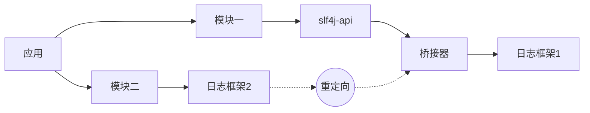
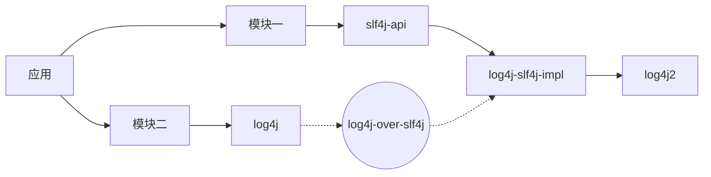
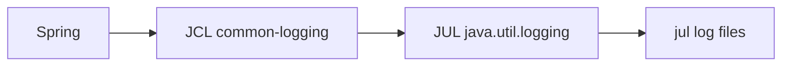
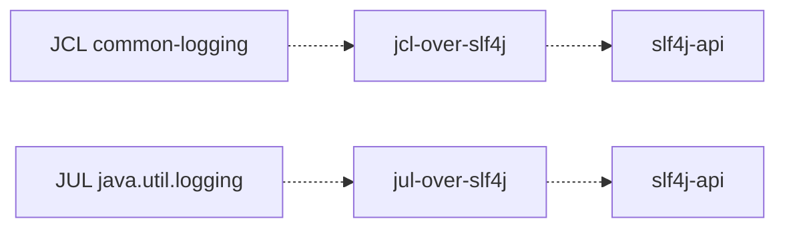

# SLF4J日志框架

Slf4j官方描述：
> The Simple Logging Facade for Java (SLF4J) serves as a simple facade or abstraction for various logging frameworks (e.g. java.util.logging, logback, log4j) allowing the end user to plug in the desired logging framework at deployment time.

## Slf4j的基本使用

### 五种日志等级

* TRACE
* DEBUG
* INFO
* WARN
* ERROR

### Logger提供的Api
```java
import org.slf4j.Logger;
import org.slf4j.LoggerFactory;

public class Slf4jLoggerSample {
    private final Logger log = LoggerFactory.getLogger(Slf4jLoggerSample.class);

    @Test
    public void typicalUsageTest() {
        log.debug("test method is called at {}", new Date());
        log.info("print arg1:{}, arg2:{}", arg1, arg2);
        if (condition) {
            log.error("unexcepted error found {}", errorMsg);
        }
    }

    /**
     * SINCE 2.0.0 SLF4J API version 2.0.0 requires Java 8 and introduces a backward-compatible fluent logging API.
     */
    @Test
    public void fluentUsageTest() {
        // using traditional API
        log.debug("Temperature set to {}. Old value was {}.", newT, oldT);

        // using fluent API, log message with arguments
        log.atDebug().log("Temperature set to {}. Old value was {}.", newT, oldT);
        
        // using fluent API, add arguments one by one and then log message
        log.atDebug().setMessage("Temperature set to {}. Old value was {}.").addArgument(newT).addArgument(oldT).log();

        // using fluent API, add one argument with a Supplier and then log message with one more argument.
        // Assume the method t16() returns 16.
        log.atDebug().setMessage("Temperature set to {}. Old value was {}.").addArgument(() -> t16()).addArgument(oldT).log();

        // using classical API
        logger.debug("oldT={} newT={} Temperature changed.", newT, oldT);

        // using fluent API
        logger.atDebug().setMessge("Temperature changed.").addKeyValue("oldT", oldT).addKeyValue("newT", newT).log();
    }
}
```

## 对不同日志框架的支持

Slf4j使用了Facade设计模式，只提供了一个日志抽象接口包slf4j-api.jar。其他日志框架可以通过桥接的方式连接slf4j提供的接口，应用层只需面向slf4j编程即可。

Slf4j和其他桥接器日志组件jar包说明
| jar包 | 说明 |
|  ----  | ----  |
| slf4j-log4j12-2.0.0.jar  | Log4j 1.2版本的桥接器，假如你继续使用Log4j 1.x框架，建议使用slf4j-reload4j代替 |
| slf4j-reload4j-2.0.0.jar  | Reload4j是Log4j 1.2.7的一个临时替换版本，你需要将Log4j.jar加入Classpath |
| slf4j-jdk14-2.0.0.jar | java.util.logging桥接器，jdk原生日志框架 |
| slf4j-nop-2.0.0.jar | NOP桥接器，默认丢弃一切日志 |
| slf4j-simple-2.0.0.jar | 一个简单实现的桥接器，该实现输出所有事件到System.err. 只有Info以及高于该级别的消息被打印，用在小型应用中 |
| slf4j-jcl-2.0.0.jar | Jakarta Commons Logging 的桥接器. 桥接器将Slf4j所有日志委派给Jcl |
| logback-classic-$\{logback.version\}.jar | Slf4j的原生实现，Logback直接实现了Slf4j的接口，因此使用Slf4j与Logback的结合使用也意味更小的内存与计算开销 |


切换不同的日志框架，只需要在classpath中替换slf4j的bindings。例如从java.util.logging切换到log4j，只需要替换slf4j-jdk14.jar到slf4j-log4j12.jar。SLF4J 不依赖任何特殊的类加载器机制，每个 SLF4J 绑定在编译时都是硬链接的，你只需要把需要的日志框架放置到合适的classpath即可（注意只能使用一个binding）。

## 桥接遗留的APIs

经常地，有些组件依赖一个非SLF4J的日志API。例如Spring Framework使用的是日志组件是Commons Logging，XSocket依赖的则是Java Util Logging。你可以假设这些组件不久会切换到SLF4J，为了处理这种情况，SLF4J提供了几个模块可以重定向调用到SLF4J，包含log4j、JCL和JUL等，下图展示了这种想法：


```text
log4j -> 重定向到SLF4j -> slf4j-log4j12-version.jar -> log4j.jar -> 输出日志
1、添加依赖
 log4j-over-slf4j（实现log4j1切换到slf4j）
 slf4j-api
 logback-classic

2、添加logback的配置文件
```

使用SLF4J桥接时，多jar包依赖可能造成死循环，在项目中应该注意以下情况：

* log4j-over-slf4j.jar和slf4j-log4j12.jar同时存在：由于slf4j-log4j12.jar的存在会将所有日志调用委托给log4j。但由于同时由于log4j-over-slf4j.jar的存在，会将所有对log4j api的调用委托给相应等值的slf4j,所以log4j-over-slf4j.jar和slf4j-log4j12.jar同时存在会形成死循环。
* jul-to-slf4j.jar和slf4j-jdk14.jar同时存在：由于slf4j-jdk14.jar的存在会将所有日志调用委托给jdk的log。但由于同时jul-to-slf4j.jar的存在，会将所有对jul api的调用委托给相应等值的slf4j，所以jul-to-slf4j.jar和slf4j-jdk14.jar同时存在会形成死循环。

## 日志框架桥接案例

### 1. 项目中一个模块用log4j，另一个模块用slf4j+log4j2，如何统一输出？

如何统一输出？这里就要用上slf4j的适配器，slf4j提供了各种各样的适配器，用来将某种日志框架委托给slf4j。可选的集成工作方式有如下:


接下来就是选择填空，根据题意应该选log4j-over-slf4j适配器，于是就变成下面这张图：

> 根据适配器工作原理的不同，被适配的日志框架并不是一定要删除！以上图为例，log4j这个日志框架删不删都可以，你只要能保证log4j的加载顺序在log4j-over-slf4j后即可。因为log4j-over-slf4j这个适配器的工作原理是，内部提供了和log4j一模一样的api接口，因此你在程序中调用log4j的api的时候，你必须想办法让其走适配器的api。如果你删了log4j这个框架，那你程序里肯定是走log4j-over-slf4j这个组件里的api。如果不删log4j，只要保证其在classpth里的顺序比log4j前即可！

### 2. 如何让Spring以log4j2的形式输出？

Spring默认使用的是jcl输出日志，由于你此时并没有引入Log4j的日志框架，jcl会以jul做为日志框架。此时集成图如下：


而在应用中，采用了slf4j+log4j-core，即log4j2进行日志记录，那么此时集成图如下：


那我们现在需要让Spring以log4j2的形式输出，怎么办？以下是两种可行的方案：


## JCL和SLF4J的桥接机制对比

JCL(Commons Logging) 是通过动态查找机制，运行时期间使用自己的ClassLoader寻找和载入本地具体的实现。详细策略可见commons-logging-*.jar包中的org.apache.commons.logging.impl.LogFactoryImpl.java类。由于OSGI不同的插件使用独立的ClassLoader，OSGI的这种机制保证了插件互相独立, 其机制限制了Commons Logging在OSGI中的正常使用。

而Slf4j在编译期间，静态绑定本地的Log库，因此可以在OSGI中正常使用。它是通过查找类路径下org.slf4j.impl.StaticLoggerBinder，然后在StaticLoggerBinder中进行绑定。

## slf4j-api包解读

API核心类功能：

* LoggerFactory：给调用方提供的创建Logger的工厂类，在编译时绑定具体的日志实现组件。
* Logger：给调用方提供的日志记录抽象方法，例如debug(String msg),info(String msg)等方法。
* ILoggerFactory：获取的Logger的工厂接口，具体的日志组件实现此接口。
* NOPLogger：对org.slf4j.Logger接口的一个没有任何操作的实现，也是Slf4j的默认日志实现。
* StaticLoggerBinder：与具体的日志实现组件实现的桥接类，具体的日志实现组件需要定义org.slf4j.impl包，并在org.slf4j.impl包下提供此类，注意在slf4j-api.jar中不存在org.slf4j.impl.StaticLoggerBinder，在源码包slf4j-api-version-source.jar中才存在此类。

仅引用slf4j-api包源码解读。


# 参考资料

* [Slf4j官网](http://www.slf4j.org/)
* [Logback官网](https://logback.qos.ch/)
* [Apache commons logging](https://commons.apache.org/proper/commons-logging/)
* [掘金 - 深入掌握Java日志体系，再也不迷路了](https://juejin.cn/post/6905026199722917902) (作者：一角钱技术)