# 缓存

## 存储介质

**内存**：将缓存存储于内存中是最快的选择，无需额外的I/O开销，但是内存的缺点是没有持久化落地物理磁盘，一旦应用异常break down而重新启动，数据很难或者无法复原。

**硬盘**：一般来说，很多缓存框架会结合使用内存和硬盘，在内存分配空间满了或是在异常的情况下，可以被动或主动的将内存空间数据持久化到硬盘中，达到释放空间或备份数据的目的。

**数据库**：前面有提到，增加缓存的策略的目的之一就是为了减少数据库的I/O压力。现在使用数据库做缓存介质是不是又回到了老问题上了？其实，数据库也有很多种类型，像那些不支持SQL，只是简单的key-value存储结构的特殊数据库（如BearKvDB和Redis），响应速度和吞吐量都远远高于我们常用的关系型数据库等。

## 缓存类型

**本地缓存**：指的是在应用中的缓存组件，其最大的优点是应用和cache是在同一个进程内部，请求缓存非常快速，没有过多的网络开销等，在单应用不需要集群支持或者集群情况下各节点无需互相通知的场景下使用本地缓存较合适；同时，它的缺点也是应为缓存跟应用程序耦合，多个应用程序无法直接的共享缓存，各应用或集群的各节点都需要维护自己的单独缓存，对内存是一种浪费。

**分布式缓存**：指的是与应用分离的缓存组件或服务，其最大的优点是自身就是一个独立的应用，与本地应用隔离，多个应用可直接的共享缓存。

## 术语

**命中率**：命中率=返回正确结果数/请求缓存次数，命中率问题是缓存中的一个非常重要的问题，它是衡量缓存有效性的重要指标。命中率越高，表明缓存的使用率越高。

**最大元素（或最大空间）**：缓存中可以存放的最大元素的数量，一旦缓存中元素数量超过这个值（或者缓存数据所占空间超过其最大支持空间），那么将会触发缓存启动清空策略根据不同的场景合理的设置最大元素值往往可以一定程度上提高缓存的命中率，从而更有效的时候缓存。

**失效策略**
* **FIFO(First In First Out)**：先进先出策略，最先进入缓存的数据在缓存空间不够的情况下（超出最大元素限制）会被优先被清除掉，以腾出新的空间接受新的数据。策略算法主要比较缓存元素的创建时间。在数据实效性要求场景下可选择该类策略，优先保障最新数据可用。
* **LFU(Less Frequently Used)**：最少使用策略，无论是否过期，根据元素的被使用次数判断，清除使用次数较少的元素释放空间。策略算法主要比较元素的hitCount（命中次数）。在保证高频数据有效性场景下，可选择这类策略。
* **LRU(Least Recently Used)**：最近最少使用策略，无论是否过期，根据元素最后一次被使用的时间戳，清除最远使用时间戳的元素释放空间。策略算法主要比较元素最近一次被get使用时间。在热点数据场景下较适用，优先保证热点数据的有效性。
* **TTL(Time To Live)**：存活期，即从缓存中创建时间点开始直至到期的一个时间段。
* **TTI(Time To Idle)**：空闲期，即一个数据多久没被访问就从缓存中移除的时间。
* 其他：随机清理、关键词清理等

## 需要考虑的问题

### 缓存穿透

**定义**：缓存穿透是指查询一个**一定不存在的数据**，由于缓存是不命中时被动写的，并且出于容错考虑，如果从存储层查不到数据则不写入缓存，这将导致这个不存在的数据每次请求都要到存储层去查询，失去了缓存的意义。在流量大时，可能DB就挂掉了，要是有人利用不存在的key频繁攻击我们的应用，这就是漏洞。

**解决方案**：

1. **布隆过滤器**：将所有可能存在的数据哈希到一个足够大的bitmap中，一个一定不存在的数据会被这个bitmap拦截掉，从而避免了对底层存储系统的查询压力。
2. **缓存空结果**：如果一个查询返回的数据为空，我们仍然把这个空结果进行缓存，可以给它设置一个很短的过期时间。

### 缓存雪崩

**定义**：缓存雪崩是指在我们设置缓存时采用了**相同的过期时间**，导致**缓存在某一时刻同时失效**，请求全部转发到DB，DB瞬时压力过重雪崩。

**解决方案**：

1. **缓存时间随机**：避免同一时刻缓存集体失效，给DB带来巨大冲击。
2. **使用互斥锁**：为同一个key的DB查找加上锁，防止对同一个key的大量请求给DB造成巨大压力。
3. **缓存时间延长**：使用异步线程为即将过期的缓存对象调整过期时间。

### 缓存击穿/热点

**定义**：对于一些设置了过期时间的key，如果这些key可能会在某些时间点被超高并发地访问，是一种非常“热点”的数据。这个时候，需要考虑一个问题：缓存被“击穿”的问题，这个和缓存雪崩的区别在于这里针对某一key缓存，前者则是很多key。缓存在某个时间点过期的时候，恰好在这个时间点对这个Key有大量的并发请求过来，这些请求发现缓存过期一般都会从后端DB加载数据并回设到缓存，这个时候大并发的请求可能会瞬间把后端DB压垮。

**解决方案**：

1. **永不过期**：不显示设置过期时间，使用异步线程进行缓存刷新。（复杂、侵入、不保证一致性）
2. **使用互斥锁**：使用互斥锁对db操作进行加锁，每次操作尝试获取锁，失败进行重试，直到db缓存完成。（复杂、死锁、阻塞）
3. **“提前”使用互斥锁**：对cache中key对应的value存储比实际过期时间更短的过期时间，当读取到value中的时间已经过期时，立刻延长时间，并从db中读取并重置缓存。
4. **熔断与限流**：做好熔断和限流，做好降级准备。

### 缓存污染

缓存污染问题说的是缓存中一些只会被访问一次或者几次的的数据，被访问完后，再也不会被访问到，但这部分数据依然留存在缓存中，消耗缓存空间。

缓存空间是有限的，如果缓存空间满了，再往缓存里写数据时就会有额外开销，影响Redis性能。这部分额外开销主要是指写的时候根据淘汰策略去选择要淘汰的数据，然后进行删除操作。

缓存的淘汰策略一般有：LFU、LRU、RANDOM、TTL等。

### 缓存一致性

**定义**：缓存数据和源数据不一致。

**场景举例：**

* 先写数据库，再删除Redis缓存：可能出现写线程在删除缓存前异常失败了，没能删除缓存，这时候就出现了数据不一致。
* 先删除缓存，再写数据库：可能还没来得及写入数据库，另外一个线程请求之后又缓存了老数据，等数据库写入之后就出现了数据不一致。

**解决方案**：见缓存更新模式。

### 缓存大Key

**定义**：存储key的值空间过大，读写key超时严重，甚至导致阻塞。
**解决方案**：分片、分割。

## 缓存更新模式

参考
https://www.cnblogs.com/songwenjie/p/9027012.html
https://juejin.im/post/5d5fde2051882505a87a918d

### Cache Aside 更新模式

Cache-Aside策略特别适合读多的应用场景。使用Cache-Aside的系统对缓存失效具有一定的弹性。如果缓存集群宕机，系统仍然可以通过直接访问数据库进行操作。

Cache-Aside策略针对不同的场景处理如下：

* 失效：应用程序先从Cache取数据，没有得到，则从数据库中取数据，成功后，放到缓存中。
* 命中：应用程序从Cache中取数据，取到后返回。
* 更新：先把数据存到数据库中，成功后，再让缓存失效。

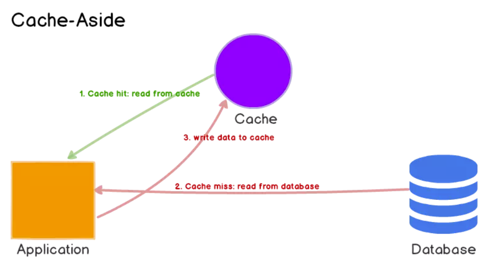

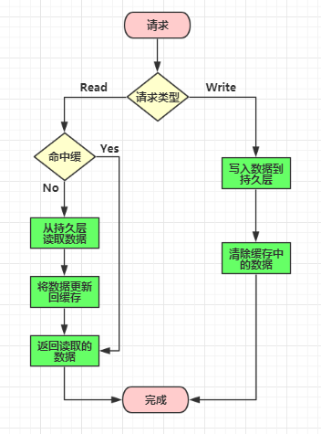

### Read/Write Through 更新模式

先更新缓存，**缓存负责同步更新数据库**，使用方看到的只有缓存一个数据库。

当多次请求相同的数据时，Read-through缓存最适合于读量较大的工作负载。缺点是，当第一次请求数据时，它总是导致缓存丢失，并导致额外的数据加载到缓存的代价。开发人员通过手动发出查询来“预热”或“预热”缓存来处理这个问题。

Write-through缓存似乎没有多大作用，实际上，它们引入了额外的写延迟，因为数据先写到缓存，然后写到主数据库。但是，当与Read-through结合使用时，我们获得了Read-through的所有好处，还获得了数据一致性保证，使我们不必使用缓存失效技术。

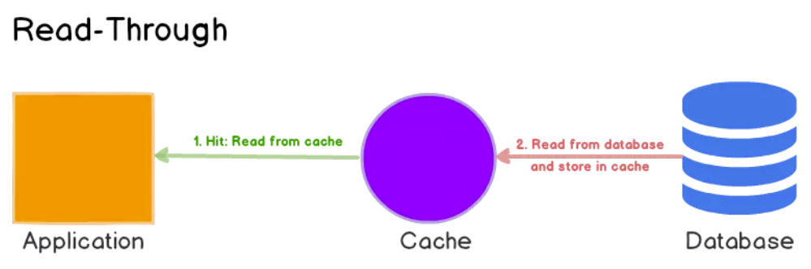

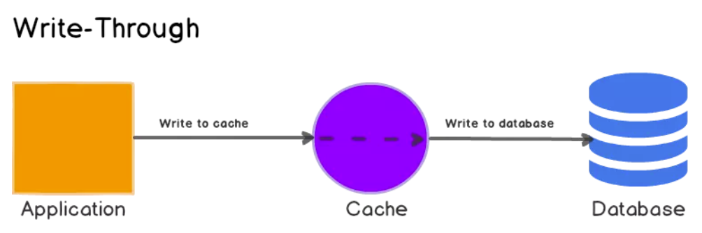

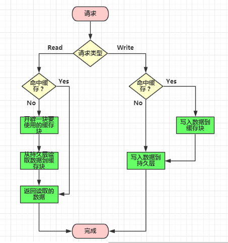

### Write Behind Caching 更新模式

先更新缓存，**缓存定时异步更新数据库**。

Write-back缓存提高了写性能，对于写工作量大的工作负载非常有用。当与Read-through相结合的时候，它对于混合工作负载非常有效，最近更新和访问的数据总是在缓存中可用。它对数据库故障具有很大程度上的弹性，可以容忍一些数据库的宕机。如果支持批处理或合并，则可以减少对数据库的总体写操作，这将减少负载并降低成本。
主要缺点是，如果缓存失效，数据可能会永久丢失。

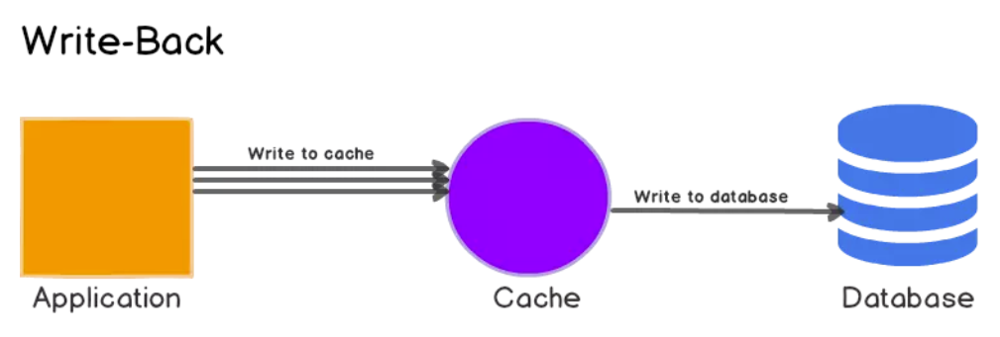

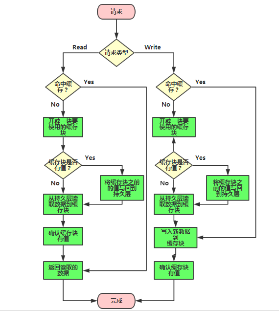

## 缓存更新的一些方案

### 消息队列 + 重试机制

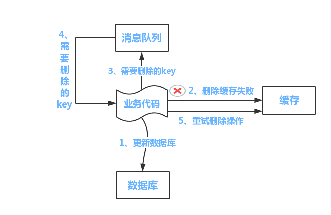

该方案的缺点是会对业务代码产生一些侵入，下面这个方案可以解决这个缺点。

### 基于binlog的异步缓存更新

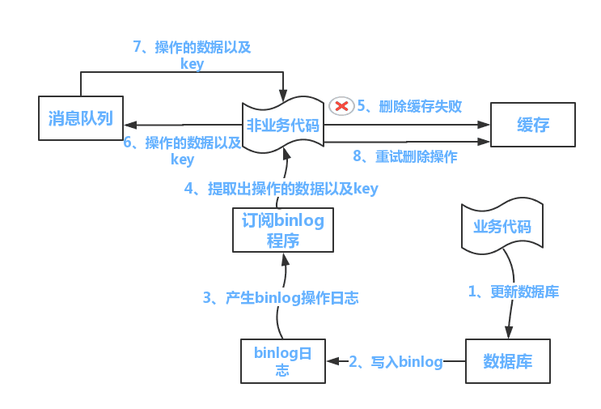

MySQL binlog增量订阅消费+消息队列+增量数据更新到Redis：

* 读Redis：热数据基本都在Redis；
* 写MySQL: 增删改都是只操作MySQL；
* 更新Redis数据：MySQ的数据操作binlog，来更新到Redis；

## 缓存拓扑类型

### 独立缓存（Standalone Ehcache）

这样的缓存应用节点都是独立的，互相不通信。

### 分布式缓存（Distributed Ehcache）

分布式缓存使用一致性散列的分布算法将数据存储在集群中的几个节点上。

### 复制式缓存（Replicated Ehcache）

缓存数据时同时存放在多个应用节点的，数据复制和失效的事件以同步或者异步的形式在各个集群节点间传播。上述事件到来时，会阻塞写线程的操作。在这种模式下，只有弱一致性模型。
它有如下几种事件传播机制：RMI、JGroups、JMS和Cache Server。
RMI模式下，所有节点全部对等：
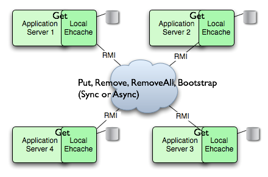

JMS模式：这种模式的核心就是一个消息队列，每个应用节点都订阅预先定义好的主题，同时，节点有元素更新时，也会发布更新元素到主题中去。JMS规范实现者上，Open MQ和Active MQ这两个，Ehcache的兼容性都已经测试过。
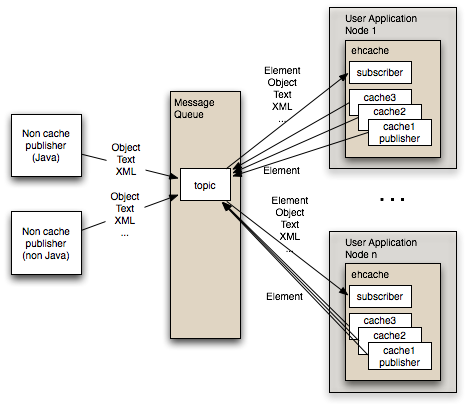

Cache Server模式：这种模式下存在主从节点，通信可以通过RESTful的API或者SOAP。
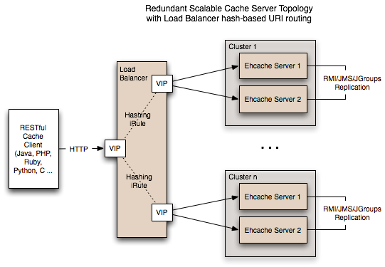

**缓存漂移（Cache Drift）**：每个应用节点只管理自己的缓存，在更新某个节点的时候，不会影响到其他的节点，这样数据之间可能就不同步了。这在web会话数据缓存中情况尤甚。
 
**数据库瓶颈（Database Bottlenecks ）**：对于单实例的应用来说，缓存可以保护数据库的读风暴；但是，在集群的环境下，每一个应用节点都要定期保持数据最新，节点越多，要维持这样的情况对数据库的开销也越大。

## 缓存框架对比

| 名称  |   类型 | 概要 | 简介 |
| --- | ---| ---| ---|
| Guava	| 本地	| Google缓存工具 | 全内存的本地缓存实现，它提供了线程安全的实现机制。|
| JCache    | 本地  | Java标准缓存  | 参考JSR-107 |
| OSCache   | 本地  | OpenSymphony高性能的J2EE缓存框架  | OSCache是个一个广泛采用的高性能的J2EE缓存框架，OSCache能用于任何Java应用程序的普通的缓存解决方案。底层数据结构基于HashTable |
| memcached	|	本地/分布式	|	Key-value内存缓存	|	它本身其实不提供分布式解决方案，多台服务器可实现分布式缓存，分布式主要是由客户端路由实现。|
| EhCache	|	本地/分布式	|	开源分布式缓存	|	Ehcache是一个Java实现的开源分布式缓存框架，EhCache 可以有效地减轻数据库的负载，可以让数据保存在不同服务器的内存中，在需要数据的时候可以快速存取。同时EhCache 扩展非常简单，官方提供的Cache配置方式有好几种。你可以通过声明配置、在xml中配置、在程序里配置或者调用构造方法时传入不同的参数。|
|	Cacheonix	|	分布式	|	分布式集群缓存系统	| 	Cacheonix同样也是一个基于Java的分布式集群缓存系统，它同样可以帮助你实现分布式缓存的部署。|
|	ASimpleCache	|	分布式	|	轻量级Android缓存架构	|	ASimpleCache是一款基于Android的轻量级缓存框架，它只有一个Java文件，ASimpleCache基本可以缓存常用的Android对象，包括普通字符串、JSON对象、经过序列化的Java对象、字节数组等。|
|	Jboss Cache	|	分布式	|	基于事务处理的缓存架构	|	JBoss Cache是一款基于Java的事务处理缓存系统，它的目标是构建一个以Java框架为基础的集群解决方案，可以是服务器应用，也可以是Java SE应用。|
|	Voldemort	|	分布式	|	键值缓存框架	|	Voldemort是一款基于Java开发的分布式键-值缓存系统，像JBoss Cache一样，Voldemort同样支持多台服务器之间的缓存同步，以增强系统的可靠性和读取性能。|
|	Redis	|	分布式	|	key-value内存缓存	|	主要优势在内存缓存上，吞吐量极高，支持持久化，提供多种数据结构。|

## 参考资料

* [腾讯云 - Java缓存深入理解](https://cloud.tencent.com/developer/article/1028722)
* [CSDN - Guava缓存值CacheBuilder介绍](https://blog.csdn.net/xlgen157387/article/details/47293517)
* [美团技术 - 缓存那些事](https://tech.meituan.com/2017/03/17/cache-about.html)
* [ITEYE - 缓存系列文章--8.热点key问题(mutex key)](https://www.iteye.com/blog/carlosfu-2269687)
* [CSDN - 缓存穿透，缓存击穿，缓存雪崩解决方案分析](https://blog.csdn.net/zeb_perfect/article/details/54135506)
* [掘金 - 一文深入了解：分布式系统中的缓存架构](https://juejin.im/entry/5b59615a5188251af86bf5c9)
* [掘金 - 如何优雅的设计和使用缓存？](https://juejin.im/post/5b849878e51d4538c77a974a)
* [微信公众号 - 百亿级日访问量的应用如何做缓存架构设计？](https://mp.weixin.qq.com/s?__biz=MjM5ODI5Njc2MA==&mid=2655816948&idx=1&sn=af4ec62a2115bbc14d067197f2cd8fd3&chksm=bd74c1238a03483579fed0e2e9e67058d4adea2b44bf02a328cdb250f0ed47a1b572379999b5&scene=21#wechat_redirect)
* [Java全栈知识体系 - Redis进阶 - 缓存问题](https://pdai.tech/md/db/nosql-redis/db-redis-x-cache.html)