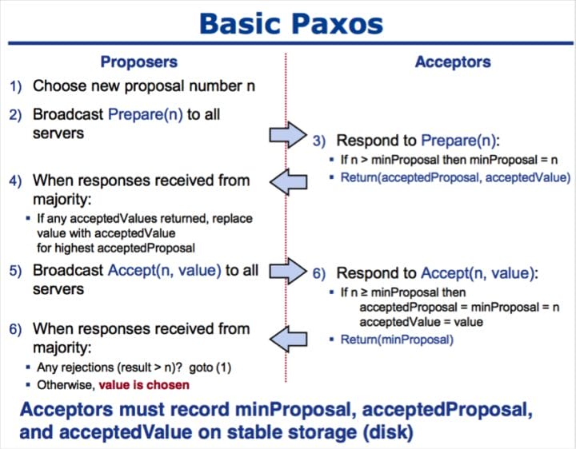

# 分布式一致性

## 分布式一致性算法

### Paxos算法

Paxos算法是Lamport宗师提出的一种**基于消息传递**的分布式一致性算法，使其获得2013年图灵奖。

自Paxos问世以来就持续垄断了分布式一致性算法，Paxos这个名词几乎等同于分布式一致性, 很多分布式一致性算法都由Paxos演变而来。Google的很多大型分布式系统都采用了Paxos算法来解决分布式一致性问题，如Chubby、Megastore以及Spanner等。开源的ZooKeeper，以及MySQL 5.7推出的用来取代传统的主从复制的MySQL Group Replication等纷纷采用Paxos算法解决分布式一致性问题。

Paxos算法运行在允许宕机故障的异步系统中，不要求可靠的消息传递，可容忍消息丢失、延迟、乱序以及重复。它利用大多数 (Majority) 机制保证了2F+1的容错能力，即2F+1个节点的系统最多允许F个节点同时出现故障。

一个或多个提议进程 (Proposer) 可以发起提案 (Proposal)，Paxos算法使所有提案中的某一个提案，在所有进程中达成一致。系统中的多数派同时认可该提案，即达成了一致。最多只针对一个确定的提案达成一致。

#### 角色划分

Paxos将系统中的角色分为：

* **提议者 (Proposer)**： 提出提案 (Proposal)，Proposal信息包括提案编号 (Proposal ID) 和提议的值 (Value)。
* **决策者 (Acceptor)**：参与决策，回应Proposers的提案。收到Proposal后可以接受提案，若Proposal获得多数Acceptors的接受，则称该Proposal被批准。
* **最终决策学习者 (Learner)**：不参与决策，从Proposers/Acceptors学习最新达成一致的提案(Value)。

三个角色的划分可以理解为人大代表(Proposer)在人大向其它代表(Acceptors)提案，通过后让老百姓(Learner)落实。

在多副本状态机中，每个副本同时具有Proposer、Acceptor、Learner三种角色。

#### 三个阶段

1. Prepare阶段

Proposer向Acceptors发出Prepare请求，Acceptors针对收到的Prepare请求进行Promise承诺。

* Prepare: Proposer生成全局唯一且递增的Proposal ID (可使用时间戳加Server ID)，向所有Acceptors发送Prepare请求，这里无需携带提案内容，只携带Proposal ID即可。
* Promise: Acceptors收到Prepare请求后，做出“两个承诺，一个应答”。
  * **承诺1：不再接受Proposal ID小于等于当前请求的Prepare请求；**
  * **承诺2：不再接受Proposal ID小于当前请求的Propose请求；**
  * **应答：不违背以前作出的承诺下，回复已经Accept过的提案中Proposal ID最大的那个提案的Value和Proposal ID，没有则返回空值。**

2. Accept阶段

Proposer收到多数Acceptors承诺的Promise后，向Acceptors发出Propose请求，Acceptors针对收到的Propose请求进行Accept处理。

* Propose：Proposer收到多数Acceptors的Promise应答后，从应答中选择Proposal ID最大的提案的Value，作为本次要发起的提案。如果所有应答的提案Value均为空值，则可以自己随意决定提案Value。然后携带当前Proposal ID，向所有Acceptors发送Propose请求。
* Accept：Acceptor收到Propose请求后，在不违背自己之前作出的承诺下，接受并持久化当前Proposal ID和提案Value。

3. Learn阶段

Proposer在收到多数Acceptors的Accept之后，标志着本次Accept成功，决议形成，将形成的决议发送给所有Learners。

1. 获取一个 Proposal ID `n`，为了保证 Proposal ID 唯一，可采用时间戳加 Server ID 生成；
2. Proposer 向所有 Acceptors 广播 `Prepare(n)` 请求；
3. Acceptor 比较 `n` 和 `minProposal` ，如果 `n > minProposal, minProposal = n`，并且将 `acceptedProposal` 和 `acceptedValue` 返回；
4. Proposer 接收到过半数回复后，如果发现有 `acceptedValue` 返回，将所有回复中 `acceptedProposal` 最大的 `acceptedValue` 作为本次提案的 `value` ，否则可以任意决定本次提案的 `value` ；
5. 到这里可以进入第二阶段，广播 `Accept(n,value)` 到所有节点；
6. Acceptor 比较 `n` 和 `minProposal` ，如果 `n >= minProposal` ，则 `acceptedProposal = minProposal = n, acceptedValue = value`，本地持久化后，返回；否则，返回minProposal。
7. 提议者接收到过半数请求后，如果发现有返回值 `result > n`，表示有更新的提议，跳转到步骤1；否则value达成一致。

#### Paxos总结

Paxos 算法的缺点如下：

* 活锁问题：当某个 Proposer 提交的 Proposal 被拒绝时，可能是因为 Accepter 承诺返回更大编号的 Proposal ，因此 Proposer 继续提高编号继续提交。如果两个 Proposer 都发现自己的编号过低而提出更大编号的 Proposal ，会导致死循环，称为活锁问题。可采用二进制指数退避算法进行避免。
* 效率低：每个完成流程的提议都要经过两大轮请求才能返回；Multi-Paxos先选出Leader后续每次仅需要一轮。
* 实现困难：共识算法存在的普遍问题。

### Raft算法

不同于Paxos算法直接从分布式一致性问题出发推导出来，Raft算法则是从多副本状态机的角度提出，用于管理多副本状态机的日志复制。Raft实现了和Paxos相同的功能，它将一致性分解为多个子问题: Leader选举(Leader election)、日志同步(Log replication)、安全性(Safety)、日志压缩(Log compaction)、成员变更(Membership change)等。同时，Raft算法使用了更强的假设来减少了需要考虑的状态，使之变的易于理解和实现。

可通过[动画理解Raft算法](http://thesecretlivesofdata.com/raft/)理解Raft算法的原理。

#### 角色划分

Raft将系统中的角色分为：

* **领导者(Leader)**：接受客户端请求，并向 Follower 同步请求日志，当日志同步到大多数节点上后告诉 Follower 提交日志。
* **跟从者(Follower)**：接受并持久化 Leader 同步的日志，在 Leader 告之日志可以提交之后，提交日志。
* **候选人(Candidate)**： Leader 选举过程中的临时角色。

Raft要求系统在任意时刻最多只有一个 Leader ，正常工作期间只有 Leader 和 Followers 。

Follower 只响应其他服务器的请求。如果 Follower 超时没有收到 Leader 的消息，它会成为一个 Candidate 并且开始一次 Leader 选举。收到大多数服务器投票的Candidate 会成为新的 Leader 。 Leader 在宕机之前会一直保持 Leader 的状态。

Raft算法将时间分为一个个的任期(term)，每一个 term 的开始都是 Leader 选举。在成功选举 Leader 之后，Leader 会在整个 term 内管理整个集群。如果 Leader 选举失败，该 term 就会因为没有 Leader 而结束。

### ZAB算法

## 参考资料

* [Raft官网](https://raft.github.io/)
* [《In Search of an Understandable Consensus Algorithm》](https://raft.github.io/raft.pdf)
* [Java全栈知识体系 - 分布式算法 - Paxos算法](https://pdai.tech/md/algorithm/alg-domain-distribute-x-paxos.html)
* [Java全栈知识体系 - 分布式算法 - Raft算法](https://pdai.tech/md/algorithm/alg-domain-distribute-x-raft.html)
* [Java全栈知识体系 - 分布式算法 - ZAB算法](https://pdai.tech/md/algorithm/alg-domain-distribute-x-zab.html)
