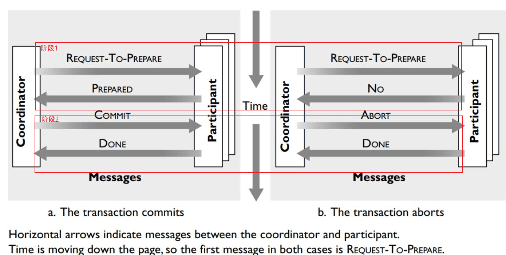
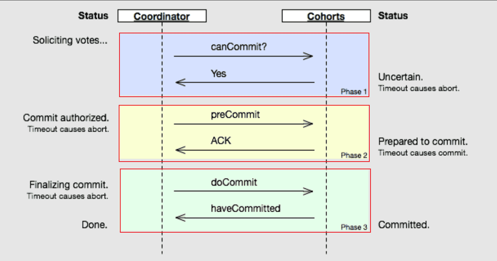
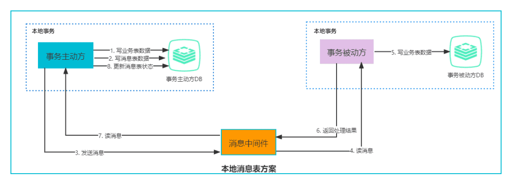
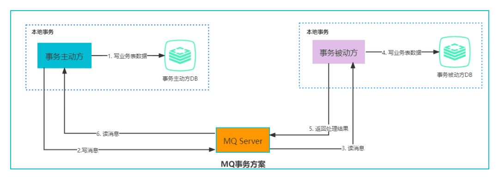
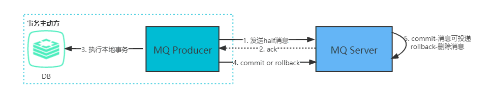
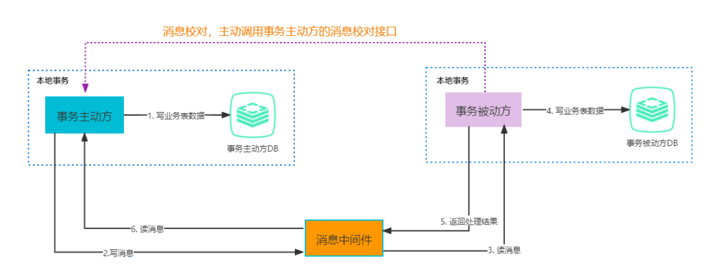

# 分布式事务

## 分布式事务解决方案

### 两阶段提交 2PC

参与者（participant）用来管理资源，协调者（coordinator）用来协调事务状态。

两段提交（Two-Phase Commit）是指两个阶段的提交：

1. 第一阶段: 准备阶段；
   1. 协调者向所有参与者发送 REQUEST-TO-PREPARE；
   2. 当参与者收到REQUEST-TO-PREPARE 消息后, 它向协调者发送消息PREPARED或者NO，表示事务是否准备好；如果发送的是NO，那么事务要回滚；
2. 第二阶段: 提交阶段；
   1. 协调者收集所有参与者的返回消息, 如果所有的参与者都回复的是PREPARED， 那么协调者向所有参与者发送COMMIT 消息；否则，协调者向所有回复PREPARED的参与者发送ABORT消息；
   2. 参与者如果回复了PREPARED消息并且收到协调者发来的COMMIT消息，或者它收到ABORT消息，它将执行提交或回滚，并向协调者发送DONE消息以确认。

两段提交（2PC）的缺点：

* **网络抖动导致的数据不一致**：第二阶段中协调者向参与者发送 Commit 命令之后，一旦此时发生网络抖动，导致一部分参与者接收到了 Commit 请求并执行，可其他未接到 Commit 请求的参与者无法执行事务提交。进而导致整个分布式系统出现了数据不一致。
* **超时导致的同步阻塞问题**：2PC中的所有的参与者节点都为事务阻塞型，当某一个参与者节点出现通信超时，其余参与者都会被动阻塞占用资源不能释放。
* **单点故障的风险**：由于严重的依赖协调者，一旦协调者发生故障，而此时参与者还都处于锁定资源的状态，无法完成事务 Commit 操作。虽然协调者出现故障后，会重新选举一个协调者，可无法解决因前一个协调者宕机导致的参与者处于阻塞状态的问题。

### 三阶段提交 3PC

三段提交（Three-Phase Commit）是对两段提交（2PC）的一种升级优化，3PC在2PC的第一阶段和第二阶段中插入一个准备阶段。保证了在最后提交阶段之前，各参与者节点的状态都一致。同时在协调者和参与者中都引入超时机制，当参与者各种原因未收到协调者的 Commit 请求后，会对本地事务进行 Commit ，不会一直阻塞等待，解决了2PC的单点故障问题，但3PC还是没能从根本上解决数据一致性的问题。

三段提交（Three-Phase Commit）是指三个阶段的提交：

* **CanCommit**：协调者向所有参与者发送 CanCommit 命令，询问是否可以执行事务提交操作。如果全部响应YES则进入下一个阶段。
* **PreCommit**：协调者向所有参与者发 PreCommit 命令，询问是否可以进行事务的预提交操作，参与者接收到 PreCommit 请求后，如参与者成功的执行了事务操作，则返回YES响应，进入最终 Commit 阶段。一旦参与者中有向协调者发送了 No 响应，或因网络造成超时，协调者没有接到参与者的响应，协调者向所有参与者发送 Abort 请求，参与者接受 Abort 命令执行事务的中断。
* **DoCommit**：在前两个阶段中所有参与者的响应反馈均是YES后，协调者向参与者发送 DoCommit 命令正式提交事务，如协调者没有接收到参与者发送的 ACK 响应，会向所有参与者发送 Abort 请求命令，执行事务的中断。

三段提交（3PC）的缺点：

消息传输依然存在可用性问题。

### 补偿事务 TCC

补偿事务（Try-Confirm-Cancel），TCC与2PC的思想很相似，事务处理流程也很相似，但**2PC是应用于在DB层面，TCC则可以理解为在应用层面的2PC，是需要我们编写业务逻辑来实现**。

TCC它的核心思想是："针对每个操作都要注册一个与其对应的确认（Try）和补偿（Cancel）"。

* **Try阶段**：尝试执行，完成所有业务检查（一致性），预留必须业务资源（准隔离性）。
* **Confirm阶段**：确认执行真正执行业务，不作任何业务检查，只使用 Try 阶段预留的业务资源，Confirm 操作满足幂等性。要求具备幂等设计，Confirm 失败后需要进行重试。
* **Cancel阶段**：取消执行，释放 Try 阶段预留的业务资源 Cancel 操作满足幂等性 Cancel 阶段的异常和 Confirm 阶段异常处理方案基本上一致。

TCC 的缺点：

1.空回滚

当一个分支事务所在的服务发生宕机或者网络异常导致调用失败，并未执行try方法，当恢复后事务执行回滚操作就会调用此分支事务的cancel方法，如果cancel方法不能处理此种情况就会出现空回滚。

是否出现空回滚，我们需要需要判断是否执行了try方法，如果执行了就没有空回滚。解决方法就是当主业务发起事务时，生成一个全局事务记录，并生成一个全局唯一ID，贯穿整个事务，再创建一张分支事务记录表，用于记录分支事务，try执行时将全局事务ID和分支事务ID存入分支事务表中，表示执行了try阶段，当cancel执行时，先判断表中是否有该全局事务ID的数据，如果有则回滚，否则不做任何操作。比如seata的AT模式中就有分支事务表。

2.幂等问题

由于服务宕机或者网络问题，方法的调用可能出现超时，为了保证事务正常执行我们往往会加入重试的机制，因此就需要保证confirm和cancel阶段操作的幂等性。

我们可以在分支事务记录表中增加事务执行状态，每次执行confirm和cancel方法时都查询该事务的执行状态，以此判断事务的幂等性。

3.悬挂问题

TCC中，在调用try之前会先注册分支事务，注册分支事务之后，调用出现超时，此时try请求还未到达对应的服务，因为调用超时了，所以会执行cancel调用，此时cancel已经执行完了，然而这个时候try请求到达了，这个时候执行了try之后就没有后续的操作了，就会导致资源挂起，无法释放。

执行try方法时我们可以判断confirm或者cancel方法是否执行，如果执行了那么就不执行try阶段。同样借助分支事务表中事务的执行状态。如果已经执行了confirm或者cancel那么try就执行。

### Saga事务

Saga是分布式事务领域最有名气的解决方案之一，最初出现在1987年Hector Garcaa-Molrna & Kenneth Salem发表的论文SAGAS里。

Saga是由一系列的本地事务构成。每一个本地事务在更新完数据库之后，会发布一条消息或者一个事件来触发Saga中的下一个本地事务的执行。如果一个本地事务因为某些业务规则无法满足而失败，Saga会执行在这个失败的事务之前成功提交的所有事务的补偿操作。

Saga的实现有很多种方式，其中最流行的两种方式是：

1. **基于事件的方式**：这种方式没有协调中心，整个模式的工作方式就像舞蹈一样，各个舞蹈演员按照预先编排的动作和走位各自表演，最终形成一只舞蹈。处于当前Saga下的各个服务，会产生某类事件，或者监听其它服务产生的事件并决定是否需要针对监听到的事件做出响应。
2. **基于命令的方式**：这种方式的工作形式就像一只乐队，由一个指挥家（协调中心）来协调大家的工作。协调中心来告诉Saga的参与方应该执行哪一个本地事务。

### 本地消息表

本地消息表的方案最初是由 eBay 提出，核心思路是**将分布式事务拆分成本地事务进行处理**。

通过在事务主动发起方额外新建事务消息表，事务发起方处理业务和记录事务消息在本地事务中完成，轮询事务消息表的数据发送事务消息，事务被动方基于消息中间件消费事务消息表中的事务。

上图中整体的处理步骤如下：

1. 事务主动方在同一个本地事务中处理业务和写消息表操作；
2. 事务主动方通过消息中间件，通知事务被动方处理事务通知事务待消息。事务主动方主动写消息到消息队列，事务消费方消费并处理消息队列中的消息；
3. 事务被动方通过消息中间件，通知事务主动方事务已处理的消息；
4. 事务主动方接收中间件的消息，更新消息表的状态为已处理。

一些必要的容错处理如下：

* 当步骤1处理出错，由于还在事务主动方的本地事务中，直接回滚即可；
* 当步骤2，3处理出错，由于事务主动方本地保存了消息，只需要轮询消息重新通过消息中间件发送，事务被动方重新读取消息处理业务即可；
* 如果是业务上处理失败，事务被动方可以发消息给事务主动方回滚事务；
* 如果事务被动方已经消费了消息，事务主动方需要回滚事务的话，需要发消息通知事务主动方进行回滚事务。

本地消息表的缺点如下：

1. 与具体的业务场景绑定，耦合性强，不可公用。
2. 消息数据与业务数据同库，占用业务系统资源。
3. 业务系统在使用关系型数据库的情况下，消息服务性能会受到关系型数据库并发性能的局限。

### 可靠消息服务的事务

基于 MQ 的分布式事务方案其实是对本地消息表的封装，将本地消息表基于 MQ 内部，其他方面的协议基本与本地消息表一致。

MQ事务方案整体流程和本地消息表的流程很相似，如下图：

从上图可以看出和本地消息表方案唯一不同就是将本地消息表存在了MQ内部，而不是业务数据库中。

在本地消息表方案中，保证事务主动方发写业务表数据和写消息表数据的一致性是基于数据库事务，RocketMQ 的事务消息相对于普通 MQ提供了 2PC 的提交接口，方案如下：

**正常情况：事务主动方发消息**

这种情况下，事务主动方服务正常，没有发生故障，发消息流程如下：
1. 发送方向 MQ 服务端(MQ Server)发送 half 消息。
2. MQ Server 将消息持久化成功之后，向发送方 ack 确认消息已经发送成功。
3. 发送方开始执行本地事务逻辑。
4. 发送方根据本地事务执行结果向 MQ Server 提交二次确认（commit 或是 rollback）。
5. MQ Server 收到 commit 状态则将半消息标记为可投递，订阅方最终将收到该消息；MQ Server 收到 rollback 状态则删除半消息，订阅方将不会接受该消息。

**异常情况：事务主动方消息恢复**

在断网或者应用重启等异常情况下，提交的二次确认超时未到达 MQ Server，此时处理逻辑如下：
1. MQ Server 对该消息发起消息回查。
2. 发送方收到消息回查后，需要检查对应消息的本地事务执行的最终结果。
3. 发送方根据检查得到的本地事务的最终状态再次提交二次确认。
4. MQ Server基于 commit/rollback 对消息进行投递或者删除。

相比本地消息表方案，MQ 事务方案优点是：

* 消息数据独立存储 ，降低业务系统与消息系统之间的耦合。
* 吞吐量大于使用本地消息表方案。

基于可靠消息服务的事务缺点如下：

* 一次消息发送需要两次网络请求(half 消息 + commit/rollback 消息) 。
* 业务处理服务需要实现消息状态回查接口。

### 最大努力通知

最大努力通知也称为定期校对，是对MQ事务方案的进一步优化。它在事务主动方增加了消息校对的接口，如果事务被动方没有接收到消息，此时可以**调用事务主动方提供的消息校对的接口主动获取**。

最大努力通知的整体流程如下图：

在可靠消息事务中，事务主动方需要将消息发送出去，并且消息接收方成功接收，这种可靠性发送是由事务主动方保证的；

但是最大努力通知，事务主动方尽最大努力（重试，轮询....）将事务发送给事务接收方，但是仍然存在消息接收不到，此时需要事务被动方主动调用事务主动方的消息校对接口查询业务消息并消费，这种通知的可靠性是由事务被动方保证的。

最大努力通知适用于业务通知类型，例如微信交易的结果，就是通过最大努力通知方式通知各个商户，既有回调通知，也有交易查询接口。

## 参考资料

* [掘金 - 再有人问你分布式事务，把这篇扔给他](https://juejin.cn/post/6844903647197806605)
* [掘金 - 常用的分布式事务解决方案](https://juejin.cn/post/6844903573667446797)
* [Java全栈知识体系 - 分布式事务及实现方案](https://pdai.tech/md/arch/arch-z-transection.html)