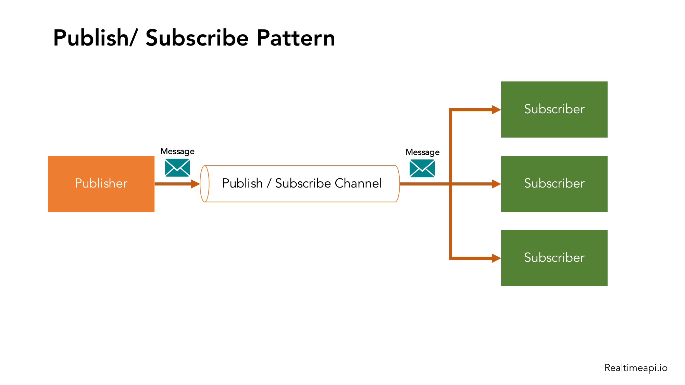
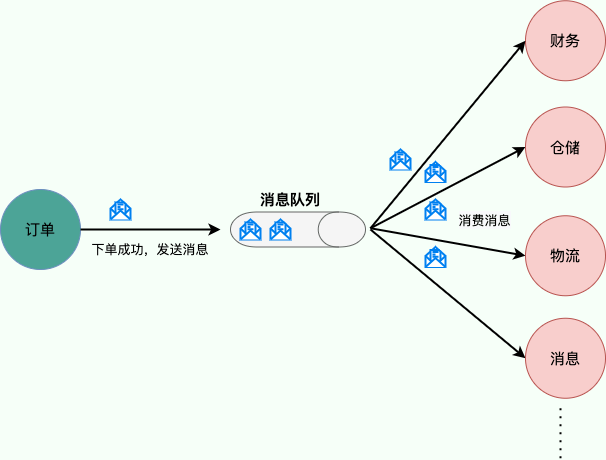
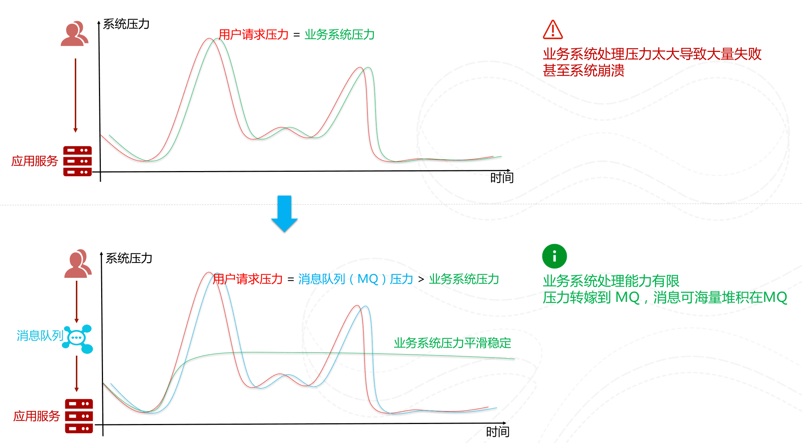

# 消息队列

## 发布/订阅模式

## 消息队列的作用

### 降低耦合性

消息队列使用**发布-订阅模式**工作，消息发送者（生产者）发布消息，一个或多个消息接受者（消费者）订阅消息。 从上图可以看到消息发送者（生产者）和消息接受者（消费者）之间没有直接耦合，消息发送者将消息发送至分布式消息队列即结束对消息的处理，消息接受者从分布式消息队列获取该消息后进行后续处理，并不需要知道该消息从何而来。对新增业务，只要对该类消息感兴趣，即可订阅该消息，对原有系统和业务没有任何影响，从而实现网站业务的可扩展性设计。

例如，我们商城系统分为用户、订单、财务、仓储、消息通知、物流、风控等多个服务。用户在完成下单后，需要调用财务（扣款）、仓储（库存管理）、物流（发货）、消息通知（通知用户发货）、风控（风险评估）等服务。使用消息队列后，下单操作和后续的扣款、发货、通知等操作就解耦了，下单完成发送一个消息到消息队列，需要用到的地方去订阅这个消息进行消息即可。

### 削峰/限流

先将短时间高并发产生的事务消息存储在消息队列中，然后后端服务再慢慢根据自己的能力去消费这些消息，这样就避免直接把后端服务打垮掉。

例如，在电子商务一些秒杀、促销活动中，合理使用消息队列可以有效抵御促销活动刚开始大量订单涌入对系统的冲击。如下图所示：

### 异步处理

将用户的请求数据存储到消息队列之后就立即返回结果，异步处理降低了响应时间，提高了用户体验。

### 延时/定时消费

消息发送后不会立即被消费，而是指定一个时间，到时间后再消费。大部分消息队列，例如 RocketMQ、RabbitMQ、Pulsar、Kafka，都支持定时/延时消息。

### 实现分布式事务

消息队列是分布式事务的解决方案之一。RocketMQ、 Kafka、Pulsar、QMQ 都提供了事务相关的功能。事务允许事件流应用将消费，处理，生产消息整个过程定义为一个原子操作。

### 数据流处理

针对分布式系统产生的海量数据流，如业务日志、监控数据、用户行为等，消息队列可以实时或批量收集这些数据，并将其导入到大数据处理引擎中，实现高效的数据流管理和处理。

## 消息队列带来的问题

### 系统复杂性提高

加入 MQ 之后，你需要保证消息没有被重复消费、处理消息丢失的情况、保证消息传递的顺序性等等问题！

### 数据一致性问题

消息队列带来的异步确实可以提高系统响应速度，但是消息没被消费，就存在一致性的问题。

### 系统可用性降低

引入了消息队列，降低了整体系统的可用性，特别是在生产环境中，是值得深入思考的问题。

## 参考资料

* [JavaGuide - 消息队列基础知识总结](https://javaguide.cn/high-performance/message-queue/message-queue.html)
* [微信公众号 - 消息队列的使用场景是什么样的？](https://mp.weixin.qq.com/s/4V1jI6RylJr7Jr9JsQe73A)