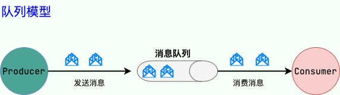

# JMS & AMQP

## JMS

JMS（JAVA Message Service,java 消息服务）是 Java 的消息服务，JMS 的客户端之间可以通过 JMS 服务进行异步的消息传输。JMS（JAVA Message Service，Java 消息服务）API 是一个消息服务的标准或者说是规范，允许应用程序组件基于 JavaEE 平台创建、发送、接收和读取消息。

JMS 定义了五种不同的消息正文格式以及调用的消息类型，允许你发送并接收以一些不同形式的数据：

* `StreamMessage`：Java 原始值的数据流。
* `MapMessage`：键值对消息。
* `TextMessage`：文本对象消息。
* `ObjectMessage`：一个序列化的Java对象。
* `BytesMessage`：一个字节数据流。

### 点到点（P2P）模型

使用队列（Queue）作为消息通信载体；满足生产者与消费者模式，一条消息只能被一个消费者使用，未被消费的消息在队列中保留直到被消费或超时。比如：我们生产者发送 100 条消息的话，两个消费者来消费一般情况下两个消费者会按照消息发送的顺序各自消费一半（也就是你一个我一个的消费。）

### 发布/订阅（Pub/Sub）模型

发布订阅模型（Pub/Sub） 使用主题（Topic）作为消息通信载体，类似于广播模式；发布者发布一条消息，该消息通过主题传递给所有的订阅者。

## AMQP

AMQP，即 Advanced Message Queuing Protocol，一个提供统一消息服务的应用层标准 高级消息队列协议（二进制应用层协议），是应用层协议的一个开放标准，为面向消息的中间件设计，兼容 JMS。基于此协议的客户端与消息中间件可传递消息，并不受客户端/中间件同产品，不同的开发语言等条件的限制。RabbitMQ 就是基于 AMQP 协议实现的。

AMQP提供了五种消息模型：

1. direct exchange：
2. fanout exchange：
3. topic change：
4. headers exchange：
5. system exchange：

## 参考资料

* [JavaGuide - 消息队列基础知识总结](https://javaguide.cn/high-performance/message-queue/message-queue.html)
