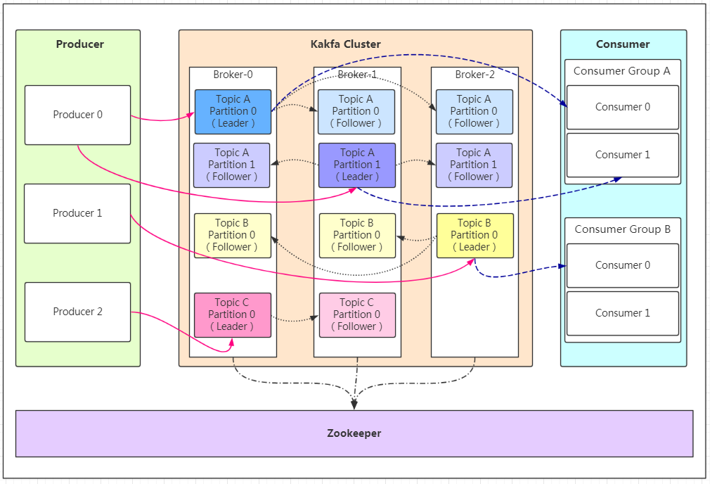

# kafka

Apache Kafka是一个开源分布式事件流平台，被数千家公司用于高性能数据管道、流分析、数据集成和关键任务应用程序。

Kafka 的主要的优势如下：

* 高吞吐量（High Throught）：使用延迟低至2ms的机器集群以网络有限的吞吐量传递消息。
* 可扩展性（Scable）：可将生产集群扩展到1000个代理、每天数万亿条消息、PB的数据和数十万个分区。弹性扩展和收缩存储和处理。
* 持久化存储（Permanent Storage）：将数据流安全地存储在分布式、持久、容错的集群中。
* 高可用（High Availability）：在可用性区域上高效地扩展集群，或者跨地理区域连接单独的集群。
* 流处理（Stream Processing）：使用事件时间和一次处理，通过联接、聚合、筛选器、转换等处理事件流。
* 生态（Ecosystem）：生态系统健全，大量开源工具。

## 总体架构

Kafka架构中比较关键的组件有：

* 消息 `Message`：消息主体。
* 生产者 `Producer`：消息的产生者，是消息的入口。
* 消费者 `Consumer`：消息的消费方，是消息的出口。
* 消费组 `Consumer Group`：将多个消费组组成一个消费者组，在kafka的设计中同一个分区的数据只能被消费者组中的某一个消费者消费。同一个消费者组的消费者可以消费同一个topic的不同分区的数据，这样设计是为了提高kafka的吞吐量！
* 机器实例 `Broker`：kafka实例，每个服务器上有一个或多个kafka的实例，我们姑且认为每个 `Broker` 对应一台服务器。每个kafka集群内的 `Broker` 都有一个不重复的编号，如图中的 `Broker-0`、`Broker-1` 等。
* 主题 `Topic`：消息的主题，可以理解为消息的分类，kafka的数据就保存在 `Topic` 。在每个 `Broker` 上都可以包含多个 `Topic`。
* 分区 `Partition`：`Topic` 的分区，每个 `Topic` 可以有多个分区，分区的作用是做负载均衡，提高kafka的吞吐量。同一个 `Topic` 在不同的分区的数据是不重复的， `Partition` 的表现形式就是一个一个的文件夹！
* 副本 `Replication`：每一个分区都有多个副本，副本的作用是做备胎。当主分区（Leader）故障的时候会选择一个备胎（Follower）上位，成为Leader。在kafka中默认副本的最大数量是10个，且副本的数量不能大于 `Broker` 的数量，Follower和Leader一定是在不同的机器，同一机器对同一个分区也只可能存放一个副本（包括自己）。
* 协调者 `Zookeeper`：kafka集群依赖 `Zookeeper` 来保存集群的的元信息，协调节点之间的关系，来保证系统的可用性。

## 参考资料

* [Kafka官网](https://kafka.apache.org/)
* [Kafka官网文档](https://kafka.apache.org/documentation/)
* [博客园 - kafka详解](https://www.cnblogs.com/huangdh/p/16886327.html)
* [腾讯云 - Kafka基本原理详解](https://cloud.tencent.com/developer/article/2088077)