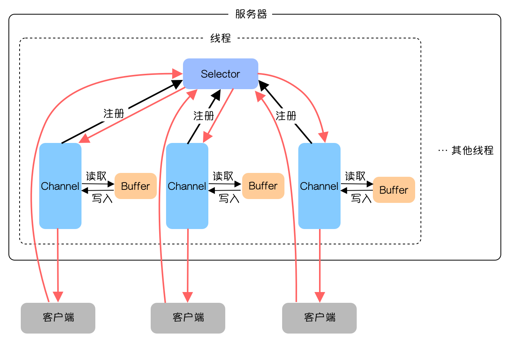
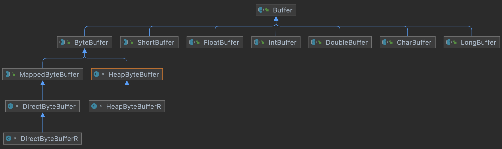
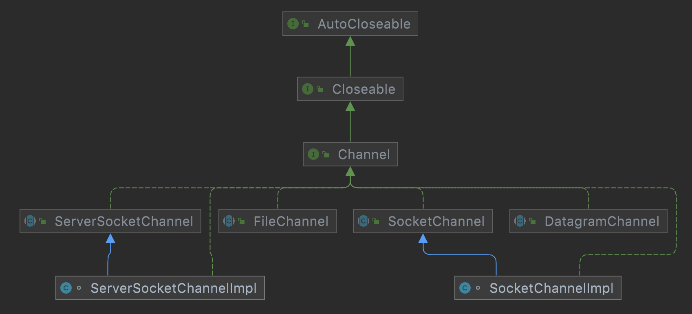
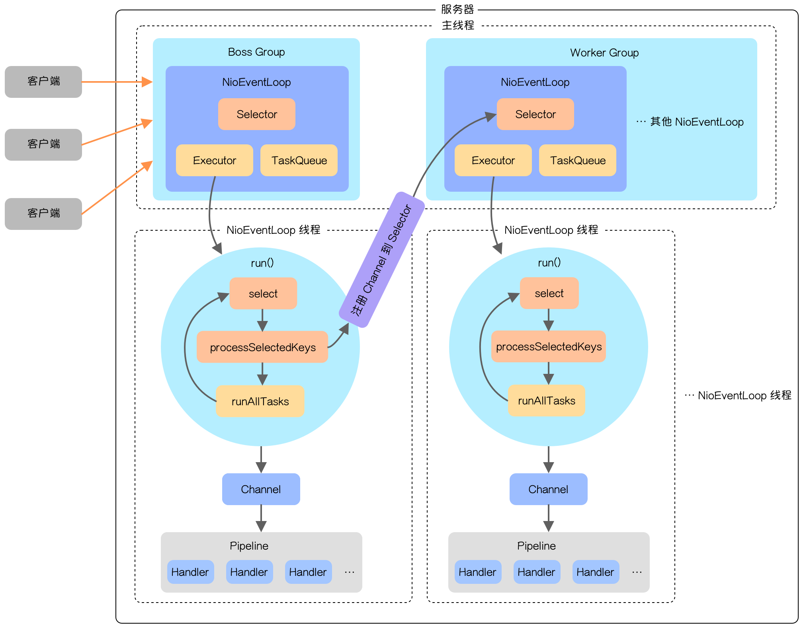

# Netty

## Java NIO 编程

这里主要讲三个非常重要的组件：通道（Channel）、缓冲区（Buffer）、选择器（Selector）。



### 缓冲区（Buffer）

`Buffer` 本质上就是一块可以读写数据的内存块，我们在使用的时候可以把它理解成一个数组。

下图是 `Buffer` 各个类的继承关系：



这里着重讲一下 `ByteBuffer` ，`ByteBuffer` 在原生 NIO 编程时使用频率是最高的。

初始化主要通过两种方式：

* `allocate(int capacity)`：创建 `byte` 类型的指定长度的缓冲区；
* `wrap(byte[] array)`：创建 `byte` 类型的有内容的缓冲区。

`ByteBuffer` 中几个比较重要的字段和方法：

* `position`：当前读取或写入的起始坐标；
* `limit`：最多可以操作到哪个索引；
* `capacity`：缓冲区的总长度；
* `remaining()`：返回的是 `limit - position` 的计算值，代表还有多少空间可以操作。

数据读取、插入和修改：

* `get()`：读取字节，不传参获取 `position` 位置的字节并让 `position + 1`，也可以通过参数读取指定位置的字节。
* `put()`：插入字节，它是一个重载方法，可以传入不同形式的字节；

### 通道（Channel）

通常来说 NIO 所有的操作都是由通道开始的，它跟我们平常使用的流（`InputStream`，`OutputStream`）有点类似。但也有些区别：

* 通道可以读也可以写，流是单向的，所以需要输入流输出流；
* 通道可以异步读写；
* 通道总是基于缓冲区来读写（将数据从通道读取到 `buffer` 或者将数据以 `buffer` 的形式写入到通道）

下图是 `Channel` 的继承关系：



常用的 `Channel` 主要有四种：

* `FileChannel` ：用于文件数据的读写；
* `DatagramChannel` ：用于 UDP 数据的读写；
* `ServerSocketChannel` 和 `SocketChannel` ：用于 TCP 数据的读写，前者代表服务端的通道，后者代表客户端。
  
使用 `ServerSocketChannel` 和 `SocketChannel` 进行 NIO 编程与直接使用 `ServerSocket` 和 `Socket` 类似。

### 选择器（Selector）

`Selector` 是实现一个线程处理多个客户端请求的核心组件， `Channel` 注册到 `Selector` 上之后，如果有就绪事件产生， `Selector` 就会去获取事件然后针对事件进行相应的处理。

`Selector` 常用方法如下：

* `open()` ：静态方法，获取一个选择器对象；
* `select()` ：调用后阻塞线程，阻塞期间会监控所有注册的通道，当有就绪事件需要操作时，会将 `SelectionKey` 放入集合并返回事件数量；
* `select(1000)` ：只阻塞 `1000` 毫秒，阻塞期间与上面的方法相同；
* `selectedKeys()` ：返回集合中保存的全部 `SelectionKey` 。

`SelectionKey` 就是用来描述各种就绪事件的类，通过它能获取到当前的就绪事件类型。

`SelectionKey` 通过 `4` 个常量来定义 `4` 种不同的就绪事件：

* `OP_READ` ：值为 `1 << 0`，读就绪事件，表示通道中有可读数据，可以执行读操作；
* `OP_WRITE` ：值为 `1 << 2`，写就绪事件，表示可以向通道写数据了；
* `OP_CONNECT` ：值为 `1 << 3`，连接就绪事件，代表客户端与服务器连接已经建立成功了；
* `OP_ACCEPT` ：值为 `1 << 4`，接收连接就绪事件，表示服务器监听到了客户端连接。

`SelectionKey` 通过以下 `4` 个静态方法判断当前是否是对应的就绪事件：

* `isReadable()` ：是否是读就绪事件；
* `isWritable()` ：是否是写就绪事件；
* `isConnectable()` ：是否是连接就绪事件；
* `isAcceptable()` ：是否是接收连接就绪事件。

### 网络编程实例

服务器端代码：

```java showLineNumbers
package com.zephyr.selector;

import java.io.IOException;
import java.net.InetSocketAddress;
import java.nio.ByteBuffer;
import java.nio.channels.SelectionKey;
import java.nio.channels.Selector;
import java.nio.channels.ServerSocketChannel;
import java.nio.channels.SocketChannel;
import java.nio.charset.StandardCharsets;
import java.util.Iterator;
import java.util.Set;

/**
 * 服务端-选择器 
 */
public class NIOSelectorServer {
    public static void main(String[] args) throws IOException {
        //打开一个服务端通道
        ServerSocketChannel serverSocketChannel = ServerSocketChannel.open();
        //绑定对应的端口号
        serverSocketChannel.bind(new InetSocketAddress(9999));
        //通道默认是阻塞的，需要设置为非阻塞
        serverSocketChannel.configureBlocking(false);
        //创建选择器
        Selector selector = Selector.open();
        //将服务端通道注册到选择器上,并指定注册监听的事件为OP_ACCEPT
        serverSocketChannel.register(selector, SelectionKey.OP_ACCEPT);
        System.out.println("服务端启动成功...");
        while (true) {
            //检查选择器是否有事件
            int select = selector.select(2000);
            if (select == 0) {
                continue;
            }
            //获取事件集合
            Set<SelectionKey> selectionKeys = selector.selectedKeys();
            Iterator<SelectionKey> iterator = selectionKeys.iterator();
            while (iterator.hasNext()) {
                //判断事件是否是客户端连接事件 SelectionKey.isAcceptable()
                SelectionKey key = iterator.next();
                //得到客户端通道,并将通道注册到选择器上, 并指定监听事件为OP_READ
                if (key.isAcceptable()) {
                    SocketChannel socketChannel = serverSocketChannel.accept();
                    System.out.println("客户端已连接......" + socketChannel);
                    //必须设置通道为非阻塞, 因为selector需要轮询监听每个通道的事件
                    socketChannel.configureBlocking(false);
                    //并指定监听事件为OP_READ
                    socketChannel.register(selector, SelectionKey.OP_READ);
                }
                //判断是否是客户端读就绪事件SelectionKey.isReadable()
                if (key.isReadable()) {
                    //得到客户端通道,读取数据到缓冲区
                    SocketChannel socketChannel = (SocketChannel) key.channel();
                    ByteBuffer byteBuffer = ByteBuffer.allocate(1024);
                    int read = socketChannel.read(byteBuffer);
                    if (read > 0) {
                        System.out.println("客户端消息:" +
                                new String(byteBuffer.array(), 0, read,
                                        StandardCharsets.UTF_8));
                        //给客户端回写数据
                        socketChannel.write(ByteBuffer.wrap("yo yo yo, hi man".getBytes(StandardCharsets.UTF_8)));
                        socketChannel.close();
                    }
                }
                //从集合中删除对应的事件, 因为防止二次处理.
                iterator.remove();
            }
        }
    }
}
```

客户端代码：

```java showLineNumbers
package com.zephyr.selector;

import java.io.IOException;
import java.net.InetSocketAddress;
import java.nio.ByteBuffer;
import java.nio.channels.SocketChannel;
import java.nio.charset.StandardCharsets;

/**
 * 客户端 
 */
public class NIOClient {
    public static void main(String[] args) throws IOException {
        //打开通道
        SocketChannel socketChannel = SocketChannel.open();
        //设置连接IP和端口号
        socketChannel.connect(new InetSocketAddress("127.0.0.1", 9999));
        //写出数据
        socketChannel.write(ByteBuffer.wrap("What's up.".getBytes(StandardCharsets.UTF_8)));
        //读取服务器写回的数据
        ByteBuffer readBuffer = ByteBuffer.allocate(1024);
        int read=socketChannel.read(readBuffer);
        System.out.println("服务端消息:" + new String(readBuffer.array(), 0, read, StandardCharsets.UTF_8));
        //释放资源
        socketChannel.close(); }
}
```

## Netty 线程模型

Netty 线程模型是基于**主从 [Reactor](../../docs/network/reactor) 多线程模型**优化而来的，整体架构如下图所示：



Netty 的线程模型主要分为两部分，分别是 `BossGroup` 和 `WorkerGroup` ，它们都分别管理一个或多个 `NioEventLoop` 。每个 `NioEventLoop` 对应着一个线程，一个 `Selector` ，一个 `Executor` 和一个 `TaskQueue` 。

`NioEventLoop` 可以理解成一个事件循环，当程序启动后每个 `NioEventLoop` 都会通过 `Executor` 启动一个线程，开始执行事件循环，在循环中 `Selector` 会通过 `select` 方法阻塞并监听就绪事件，当有事件到来时通过 `processSelectedKeys` 方法处理 `Selector` 事件，之后再通过 `runAllTasks` 方法处理其他的任务。

与 主从 Reactor 多线程模型类似，`BossGoup` 负责连接事件，当建立连接之后会生成一个 `NioSocketChannel` 并注册到 `WorkGroup` 其中一个 `NioEventLoop` 的 `Selector` 上。 `WokerGroup` 中的 `NioEventLoop` 负责处理数据请求，当请求到来时会调用 `processSelectedKeys` 方法，其中的业务处理会依次经过 `Pipeline` 中的多个 `Handler` 。

## Netty 编程实例

### Netty 服务器

```java showLineNumbers
public class NettyServer {

    public static void main(String[] args) throws InterruptedException {
      	// 创建 BossGroup
        EventLoopGroup bossGroup = new NioEventLoopGroup(1);
        // 创建 WorkerGroup
        EventLoopGroup workerGroup = new NioEventLoopGroup();
        // 创建服务器启动类
        ServerBootstrap bootstrap = new ServerBootstrap();
        // 添加配置
        bootstrap.group(bossGroup, workerGroup) // 设置 BossGroup 和 ChildGroup
                .channel(NioServerSocketChannel.class) // 设置 Channel 具体类
                .option(ChannelOption.SO_BACKLOG, 128) // 设置连接队列
                .childOption(ChannelOption.SO_KEEPALIVE, Boolean.TRUE) // 设置开启保活机制
                .childHandler(new ChannelInitializer<SocketChannel>() {
                    @Override
                    protected void initChannel(SocketChannel socketChannel) throws Exception {
                      	// 把自定义 Handler 添加到 pipeline
                        socketChannel.pipeline().addLast(new NettyServerHandler()); 
                    }
                });
        // 绑定端口号
        ChannelFuture channelFuture = bootstrap.bind(new InetSocketAddress(9999)).sync();
        System.out.println("服务器启动成功！");
        // 阻塞直到通道关闭
        channelFuture.channel().closeFuture().sync();
        // 优雅地关闭 BossGroup
        bossGroup.shutdownGracefully();
        // 优雅地关闭 WorkerGroup
        workerGroup.shutdownGracefully();
    }

}
```

自定义服务器端 ChannelHandler 代码，只列出了主要几个方法的实现：

```java showLineNumbers
public class NettyServerHandler implements ChannelInboundHandler {

    @Override
    public void channelRead(ChannelHandlerContext channelHandlerContext, Object o) throws Exception {
        ByteBuf byteBuf = (ByteBuf) o;
        System.out.println(byteBuf.toString(CharsetUtil.UTF_8));
        Channel channel = channelHandlerContext.pipeline().channel();
        System.out.println(channel);
    }

    @Override
    public void channelReadComplete(ChannelHandlerContext channelHandlerContext) throws Exception {
        channelHandlerContext.writeAndFlush(Unpooled.copiedBuffer("这是服务器的响应信息...".getBytes(CharsetUtil.UTF_8)));
    }

    @Override
    public void channelRegistered(ChannelHandlerContext channelHandlerContext) throws Exception {
        System.out.println("通道注册");
    }

    ...
      
}
```

### 客户端代码

```java showLineNumbers
public class NettyClient {

    public static void main(String[] args) throws InterruptedException {
        // 创建 EventLoopGroup
        EventLoopGroup eventLoopGroup = new NioEventLoopGroup(1);
        // 创建启动类
        Bootstrap bootstrap = new Bootstrap();
        // 设置参数
        bootstrap.group(eventLoopGroup)
                .channel(NioSocketChannel.class) // 设置 Channel 的类
                .handler(new ChannelInitializer<SocketChannel>() {
                    @Override
                    protected void initChannel(SocketChannel socketChannel) throws Exception {
                        // 添加自定义 Handler
                        socketChannel.pipeline().addLast(new NettyClientHandler());
                    }
                });
        // 连接服务器
        ChannelFuture channelFuture = bootstrap.connect(new InetSocketAddress("127.0.0.1", 9999)).sync();
        System.out.println("客户端启动成功！");
        // 阻塞直到通道判断
        channelFuture.channel().closeFuture().sync();
        // 优雅地关闭 EventLoopGroup
        eventLoopGroup.shutdownGracefully();
    }

}
```

自定义客户端 ChannelHandler 代码：

```java showLineNumbers
public class NettyClientHandler implements ChannelInboundHandler {

    @Override
    public void channelActive(ChannelHandlerContext channelHandlerContext) throws Exception {
        channelHandlerContext.writeAndFlush(Unpooled.copiedBuffer("这是客户端发来的消息", CharsetUtil.UTF_8));
    }

    @Override
    public void channelRead(ChannelHandlerContext channelHandlerContext, Object o) throws Exception {
        ByteBuf byteBuf = (ByteBuf) o;
        System.out.println(byteBuf.toString(CharsetUtil.UTF_8));
    }
  
  	@Override
    public void channelRegistered(ChannelHandlerContext channelHandlerContext) throws Exception {
				System.out.println("通道注册");
    }

  	...  
  
}
```

## Netty 核心组件

### ChannelHandler

### NioEventLoop

### NioEventLoopGroup

### ChannelOption

### ServerBootstrap 和 Bootstrap

### ChannelFuture

## 参考资料

* [Netty 官网](https://netty.io/)
* [GitHub - netty/netty](https://github.com/netty/netty)
* [Zephyr - 多图详解 Netty](https://anye3210.github.io/2021/08/22/%E5%A4%9A%E5%9B%BE%E8%AF%A6%E8%A7%A3-Netty/)
