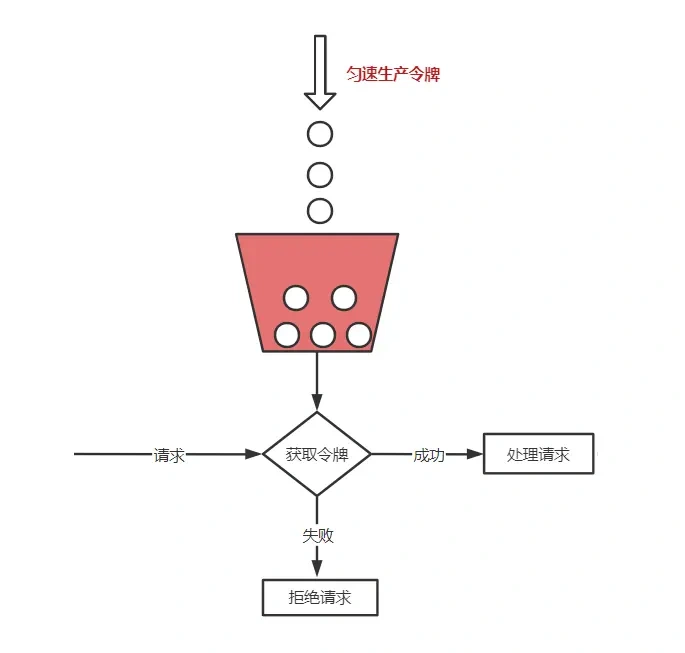
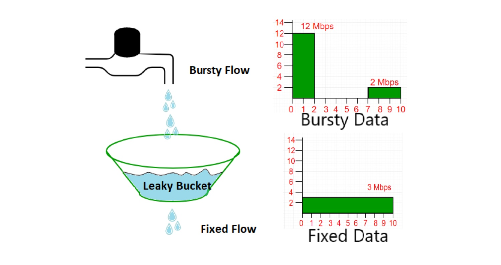
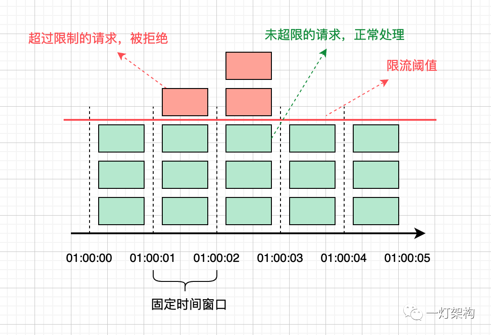
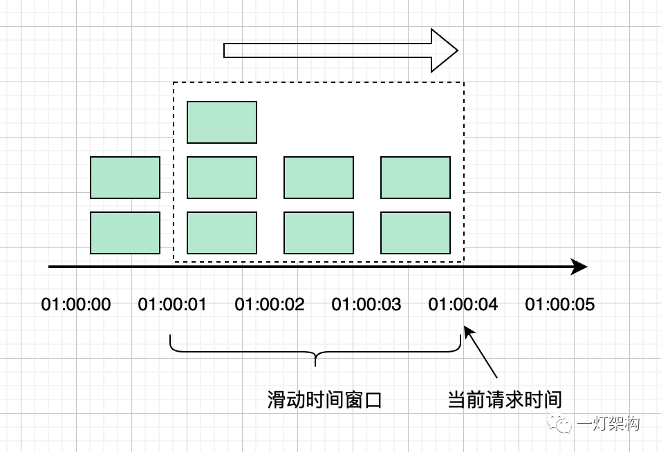

# 限流算法

## 令牌桶算法

令牌桶（Token Bucket）算法核心的思想是以固定的速率生产Token到容量固定的桶中，请求必须先拿到Token才能进行下一步处理。有可能出现Token生产出来的量超过Bucket的量，这个时候采用溢出处理，直接丢弃多余生产出来的Token。



```java showLineNumbers title="TokenBucketRateLimiter.java"
import java.time.Duration;
import java.time.Instant;
import java.time.temporal.ChronoUnit;

public class TokenBucketRateLimiter {
    private final long capacity;
    private long tokenRate;
    private long tokenCount;
    private Instant lastRecordTime;
    
    public TokenBucketRateLimiter(long capacity, long tokenRate) {
        if (capacity <= 0) {
            throw new IllegalArgumentException("capacity must be greater than 0");
        }
        this.capacity = capacity;
        setTokenRate(tokenRate);
        this.lastRecordTime = Instant.now();
    }

    public void setTokenRate(long tokenRate) {
        if (tokenRate <= 0) {
            throw new IllegalArgumentException("tokenRate must be greater than 0");
        }
        this.tokenRate = tokenRate;
    }

    public synchronized boolean acquire() {
        Instant now = Instant.now();
        long interval = Duration.between(lastRecordTime, now).get(ChronoUnit.MILLIS);
        tokenCount = Math.min(capacity, tokenCount + interval * tokenRate / 1000);
        lastRecordTime = now;
        if (tokenCount > 0) {
            tokenCount--;
            return true;
        }
        return false;
    }
}
```

## 漏桶算法

漏桶（Leaky Bucket）算法的核心思想是以固定的速率消费Bucket中的数据，请求的数据放入桶中，如果桶满了直接溢出，丢弃请求。



```java showLineNumbers title="LeakyBucketRateLimiter.java"
import java.time.Duration;
import java.time.Instant;
import java.time.temporal.ChronoUnit;

public class LeakyBucketRateLimiter {
    private final long capacity;
    private long leakyRate;
    private long water;
    private Instant lastLeakyTime;

    public LeakyBucketRateLimiter(long capacity, long leakyRate) {
        if (capacity <= 0) {
            throw new IllegalArgumentException("capacity must be grater than 0");
        }
        this.capacity = capacity;
        setLeakyRate(leakyRate);
        this.lastLeakyTime = Instant.now();
    }

    public void setLeakyRate(long leakyRate) {
        if (leakyRate <= 0) {
            throw new IllegalArgumentException("leakyRate must be grater than 0");
        }
        this.leakyRate = leakyRate;
    }

    public synchronized boolean acquire() {
        Instant now = Instant.now();
        long interval = Duration.between(lastLeakyTime, now).get(ChronoUnit.MILLIS);
        long leakyWater = Math.max(water, interval * leakyRate / 1000);
        water -= leakyWater;
        lastLeakyTime = now;
        if (water == capacity) {
            return false;
        }
        water++;
        return true;
    }
}
```

## 固定窗口

固定窗口算法的核心思想是为一段时间窗口的请求量设置一个上限，超出部分直接丢弃，实现上会把时间划分为一个一个固定的窗口。



```java showLineNumbers title="FixedWindowRateLimiter.java"
import java.time.Duration;
import java.time.Instant;
import java.time.temporal.ChronoUnit;

public class FixedWindowRateLimiter {
    private final long windowSize;
    private final int windowInterval;
    private long windowCount;
    private Instant lastRecordTime;

    public FixedWindowRateLimiter(long windowSize, int windowInterval) {
        if (windowSize <= 0) {
            throw new IllegalArgumentException("windowSize must be greater than 0");
        }
        if (windowInterval <= 0) {
            throw new IllegalArgumentException("windowInterval must be greater than 0");
        }
        this.windowSize = windowSize;
        this.windowInterval = windowInterval;
    }

    public synchronized boolean acquire() {
        Instant now = Instant.now();
        long interval = Duration.between(lastRecordTime, now).get(ChronoUnit.MILLIS);
        if (interval > windowInterval) {
            windowCount = 0;
        }
        lastRecordTime = now;
        if (windowCount < windowSize) {
            windowCount++;
            return true;
        }
        return false;
    }
}
```

## 滑动窗口

滑动窗口算法的核心思想是把多段时间窗口合并起来统一设置一个上限，窗口的个数为1的时候退化为固定窗口，多个窗口按时间向前滑动，是固定窗口的优化算法。



```java showLineNumbers title="SlideWindowRateLimiter.java"
import java.time.Instant;
import java.util.HashMap;
import java.util.Map;

public class SlideWindowRateLimiter {
    private final long windowSize;
    private final int windowInterval;
    private final int maxWindowCount;
    private final Map<Long, Long> windowCounts = new HashMap<>();

    public SlideWindowRateLimiter(long windowSize, int windowInterval, int maxWindowCount) {
        if (windowSize <= 0) {
            throw new IllegalArgumentException("windowSize must be greater than 0");
        }
        if (windowInterval <= 0) {
            throw new IllegalArgumentException("windowInterval must be greater than 0");
        }
        if (maxWindowCount <= 0) {
            throw new IllegalArgumentException("maxWindowCount must be greater than 0");
        }
        this.windowSize = windowSize;
        this.windowInterval = windowInterval;
        this.maxWindowCount = maxWindowCount;
    }

    public synchronized boolean acquire() {
        long now = Instant.now().toEpochMilli();
        long minTime = now - (long) windowInterval * maxWindowCount;

        long totalCount = 0;
        Iterator<Map.Entry<Long, Long>> iterator = windowCounts.entrySet().iterator();
        while (iterator.hasNext()) {
            Map.Entry<Long, Long> entry = iterator.next();
            if (entry.getKey() < minTime) {
                iterator.remove();
            }
            totalCount += entry.getValue();
        }
        
        if (totalCount >= windowSize) {
            return false;
        }

        long slot = now / windowInterval;
        windowCounts.merge(slot, 1L, Long::sum);
        return true;
    }
}
```

## 计数器

## 参考资料
